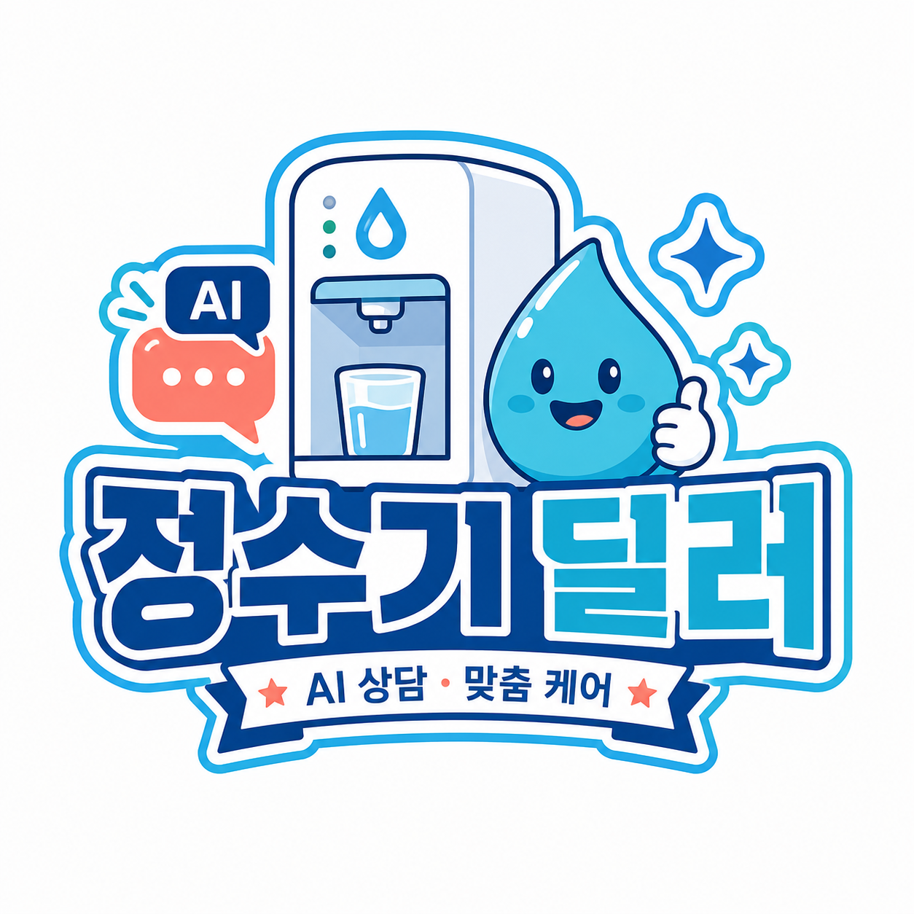

# 정수기 딜러

  

  <strong>SKN29-FINAL-4TEAM</strong> 
  정수기 구독 고객 케어 및 A/S 업무 지원 시스템

## 프로젝트 소개

SK매직 정수기 구독 고객의 고객케어·상담·A/S 업무를 지원하는 다중 에이전트 프로젝트입니다. 고객의 문의 접수부터 AI 상담, 상담사와 방문기사 인계, 처리 후 고객의 해결 여부 확인까지 이어지는 서비스 흐름을 구축합니다.

## 프로토타입

[워터케어 ONE 정수기 고객케어·A/S 프로토타입](https://github.com/antisdream/water_purifier_prototype)은 고객의 증상 입력부터 상담, 방문 점검, 작업 결과·서명, 해결 확인과 운영 감사 이력까지 동일한 문의 ID로 연결해 체험하는 정적 HTML 프로토타입입니다. 고객용 포털과 상담사·방문기사·운영 담당자용 통합 업무 포털로 구성됩니다.

현재 프로토타입은 실제 운영 서비스가 아니라 가상 데이터와 브라우저 로컬 상태로 업무 흐름을 검증하는 단계입니다. 실제 AI/RAG, 사내 API, 서버 인증·DB와 외부 알림은 아직 연동하지 않았습니다.

## 작업 산출물

2026-07-22 기준 프로젝트 기획, 데이터 수집·가공, 사용자별 화면·업무 흐름을 정리한 현재 단계의 주간 산출물입니다.

- [프로젝트 기획서 v0.2](weekly_output/기획서%20v0.2.docx) — 프로젝트 범위와 대표 시나리오, 문제 정의, 시장·BM 분석, 시스템 구성과 검증 방향을 정리했습니다.
- [수집 데이터 보고서 v1](weekly_output/수집_데이터_보고서_v1.docx) — MVP·후속 확장 대상의 공식 매뉴얼·FAQ 수집, 자동화 절차, 저장 포맷, 법적·윤리적 검토와 품질 관리 방안을 정리했습니다.
- [화면설계서 초안 v3](weekly_output/화면설계서_초안_v3.docx) — 고객·상담사·방문기사·운영 담당자의 화면 목록과 업무 인계 흐름, 상태·권한 정책, 주요 와이어프레임을 정리했습니다.

## 팀원별 역할 분담

> [!IMPORTANT]
> 역할 분담은 **2026-07-23 기준 협의·작업 진행 중(ING)**이며 최종 확정본이 아닙니다. 향후 팀 협의와 WBS 세부 작업 조정에 따라 변경될 수 있습니다.

현재 역할은 서비스 구현에 필요한 6개 담당 영역을 기준으로 구분했습니다. 각 담당자는 주 담당 업무를 중심으로 협업하며, 통합과 문제 해결이 필요한 경우 역할 간 공동 작업을 진행합니다. WBS의 작업 수와 공수는 기능 영역 기준이며 개인별 배분 수치는 아닙니다.

### 역할 요약

| 담당자 | 역할 |
| :---: | --- |
| 윤&#8288;승&#8288;혁 | **PM·기술 통합 담당** PM / Technical Coordinator |
| 양&#8288;정&#8288;현 | **모바일 앱 개발 담당** Mobile Application Developer |
| 한&#8288;예&#8288;나 | **웹 프론트엔드 개발 담당** Web Frontend Developer |
| 최&#8288;지&#8288;용 | **백엔드·데이터베이스 담당** Backend & Database Developer |
| 이&#8288;동&#8288;윤 | **AI·RAG 담당** AI / RAG Engineer |
| 김&#8288;은&#8288;진 | **데이터·QA·DevOps 담당** Data, QA & DevOps Engineer |

### PM·기술 통합 담당

*PM / Technical Coordinator*

**담당자:** 윤&#8288;승&#8288;혁

프로젝트의 일정과 개발 범위를 관리하고, 각 담당자의 결과물이 하나의 서비스로 연결되도록 조율합니다.

**주요 업무**

- 전체 일정과 우선순위 관리
- 기능 범위 및 변경 사항 정리
- 프론트엔드·백엔드·AI 간 협업 조정
- API 명세와 공통 개발 규칙 관리
- 통합 테스트, 배포, 발표 준비 총괄
- 필요 시 공통 기능 개발 및 오류 해결 지원

---

### 모바일 앱 개발 담당

*Mobile Application Developer*

**담당자:** 양&#8288;정&#8288;현

고객과 방문기사가 사용하는 모바일·태블릿 애플리케이션을 개발합니다.

**주요 업무**

- 고객용 모바일 화면 개발
- 방문기사용 태블릿 화면 개발
- 사용자 역할에 따른 화면과 메뉴 분리
- 백엔드 API 연동
- 스마트폰·태블릿 화면 대응
- 로딩·오류·입력 검증 등 모바일 사용성 처리

---

### 웹 프론트엔드 개발 담당

*Web Frontend Developer*

**담당자:** 한&#8288;예&#8288;나

상담사와 운영 담당자가 PC에서 사용하는 웹 애플리케이션을 개발합니다.

**주요 업무**

- 상담사용 업무 화면 개발
- 고객·제품·문의·상담 정보 조회 화면 구현
- 검색, 필터, 목록, 상세 화면 구현
- 운영 담당자용 대시보드 확장 개발
- 역할별 메뉴와 접근 화면 분리
- 백엔드 API 연동 및 웹 사용성 개선

---

### 백엔드·데이터베이스 담당

*Backend & Database Developer*

**담당자:** 최&#8288;지&#8288;용

모바일 앱과 웹에서 공통으로 사용하는 서버, API, 데이터베이스를 개발합니다.

**주요 업무**

- 사용자 인증과 역할별 권한 관리
- 고객·제품·구독 정보 관리
- 문의·문진·상담·방문 업무 API 개발
- 업무 상태와 처리 이력 관리
- 데이터베이스 설계 및 관리
- 모바일·웹·AI 기능 간 데이터 연결

---

### AI·RAG 담당

*AI / RAG Engineer*

**담당자:** 이&#8288;동&#8288;윤

공식 자료를 바탕으로 고객 증상을 분석하고 상담과 방문 업무를 지원하는 AI 기능을 개발합니다.

**주요 업무**

- 고객 증상 분석 및 대표 증상 분류
- 필요한 추가 질문 생성 또는 선택
- 매뉴얼·FAQ 등 공식 문서 검색
- 근거 기반 고객 안내 생성
- 상담사용 문의 요약 생성
- 방문기사용 사전 점검 정보 생성
- 위험한 안내와 근거 없는 답변 방지

---

### 데이터·QA·DevOps 담당

*Data, QA & DevOps Engineer*

**담당자:** 김&#8288;은&#8288;진

AI와 서비스에 필요한 데이터를 준비하고, 완성된 기능의 품질과 배포 환경을 관리합니다.

**주요 업무**

- 공식 매뉴얼·FAQ·제품 자료 수집 및 정제
- RAG 검색용 문서와 메타데이터 구성
- 테스트용 고객·문의·상담 데이터 제작
- 기능별 테스트 시나리오 작성 및 검증
- 오류와 버그 기록 및 재검사
- Docker·환경 변수·서버 배포 지원
- 최종 시연 환경과 데이터 점검

## WBS 역할별 배분

제공된 WBS 작업목록, 통합 Markdown, 갠트차트를 교차 확인한 역할별 작업 규모입니다.

| 담당 역할 | 작업 수 | 예상 공수(인일) |
| --- | ---: | ---: |
| PM/기획 | 12 | 15.5 |
| AI | 17 | 27.0 |
| 백엔드 | 19 | 25.5 |
| 프론트엔드 | 14 | 18.5 |
| **합계** | **62** | **86.5** |

## 2주차 데이터 기준

- 기본 MVP 모델: `WPUJAC104DWH` (`WPU-JAC104D` 계열)
- 후속 확장 모델: `WPUIAC425SNW` (`WPU-IAC425` 계열)
- 이전 모델 `WPU-IAC506` 산출물: 원격 커밋 `e909835`에서 저장소 삭제, 신규 구현에서 사용 금지

## 데이터 확인

- [데이터 구조와 사용 규칙](data/README.md)
- [JAC104D 공식 근거 검증 보고서](data/reports/team_A_feedback_response_20260721.md)
- [팀원별 데이터 확인 가이드](data/handoff_guides/README.md)
- [검증 완료 RAG 샘플](data/processed/structured/rag_verified_sample.jsonl)
- [합성 시연 시나리오](data/synthetic/demo_scenarios.json)

공식 매뉴얼 원문은 저작권과 재배포 범위가 확인되지 않아 `data/raw/`에만 보관하며 GitHub에는 업로드하지 않습니다. 저장소에서는 출처·버전·해시·페이지 근거와 공식 자료 기반 구조화 데이터만 공유합니다.
