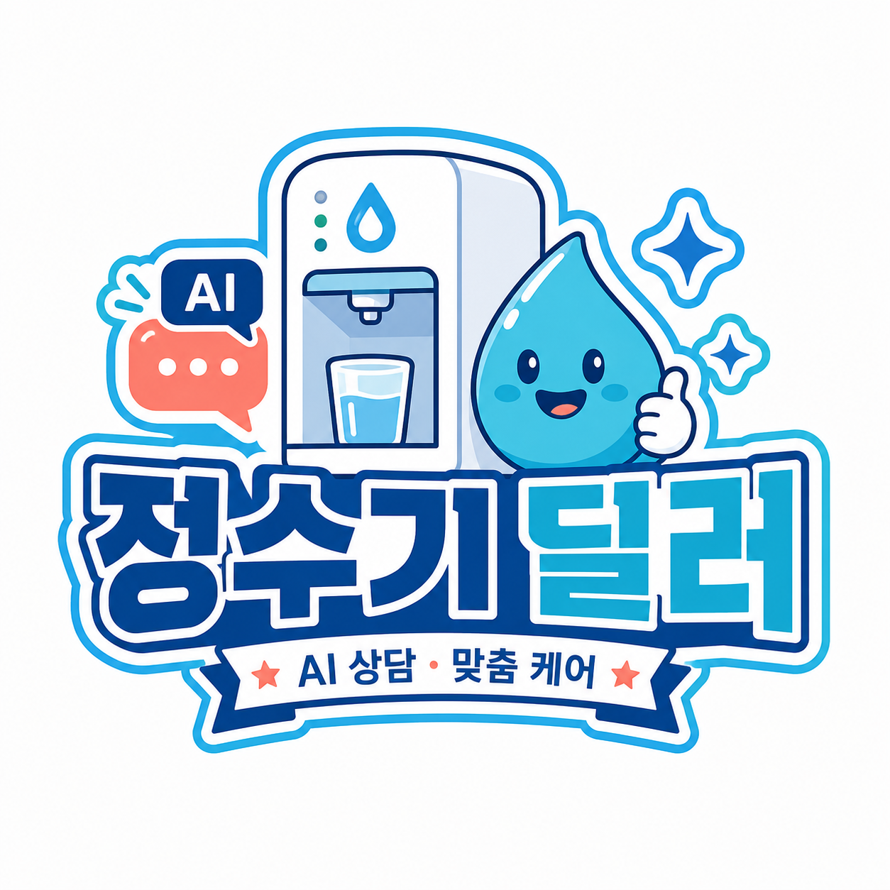
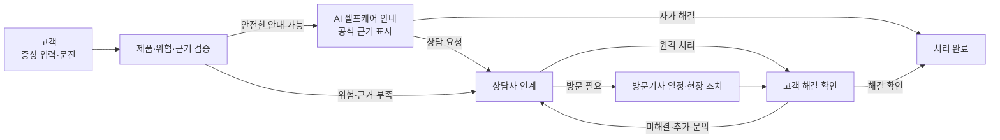
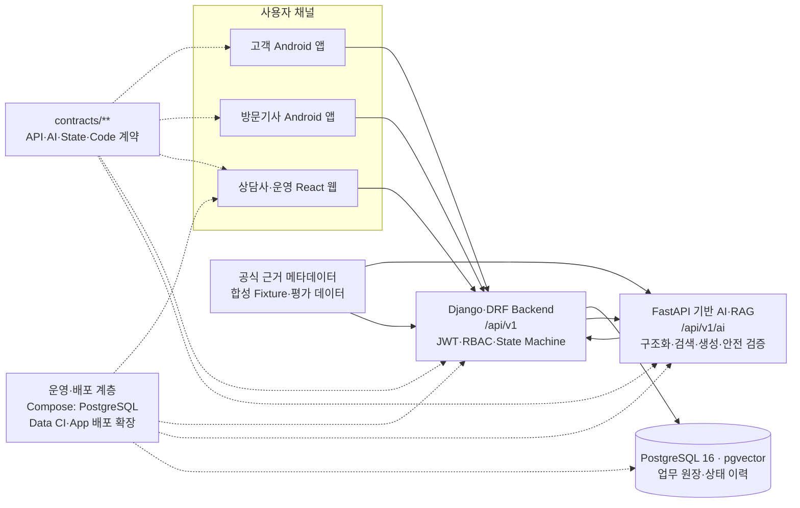

# 워터브릿지(WaterBridge)

<p align="center">
  
</p>

<p align="center">
  <strong>정수기 구독 고객의 문의부터 AI 안내, 상담, 방문 A/S, 해결 확인까지</strong><br>
  고객과 업무 담당자 사이의 정보를 하나의 문의 이력으로 잇는 AI 고객케어 플랫폼
</p>

<p align="center">
  
  
  
  
</p>

> **교육용 팀 프로젝트입니다.** 실제 SK매직 운영 서비스나 공식 고객지원 채널이 아니며, 실제 개인정보 대신 공개 가능한 구조화 데이터와 합성 시나리오를 사용합니다.

## 프로젝트 소개

정수기 구독 고객의 문의는 고객, 상담사, 방문기사, 운영 담당자를 거치며 같은 증상과 조치 내역이 반복 전달되기 쉽습니다. 워터브릿지는 문의 ID를 중심으로 문진, 공식 근거 기반 AI 안내, 상담·방문 인계, 처리 결과와 고객 피드백을 하나의 이력으로 연결합니다.

| 항목 | 내용 |
| --- | --- |
| 팀명 | 정수기 딜러 |
| 프로젝트명 | 워터브릿지(WaterBridge) |
| 교육 과정 | SK Networks Family AI Camp 29기 Final Project 4팀 |
| 대상 사용자 | 정수기 구독 고객, 상담사, 방문기사, 운영 담당자 |
| 기본 MVP 모델 | `WPUJAC104DWH` · `WPU-JAC104D` 계열 |
| 후속 확장 모델 | `WPUIAC425SNW` · `WPU-IAC425` 계열 |
| 제외 모델 | `WPU-IAC506` · `removed_legacy` 정책에 따라 신규 DB·RAG·화면·시연에서 사용 금지 |
| 핵심 가치 | 안전한 자가조치 안내, 근거 기반 상담, 끊김 없는 업무 인계, 처리 결과 추적 |

Backend·PostgreSQL의 상세 실행 기준은 [Backend README](backend/README.md)와
[Django·PostgreSQL 로컬 개발환경 설치·실행·복구 가이드](docs/individual/jiyong/개발환경/Django_PostgreSQL_로컬개발환경_설치_실행_복구_가이드.md)를
따릅니다.

### 해결하려는 문제

| 문제 | 워터브릿지의 접근 |
| --- | --- |
| 고객이 증상과 이전 조치를 담당자마다 반복 설명 | 하나의 문의 ID에 문진, 상담, 방문, 결과 이력을 누적 |
| 일반적인 답변이 위험 징후나 제품별 차이를 놓칠 수 있음 | 제품 검증, 위험 감지, 공식 문서 근거를 거친 AI 안내 |
| 상담사와 방문기사 사이에 맥락이 손실됨 | 역할별 화면과 구조화된 상담·방문 인계 정보 제공 |
| 상담·방문 종료가 실제 해결을 보장하지 않음 | `COMPLETION_PENDING`에서 고객 피드백을 확인한 뒤 최종 완료 |

## 핵심 사용자와 목표 기능

P0·P1은 기획 우선순위이며 Runtime 구현 완료 표시가 아닙니다. 실제 연동 범위는 [API Runtime 구현 현황](docs/api/runtime_implementation_status.md)과 각 Component README에서 확인합니다.

| 사용자 | 주요 기능 | 대표 채널 | 범위 |
| --- | --- | --- | --- |
| 고객 | 제품 확인, 증상 문진, AI 안전 안내, 상담 요청, 방문 일정 확인, 해결 피드백 | Android 고객 앱 | P0 |
| 상담사 | 상담 큐 조회, 문의·고객·근거 확인, 상담 요약, 방문 필요 검토와 인계 | React 웹 | P0 |
| 방문기사 | 방문 일정, 사전 점검 정보, 현장 조치와 결과 기록 | Android 기사 앱 | P0 |
| 운영 담당자 | 문의 현황, 위험·지연·재문의 예외, 처리 결과와 운영 지표 확인 | React 웹 | P1 |

### 목표 기능

- 공식 매뉴얼과 FAQ의 제품·세대·페이지 근거를 보존하는 RAG 데이터 구조
- 위험 징후와 근거 부족을 상담 경로로 전환하는 안전 중심 분기
- JWT·RBAC 기반 사용자 인증과 역할별 권한 계약
- `allowed_actions`, `state_version`, 멱등 키를 사용하는 Backend 중심 상태 전이
- 상담 요약, 방문 일정, 사전 방문 보고서, 처리 결과의 단계별 이력 관리
- 합성 고객·문의·상담·방문 데이터와 계약·통합·E2E 검증 경로

## 서비스 흐름


```mermaid
flowchart LR
    CUSTOMER["고객<br/>증상 입력·문진"] --> SAFETY["제품·위험·근거 검증"]
    SAFETY -->|안전한 안내 가능| AI_GUIDE["AI 셀프케어 안내<br/>공식 근거 표시"]
    SAFETY -->|위험·근거 부족| CONSULT["상담사 인계"]
    AI_GUIDE -->|자가 해결| DONE["처리 완료"]
    AI_GUIDE -->|상담 요청| CONSULT
    CONSULT -->|원격 처리| FEEDBACK["고객 해결 확인"]
    CONSULT -->|방문 필요| VISIT["방문기사 일정·현장 조치"]
    VISIT --> FEEDBACK
    FEEDBACK -->|해결 확인| DONE
    FEEDBACK -->|미해결·추가 문의| CONSULT
```

AI는 안내와 구조화된 결과를 반환하지만 문의 상태를 직접 변경하지 않습니다. 모든 상태 변경은 Backend가 권한, 가드, 상태 버전과 멱등성을 확인한 뒤 기록합니다.
상태·이벤트·가드·완료 정책의 상세 기준은 [State Machine 계약](contracts/state-machine/README.md)에서 관리합니다. 계약 승인은 개별 기능의 Runtime 구현 완료를 의미하지 않습니다.

## 시스템 아키텍처

아래 그림은 지침서의 책임 경계와 현재 저장소의 구성 방향을 요약합니다. 개별 배포·연동 완료 범위는 각 Component README와 [Runtime 구현 현황](docs/api/runtime_implementation_status.md)에서 별도로 확인합니다.


```mermaid
flowchart LR
    subgraph CHANNELS["사용자 채널"]
        CUSTOMER_APP["고객 Android 앱"]
        TECH_APP["방문기사 Android 앱"]
        WEB_APP["상담사·운영 React 웹"]
    end

    BACKEND["Django·DRF Backend<br/>/api/v1<br/>JWT·RBAC·State Machine"]
    AI["FastAPI 기반 AI·RAG<br/>/api/v1/ai<br/>구조화·검색·생성·안전 검증"]
    DB[("PostgreSQL 16 · pgvector<br/>업무 원장·상태 이력")]
    DATA["공식 근거 메타데이터<br/>합성 Fixture·평가 데이터"]
    CONTRACTS["contracts/**<br/>API·AI·State·Code 계약"]
    OPS["운영·배포 계층<br/>Compose: PostgreSQL<br/>Data CI·App 배포 확장"]

    CUSTOMER_APP --> BACKEND
    TECH_APP --> BACKEND
    WEB_APP --> BACKEND
    BACKEND --> DB
    BACKEND --> AI
    AI --> BACKEND
    DATA --> AI
    DATA --> BACKEND

    CONTRACTS -.-> CUSTOMER_APP
    CONTRACTS -.-> TECH_APP
    CONTRACTS -.-> WEB_APP
    CONTRACTS -.-> BACKEND
    CONTRACTS -.-> AI
    OPS -.-> WEB_APP
    OPS -.-> BACKEND
    OPS -.-> AI
    OPS -.-> DB
```

### 책임 경계

- Web과 Mobile은 Backend REST API만 호출하며 DB와 AI 내부 API에 직접 접근하지 않습니다.
- AI는 분석·검색·생성·검증 결과를 반환하고, 상태·권한·업무 원장을 직접 변경하지 않습니다.
- Backend가 인증, 권한, 상태 전이, 트랜잭션, 감사 이력의 최종 권위입니다.
- `contracts/**`가 서비스 간 요청·응답, 상태, 이벤트, 코드값의 공통 기준입니다.
- DB 변경은 Django Model과 Migration으로만 수행합니다.

## 기술 구성

| 영역 | 핵심 기술 | 책임 |
| --- | --- | --- |
| Web | React, TypeScript, Vite, React Router | 상담사·운영 웹 |
| Mobile | Kotlin, Jetpack Compose, Gradle | 고객·방문기사 Android 앱 |
| Backend | Python 3.13.13, Django, Django REST Framework, JWT | 인증·권한·API·State Machine·데이터 저장 |
| AI·RAG | Python 3.13.13, FastAPI, LangGraph, Pydantic, BAAI/bge-m3 | 증상 구조화·안전 판정·근거 검색·응답 검증 |
| Database·Search | PostgreSQL 16, pgvector, Full Text Search | 업무 원장·상태 이력·공식 근거 검색 |
| Contracts | OpenAPI, JSON Schema, State Machine | 서비스 간 API·AI·상태·코드 계약 |
| Test·Infra | pytest, Vitest, Gradle, Docker Compose | 단위·계약·통합 검증과 로컬 PostgreSQL 실행 |

정확한 버전은 각 영역의 lockfile·requirements·Gradle 설정·Container image를 기준으로 합니다. Kubernetes와 전체 CI/CD는 확장 방향이며 현재 완료 범위로 간주하지 않습니다.

## 저장소 구조와 책임 경계

```text
SKN29-FINAL-4TEAM/
├─ web/                       # 상담사·운영 React 웹과 영역 내 테스트
├─ mobile/
│  ├─ customer-app/          # 고객 Android 앱
│  ├─ technician-app/        # 방문기사 Android 앱
│  └─ core/                  # 공통 Kotlin 모델·상태 표현
├─ backend/                   # Django·DRF·PostgreSQL·Workflow과 영역 내 테스트
├─ ai/                        # AI·RAG·안전 검증과 영역 내 테스트
├─ contracts/
│  ├─ api/                   # REST·OpenAPI 계약
│  ├─ ai/                    # Backend↔AI Schema 계약
│  ├─ state-machine/         # 상태·이벤트·가드·완료 정책
│  ├─ codes/                 # 공통 업무 코드
│  └─ error-codes/           # 공통 오류 코드
├─ data/                      # 공식 메타데이터·가공·합성·평가 데이터
├─ scripts/                   # 개발환경·계약·데이터·DB·Smoke 자동화
├─ docs/                      # 기획·설계·API·DB·ADR·인계 문서
├─ infra/                     # Kubernetes·배포·관측성 확장 구조
├─ tests/                     # 서비스 간 계약·통합·E2E 확장 구조
├─ .github/                   # Data CI와 협업·추가 Workflow 구조
└─ docker-compose.yml         # 로컬 PostgreSQL·pgvector 실행
```

> 현재 Django 실행·Migration 기준은 `backend/**`, 기계 계약 기준은 `contracts/**`입니다. 실제 테스트 코드는 각 영역 내에 있으며, 루트 `tests/**`와 `infra/**`의 일부는 통합·배포 확장 구조입니다.

목표 구조와 영역 경계는 [프로젝트 디렉토리 구조 v2](docs/architecture/프로젝트%20디렉토리%20구조%20v2.md), 편집 관할은 [팀원별 관할 영역 v2](docs/planning/md/팀원별%20관할%20영역%20v2.md)를 참고합니다. 문서의 예시 트리는 구현 완료 표시가 아니므로 실제 파일·Route·Migration·테스트로 다시 판정합니다.

`com.skn29.watercare`, `watercare_` 등이 남은 일부 패키지·Docker 식별자와 루트의 구형 BAT는 기존 링크·데이터 호환 또는 참고용 Legacy입니다. 현재 프로젝트 표시명은 WaterBridge입니다.

## 팀 구성과 관할

| 팀원 | 역할 | 주관할 | 주요 책임 | GitHub |
| :---: | --- | --- | --- | :---: |
| 윤승혁 | PM·기술 통합 | 저장소 Root, `contracts/state-machine/**` | 일정·범위·우선순위, 공통 계약, 서비스 통합, 발표 | [@idenist](https://github.com/idenist) |
| 양정현 | 모바일 앱 | `mobile/**` | 고객·방문기사 Android 앱, Mobile 계약 연동 | [@didwjdgus90](https://github.com/didwjdgus90) |
| 한예나 | 웹 프론트엔드 | `web/**` | 상담사·운영 웹, API Wrapper, 역할별 화면 | [@hanyena0830](https://github.com/hanyena0830) |
| 최지용 | 백엔드·DB | `backend/**`, `contracts/api/**`, `contracts/codes/**` | 인증·권한, REST API, DB·Migration, 상태 전이 Runtime | [@antisdream](https://github.com/antisdream) |
| 이동윤 | AI·RAG | `ai/**`, `contracts/ai/**` | 문진 분석, 공식 근거 검색, 생성·안전 검증, AI 평가 | [@ldy-99](https://github.com/ldy-99) |
| 김은진 | 데이터·QA·DevOps | `data/**`, `infra/**`, `tests/**`, `.github/**` | 데이터 Pipeline, QA, CI/CD, 배포·관측성 | [@eunjin661](https://github.com/eunjin661) |

`docs/**`는 공동 편집 영역입니다. API, 상태 머신, AI, 데이터 등 경계 파일은 주관할과 부관할이 함께 검토합니다.

## 빠른 시작

### 1. Backend와 PostgreSQL

요구 환경은 Python `3.13.13`, Docker Desktop, PowerShell입니다. 저장소 Root에서 실행합니다.

```powershell
if (-not (Test-Path .\backend\.env)) {
    Copy-Item .\backend\.env.example .\backend\.env
}

# backend/.env의 replace-with-* 값을 로컬 개발용 비밀값으로 교체
python .\scripts\development\bootstrap.py --service backend
python .\scripts\development\check_environment.py --service backend

docker compose --env-file .\backend\.env up -d postgres

Push-Location .\backend
.\.venv\Scripts\python.exe manage.py migrate --noinput
.\.venv\Scripts\python.exe manage.py runserver 127.0.0.1:8000 --noreload
Pop-Location
```

`backend/.venv`가 이미 생성된 경우 패키지 설치 진입점은
[`backend/requirements.txt`](backend/requirements.txt)이며, 신규 환경의
생성·동기화·검증은 위 `bootstrap.py` 절차를 사용합니다.

상세한 최초 설치, 일상 실행, Seed와 Smoke 검증은 [Backend README](backend/README.md)를 확인합니다.

### 2. Web

Node.js `20.19+` 또는 `22.12+` 환경에서 실행합니다.

```powershell
Push-Location .\web
npm.cmd ci
npm.cmd run dev
Pop-Location
```

기본 개발 설정은 합성 Mock을 사용합니다. 브라우저에서 `http://localhost:5173/consultant/inquiries`를 열고, 환경변수와 실제 연동 범위는 [Web README](web/README.md)를 확인합니다.

### 3. Android

JDK `17`과 Android SDK가 준비된 환경에서 실행합니다.

```powershell
Push-Location .\mobile
.\setup-local-properties.bat
.\verify-build.bat
Pop-Location
```

`verify-build.bat`는 공통 모듈 단위 테스트와 두 앱의 Assemble을 검증합니다.

### 4. AI

Python `3.13.13`에서 Backend와 분리된 `ai/.venv`를 사용합니다.

```powershell
python -m venv .\ai\.venv
.\ai\.venv\Scripts\python.exe -m pip install -r .\ai\requirements.lock
.\ai\.venv\Scripts\python.exe -m uvicorn ai.app.main:app --host 127.0.0.1 --port 8001
```

AI의 공식 설치 SSOT는 `ai/requirements.lock`이며 위 명령은 저장소 Root에서
실행합니다. 현재 AI는 Monorepo Source Runtime이므로 `pip install ai`,
`pip install .\ai`, `pip install -e .\ai`와 Wheel 배포를 지원하지 않습니다.
`ai/pyproject.toml`은 설치 가능한 배포 Package 계약이 아닙니다.

실행 모드, pgvector 연결과 평가 절차는 [AI README](ai/README.md), 입출력 기계 계약은 [`contracts/ai`](contracts/ai/)를 확인합니다.

## 개발과 검증 원칙

- API·AI·상태·코드 경계를 바꿀 때는 `contracts/**`와 소비자 구현을 같은 변경 단위에서 정합화합니다.
- DB Schema는 Django Model과 Migration으로만 변경하며 수동 DDL을 기준으로 삼지 않습니다.
- 쓰기 API는 권한, 멱등 키, 상태 버전, Correlation ID와 감사 이력을 함께 검증합니다.
- 실제 `.env`, Token, 비밀번호, 개인정보와 배포 비허용 범위가 확인되지 않은 공식 원문은 Git에 Commit하지 않습니다.

### 대표 검증 명령

```powershell
# 상태 머신 계약
python .\scripts\contracts\validate_state_machine.py

# Backend
Push-Location .\backend
.\.venv\Scripts\python.exe -m pytest
Pop-Location

# Web
Push-Location .\web
npm.cmd run lint
npm.cmd run test
npm.cmd run build
Pop-Location

# AI
.\ai\.venv\Scripts\python.exe -m pytest .\ai\tests\unit

# Android 공통 모듈 테스트·앱 Assemble
Push-Location .\mobile
.\verify-build.bat
Pop-Location
```

검증 건수는 코드 변경에 따라 달라지므로 README에 고정하지 않습니다. 현재 실행 증거와 미연동 범위는 [Runtime 구현 현황](docs/api/runtime_implementation_status.md)과 [통합 인계 허브](docs/handoffs/README.md)에서 확인합니다.

## 문서 안내

| 분류 | 문서 | 내용 |
| --- | --- | --- |
| 문서 Hub | [docs/README.md](docs/README.md) | 전체 문서 탐색과 판정 우선순위 |
| 기획 | [요구사항정의서](docs/planning/md/요구사항정의서.md) | P0·P1 기능, 비기능, 제외 범위 |
| 일정 | [WBS](docs/planning/md/WBS.md) | 역할, 작업, 일정과 완료 기준 |
| 구조 | [프로젝트 디렉토리 구조 v2](docs/architecture/프로젝트%20디렉토리%20구조%20v2.md) | Monorepo 목표 구조와 책임 경계 |
| API | [WaterBridge API 문서](docs/api/README.md) | 기계 계약, 사람용 명세와 Runtime 구분 |
| Runtime | [API Runtime 구현 현황](docs/api/runtime_implementation_status.md) | OpenAPI와 실제 Django Route 대조 |
| Database | [WaterBridge Database 문서](docs/database/README.md) | 물리 계약, ERD, Table Dictionary |
| State | [State Machine 계약](contracts/state-machine/README.md) | 상태·이벤트·가드·완료 정책 |
| Handoff | [팀 통합 인계 허브](docs/handoffs/README.md) | 영역 간 인계와 검토 Gate |

## 구현 상태와 범위

- 요구사항, 기계 계약, Runtime, WBS 완료 상태는 서로 다른 판정 축입니다. 실제 API 지원 범위는 [API Runtime 구현 현황](docs/api/runtime_implementation_status.md)을 기준으로 합니다.
- 현재 Web의 주요 업무 화면은 Mock, Mobile 고객 흐름은 Fake Repository, 기사 앱은 Demo·후속 구현 경계가 있습니다. Backend↔AI 전체 E2E 연동도 완료 기능으로 간주하지 않습니다.
- `docker-compose.yml`은 `pgvector/pgvector:0.8.6-pg16-bookworm` 기반 PostgreSQL만 실행합니다. Web·Backend·AI Container 배포와 Kubernetes는 확장 범위입니다.
- GitHub Actions에는 Data CI가 구현되어 있으며, 앱 전체의 Build·Deploy CI/CD는 추가 구현 범위입니다.
- 실제 사내 시스템 API, 기사 자동 배정·예약·경로 최적화, 외부 알림, 결제·해지·환불은 MVP 제외 범위입니다.
- 저장소에 공유하는 고객·문의·상담·방문 데이터는 합성 데이터입니다. 공식 원문은 저작권·배포 범위를 확인하고 Git 추적 대상에서 제외합니다.
