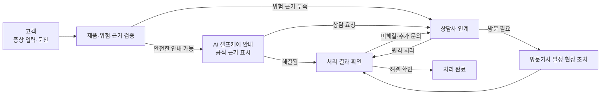
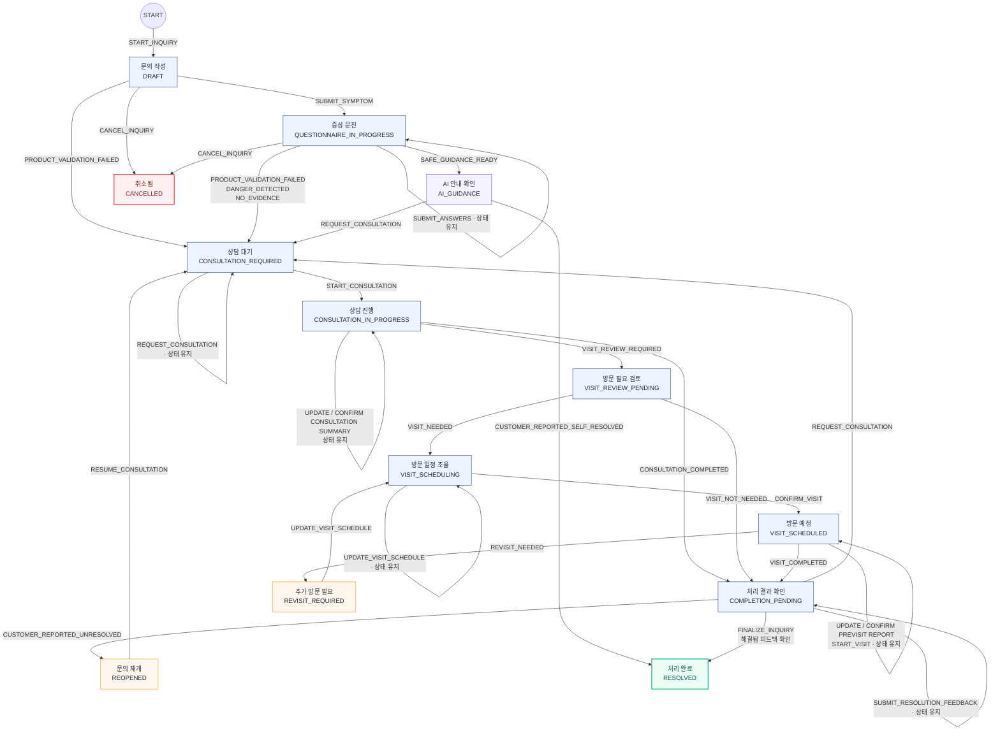
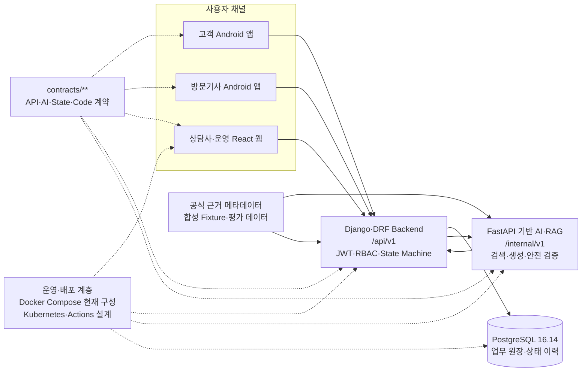

# WaterCare ONE · 정수기 딜러

<p align="center">
  
</p>

<p align="center">
  <strong>정수기 구독 고객의 문의부터 AI 셀프케어, 상담, 방문 A/S, 해결 확인까지</strong><br>
  하나의 문의와 승인된 상태 계약으로 연결하는 고객케어 업무 지원 플랫폼
</p>

<p align="center">
  
  
  
</p>

> **교육용 팀 프로젝트입니다.** 실제 SK매직 운영 서비스나 공식 고객지원 채널이 아니며, 실제 개인정보 대신 공개 가능한 구조화 데이터와 합성 시나리오를 사용합니다.

## 목차

1. [프로젝트 개요](#프로젝트-개요)
2. [핵심 사용자와 기능](#핵심-사용자와-기능)
3. [서비스 흐름](#서비스-흐름)
4. [문의 처리 상태 머신](#문의-처리-상태-머신)
5. [시스템 아키텍처](#시스템-아키텍처)
6. [기술 스택](#기술-스택)
7. [저장소 구조와 책임 경계](#저장소-구조와-책임-경계)
8. [팀 구성과 관할](#팀-구성과-관할)
9. [빠른 시작](#빠른-시작)
10. [개발과 검증 규칙](#개발과-검증-규칙)
11. [문서 안내](#문서-안내)
12. [현재 범위와 제한](#현재-범위와-제한)

## 프로젝트 개요

정수기 구독 고객의 문의는 고객, 상담사, 방문기사, 운영 담당자를 거치면서 같은 증상과 조치 내역이 반복 전달되기 쉽습니다. WaterCare ONE은 문의 ID를 중심으로 문진, 공식 근거 기반 AI 안내, 상담 및 방문 인계, 처리 결과와 고객 피드백을 하나의 이력으로 연결합니다.

| 항목 | 내용 |
| --- | --- |
| 프로젝트 | SK Networks Family AI Camp 29기 Final Project 4팀 |
| 서비스명 | WaterCare ONE · 정수기 딜러 |
| 대상 사용자 | 정수기 구독 고객, 상담사, 방문기사, 운영 담당자 |
| 기본 MVP 모델 | `WPUJAC104DWH` · `WPU-JAC104D` 계열 |
| 후속 확장 모델 | `WPUIAC425SNW` · `WPU-IAC425` 계열 |
| 제외 모델 | `WPU-IAC506` · `removed_legacy` 정책에 따라 신규 DB·RAG·화면·시연에서 사용 금지 |
| 핵심 가치 | 안전한 셀프케어, 근거 기반 상담, 끊김 없는 업무 인계, 처리 결과 추적 |
| 프로토타입 | [워터케어 ONE 정적 HTML 프로토타입](https://github.com/antisdream/water_purifier_prototype) |

Backend·PostgreSQL의 상세 실행 기준은 [Backend README](backend/README.md)와
[Django·PostgreSQL 공유 패키지 인계서 v1.3](docs/individual/jiyong/manuals/20260729_최지용_Django_PostgreSQL_공유패키지_인계서_v1.3.md)를
따릅니다.

### 해결하려는 문제

| 문제 | WaterCare ONE의 접근 |
| --- | --- |
| 고객이 증상과 이전 조치를 담당자마다 반복 설명 | 하나의 문의 ID에 문진, 상담, 방문, 결과 이력을 누적 |
| 일반적인 답변이 위험 징후나 제품별 차이를 놓칠 수 있음 | 제품 검증, 위험 감지, 공식 문서 근거를 거친 AI 안내 |
| 상담사와 방문기사 사이에 맥락이 손실됨 | 역할별 화면과 구조화된 상담·방문 인계 정보 제공 |
| 처리 완료 여부가 내부 종결만으로 판단됨 | `COMPLETION_PENDING`에서 고객 해결 피드백을 확인한 뒤 최종 완료 |

## 핵심 사용자와 기능

| 사용자 | 주요 기능 | 대표 채널 |
| --- | --- | --- |
| 고객 | 제품 확인, 증상 문진, AI 안전 안내, 상담 요청, 방문 일정 확인, 해결 피드백 | Android 고객 앱 |
| 상담사 | 상담 큐 조회, 문의·고객·근거 확인, 상담 요약, 방문 필요 검토와 인계 | React 웹 |
| 방문기사 | 방문 일정, 사전 점검 정보, 위치·도착 처리, 현장 조치와 결과 기록 | Android 기사 앱 |
| 운영 담당자 | 문의 현황, 위험·지연·재문의 등 예외, 처리 결과와 운영 지표 확인 | React 웹 |

### 주요 기능

- 공식 매뉴얼과 FAQ의 제품·세대·페이지 근거를 보존하는 RAG 데이터 구조
- 위험 징후와 근거 부족을 상담 경로로 전환하는 안전 중심 분기
- JWT·RBAC 기반 사용자 인증과 역할별 권한 계약
- `allowed_actions`, `state_version`, 멱등 키를 사용하는 Backend 중심 상태 전이
- 상담 요약, 방문 일정, 사전 방문 보고서, 처리 결과의 단계별 이력 관리
- 합성 고객·문의·상담·방문 데이터와 계약·통합·E2E 검증 경로

## 서비스 흐름


```mermaid
flowchart LR
    CUSTOMER["고객<br/>증상 입력·문진"] --> SAFETY["제품·위험·근거 검증"]
    SAFETY -->|안전한 안내 가능| AI_GUIDE["AI 셀프케어 안내<br/>공식 근거 표시"]
    SAFETY -->|위험·근거 부족| CONSULT["상담사 인계"]
    AI_GUIDE -->|해결됨| FEEDBACK["처리 결과 확인"]
    AI_GUIDE -->|상담 요청| CONSULT
    CONSULT -->|원격 처리| FEEDBACK
    CONSULT -->|방문 필요| VISIT["방문기사 일정·현장 조치"]
    VISIT --> FEEDBACK
    FEEDBACK -->|해결 확인| DONE["처리 완료"]
    FEEDBACK -->|미해결·추가 문의| CONSULT
```

AI는 안내와 구조화된 결과를 반환하지만 문의 상태를 직접 변경하지 않습니다. 모든 상태 변경은 Backend가 권한, 가드, 상태 버전과 멱등성을 확인한 뒤 기록합니다.

## 문의 처리 상태 머신

> 아래 흐름은 [`contracts/state-machine`](contracts/state-machine/)의 `TEAM_APPROVED v1.0.0` 업무 계약 기준이며, 개별 Runtime 구현 상태와는 구분됩니다.

사용자가 제공한 상태 머신의 상태명과 시각적 구분을 유지하되, 현재 승인 계약의 이벤트·가드·완료 정책에 맞춰 전이 경로를 정합화했습니다.


```mermaid
flowchart TB
    START((START))
    DRAFT["문의 작성<br/>DRAFT"]
    QUESTIONNAIRE["증상·문진<br/>QUESTIONNAIRE_IN_PROGRESS"]
    AI_GUIDANCE["AI 안내 확인<br/>AI_GUIDANCE"]
    CONSULTATION_REQUIRED["상담 대기<br/>CONSULTATION_REQUIRED"]
    CONSULTATION_IN_PROGRESS["상담 진행<br/>CONSULTATION_IN_PROGRESS"]
    VISIT_REVIEW_PENDING["방문 필요 검토<br/>VISIT_REVIEW_PENDING"]
    VISIT_SCHEDULING["방문 일정 조율<br/>VISIT_SCHEDULING"]
    VISIT_SCHEDULED["방문 예정<br/>VISIT_SCHEDULED"]
    COMPLETION_PENDING["처리 결과 확인<br/>COMPLETION_PENDING"]
    REVISIT_REQUIRED["추가 방문 필요<br/>REVISIT_REQUIRED"]
    REOPENED["문의 재개<br/>REOPENED"]
    RESOLVED["처리 완료<br/>RESOLVED"]
    CANCELLED["취소됨<br/>CANCELLED"]

    START -->|START_INQUIRY| DRAFT

    DRAFT -->|SUBMIT_SYMPTOM| QUESTIONNAIRE
    QUESTIONNAIRE -->|SUBMIT_ANSWERS · 상태 유지| QUESTIONNAIRE

    DRAFT -->|PRODUCT_VALIDATION_FAILED| CONSULTATION_REQUIRED
    QUESTIONNAIRE -->|PRODUCT_VALIDATION_FAILED<br/>DANGER_DETECTED<br/>NO_EVIDENCE| CONSULTATION_REQUIRED
    QUESTIONNAIRE -->|SAFE_GUIDANCE_READY| AI_GUIDANCE

    DRAFT -->|CANCEL_INQUIRY| CANCELLED
    QUESTIONNAIRE -->|CANCEL_INQUIRY| CANCELLED

    AI_GUIDANCE -->|CUSTOMER_REPORTED_SELF_RESOLVED| RESOLVED
    AI_GUIDANCE -->|REQUEST_CONSULTATION| CONSULTATION_REQUIRED

    CONSULTATION_REQUIRED -->|REQUEST_CONSULTATION · 상태 유지| CONSULTATION_REQUIRED
    CONSULTATION_REQUIRED -->|START_CONSULTATION| CONSULTATION_IN_PROGRESS

    CONSULTATION_IN_PROGRESS -->|UPDATE / CONFIRM CONSULTATION SUMMARY<br/>상태 유지| CONSULTATION_IN_PROGRESS
    CONSULTATION_IN_PROGRESS -->|CONSULTATION_COMPLETED| COMPLETION_PENDING
    CONSULTATION_IN_PROGRESS -->|VISIT_REVIEW_REQUIRED| VISIT_REVIEW_PENDING

    VISIT_REVIEW_PENDING -->|VISIT_NOT_NEEDED| COMPLETION_PENDING
    VISIT_REVIEW_PENDING -->|VISIT_NEEDED| VISIT_SCHEDULING

    VISIT_SCHEDULING -->|UPDATE_VISIT_SCHEDULE · 상태 유지| VISIT_SCHEDULING
    VISIT_SCHEDULING -->|CONFIRM_VISIT| VISIT_SCHEDULED

    VISIT_SCHEDULED -->|UPDATE / CONFIRM PREVISIT REPORT<br/>START_VISIT · 상태 유지| VISIT_SCHEDULED
    VISIT_SCHEDULED -->|VISIT_COMPLETED| COMPLETION_PENDING
    VISIT_SCHEDULED -->|REVISIT_NEEDED| REVISIT_REQUIRED

    REVISIT_REQUIRED -->|UPDATE_VISIT_SCHEDULE| VISIT_SCHEDULING

    COMPLETION_PENDING -->|SUBMIT_RESOLUTION_FEEDBACK · 상태 유지| COMPLETION_PENDING
    COMPLETION_PENDING -->|FINALIZE_INQUIRY<br/>해결됨 피드백 확인| RESOLVED
    COMPLETION_PENDING -->|CUSTOMER_REPORTED_UNRESOLVED| REOPENED
    COMPLETION_PENDING -->|REQUEST_CONSULTATION| CONSULTATION_REQUIRED
    REOPENED -->|RESUME_CONSULTATION| CONSULTATION_REQUIRED

    classDef normal fill:#eef4ff,stroke:#24466f,color:#1f2937;
    classDef ai fill:#f5f3ff,stroke:#7c3aed,color:#1f2937;
    classDef exception fill:#fff7ed,stroke:#f59e0b,color:#1f2937;
    classDef resolved fill:#ecfdf5,stroke:#10b981,color:#065f46,stroke-width:2px;
    classDef cancelled fill:#fff1f2,stroke:#ef4444,color:#991b1b,stroke-width:2px;

    class DRAFT,QUESTIONNAIRE,CONSULTATION_REQUIRED,CONSULTATION_IN_PROGRESS,VISIT_REVIEW_PENDING,VISIT_SCHEDULING,VISIT_SCHEDULED,COMPLETION_PENDING normal;
    class AI_GUIDANCE ai;
    class REVISIT_REQUIRED,REOPENED exception;
    class RESOLVED resolved;
    class CANCELLED cancelled;
```

핵심 규칙은 다음과 같습니다.

- 취소는 승인 계약상 `DRAFT`, `QUESTIONNAIRE_IN_PROGRESS`에서만 가능합니다.
- `AI_GUIDANCE`는 고객 자가 해결 시 `RESOLVED`, 상담 요청 시 `CONSULTATION_REQUIRED`로만 이동합니다.
- 상담 또는 방문 처리가 끝나도 즉시 완료하지 않고 `COMPLETION_PENDING`에서 고객 피드백을 확인합니다.
- 미해결 문의는 `REOPENED`를 거쳐 상담 대기로 복귀하고, 추가 방문은 일정 조율 단계로 돌아갑니다.

## 시스템 아키텍처

아래 그림은 공통 개발 규칙과 기술 선정안을 반영한 목표 책임 구조입니다. 현재 배포·연동 완료 범위는 각 Component README와 [Runtime 구현 현황](docs/api/runtime_implementation_status.md)에서 별도로 확인합니다.


```mermaid
flowchart LR
    subgraph CHANNELS["사용자 채널"]
        CUSTOMER_APP["고객 Android 앱"]
        TECH_APP["방문기사 Android 앱"]
        WEB_APP["상담사·운영 React 웹"]
    end

    BACKEND["Django·DRF Backend<br/>/api/v1<br/>JWT·RBAC·State Machine"]
    AI["FastAPI 기반 AI·RAG<br/>/internal/v1<br/>검색·생성·안전 검증"]
    DB[("PostgreSQL 16.14<br/>업무 원장·상태 이력")]
    DATA["공식 근거 메타데이터<br/>합성 Fixture·평가 데이터"]
    CONTRACTS["contracts/**<br/>API·AI·State·Code 계약"]
    OPS["운영·배포 계층<br/>Docker Compose 현재 구성<br/>Kubernetes·Actions 설계"]

    CUSTOMER_APP --> BACKEND
    TECH_APP --> BACKEND
    WEB_APP --> BACKEND
    BACKEND --> DB
    BACKEND --> AI
    AI --> BACKEND
    DATA --> AI
    DATA --> BACKEND

    CONTRACTS -.-> CUSTOMER_APP
    CONTRACTS -.-> TECH_APP
    CONTRACTS -.-> WEB_APP
    CONTRACTS -.-> BACKEND
    CONTRACTS -.-> AI
    OPS -.-> WEB_APP
    OPS -.-> BACKEND
    OPS -.-> AI
    OPS -.-> DB
```

### 책임 경계

- Web과 Mobile은 Backend REST API만 호출하며 DB와 AI 내부 API에 직접 접근하지 않습니다.
- AI는 분석·검색·생성·검증 결과를 반환하고, 상태·권한·업무 원장을 직접 변경하지 않습니다.
- Backend가 인증, 권한, 상태 전이, 트랜잭션, 감사 이력의 최종 권위입니다.
- `contracts/**`가 서비스 간 요청·응답, 상태, 이벤트, 코드값의 공통 기준입니다.
- DB 변경은 Django Model과 Migration으로만 수행합니다.

## 기술 스택

버전은 2026-07-30 현재 저장소의 lockfile, requirements, Gradle 설정과 Docker image에서 확인한 값입니다. `미고정`은 기술 선택은 반영됐지만 재현 가능한 버전 핀이 아직 없다는 뜻입니다.

| 영역 | 아이콘 | 기술 | 버전·기준 | 용도 |
| --- | :---: | --- | --- | --- |
| Web |  | Node.js | `20.19+` 또는 `22.12+` | Web 개발·빌드 Runtime |
| Web |  | React | `19.2.8` | 상담사·운영 SPA |
| Web |  | TypeScript | `6.0.3` | 정적 타입과 계약 모델 |
| Web |  | Vite | `8.1.5` | 개발 서버와 Production build |
| Web |  | React Router DOM | `7.11.0` | 역할별 화면 Routing |
| Web Test |  | Vitest | `4.1.10` | 단위·컴포넌트·통합 테스트 |
| Mobile |  | Kotlin | `2.4.10` | 고객·방문기사 Android 앱 |
| Mobile |  | Android SDK | `compile/target 37`, `min 26` | Android Native 플랫폼 |
| Mobile |  | Jetpack Compose BOM | `2026.06.00` | 선언형 UI |
| Mobile |  | Gradle / Android Gradle Plugin | `9.5.0` / `9.3.0` | Android build |
| Backend |  | Python | `3.13.13` | Backend Runtime |
| Backend |  | Django | `5.2.16` | 도메인·ORM·관리 기능 |
| Backend |  | Django REST framework | `3.17.1` | REST API |
| Backend |  | Simple JWT | `5.5.1` | Access·Refresh Token |
| Backend |  | drf-spectacular | `0.30.0` | OpenAPI Schema 생성 |
| Backend |  | psycopg | `3.3.4` | PostgreSQL Driver |
| Backend Test |  | pytest / pytest-django | `9.1.1` / `4.12.0` | 단위·API·DB·계약 테스트 |
| Database |  | PostgreSQL | `16.14-bookworm` | 업무 원장·상태 이력·감사 데이터 |
| AI·RAG |  | PostgreSQL FTS + GIN | PostgreSQL `16.14` 내장 | 공식 문서 Keyword 검색 |
| AI |  | FastAPI | 미고정 | Backend 전용 AI HTTP Interface |
| AI |  | Pydantic | 미고정 | AI 입출력 Schema 검증 |
| AI |  | Uvicorn | 미고정 | AI ASGI Server |
| AI·RAG |  | BAAI/bge-m3 | 모델 Revision 미고정 · `1024`차원 | 공식 문서 Embedding |
| AI·RAG |  | pgvector | 확장 버전 미고정 | PostgreSQL Vector 검색 설계 |
| Infra |  | Docker Compose | Engine 버전 미고정 | 로컬 서비스 구성 |
| Infra |  | Kubernetes | Cluster 버전 미고정 · 도입 기준 | 배포·Job·Rollout 설계 |
| CI/CD |  | GitHub Actions | Runner 버전 미고정 · 도입 기준 | 계약·테스트·빌드·배포 Workflow 설계 |

## 저장소 구조와 책임 경계

```text
SKN29-FINAL-4TEAM/
├─ web/                       # 상담사·운영 React 웹
├─ mobile/
│  ├─ customer-app/          # 고객 Android 앱
│  ├─ technician-app/        # 방문기사 Android 앱
│  └─ core/                  # 공통 Kotlin 모델·상태 표현
├─ backend/                   # Django·DRF·PostgreSQL·Workflow
├─ ai/                        # AI·RAG·안전 검증
├─ contracts/
│  ├─ api/                   # REST·OpenAPI 계약
│  ├─ ai/                    # Backend↔AI Schema 계약
│  ├─ state-machine/         # 상태·이벤트·가드·완료 정책
│  ├─ codes/                 # 공통 업무 코드
│  └─ error-codes/           # 공통 오류 코드
├─ data/                      # 공식 메타데이터·가공·합성·평가 데이터
├─ infra/                     # Docker·Kubernetes·Cloud·Monitoring 구조
├─ scripts/                   # 개발·계약·DB·테스트·배포 자동화
├─ tests/                     # 서비스 간 계약·통합·E2E·안전 검증
├─ docs/                      # 기획·설계·API·DB·ADR·인계 문서
├─ assets/                    # README와 공통 시각 자료
├─ preview/                   # 화면·시연 Preview
├─ .github/                   # 협업 설정과 CI/CD 골격
└─ WaterCareBackend/          # 구형 Android 연동 참고본
```

> 현재 실행·Migration 기준은 `backend/**`, 공통 계약 기준은 `contracts/**`입니다. `WaterCareBackend/**`와 루트의 구형 실행 BAT는 참고용 Legacy이며 현재 API·DB·상태 계약의 권위가 아닙니다.

세부 구조와 소유권은 [프로젝트 디렉토리 구조 v2](docs/architecture/프로젝트%20디렉토리%20구조%20v2.md)와 [팀원별 관할 영역 v2](docs/planning/md/팀원별%20관할%20영역%20v2.md)를 따릅니다.

## 팀 구성과 관할

| 팀원 | 역할 | 주관할 | 주요 책임 | GitHub |
| :---: | --- | --- | --- | :---: |
| 윤승혁 | PM·기술 통합 | 저장소 Root, `contracts/state-machine/**` | 일정·범위·우선순위, 공통 계약, 서비스 통합, 발표 | [@idenist](https://github.com/idenist) |
| 양정현 | 모바일 앱 | `mobile/**` | 고객·방문기사 Android 앱, Mobile 계약 연동 | [@didwjdgus90](https://github.com/didwjdgus90) |
| 한예나 | 웹 프론트엔드 | `web/**` | 상담사·운영 웹, API Wrapper, 역할별 화면 | [@hanyena0830](https://github.com/hanyena0830) |
| 최지용 | 백엔드·DB | `backend/**`, `contracts/api/**`, `contracts/codes/**` | 인증·권한, REST API, DB·Migration, 상태 전이 Runtime | [@antisdream](https://github.com/antisdream) |
| 이동윤 | AI·RAG | `ai/**`, `contracts/ai/**` | 문진 분석, 공식 근거 검색, 생성·안전 검증, AI 평가 | [@ldy-99](https://github.com/ldy-99) |
| 김은진 | 데이터·QA·DevOps | `data/**`, `infra/**`, `tests/**`, `.github/**` | 데이터 Pipeline, QA, CI/CD, 배포·관측성 | [@eunjin661](https://github.com/eunjin661) |

`docs/**`는 공동 편집 영역입니다. API, 상태 머신, AI, 데이터 등 경계 파일은 주관할과 부관할이 함께 검토합니다.

## 빠른 시작

### 1. Backend와 PostgreSQL

요구 환경은 Python `3.13.13`, Docker Desktop, PowerShell입니다. 저장소 Root에서 실행합니다.

```powershell
if (-not (Test-Path .\backend\.env)) {
    Copy-Item .\backend\.env.example .\backend\.env
}

# backend/.env의 replace-with-* 값을 로컬 개발용 비밀값으로 교체
python .\scripts\development\bootstrap.py --service backend
python .\scripts\development\check_environment.py --service backend

docker compose --env-file .\backend\.env up -d postgres

Set-Location .\backend
.\.venv\Scripts\python.exe manage.py migrate --noinput
.\.venv\Scripts\python.exe manage.py runserver 127.0.0.1:8000 --noreload
```

상세한 최초 설치, 일상 실행, Seed와 Smoke 검증은 [Backend README](backend/README.md)를 확인합니다.

### 2. Web

Node.js `20.19+` 또는 `22.12+` 환경에서 실행합니다.

```powershell
Set-Location .\web
npm.cmd ci
npm.cmd run dev
```

기본 개발 설정은 합성 Mock을 사용합니다. 브라우저에서 `http://localhost:5173/consultant/inquiries`를 열고, 환경변수와 실제 연동 범위는 [Web README](web/README.md)를 확인합니다.

### 3. Android

JDK `17`과 Android SDK가 준비된 환경에서 실행합니다.

```powershell
Set-Location .\mobile
.\setup-local-properties.bat
.\verify-build.bat
```

카카오 네이티브 앱 키가 없으면 고객 앱은 시연용 지도를 사용합니다. 모듈 구성은 [Mobile README](mobile/README.md)를 확인합니다.

### 4. AI

`ai/**`에는 HTTP Interface, 검색, 생성, 검증, 평가 구조가 분리되어 있습니다. 현재 `ai/pyproject.toml`에 재현 가능한 의존성 버전과 표준 실행 명령이 고정되지 않았으므로, 이를 완료하기 전까지 README에서 임의의 설치 명령을 제공하지 않습니다. 현재 범위는 [AI README](ai/README.md)와 [`contracts/ai`](contracts/ai/)를 기준으로 확인합니다.

## 개발과 검증 규칙

### 협업 규칙

- `main` 직접 Push를 금지하고, 개인·기능 Branch에서 작업한 뒤 PR Review를 거쳐 병합합니다.
- Commit message는 `YYYY-MM-DD | 작업내용` 형식을 사용합니다.
- API·AI·상태·코드 경계를 바꿀 때는 구현보다 `contracts/**`를 먼저 정합화합니다.
- DB Schema는 Django Model과 Migration으로만 변경하며 수동 DDL을 기준으로 삼지 않습니다.
- 실제 `.env`, Token, 비밀번호, 개인정보, 공식 원문 파일은 Git에 Commit하지 않습니다.
- 외부 쓰기 요청은 멱등 키, 상태 버전, Correlation ID와 감사 이력을 고려합니다.

전체 규칙은 [공통 개발 규칙](docs/planning/md/공통%20개발%20규칙.md)과 [CONTRIBUTING.md](CONTRIBUTING.md)를 따릅니다.

### 대표 검증 명령

```powershell
# 상태 머신 계약
python .\scripts\contracts\validate_state_machine.py

# Backend
Set-Location .\backend
.\.venv\Scripts\python.exe -m pytest

# Web
Set-Location ..\web
npm.cmd run lint
npm.cmd run test
npm.cmd run build

# Android
Set-Location ..\mobile
.\verify-build.bat
```

검증 건수는 코드 변경에 따라 달라지므로 README에 고정하지 않습니다. 현재 실행 증거와 미연동 범위는 [Runtime 구현 현황](docs/api/runtime_implementation_status.md)과 [통합 인계 허브](docs/handoffs/README.md)에서 확인합니다.

## 문서 안내

| 분류 | 문서 | 내용 |
| --- | --- | --- |
| 문서 Hub | [docs/README.md](docs/README.md) | 전체 문서 탐색과 권위 기준 |
| 주간 산출물 | [프로젝트 기획서 DOCX](docs/planning/etc/기획서.docx) | 범위·대표 시나리오·문제 정의·시장 및 BM 분석 |
| 주간 산출물 | [수집 데이터 보고서 DOCX](docs/planning/etc/수집데이터보고서.docx) | 공식 매뉴얼·FAQ 수집, 저장 형식, 법적·윤리적 검토 |
| 주간 산출물 | [화면설계서 DOCX](docs/planning/etc/화면설계서.docx) | 역할별 화면·업무 인계·상태와 권한 정책 |
| 기획 | [요구사항정의서](docs/planning/md/요구사항정의서.md) | 사용자·기능·비기능 요구사항 |
| 기획 | [화면설계서](docs/planning/md/화면설계서.md) | 역할별 화면과 업무 흐름 |
| 기술 | [기술스택정의서](docs/planning/md/기술스택정의서.md) | 기술 선택 배경과 적용 범위 |
| 구조 | [프로젝트 디렉토리 구조 v2](docs/architecture/프로젝트%20디렉토리%20구조%20v2.md) | Monorepo 구조와 경계 |
| 협업 | [공통 개발 규칙](docs/planning/md/공통%20개발%20규칙.md) | Git, 코드, API, DB, 보안 규칙 |
| 협업 | [팀원별 관할 영역 v2](docs/planning/md/팀원별%20관할%20영역%20v2.md) | 경로별 주관할·부관할 |
| API | [API 문서 Hub](docs/api/README.md) | API 계약과 Runtime 상태 |
| Database | [Database 문서 Hub](docs/database/README.md) | Physical Contract, ERD, Table Dictionary |
| State | [State Machine 계약](contracts/state-machine/README.md) | 상태·이벤트·가드·완료 정책 |
| Data | [data/README.md](data/README.md) | 데이터 구조, 검증, 공개 범위 |
| Data QA | [데이터 상태·품질 검증](data/processed/validation/DATA_STATUS_QA.md) | 구조·계약·품질 Gate |
| Data QA | [데이터·QA 팀 인계 보고서](docs/individual/eunjin/팀_공유용_데이터_QA_작업_보고서.md) | 검증 결과와 팀 공유 기준 |
| RAG | [검증 완료 RAG 샘플](data/processed/structured/rag/mvp/rag_verified_sample.jsonl) | MVP 공식 근거 구조화 예시 |
| Demo | [합성 시연 시나리오](data/synthetic/scenarios/demo_scenarios.json) | 역할·상태별 시연 데이터 |
| Handoff | [팀 통합 인계 허브](docs/handoffs/README.md) | 영역 간 인계와 현재 기준선 |

## 현재 범위와 제한

- 승인된 업무 계약과 실제 Runtime 구현 완료는 같은 의미가 아닙니다. 최신 차이는 [Runtime 구현 현황](docs/api/runtime_implementation_status.md)을 기준으로 판단합니다.
- Web의 일부 상담·운영 흐름은 합성 Mock으로 동작하며 실제 Backend API 연동이 남아 있습니다.
- Mobile의 상태 표현은 승인된 State Machine 계약과 계속 정합화 중입니다.
- AI/RAG는 구조와 계약이 준비되어 있으나 실행 의존성 버전과 표준 실행 경로를 고정해야 합니다.
- `docker-compose.yml`은 PostgreSQL `16.14-bookworm`을 실행하며, pgvector Extension 버전은 아직 고정하지 않았습니다.
- `infra/kubernetes/**`와 `.github/workflows/**`는 현재 디렉토리 골격 중심이며 실제 배포 Manifest와 CI/CD Workflow 구현이 남아 있습니다.
- 공식 매뉴얼 원문은 저작권과 배포 범위를 확인하기 위해 `data/raw/`에만 보관하고 GitHub에 올리지 않습니다.
- 저장소에 공유하는 고객·문의·상담·방문 데이터는 합성 데이터이며 실제 개인정보를 사용하지 않습니다.
