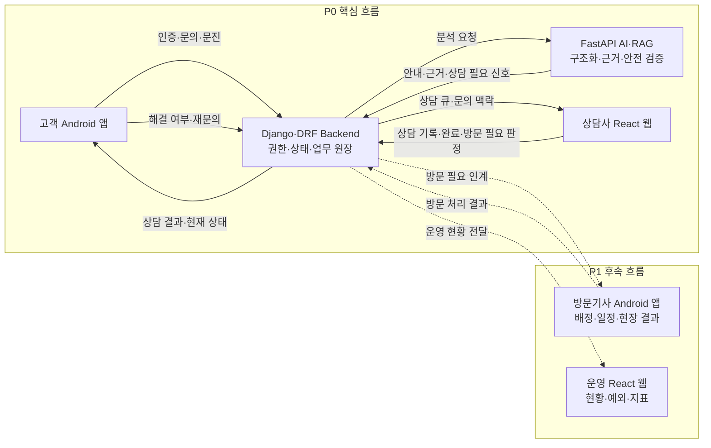
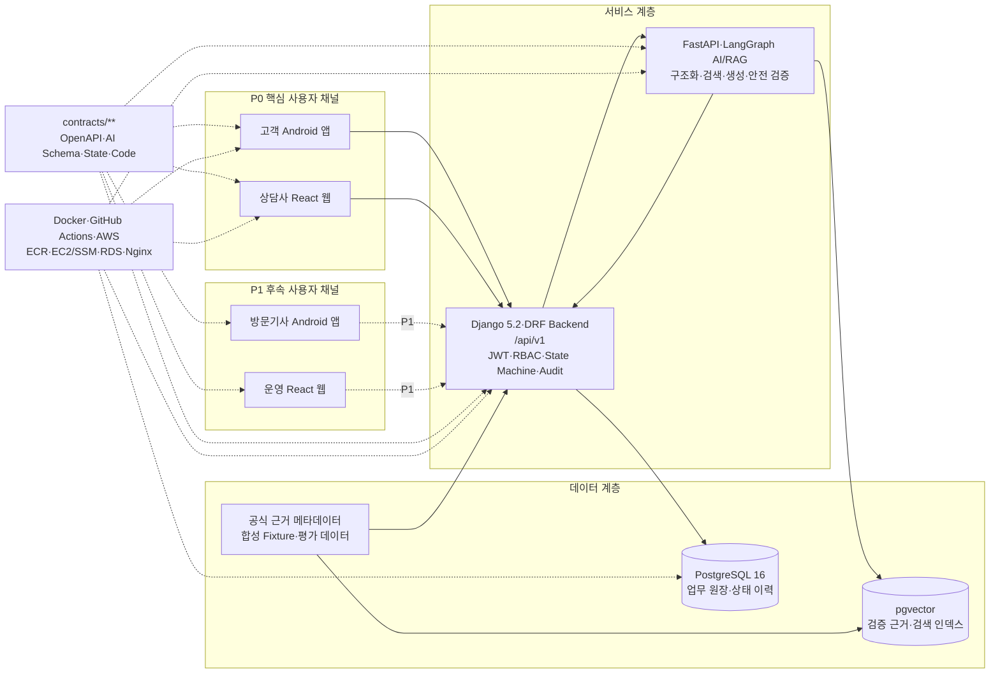

# 워터브릿지(WaterBridge)

<p align="center">
  
</p>

<p align="center">
  <strong>정수기 구독 고객의 문의부터 AI 안전 안내, 상담, 해결 확인까지</strong><br>
  고객·상담사 P0 흐름을 중심으로 방문기사·운영 확장을 P1로 분리한 AI 고객케어 플랫폼
</p>

<p align="center">
  
  
  
  
</p>

> **교육용 팀 프로젝트입니다.** 실제 SK매직 운영 서비스나 공식 고객지원 채널이 아니며, 실제 개인정보 대신 공개 가능한 구조화 데이터와 합성 시나리오를 사용합니다.

## 프로젝트 한눈에 보기

정수기 구독 고객은 증상과 이전 조치를 반복 설명하기 쉽고, 상담사는 AI 안내의 근거와 고객이 이미 수행한 조치를 다시 확인해야 합니다. 워터브릿지는 문의 ID를 중심으로 고객 문진, 공식 근거 기반 AI 안내, 상담 기록, 처리 결과와 고객 피드백을 하나의 P0 이력으로 연결합니다. 방문기사 현장 처리와 운영 대시보드는 이 핵심 흐름 위에 붙는 P1 후속 범위입니다.

| 항목 | 내용 |
| --- | --- |
| 팀명 | 정수기 딜러 |
| 프로젝트명 | 워터브릿지(WaterBridge) |
| 교육 과정 | SK Networks Family AI Camp 29기 Final Project 4팀 |
| 대상 사용자 | P0: 정수기 구독 고객·상담사 / P1: 방문기사·운영 담당자 |
| 기본 MVP 모델 | `WPUJAC104DWH` · `WPU-JAC104D` 계열 |
| 후속 확장 모델 | `WPUIAC425SNW` · `WPU-IAC425` 계열 |
| 제외 모델 | `WPU-IAC506` · `removed_legacy` 정책에 따라 신규 DB·RAG·화면·시연에서 사용 금지 |
| 핵심 가치 | 안전한 자가조치 안내, 근거 기반 상담, 처리 결과 확인, 후속 업무 확장 |

### 해결하려는 문제

| 문제 | 워터브릿지의 접근 |
| --- | --- |
| 고객이 증상과 이전 조치를 반복 설명 | 하나의 문의 ID에 문진, AI 안내, 상담과 결과 이력을 누적 |
| 일반적인 답변이 위험 징후나 제품별 차이를 놓칠 수 있음 | 제품 검증, 위험 감지, 공식 문서 근거를 거친 AI 안내 |
| AI 안내와 상담 사이에 맥락이 손실됨 | 고객 입력·수행 조치·위험도·공식 근거를 상담사에게 구조화해 전달 |
| 상담 종료가 실제 해결을 보장하지 않음 | 고객이 상담 결과와 현재 상태를 확인하고 해결 여부를 다시 알리는 P0 후속 흐름 |
| 방문·운영 기능을 핵심 MVP와 동시에 완성하기 어려움 | 방문 필요 판정까지만 P0에 두고 기사 현장 처리와 운영 대시보드는 P1로 분리 |

## 팀원 소개

<table border="1" cellpadding="18" cellspacing="0" width="1000" rules="all" frame="box">
  <tr>
    <td align="center" valign="top" width="333">
      <br>
      <strong>김은진</strong>
      <hr>
      <strong>데이터·QA·DevOps</strong><br>
      <sub>데이터 Pipeline·QA·CI/CD<br>배포·관측성</sub><br>
      <a href="https://github.com/eunjin661">@eunjin661</a>
    </td>
    <td align="center" valign="top" width="333">
      <br>
      <strong>양정현</strong>
      <hr>
      <strong>모바일 앱</strong><br>
      <sub>고객·방문기사 Android 앱<br>Mobile 계약 연동</sub><br>
      <a href="https://github.com/didwjdgus90">@didwjdgus90</a>
    </td>
    <td align="center" valign="top" width="333">
      <br>
      <strong>윤승혁</strong>
      <hr>
      <strong>PM·기술 통합</strong><br>
      <sub>일정·범위·우선순위·공통 계약<br>서비스 통합·발표</sub><br>
      <a href="https://github.com/idenist">@idenist</a>
    </td>
  </tr>
  <tr>
    <td align="center" valign="top" width="333">
      <br>
      <strong>이동윤</strong>
      <hr>
      <strong>AI·RAG</strong><br>
      <sub>문진 분석·공식 근거 검색<br>생성·안전 검증·AI 평가</sub><br>
      <a href="https://github.com/ldy-99">@ldy-99</a>
    </td>
    <td align="center" valign="top" width="333">
      <br>
      <strong>최지용</strong>
      <hr>
      <strong>백엔드·DB</strong><br>
      <sub>인증·권한·REST API<br>DB·Migration·상태 전이 Runtime</sub><br>
      <a href="https://github.com/antisdream">@antisdream</a>
    </td>
    <td align="center" valign="top" width="333">
      <br>
      <strong>한예나</strong>
      <hr>
      <strong>웹 프론트엔드</strong><br>
      <sub>상담사·운영 Web<br>API Wrapper·역할별 화면</sub><br>
      <a href="https://github.com/hanyena0830">@hanyena0830</a>
    </td>
  </tr>
</table>

## 핵심 사용자와 목표 기능

핵심 MVP는 **고객 ↔ 상담사**의 P0 수직 흐름입니다.

- **P0:** 방문 필요 여부를 판정하고 P1 인계 정보를 상담 기록에 남기는 단계까지
- **P1:** 실제 기사 배정·일정·현장 처리와 운영 대시보드

> P0·P1은 기획 우선순위이며 Runtime 구현 완료 표시가 아닙니다. 실제 연동 범위는 [API Runtime 구현 현황](docs/api/runtime_implementation_status.md)과 각 Component README에서 다시 판정합니다.

| 우선순위·사용자 | 주요 기능 | 채널 |
| --- | --- | --- |
| **P0 · 고객** | 합성 계약 고객 인증 · 구독·제품 확인 · 증상 문진<br>AI 안전 안내 · 상담 요청 · 상담 결과·해결 여부 확인 | 고객 Android 앱 |
| **P0 · 상담사** | 상담 큐 · 문의·고객·근거·상태 이력 확인<br>상담 시작·기록·요약·완료 · 방문 필요 여부와 P1 인계 기록 | 상담사 React 웹 |
| **P1 · 방문기사** | 가상 기사 배정 · 방문 일정·사전 점검 정보 조회<br>현장 조치와 방문 결과 기록 | 기사 Android 앱 |
| **P1 · 운영 담당자** | 문의 현황 · 위험·지연·재문의 예외 확인<br>처리 결과와 운영 지표 확인 | 운영 React 웹 |

### P0 핵심 목표

- 합성 계약 고객 인증부터 고객 앱 문의, AI Safety/RAG, 상담사 처리, 고객의 상담 결과 확인까지 같은 문의 ID로 연결
- 공식 매뉴얼·FAQ의 제품·세대·페이지 근거를 보존하고 위험 징후·근거 부족을 상담 경로로 전환
- JWT·RBAC와 `allowed_actions`, `state_version`, 멱등 키를 사용하는 Backend 중심 권한·상태 전이
- 고객 입력, 수행 조치, 위험도, 근거, 상담 기록과 처리 결과를 단계별 이력으로 보존
- 상담사가 방문 필요 여부를 판정하고 후속 P1이 소비할 인계 정보를 기록

### P1 후속 목표

- 가상 기사 배정, 방문 일정 조율, 사전 점검 리포트, 현장 조치와 방문 결과의 고객 이력 반영
- 운영 대시보드, 위험·지연·근거 검색 실패 등의 예외 관리와 운영 지표
- 반응형·성능·유지보수성 고도화와 제한된 관리자 권한 위임·회수

P1 코드·화면 골격이나 과거 테스트가 존재하더라도 P0 핵심 범위 또는 최종 완료로 승격하지 않습니다. 범위의 기준은 [요구사항정의서](docs/planning/md/요구사항정의서.md)의 `FR-025`~`FR-037`과 [WBS](docs/planning/md/WBS.md)의 현행 P0·P1 운영 기준입니다.

## 서비스 흐름


```mermaid
flowchart LR
    subgraph P0["P0 핵심 흐름"]
        CUSTOMER["고객 Android 앱"]
        BACKEND["Django·DRF Backend<br/>권한·상태·업무 원장"]
        AI["FastAPI AI·RAG<br/>구조화·근거·안전 검증"]
        CONSULTANT["상담사 React 웹"]

        CUSTOMER -->|"인증·문의·문진"| BACKEND
        BACKEND -->|"분석 요청"| AI
        AI -->|"안내·근거·상담 필요 신호"| BACKEND
        BACKEND -->|"상담 큐·문의 맥락"| CONSULTANT
        CONSULTANT -->|"상담 기록·완료·방문 필요 판정"| BACKEND
        BACKEND -->|"상담 결과·현재 상태"| CUSTOMER
        CUSTOMER -->|"해결 여부·재문의"| BACKEND
    end

    subgraph P1["P1 후속 흐름"]
        TECHNICIAN["방문기사 Android 앱<br/>배정·일정·현장 결과"]
        OPERATOR["운영 React 웹<br/>현황·예외·지표"]
    end

    BACKEND -.->|방문 필요 인계| TECHNICIAN
    TECHNICIAN -.->|방문 처리 결과| BACKEND
    BACKEND -.->|운영 현황 전달| OPERATOR
```

AI는 안내와 구조화된 결과를 반환하지만 문의 상태를 직접 변경하지 않습니다. 모든 상태 변경은 Backend가 권한, 가드, 상태 버전과 멱등성을 확인한 뒤 기록합니다.
상태·이벤트·가드·완료 정책의 상세 기준은 [State Machine 계약](contracts/state-machine/README.md)에서 관리합니다. 계약 승인은 개별 기능의 Runtime 구현 완료를 의미하지 않습니다.

## 시스템 아키텍처

아래 그림은 현재 저장소의 책임 경계와 P0·P1 우선순위를 함께 표현합니다. 사용자 채널은 AI·DB를 직접 호출하지 않으며 Backend가 인증·권한·업무 상태의 최종 책임을 가집니다. 점선 P1 연결은 확장 경계이며 구현·배포 완료를 뜻하지 않습니다.


```mermaid
flowchart LR
    subgraph P0_CHANNELS["P0 핵심 사용자 채널"]
        CUSTOMER_APP["고객 Android 앱"]
        CONSULTANT_WEB["상담사 React 웹"]
    end

    subgraph P1_CHANNELS["P1 후속 사용자 채널"]
        TECH_APP["방문기사 Android 앱"]
        OPERATOR_WEB["운영 React 웹"]
    end

    subgraph SERVICES["서비스 계층"]
        BACKEND["Django 5.2·DRF Backend<br/>/api/v1<br/>JWT·RBAC·State Machine·Audit"]
        AI["FastAPI·LangGraph AI/RAG<br/>구조화·검색·생성·안전 검증"]
    end

    subgraph STORAGE["데이터 계층"]
        BUSINESS_DB[("PostgreSQL 16<br/>업무 원장·상태 이력")]
        VECTOR_DB[("pgvector<br/>검증 근거·검색 인덱스")]
        DATA["공식 근거 메타데이터<br/>합성 Fixture·평가 데이터"]
    end

    CONTRACTS["contracts/**<br/>OpenAPI·AI Schema·State·Code"]
    DELIVERY["Docker·GitHub Actions·AWS<br/>ECR·EC2/SSM·RDS·Nginx"]

    CUSTOMER_APP --> BACKEND
    CONSULTANT_WEB --> BACKEND
    TECH_APP -.->|P1| BACKEND
    OPERATOR_WEB -.->|P1| BACKEND
    BACKEND --> AI
    AI --> BACKEND
    BACKEND --> BUSINESS_DB
    AI --> VECTOR_DB
    DATA --> VECTOR_DB
    DATA --> BACKEND

    CONTRACTS -.-> CUSTOMER_APP
    CONTRACTS -.-> CONSULTANT_WEB
    CONTRACTS -.-> TECH_APP
    CONTRACTS -.-> OPERATOR_WEB
    CONTRACTS -.-> BACKEND
    CONTRACTS -.-> AI
    DELIVERY -.-> CUSTOMER_APP
    DELIVERY -.-> CONSULTANT_WEB
    DELIVERY -.-> BACKEND
    DELIVERY -.-> AI
    DELIVERY -.-> BUSINESS_DB
```

PostgreSQL 업무 원장과 pgvector 검색 인덱스는 같은 PostgreSQL 계열 인프라에 배치될 수 있지만, 그림에서는 쓰기 책임과 검색 책임을 분명히 하기 위해 논리적으로 나눴습니다. 개별 Route·배포·E2E 완료 범위는 각 Component README, [Runtime 구현 현황](docs/api/runtime_implementation_status.md), [WBS](docs/planning/md/WBS.md)에서 별도로 확인합니다.

## 기술 스택

| 영역 | 현재 기준 기술 | 핵심 책임 | 버전·구성 기준 |
| --- | --- | --- | --- |
| Web | React `19.2.8`, React Router `7.11.0`, TypeScript `6.0.3`, Vite `8.1.5` | 상담사 P0 Web, 운영 P1 Web, API Wrapper와 역할별 화면 | [`web/package.json`](web/package.json), [`web/package-lock.json`](web/package-lock.json) |
| Mobile | Kotlin/Compose `2.4.10`, Android Gradle Plugin `9.3.0`, Gradle `9.5.0`, JDK `17` | 고객 P0 앱, 방문기사 P1 앱, 공통 계약 모델 | [`mobile/build.gradle.kts`](mobile/build.gradle.kts), [`gradle-wrapper.properties`](mobile/gradle/wrapper/gradle-wrapper.properties) |
| Backend | Python `3.13.13`, Django `5.2.16`, DRF `3.17.1`, drf-spectacular `0.30.0`, Gunicorn `26.0.0` | 인증·RBAC·REST API·State Machine·감사·DB Transaction | [`backend/.python-version`](backend/.python-version), [`backend/requirements`](backend/requirements/) |
| AI·RAG | Python `3.13.13`, FastAPI `0.136.3`, Uvicorn `0.48.0`, Pydantic `2.13.4`, LangGraph `1.2.2`, Sentence Transformers `5.5.1`, `BAAI/bge-m3` | 증상 구조화·Safety/HITL·공식 근거 검색·응답 검증 | [`ai/pyproject.toml`](ai/pyproject.toml), [`ai/requirements.lock`](ai/requirements.lock), [`retrieval_policy.yaml`](ai/configs/retrieval_policy.yaml) |
| Database·Search | PostgreSQL `16`, pgvector `0.8.6` 로컬 기준, Django Migrations | 업무 원장·상태 이력·1024차원 공식 근거 검색 | [`docker-compose.yml`](docker-compose.yml), [`docs/database`](docs/database/) |
| Contracts | OpenAPI `3.1.0`, JSON Schema, State Machine, 공통 코드·오류 계약 | Backend·AI·Web·Mobile 사이의 기계 판독 경계 | [`contracts`](contracts/), [`openapi.yaml`](contracts/api/openapi.yaml) |
| Test·Delivery | pytest, Vitest `4.1.10`, Playwright `1.62.1`, Gradle, Docker, GitHub Actions | 단위·계약·통합·E2E, 이미지 Build와 Release Gate | [`.github/workflows`](.github/workflows/), [`tests`](tests/) |
| Production Infra | AWS ECR·EC2·SSM·RDS, Nginx, Docker Compose, OpenTelemetry·Tempo/S3 | 태그 기반 배포, TLS/Reverse Proxy, 관측성과 Rollback 절차 | [`production-deployment-runbook.md`](docs/deployment/production-deployment-runbook.md), [`infra`](infra/) |

버전은 위 Source 파일을 기준으로 하며, 의존성이나 배포 정의가 있다는 사실을 운영 배포·기능 검증 완료로 해석하지 않습니다. AWS 운영 상태와 최종 Release 판정은 배포 후 Health·기능 Smoke·Rollback 증거 및 PM Gate가 함께 있어야 합니다.

## 저장소 구조

```text
SKN29-FINAL-4TEAM/
├─ backend/                   # Django·DRF API, 업무 원장, Migration과 Backend 테스트
├─ ai/                        # AI·RAG·Safety/HITL, 평가와 AI 테스트
├─ web/                       # 상담사 P0·운영 P1 React 웹과 Web 테스트
├─ mobile/
│  ├─ customer-app/          # 고객 P0 Android 앱
│  ├─ technician-app/        # 방문기사 P1 Android 앱
│  └─ core/                  # 공통 Kotlin 모델·상태 표현
├─ contracts/
│  ├─ api/                   # OpenAPI 3.1 REST 계약과 예시
│  ├─ ai/                    # Backend↔AI 기계 Schema
│  ├─ state-machine/         # 상태·이벤트·가드·완료 정책
│  ├─ codes/                 # 공통 업무 코드
│  └─ error-codes/           # 공통 오류 코드
├─ data/                      # 공개 메타데이터·가공·합성·평가 데이터
├─ tests/                     # 서비스 간 Contract·통합·E2E·Smoke·배포 검증
├─ scripts/                   # 계약·데이터·DB·개발·배포·Smoke 자동화
├─ infra/                     # AWS·Docker·Kubernetes·관측성·Systemd 구성
├─ docs/                      # 기획·API·DB·배포·테스트·인계·제출 문서
├─ artifacts/                 # 공개 시연 영상과 모델링·평가 산출물
├─ assets/                    # 루트 README와 공용 정적 자산
├─ preview/                   # 고객·기사 화면 정적 미리보기
├─ personal/                  # 공개된 개인별 실험·확장 자료
├─ .github/                   # Backend·Data·Contract·배포 Workflow와 협업 설정
├─ .githooks/                 # 저장소 공용 Git Hook
├─ .agents/                   # 저장소 내 Agent Skill 설정
├─ .claude/                   # 저장소 내 Claude Skill 설정
├─ .vscode/                   # 공용 Editor·Task 설정
├─ docker-compose.yml         # 로컬 PostgreSQL 16·pgvector 0.8.6
└─ README.md                  # 공개 프로젝트 진입점
```

이 트리는 로컬 파일 탐색 결과가 아니라 현재 Git `main`에서 추적되는 공개 경로를 기준으로 작성했습니다. 현행 Django 실행·Migration 원본은 `backend/**`, 기계 계약 원본은 `contracts/**`입니다. 영역별 테스트와 루트 `tests/**`가 함께 존재하므로 테스트 위치는 실행 명령과 Workflow에서 다시 확인합니다.

목표 구조와 영역 경계는 [프로젝트 디렉토리 구조 v3](docs/architecture/프로젝트%20디렉토리%20구조%20v3.md), 편집 관할은 [팀원별 관할 영역 v2](docs/planning/md/팀원별%20관할%20영역%20v2.md)를 참고합니다. 문서의 예시 트리는 구현 완료 표시가 아니므로 실제 파일·Route·Migration·테스트로 다시 판정합니다.

`.pytest-tmp-unit-26838`, 루트의 구형 BAT·일회성 보정 Python 파일, `com.skn29.watercare`·`watercare_` 식별자는 현재 공개 Git에 남아 있는 임시·호환·Legacy 항목입니다. README의 권장 실행 경로로 사용하지 않으며, 삭제 여부는 링크·데이터·팀 작업 영향을 확인한 별도 정리 작업에서 결정합니다. 현재 프로젝트 표시명은 WaterBridge입니다.

## 빠른 시작

### 0. 재현 범위와 준비물

이 절차는 Windows PowerShell에서 공개 저장소를 새로 받은 개발자가 합성 데이터와 로컬 서비스를 재현하는 기준입니다. 실제 운영 AWS 계정·RDS·외부 Provider와 실고객 데이터는 빠른 시작 범위에 포함하지 않습니다.

- Git, PowerShell
- Python `3.13.13`
- Web 개발·Build는 Node.js `20.19+` 또는 `22.12+`, 현재 Lockfile의 전체 테스트는 `jsdom 30` 조건에 맞는 Node.js `22.22.2+`, `24.15.0+` 또는 `26+`와 npm
- Docker Desktop
- Android 빌드 시 JDK `17`, Android SDK Platform `37`

```powershell
git clone https://github.com/SKNETWORKS-FAMILY-AICAMP/SKN29-FINAL-4TEAM.git
Set-Location .\SKN29-FINAL-4TEAM
git switch main
git pull --ff-only
git rev-parse HEAD
```

검증 결과를 공유할 때는 마지막 SHA를 함께 기록합니다. 특정 릴리스 재현은 이동하는 `main` 대신 승인된 Tag 또는 Commit SHA를 Checkout합니다.

### 제출·인계 산출물 현황

아래 표는 현재 공개 Git `main`에서 확인할 수 있는 제출·인계 자료만 정리합니다.

| 제출 항목 | 현재 공개 저장소 기준 |
| --- | --- |
| 빌드·배포 매뉴얼 | **대체 자료 있음**<br>이 README와 [운영 배포 Runbook](docs/deployment/production-deployment-runbook.md)을 사용합니다. `deploy_guide.docx`는 없으며, 실제 배포 완료는 배포 후 Smoke·Rollback 증거로 별도 판정합니다. |
| DB 스키마 | **Django Migration이 기준**<br>`init_schema.sql`은 없습니다. Django Model·Migration과 [DB 문서](docs/database/README.md)가 Schema SSOT이며, SQL 제출이 필수라면 승인된 Release에서 생성한 **Schema Snapshot**임을 명시합니다. |
| API 명세 | **OpenAPI·Swagger 제공**<br>[OpenAPI 3.1](contracts/api/openapi.yaml), [사람용 API 명세](docs/api/waterbridge_api_specification.md), Backend `/api/docs/`를 사용합니다. Runtime Swagger의 Serializer 추론·`operationId` 충돌 경고는 보완이 필요합니다. |
| 운영 계정·환경변수 | **공개 예시만 제공**<br>`account_list.xlsx`와 실제 비밀값은 없습니다. 공개용 `.env.example` 5종으로 변수 이름을 확인하고, 실제 계정·비밀번호·API Key는 승인된 비공개 전달 절차로 관리합니다. |

공개 환경변수 이름은 [루트](.env.example), [Backend](backend/.env.example), [AI](ai/.env.example), [Web](web/.env.example), [Production Runtime](infra/docker/compose/production/runtime.env.example) 예시에서 확인합니다. `replace-with-*`는 실제 값이 아니며, 실제 Secret은 승인된 비공개 저장소와 전달 절차에서 관리합니다.

### 1. Backend와 PostgreSQL

저장소 Root에서 Backend 전용 가상환경을 만들고, 공개 예시를 복사한 로컬 `.env`의 모든 `replace-with-*` 값을 안전한 개발용 값으로 교체합니다. `.env`는 Git에 Commit하지 않습니다.

```powershell
if (-not (Test-Path .\backend\.env)) {
    Copy-Item .\backend\.env.example .\backend\.env
}

python .\scripts\development\bootstrap.py --service backend
python .\scripts\development\check_environment.py --service backend

docker compose --env-file .\backend\.env up -d postgres
docker compose --env-file .\backend\.env ps postgres

Push-Location .\backend
.\.venv\Scripts\python.exe manage.py migrate --plan
.\.venv\Scripts\python.exe manage.py migrate --noinput
.\.venv\Scripts\python.exe manage.py check

# 합성 Demo·Web E2E가 필요할 때만 신규 로컬 DB에 순서대로 실행
.\.venv\Scripts\python.exe manage.py seed_demo_accounts
.\.venv\Scripts\python.exe manage.py seed_demo_products
.\.venv\Scripts\python.exe manage.py seed_demo_subscriptions
.\.venv\Scripts\python.exe manage.py seed_consultant_dashboard

.\.venv\Scripts\python.exe manage.py runserver 127.0.0.1:8000 --noreload
Pop-Location
```

위 `migrate --noinput`은 **새로 만든 로컬 개발 DB**에서 전체 Schema를 구성하는 명령이며 방문기사 P1 Migration도 포함합니다. Schema 적용을 P1 Runtime 출시 완료로 해석하지 않습니다. 공유·팀 통합·운영 DB에는 이 명령을 그대로 실행하지 말고 `migrate --check`, 백업, 승인된 Target과 [`migrate_team_integration_allowlist.py`](scripts/database/migrate_team_integration_allowlist.py)의 Plan Gate를 확인합니다. 현재 기준선의 공유 DB Gate는 아래 재현 스냅샷처럼 HOLD 상태이므로 우회 적용하지 않습니다.

신규 환경 생성·동기화의 공식 진입점은 `bootstrap.py`, 기존 `backend/.venv`의 직접 의존성 진입점은 [`backend/requirements.txt`](backend/requirements.txt)입니다. 네 Seed 명령은 합성 로컬 DB 전용이며 실제 고객·공유 DB에는 실행하지 않습니다. Seed·Auth Smoke와 안전한 Migration 절차는 [Backend README](backend/README.md)를 따릅니다. `runserver`는 실행 중인 Terminal을 점유하므로 이후 Component는 새 PowerShell Terminal에서 실행합니다.

Backend가 실행되면 다음 주소를 확인할 수 있습니다.

- Liveness: `http://127.0.0.1:8000/health`
- OpenAPI Schema: `http://127.0.0.1:8000/api/schema/`
- Swagger UI: `http://127.0.0.1:8000/api/docs/`

`/api/schema/`와 `/api/docs/`의 HTTP `200`은 문서 UI가 열린다는 뜻입니다. 현재 일부 `APIView` Serializer를 Runtime Generator가 추론하지 못하고 일부 `operationId`가 충돌하므로, 누락 없는 API 계약 기준은 [`contracts/api/openapi.yaml`](contracts/api/openapi.yaml)과 [Runtime 구현 현황](docs/api/runtime_implementation_status.md)을 함께 사용합니다.

### 2. AI

AI는 Backend와 분리된 `ai/.venv`를 사용하며 설치 SSOT는 `ai/requirements.lock`입니다.

```powershell
python -m venv .\ai\.venv
.\ai\.venv\Scripts\python.exe -m pip install -r .\ai\requirements.lock
.\ai\.venv\Scripts\python.exe -m uvicorn ai.app.main:app --host 127.0.0.1 --port 8001
```

- Liveness: `http://127.0.0.1:8001/health`
- AI Swagger UI: `http://127.0.0.1:8001/docs`

환경변수 없이 Liveness와 로컬 단위 테스트는 확인할 수 있지만, 실제 LLM·pgvector·Backend Context MCP 경로는 [AI 환경변수 예시](ai/.env.example)의 승인된 Secret과 실행 대상이 필요합니다. `pip install ai`, `pip install .\ai`, Editable Install과 Wheel 배포는 현재 지원하지 않습니다. 상세 Runtime Mode와 평가 절차는 [AI README](ai/README.md)를 확인합니다.

### 3. Web

```powershell
Push-Location .\web
npm.cmd ci
npm.cmd run dev
Pop-Location
```

개발 기본값은 합성 Mock이며 상담사 화면은 `http://localhost:5173/consultant/inquiries`입니다. 실제 Backend 연동을 확인할 때는 [`web/.env.example`](web/.env.example)을 `.env.local`로 복사하고 `VITE_USE_MOCK_API=false`, Backend Proxy 대상을 명시합니다. Mock 성공을 실제 API·DB 저장 성공으로 보고하지 않습니다. 세부 경계는 [Web README](web/README.md)를 확인합니다.

### 4. Android

```powershell
Push-Location .\mobile
.\setup-local-properties.bat
.\gradlew.bat `
  :core:test `
  :customer-app:testLocalDebugUnitTest `
  :technician-app:testDebugUnitTest `
  :customer-app:assembleLocalDebug `
  :technician-app:assembleDebug `
  --no-daemon
Pop-Location
```

`setup-local-properties.bat`는 `%LOCALAPPDATA%\Android\Sdk`를 기준으로 Git 비추적 `local.properties`를 만들며 기존 파일을 덮어쓰지 않습니다. APK는 각각 `mobile/customer-app/build/outputs/apk/local/debug/customer-app-local-debug.apk`, `mobile/technician-app/build/outputs/apk/debug/technician-app-debug.apk`에 생성됩니다.

현재 `mobile/verify-build.bat`의 `:customer-app:testDebugUnitTest`는 Customer 앱에 `local`·`aws` Flavor가 생긴 뒤 대상이 모호해져 실패하므로 권장 경로에서 제외했습니다. 위처럼 `testLocalDebugUnitTest`와 `assembleLocalDebug`를 명시합니다. 기사 앱 Build 성공은 P1 기사 Runtime 연동 완료를 뜻하지 않습니다.

## 테스트 및 검증

검증은 아래 단계를 순서대로 구분합니다. 낮은 단계의 PASS를 높은 단계의 완료 근거로 사용하지 않습니다.

- **정적·계약:** Markdown 링크, OpenAPI·AI·State·Code 계약, Lint·TypeCheck
  - 서버 기동, DB 저장, 사용자 흐름 성공을 증명하지 않습니다.
- **단위·컴포넌트:** Backend·AI·Web·Mobile의 영역별 테스트와 Build
  - 서비스 간 실제 연동이나 운영 배포를 증명하지 않습니다.
- **로컬 통합:** 실제 PostgreSQL Migration, Backend·AI Health, API·DB Smoke
  - AWS·RDS·물리기기·브라우저 전체 E2E를 증명하지 않습니다.
- **수직 E2E:** 같은 SHA·합성 계정·동일 문의로 고객→AI→상담사→고객 결과 확인
  - 독립 QA와 운영 Release 승인을 대신하지 않습니다.
- **배포 Gate:** 배포 후 Health·기능 Smoke·관측성·Rollback
  - PM 최종 승인과 실고객 운영 허가를 대신하지 않습니다.

- API·AI·상태·코드 경계를 변경할 때는 `contracts/**`와 소비자 구현을 같은 변경 단위에서 정합화합니다.
- DB Schema는 Django Model과 Migration을 원본으로 관리하며 수동 DDL이나 오래된 SQL Snapshot을 실행 기준으로 삼지 않습니다.
- 쓰기 API는 역할·소유권, 멱등 키, 상태 버전, Correlation ID, Transaction과 감사 이력을 함께 검증합니다.
- Mock UI, Health Check, Migration 적용, 이미지 Build, 테스트 건수만으로 전체 수직 E2E 또는 운영 완료를 선언하지 않습니다.
- 실제 `.env`, Token, 비밀번호, 개인정보와 승인되지 않은 운영 원문은 Git·문서·테스트 출력에 기록하지 않습니다.

### 대표 검증 명령

```powershell
# Contract·Data 경계
python .\scripts\contracts\validate_openapi.py
python .\scripts\contracts\validate_examples.py
python .\scripts\contracts\validate_codes.py
python .\scripts\contracts\validate_state_machine.py
python .\scripts\contracts\validate_contract_crosswalk.py

# Backend: 환경 확인 후 테스트 설정으로 회귀
python .\scripts\development\check_environment.py --service backend
Push-Location .\backend
.\.venv\Scripts\python.exe -m pytest
Pop-Location

# Web: Lockfile 설치·정적 검사·테스트·Production Build
Push-Location .\web
npm.cmd ci
npm.cmd run lint
npm.cmd run typecheck
npm.cmd run test
npm.cmd run build
Pop-Location

# AI: 외부 Provider 없이 실행 가능한 Unit 범위
.\ai\.venv\Scripts\python.exe -m pytest .\ai\tests\unit

# Android: Customer의 local Flavor를 명시한 Unit Test와 Debug APK Assemble
Push-Location .\mobile
.\gradlew.bat `
  :core:test `
  :customer-app:testLocalDebugUnitTest `
  :technician-app:testDebugUnitTest `
  :customer-app:assembleLocalDebug `
  :technician-app:assembleDebug `
  --no-daemon
Pop-Location

# 문서 변경 자체의 공백 오류 확인
git diff --check
```

실제 PostgreSQL까지 확인할 때는 Backend `.env`와 로컬 Compose 대상이 준비된 상태에서 다음 읽기·검증 Gate를 추가합니다.

```powershell
docker compose --env-file .\backend\.env up -d postgres
.\backend\.venv\Scripts\python.exe .\scripts\development\check_environment.py --service backend --postgresql
```

Browser E2E는 [Web Playwright E2E 안내](web/e2e/README.md)의 Loopback·합성 DB·Seed·비밀번호 조건을 모두 충족할 때만 실행합니다. 합성 상담사 비밀번호는 환경변수로만 전달하며 **12~64자의 영문·숫자 조합**이어야 합니다. 전체 Migration을 적용한 일반 로컬 DB나 공유 DB에서는 실행하지 않습니다. 현재 공식 P1-HOLD Migration Gate와 Browser 시나리오가 모두 PASS하지 않으므로 아래 기준선에서는 수직 E2E가 HOLD입니다.

### 2026-09-01 재현 점검 스냅샷

기준은 `origin/main` Commit `7e1dba84b7d8b7a7a15560f4b1b0350c8dfca77f`입니다. 아래 숫자는 이 SHA·Windows 환경에서 직접 실행한 일회성 증거이며 이후 Commit의 PASS 근거로 재사용하지 않습니다.

- **Contract — PASS**
  - OpenAPI·Example·공통 Code·State Machine·Crosswalk 검증 Script 5종이 Exit `0`으로 완료됐습니다.
- **Backend 설치·기동 — PASS_WITH_SCHEMA_WARNING**
  - 새 Python `3.13.13` venv, Django Check, 빈 PostgreSQL `16` 전체 Migration, `migrate --check`, pgvector `0.8.6`, Health·Schema·Swagger HTTP `200`을 확인했습니다.
  - Runtime Schema의 `APIView` Serializer 추론 실패와 `operationId` 충돌 경고가 있어 Swagger 완전성은 HOLD입니다.
- **Backend 전체 회귀 — HOLD**
  - 최초 실행은 `1716 passed, 8 failed, 47 skipped, 13 errors`였습니다.
  - 권한이 정상인 Temp에서 환경성 Error 13건은 재현되지 않았지만, T-005 준비도 2건과 Migration Allowlist 6건은 계속 실패했습니다.
- **AI — PASS**
  - Unit `1040 passed`, Subtest `41 passed`, Deprecation Warning 2건과 Health·OpenAPI·Docs HTTP `200`을 확인했습니다.
  - 실제 외부 LLM·Vector 검색 E2E는 범위 밖입니다.
- **Web 정적·컴포넌트 — PASS_WITH_ENV_WARNING**
  - Lint·TypeCheck·Production Build, Vitest `417 passed, 4 skipped`, Production Preview와 상담사 Route HTTP `200`을 확인했습니다.
  - 실행 PC의 Node `24.14.0`은 `jsdom 30` 최소 `24.15.0`보다 낮아 지원 Node에서 재확인이 필요합니다.
- **Android — PASS_WITH_ENV_WARNING**
  - Variant 명시 명령으로 Gradle Task 112개와 두 APK Build가 성공했습니다.
  - 실행 PC는 JDK `26.0.1`이므로 프로젝트 기준 JDK `17`에서 재확인이 필요하며, `verify-build.bat`는 Customer Variant 모호성으로 실패합니다.
- **Web↔Backend↔PostgreSQL Browser E2E — HOLD**
  - 팀 Migration Allowlist가 실제 `inquiries.0018` 대신 `0017` leaf를 기대해 공식 Gate가 차단됩니다.
  - P1 `visits.0005`만 보류한 합성 DB의 Chromium 시나리오 2건은 현 UI의 `편집 시작` 단계를 테스트가 반영하지 못해 실패했습니다.

Backend의 8개 회귀 실패와 Browser E2E 2개 실패를 해결하고 같은 SHA에서 재실행하기 전에는 “전체 테스트 PASS”, “수직 E2E 완료”, “배포 가능”으로 보고하지 않습니다. 특히 `inquiries.0018`을 승인 Leaf로 반영할지는 Migration 소유자·DB 담당·PM이 검토해야 하며 README 변경에서 임의 수정하지 않습니다.

검증 건수는 코드 변경에 따라 달라지므로 일반 설명에는 고정하지 않습니다. 실행일·SHA·환경·명령·Exit code가 없는 과거 숫자는 현재 PASS로 재사용하지 않습니다. 현재 구현과 미연동 범위는 [Runtime 구현 현황](docs/api/runtime_implementation_status.md), 테스트 스냅샷은 [테스트 결과 Hub](docs/testing/results/README.md), 팀 Gate는 [통합 인계 Hub](docs/handoffs/README.md)에서 확인합니다.

## 관련 문서

| 분류 | 대표 문서 | 확인할 내용 |
| --- | --- | --- |
| 문서 Hub | [docs/README.md](docs/README.md) | 전체 문서 탐색, 계약·Runtime·WBS 판정 우선순위 |
| 범위·일정 | [요구사항정의서](docs/planning/md/요구사항정의서.md) · [WBS](docs/planning/md/WBS.md) | P0·P1·제외 범위, 담당·일정·완료 Gate |
| 구조·관할 | [프로젝트 디렉토리 구조 v3](docs/architecture/프로젝트%20디렉토리%20구조%20v3.md) · [팀원별 관할 영역 v2](docs/planning/md/팀원별%20관할%20영역%20v2.md) | Monorepo 목표 구조, 책임·편집 경계 |
| API 계약 | [OpenAPI 3.1](contracts/api/openapi.yaml) · [API 문서 Hub](docs/api/README.md) | 기계 계약과 사람용 명세의 진입점 |
| API Runtime | [API Runtime 구현 현황](docs/api/runtime_implementation_status.md) | OpenAPI Operation과 실제 Django Route 대조 |
| 상태 계약 | [State Machine 계약](contracts/state-machine/README.md) | 상태·이벤트·가드·허용 행동·완료 정책 |
| Database | [Database 문서 Hub](docs/database/README.md) · [테이블 명세](docs/database/waterbridge_table_dictionary.md) · [ERD](docs/database/erd/waterbridge_erd.html) | Model·Migration·물리 계약·관계·필드 |
| Component | [Backend](backend/README.md) · [AI](ai/README.md) · [Web](web/README.md) · [Mobile](mobile/README.md) | 영역별 설치·실행·검증과 미연동 범위 |
| 배포·운영 | [Production 배포 Runbook](docs/deployment/production-deployment-runbook.md) · [Infra](infra/) | AWS Bootstrap, Release, Health, 관측성, Rollback 절차 |
| 테스트 | [테스트 결과 Hub](docs/testing/results/README.md) · [테스트 Case Matrix](docs/testing/test-case-matrix.md) | 실행 시점별 증거, 알려진 제한과 인수 기준 |
| 협업·인계 | [팀 통합 인계 Hub](docs/handoffs/README.md) | 영역 간 인계, 독립 QA, PM·Release Gate |
| 제출 | [데이터베이스·저장소 설계](docs/submission/database-storage-design.md) · [데이터 전처리 결과](docs/submission/data-preprocessing-result.md) | 공개 제출 산출물과 데이터 경계 |

날짜가 붙은 개인·주차별 문서는 당시 증거를 보존하는 기록입니다. 대표 문서와 내용이 충돌하면 기계 계약, 실제 Route·Model·Migration, 최신 WBS 순서로 현재 상태를 다시 판정합니다.
