# Inquiry State Machine — 한눈에 보는 업무 흐름

> **계약 버전:** `1.0.0` · `TEAM_APPROVED`  
> **최초 채택:** 2026-07-29  
> **README 갱신 기준:** 2026-08-10 소스코드  
> **원본 기준:** `contracts/state-machine/*.yaml` + `contracts/api/action-operation-crosswalk.yaml`  
> 이 README는 YAML 계약을 사람이 빠르게 이해하기 위한 설명서다. **충돌 시 YAML이 최종 기준**이다.

---

## 1. 30초 요약

WaterBridge의 문의 상태는 **Backend State Machine이 최종 결정**한다.

```text
Web / Mobile ── 행동 요청 ──→ Backend State Machine ←── AI 결과 후보
                                 │
                                 ├─ 현재 상태 확인
                                 ├─ 역할·담당자 확인
                                 ├─ Guard 확인
                                 ├─ state_version 확인
                                 └─ 허용된 경우에만 상태 변경
```

반드시 기억할 규칙:

1. Web·Mobile은 다음 상태를 직접 지정하지 않는다.
2. 화면의 버튼은 Backend가 계산한 `allowed_actions`를 사용한다.
3. AI는 DB 상태를 직접 바꾸지 않는다.
4. 등록되지 않은 전이는 기본 `DENY`다.
5. 위험 감지·공식 근거 부족·제품 검증 실패는 상담 흐름으로 보낸다.
6. Inquiry 상태와 Visit 상태는 별도 Aggregate다.
7. 모든 외부 쓰기는 `Idempotency-Key`를 사용한다.
8. 생성 외 상태 관련 쓰기는 `state_version`을 검증한다.
9. 상담·방문 완료는 즉시 `RESOLVED`가 아니다.
10. 상담·방문 해결은 고객 확인 후 **마지막 처리 담당자**가 최종 완료한다.
11. `RESOLVED`, `CANCELLED`는 변경 불가능한 종료 상태다.

### 현재 계약 규모

| 구분 | 수량 |
|---|---:|
| Inquiry State | 13 |
| Visit Status | 7 |
| Event | 30 |
| Transition | 34 |
| Guard | 39 |
| 외부 Action | 23 |
| Role | 5 |

---

## 2. 전체 상태 흐름



대표 흐름만 단순화하면 다음과 같다.

```text
DRAFT
  │ 증상 제출
  ↓
QUESTIONNAIRE_IN_PROGRESS
  │
  ├─ SAFE_GUIDANCE_READY ───────────────→ AI_GUIDANCE
  │                                        ├─ 자가 해결 → RESOLVED
  │                                        └─ 상담 요청 ─┐
  │                                                     │
  ├─ DANGER_DETECTED ────────────────────┐              │
  ├─ NO_EVIDENCE ────────────────────────┼──────────────┤
  └─ PRODUCT_VALIDATION_FAILED ──────────┘              ↓
                                            CONSULTATION_REQUIRED
                                                      │
                                                      ↓
                                            CONSULTATION_IN_PROGRESS
                                                 │              │
                                      상담 완료 ─┘              └─ 방문 검토
                                                 │                      ↓
                                                 │            VISIT_REVIEW_PENDING
                                                 │                │           │
                                                 │            방문 필요    방문 불필요
                                                 │                ↓           │
                                                 │        VISIT_SCHEDULING     │
                                                 │                ↓           │
                                                 │        VISIT_SCHEDULED      │
                                                 │           │         │      │
                                                 │        방문 완료    재방문   │
                                                 │           │         ↓      │
                                                 │           │  REVISIT_REQUIRED
                                                 ↓           ↓
                                             COMPLETION_PENDING
                                                 │
                                       ┌─────────┼──────────┐
                                       │         │          │
                                    해결 확인    미해결    상담 재요청
                                       │         │          │
                                  담당자 최종    ↓          ↓
                                      완료    REOPENED  CONSULTATION_REQUIRED
                                       │         │
                                       ↓         └─ RESUME_CONSULTATION
                                   RESOLVED
```

Mermaid 원본은 `diagrams/inquiry-state-machine.mmd`이며 YAML에서 자동 생성된다.

---

## 3. Inquiry State 13개

| State | 사용자 표시 | 주 담당 | 의미 |
|---|---|---|---|
| `DRAFT` | 작성 중 | CUSTOMER | 문의 생성 후 최초 증상 제출 전 |
| `QUESTIONNAIRE_IN_PROGRESS` | 문진 진행 중 | CUSTOMER | 증상·추가 답변 수집 및 AI 판정 단계 |
| `AI_GUIDANCE` | 안내 확인 중 | CUSTOMER | 공식 근거·안전 검증을 통과한 안내가 준비됨 |
| `CONSULTATION_REQUIRED` | 상담 대기 | CONSULTANT | 위험·근거 부족·제품 검증 실패·고객 요청으로 상담 필요 |
| `CONSULTATION_IN_PROGRESS` | 상담 진행 중 | CONSULTANT | 담당 상담사가 문의 처리 중 |
| `VISIT_REVIEW_PENDING` | 방문 검토 중 | CONSULTANT | 방문 필요 여부를 판단하는 단계 |
| `VISIT_SCHEDULING` | 방문 일정 조율 중 | CONSULTANT | 기사 배정·방문 날짜 조율 |
| `VISIT_SCHEDULED` | 방문 예정 / 진행 중 | TECHNICIAN | 방문 확정 또는 현장 점검 단계 |
| `COMPLETION_PENDING` | 해결 확인·최종 완료 대기 | SHARED | 상담/방문 처리 후 고객 확인 또는 최종 완료 대기 |
| `REVISIT_REQUIRED` | 추가 방문 필요 | CONSULTANT | 기사가 재방문 필요 판단 |
| `REOPENED` | 문의 재개 | CONSULTANT | 고객이 미해결을 보고하여 상담으로 다시 연결할 상태 |
| `RESOLVED` | 처리 완료 | NONE | 정상 종료 |
| `CANCELLED` | 취소됨 | NONE | 취소 종료 |

### Terminal State

```text
RESOLVED
CANCELLED
```

Terminal State에서는 추가 수정·전이·같은 Inquiry의 재개를 허용하지 않는다.
후속 문제가 생기면 새 Inquiry를 만든다.

---

## 4. AI 판정은 어떻게 상태로 연결되는가

AI/System 결과 중 Inquiry 상태를 바꾸는 핵심 이벤트는 다음 네 가지다.

| System Event | 의미 | 다음 State |
|---|---|---|
| `SAFE_GUIDANCE_READY` | 안전 검증 완료 + 공식 근거 존재 | `AI_GUIDANCE` |
| `DANGER_DETECTED` | 명시적 위험 규칙에서 위험 감지 | `CONSULTATION_REQUIRED` |
| `NO_EVIDENCE` | 고객 안내에 사용할 공식 근거 없음 | `CONSULTATION_REQUIRED` |
| `PRODUCT_VALIDATION_FAILED` | 제품 검증 실패 | `CONSULTATION_REQUIRED` |

AI는 다음 State를 직접 저장하지 않는다.

```text
AI 결과
  ↓
Backend에 내부 Event 후보 전달
  ↓
Backend가 State + Version + Guard 재검증
  ↓
통과한 경우에만 실제 상태 전이
```

---

## 5. Visit Status 7개

Inquiry의 `VISIT_SCHEDULED`는 큰 업무 단계이고, 방문의 세부 진행 상태는 별도로 관리한다.

| Visit Status | 의미 |
|---|---|
| `ASSIGNING` | 기사 배정 중 |
| `SCHEDULING` | 방문 일정 조율 중 |
| `CONFIRMED` | 방문 일정 확정 |
| `IN_PROGRESS` | 현장 점검 진행 중 |
| `COMPLETED` | 방문 처리 완료 |
| `FOLLOW_UP_REQUIRED` | 추가 방문 필요 |
| `CANCELLED` | 방문 취소 |

대표 연결:

```text
VISIT_REVIEW_PENDING
  │ VISIT_NEEDED
  ↓
VISIT_SCHEDULING + Visit: ASSIGNING
  │ UPDATE_VISIT_SCHEDULE
  ↓
VISIT_SCHEDULING + Visit: SCHEDULING
  │ CONFIRM_VISIT
  ↓
VISIT_SCHEDULED + Visit: CONFIRMED
  │ START_VISIT
  ↓
VISIT_SCHEDULED + Visit: IN_PROGRESS
  │
  ├─ VISIT_COMPLETED → COMPLETION_PENDING + Visit: COMPLETED
  └─ REVISIT_NEEDED → REVISIT_REQUIRED + Visit: FOLLOW_UP_REQUIRED
```

---

## 6. Event를 역할별로 빠르게 찾기

### CUSTOMER

```text
START_CARE_PRECHECK
START_INQUIRY
PRODUCT_UPDATED
SUBMIT_SYMPTOM
SUBMIT_ANSWERS
REQUEST_CONSULTATION
CUSTOMER_REPORTED_SELF_RESOLVED
SUBMIT_RESOLUTION_FEEDBACK
CUSTOMER_REPORTED_UNRESOLVED
CANCEL_INQUIRY
```

### CONSULTANT

```text
START_CONSULTATION
UPDATE_CONSULTATION_SUMMARY
CONFIRM_CONSULTATION_SUMMARY
CONSULTATION_COMPLETED
VISIT_REVIEW_REQUIRED
VISIT_NEEDED
VISIT_NOT_NEEDED
UPDATE_VISIT_SCHEDULE
CONFIRM_VISIT
RESUME_CONSULTATION
FINALIZE_INQUIRY
CANCEL_INQUIRY
```

### TECHNICIAN

```text
UPDATE_PREVISIT_REPORT
CONFIRM_PREVISIT_REPORT
START_VISIT
VISIT_COMPLETED
REVISIT_NEEDED
FINALIZE_INQUIRY
```

### OPERATOR

```text
CANCEL_INQUIRY
```

### SYSTEM

```text
PRODUCT_VALIDATION_FAILED
SAFE_GUIDANCE_READY
DANGER_DETECTED
NO_EVIDENCE
```

`START_CARE_PRECHECK`, `PRODUCT_UPDATED`는 Event Registry에는 존재하지만 Inquiry State Transition 자체에서는 제외된다.

---

## 7. 상태별 화면 Action — `allowed_actions` 요약

실제 Action 노출 여부는 **State + Role + Visit 상태 + Guard**를 모두 확인한 뒤 Backend가 계산한다.

| Inquiry State | Role | 외부 Action |
|---|---|---|
| `DRAFT` | CUSTOMER | 증상 제출, 문의 취소 |
| `DRAFT` | CONSULTANT / OPERATOR | 권한 조건 충족 시 문의 취소 |
| `QUESTIONNAIRE_IN_PROGRESS` | CUSTOMER | 추가 답변 제출, 문의 취소 |
| `QUESTIONNAIRE_IN_PROGRESS` | CONSULTANT / OPERATOR | 권한 조건 충족 시 문의 취소 |
| `AI_GUIDANCE` | CUSTOMER | 자가 해결 확정, 상담 요청 |
| `CONSULTATION_REQUIRED` | CUSTOMER | 상담 요청 확인 |
| `CONSULTATION_REQUIRED` | CONSULTANT | 상담 시작 |
| `CONSULTATION_IN_PROGRESS` | CONSULTANT | 상담 요약 수정·확정, 상담 완료, 방문 검토 |
| `VISIT_REVIEW_PENDING` | CONSULTANT | 방문 필요 / 방문 불필요 확정 |
| `VISIT_SCHEDULING` | CONSULTANT | 일정 조율, 방문 확정 |
| `VISIT_SCHEDULED` | TECHNICIAN | 사전 리포트 수정·확정, 방문 시작·완료, 재방문 요청 |
| `COMPLETION_PENDING` | CUSTOMER | 해결됨 피드백, 미해결 보고, 상담 재요청 |
| `COMPLETION_PENDING` | CONSULTANT | 상담 흐름의 마지막 처리 담당자면 최종 완료 |
| `COMPLETION_PENDING` | TECHNICIAN | 방문 흐름의 마지막 처리 담당자면 최종 완료 |
| `REVISIT_REQUIRED` | CONSULTANT | 재방문 일정 조율 |
| `REOPENED` | CONSULTANT | 상담 대기열 복귀 |
| `RESOLVED` | - | 없음 |
| `CANCELLED` | - | 없음 |

### 클라이언트가 지켜야 할 것

Web·Mobile에서 위 표를 다시 하드코딩하지 않는다.
API가 반환한 다음 값을 최종 기준으로 사용한다.

```json
{
  "current_status": "CONSULTATION_REQUIRED",
  "state_version": 4,
  "allowed_actions": [
    {
      "code": "START_CONSULTATION",
      "label": "상담 시작",
      "operation_id": "startConsultation",
      "style": "PRIMARY",
      "requires_confirmation": false,
      "confirmation_message": null
    }
  ]
}
```

---

## 8. Guard — 왜 전이가 허용되거나 막히는가

등록되지 않은 전이는 기본적으로 거부한다.

```text
unlisted_transition_policy = DENY
```

Guard 39개는 다음 범주로 나뉜다.

| 범주 | 확인 내용 |
|---|---|
| `AUTHENTICATION` | 인증 여부 |
| `ROLE` | CUSTOMER / CONSULTANT / TECHNICIAN / SYSTEM 역할 |
| `RESOURCE_ACCESS` | 본인 문의, 배정된 상담·방문 여부 |
| `ASSIGNMENT` | 마지막 처리 담당자 등 담당 관계 |
| `CONCURRENCY` | `state_version` 일치 여부 |
| `IDEMPOTENCY` | 중복 요청 및 키 재사용 |
| `PAYLOAD` | 증상·답변·요약·일정·결과 데이터 형식 |
| `BUSINESS_RULE` | 기사 배정, 확정 날짜 등 업무 규칙 |
| `SAFETY_AND_EVIDENCE` | 위험 판정, 공식 근거, 안전 안내 검증 |
| `COMPLETION` | 상담·방문 처리와 최종 완료 조건 |

### 핵심 Guard만 기억하면

| Guard | 의미 |
|---|---|
| `G-STATE-VERSION` | 요청 버전 = 현재 Inquiry 버전이어야 함 |
| `G-IDEMPOTENCY-KEY` | 외부 쓰기에 멱등성 키 필요 |
| `G-INQUIRY-OWNER` | 고객은 본인 문의만 접근 |
| `G-ASSIGNED-CONSULTANT` | 배정 상담사만 상담 처리 |
| `G-ASSIGNED-TECHNICIAN` | 배정 기사만 방문 처리 |
| `G-SAFE-GUIDANCE-VALID` | 고객 노출 가능한 안전 검증 완료 안내인지 확인 |
| `G-OFFICIAL-EVIDENCE-AVAILABLE` | 공식 근거 최소 1개 필요 |
| `G-NO-DANGER-CONFLICT` | 안전 안내와 위험 판정 충돌 금지 |
| `G-DANGER-ASSESSMENT-VALID` | 위험 이벤트에 명시적 규칙 결과 필요 |
| `G-RESOLVED-CUSTOMER-FEEDBACK-EXISTS` | 상담·방문 최종 완료 전 고객 해결 확인 필요 |
| `G-ACTOR-LAST-HANDLER` | 마지막 처리 담당자만 최종 완료 가능 |

---

## 9. 언제 `RESOLVED`가 되는가

### A. 자가조치 단독 해결

```text
AI_GUIDANCE
  │ CUSTOMER_REPORTED_SELF_RESOLVED
  ↓
RESOLVED
```

조건:

- 활성 상담 없음
- 활성 Visit 없음
- 검증된 안내 존재
- 공식 근거 존재

### B. 상담 후 해결

```text
CONSULTATION_COMPLETED
또는 VISIT_NOT_NEEDED
        ↓
COMPLETION_PENDING
        │
        ├─ 고객 해결됨 피드백
        │        ↓
        │   마지막 상담사 FINALIZE_INQUIRY
        │        ↓
        │     RESOLVED
        │
        └─ 고객 미해결 → REOPENED
```

### C. 방문 후 해결

```text
VISIT_COMPLETED
      ↓
COMPLETION_PENDING
      │
      ├─ 고객 해결됨 피드백
      │        ↓
      │   마지막 방문기사 FINALIZE_INQUIRY
      │        ↓
      │     RESOLVED
      │
      └─ 고객 미해결 → REOPENED
```

### 금지되는 지름길

```text
AI 결과 → RESOLVED                           X
상담 완료 → 즉시 RESOLVED                   X
방문 완료 → 즉시 RESOLVED                   X
고객 해결 피드백만으로 → RESOLVED           X
마지막 처리 담당자가 아닌 사용자의 FINALIZE X
```

---

## 10. 미해결·재방문

### 고객 미해결

```text
COMPLETION_PENDING
  │ CUSTOMER_REPORTED_UNRESOLVED
  ↓
REOPENED
  │ RESUME_CONSULTATION
  ↓
CONSULTATION_REQUIRED
```

기존 입력·상담·방문 이력은 보존하고, 재개 횟수와 사유를 감사 로그에 남긴다.

### 기사 재방문 필요

```text
VISIT_SCHEDULED + IN_PROGRESS
  │ REVISIT_NEEDED
  ↓
REVISIT_REQUIRED + FOLLOW_UP_REQUIRED
  │ UPDATE_VISIT_SCHEDULE
  ↓
VISIT_SCHEDULING + SCHEDULING
```

---

## 11. `state_version`과 `Idempotency-Key`

### state_version

- 문의 생성 시 `1`
- 성공한 외부·내부 쓰기마다 증가
- 생성 외 상태 관련 쓰기는 현재 버전 검증

```text
request.state_version == inquiry.state_version
```

불일치:

```text
HTTP 409
STATE_VERSION_CONFLICT
```

응답에는 최신 `current_status`, `current_state_version`, `allowed_actions`, `correlation_id`를 포함한다.

### Idempotency-Key

모든 외부 쓰기 Action에 필요하다.

```text
같은 actor + operation + key + request hash
→ 기존 성공 응답 재사용

같은 key + 다른 request hash
→ 409 IDEMPOTENCY_KEY_REUSE_CONFLICT
```

### 상태 변경 트랜잭션

```text
BEGIN
→ Inquiry Lock
→ State / Version / Idempotency 확인
→ Guard 평가
→ Inquiry·Visit 변경
→ 상태 이력·업무 Event 저장
→ state_version 증가
→ COMMIT
```

Inquiry와 Visit을 함께 잠글 때 순서는 항상:

```text
INQUIRY → VISIT
```

AI 결과 역시 요청 시작 시점의 `inquiry_id + state_version`이 현재와 달라졌다면 stale result로 기록하고 전이에 적용하지 않는다.

---

## 12. 상담 Draft 정책

`consultation-draft-policy.yaml`은 상담 입력의 임시 복구 정책이다.

현재 상태:

```text
POLICY_CONFIRMED_RUNTIME_DEFERRED
```

핵심:

- 같은 브라우저 탭의 메모리에서만 보존
- 마지막 수정 후 15분 TTL
- 이탈 시 `beforeunload` 경고
- 서버 Draft 저장 없음
- 백그라운드 자동저장 없음
- `localStorage`, `sessionStorage`, IndexedDB 사용 금지
- 버전 불일치 시 자동 Merge 금지
- 정책은 확정됐지만 실제 Web Runtime은 Deferred

---

## 13. 과거 Data 상태와의 Crosswalk

`data-state-crosswalk.yaml`은 Legacy 표현을 canonical State Machine으로 변환하는 기준이다.

### Role Alias

```text
COUNSELOR → CONSULTANT
```

### Inquiry 상태 Alias

| Legacy | Canonical |
|---|---|
| `AI_GUIDANCE_READY` | `AI_GUIDANCE` |
| `CONSULTATION_PENDING` | `CONSULTATION_REQUIRED` |
| `PRODUCT_VALIDATION_FAILED` | State가 아니라 Event → `CONSULTATION_REQUIRED` |

### Inquiry + Visit 복합 표현

| Legacy | Inquiry | Visit |
|---|---|---|
| `VISIT_PENDING` | `VISIT_SCHEDULED` | `CONFIRMED` |
| `VISIT_IN_PROGRESS` | `VISIT_SCHEDULED` | `IN_PROGRESS` |

Legacy 코드를 새로운 canonical State로 임의 추가하지 않는다.

---

## 14. 2026-08-10 기준 외부 Action 구현 상태

State Machine의 업무 의미는 여전히 `v1.0.0`이다.
실제 API/Runtime 구현 수준은 `../api/action-operation-crosswalk.yaml`에서 별도 관리한다.

| 분류 | 수량 | 의미 |
|---|---:|---|
| `RUNTIME_IMPLEMENTED` | 13 | Backend Runtime과 검증 증거 존재 |
| `OPENAPI_CONFIRMED` | 6 | OpenAPI Operation 확정, Runtime 완료는 아님 |
| `CONTRACT_ONLY` | 0 | State Machine에만 존재하는 외부 Action 없음 |
| `DEFERRED` | 4 | 후속 구현 범위 |

### Runtime 구현 완료 13개

```text
SUBMIT_SYMPTOM
CANCEL_INQUIRY
SUBMIT_ANSWERS
REQUEST_CONSULTATION
START_CONSULTATION
UPDATE_CONSULTATION_SUMMARY
CONFIRM_CONSULTATION_SUMMARY
CONSULTATION_COMPLETED
VISIT_REVIEW_REQUIRED
VISIT_NEEDED
UPDATE_VISIT_SCHEDULE
CONFIRM_VISIT
VISIT_NOT_NEEDED
```

### OpenAPI 확정 6개

```text
START_VISIT
VISIT_COMPLETED
SUBMIT_RESOLUTION_FEEDBACK
CUSTOMER_REPORTED_UNRESOLVED
RESUME_CONSULTATION
FINALIZE_INQUIRY
```

### Deferred 4개

```text
CUSTOMER_REPORTED_SELF_RESOLVED
UPDATE_PREVISIT_REPORT
CONFIRM_PREVISIT_REPORT
REVISIT_NEEDED
```

> `OPENAPI_CONFIRMED`는 Backend Runtime 구현 완료를 의미하지 않는다.

---

## 15. 대표 Example 7개

| 파일 | 흐름 |
|---|---|
| `examples/representative-e2e.yaml` | 고객 → AI → 상담 → 방문 → 해결 확인 → 완료 |
| `examples/self-resolution.yaml` | AI 안내 후 고객 자가 해결 |
| `examples/consultation-resolution.yaml` | 상담 후 방문 없이 해결 |
| `examples/visit-resolution.yaml` | 방문 처리 후 해결 |
| `examples/danger-detected.yaml` | 위험 감지 → 일반 안내 차단 → 상담 |
| `examples/no-evidence.yaml` | 공식 근거 없음 → 임의 안내 없이 상담 |
| `examples/reopened-inquiry.yaml` | 고객 미해결 → REOPENED → 상담 복귀 |

### 대표 E2E `SYN-JAC104-002`

```text
1  START_INQUIRY
2  SUBMIT_SYMPTOM
3  SUBMIT_ANSWERS
4  SAFE_GUIDANCE_READY
5  REQUEST_CONSULTATION
6  START_CONSULTATION
7  VISIT_REVIEW_REQUIRED
8  VISIT_NEEDED
9  UPDATE_VISIT_SCHEDULE
10 CONFIRM_VISIT
11 START_VISIT
12 VISIT_COMPLETED
13 SUBMIT_RESOLUTION_FEEDBACK
14 FINALIZE_INQUIRY
```

기대 결과:

```text
Inquiry      = RESOLVED
Visit        = COMPLETED
state_version = 14
terminal     = true
```

---

## 16. 어떤 YAML을 봐야 하는가

| 궁금한 것 | 파일 |
|---|---|
| 상태 코드·표시명·주 담당 | `inquiry-states.yaml` |
| Event 종류·실행 역할·외부 노출 여부 | `inquiry-events.yaml` |
| `from + event → to` 실제 전이 | `transition-rules.yaml` |
| 권한·담당자·버전·안전·완료 조건 | `transition-guards.yaml` |
| 상태·역할별 화면 Action | `allowed-actions.yaml` |
| 역할별 접근 범위 | `role-permissions.yaml` |
| 자가해결·상담·방문 완료 규칙 | `completion-policy.yaml` |
| 버전 충돌·멱등성·Lock·Retry | `concurrency-policy.yaml` |
| 상담 같은 탭 15분 Draft | `consultation-draft-policy.yaml` |
| Legacy Data 상태 변환 | `data-state-crosswalk.yaml` |
| 전체 그림 | `diagrams/inquiry-state-machine.svg` |
| 실제 시나리오 | `examples/*.yaml` |
| Action별 API/Runtime 구현 수준 | `../api/action-operation-crosswalk.yaml` |

---

## 17. 구현 영역별 책임

### Backend

- 상태 전이의 최종 권위
- 행동별 API → Event → Transition/Guard 평가
- `allowed_actions` 계산
- Inquiry·Visit·History·Version을 트랜잭션으로 처리

### Web·Mobile

- 다음 상태 직접 지정 금지
- 상태만 보고 Action 가능 여부 하드코딩 금지
- API `allowed_actions` 사용
- 쓰기 요청에 `state_version` + 새 `Idempotency-Key`
- 409 발생 시 최신 Detail로 화면 갱신

### AI

- DB 상태 직접 수정 금지
- 검증 결과만 Backend로 전달
- Backend가 SYSTEM Event 적용 여부를 최종 판단

### QA

최소 다음을 검증한다.

```text
미등록 전이 차단
타 고객 Inquiry 접근 차단
비담당 상담사·기사 차단
state_version 충돌 409
Idempotency 중복 처리
위험 결과와 안전 안내 충돌 차단
공식 근거 없는 고객 안내 차단
고객 해결 확인 없는 FINALIZE 차단
마지막 처리 담당자 아닌 FINALIZE 차단
Terminal State 변경 차단
```

---

## 18. 검증 명령

State Machine:

```bash
python scripts/contracts/validate_state_machine.py
```

Diagram:

```bash
python scripts/contracts/render_state_machine.py --check
```

Action ↔ OpenAPI ↔ Runtime:

```bash
python scripts/contracts/validate_contract_crosswalk.py
```

Code / OpenAPI / Example:

```bash
python scripts/contracts/validate_codes.py
python scripts/contracts/validate_openapi.py
python scripts/contracts/validate_examples.py
```

전체 Contract Test:

```bash
python -m unittest discover -s tests/contract -p "test_*.py" -v
```

---

## 19. 계약 변경 순서

코드에서 State나 Event를 먼저 임의 변경하지 않는다.

```text
1. 업무 규칙 변경 협의
2. State / Event / Transition / Guard 영향 확인
3. 관련 YAML 수정
4. allowed_actions / role_permissions / completion_policy 동기화
5. Diagram 재생성
6. API Crosswalk / OpenAPI 영향 반영
7. Example 수정
8. contracts/CHANGELOG.md 기록
9. Validator + Contract Test PASS
10. Backend / Web / Mobile / AI Runtime 반영
```

핵심 YAML은 하나의 계약 묶음으로 본다.

```text
inquiry-states.yaml
inquiry-events.yaml
transition-rules.yaml
transition-guards.yaml
allowed-actions.yaml
role-permissions.yaml
completion-policy.yaml
concurrency-policy.yaml
```
