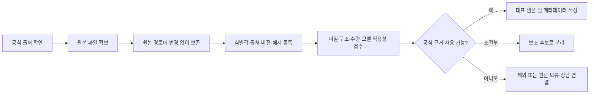

# WPU-IAC506 데이터 수집 보고서

> **문서 상태:** 임시본  
> **산출물 단계:** 데이터 수집 및 저장  
> **작성 기준일:** 2026-07-20  
> **제출 일자:** 작성 예정  
> **교육 기수·팀명:** 작성 예정  
> **작성 역할:** 팀원 C - 공식 데이터 수집·수집 절차 설계·보고서 취합  
> **저장소 내 경로:** `data/reports/데이터_수집_보고서_임시본.md`  
> **원격 GitHub 주소:** 작성 예정

## 문서 작성 기준

- MVP 지원 범위는 `WPU-IAC506` 단일 모델이다.
- `WPU-IAC506 REV.00` 공식 사용설명서를 1차 근거로 사용한다.
- 정수기 공통 FAQ는 WPU-IAC506 적용이 직접 확인되지 않은 조건부 보조 자료다.
- 이번 단계는 수집 현황과 전처리 가능성을 검증하는 기획 단계다. 전체 전처리, OCR, 임베딩 생성 및 벡터 DB 적재는 수행하지 않았다.
- 공식 매뉴얼과 FAQ 원본은 팀 내부 개발·검토용으로 제한하며 공개 저장소에 업로드하지 않는다.
- 방문관리·셀프관리 시연 규칙은 공식 정책이 아닌 `team_designed` 데이터로 구분한다.

---

## 1. 수집 데이터 개요

본 프로젝트는 정수기 구독 고객의 제품 문의와 A/S 상담을 지원하는 MVP를 기획하고 있다. 공식 제품 정보와 안전한 고객 안내 근거를 확보하기 위해 WPU-IAC506 사용설명서와 정수기 공통 FAQ를 수집·등록했다. 공식 원본, 가공 가능성 검증용 샘플, 팀이 만든 합성 시연 데이터는 서로 다른 경로와 식별값으로 관리한다.

| 데이터명 | 수집 대상 | 수집 목적 | 사용 예정 기능 | 출처·권리 상태 | 현재 상태 |
|---|---|---|---|---|---|
| WPU-IAC506 사용설명서 | SK매직 얼음 냉온정수기 `WPU-IAC506`, `REV.00` | 모델 식별, 관리 기준, 대표 증상, 안전 및 상담 근거 확보 | RAG, 제품 식별, 케어 기준, 위험 분기 | [SK인텔릭스서비스 공식 사용설명서 화면](https://www.skintellixservice.com/web/easy/easyMain.do?tabIndex=3#Back), 원본 외부 재배포 범위 미확정 | 확보 완료 |
| SK매직 정수기 공통 FAQ | 정수기 FAQ 119건 | 대표 증상 관련 보조 검색 후보 확보 | 보조 검색, 답변 후보 비교 | [SK매직 공식 FAQ 목록](https://www.skmagic.com/customer/faq/indexFaqList), 개별 모델 적용성 제한 | 부분 확보·조건부 사용 |
| 공식 보완 후보 목록 | 모델 검색 결과와 대표 FAQ 콘텐츠 ID | 공식 화면에서 대표 항목을 다시 식별할 수 있도록 보완 | 출처 추적, 적용 범위 검토 | [SK인텔릭스서비스 쉬운해결](https://www.skintellixservice.com/web/easy/easyMain.do?tabIndex=0) | 12건 확보 |
| RAG 대표 샘플 | 매뉴얼 근거 6개 주제 | 전처리·메타데이터 구조의 기획 타당성 검증 | 팀원 B·D 인계, 검색 구조 설계 | 공식 매뉴얼 기반 가공 요약 | 6건 작성 완료 |
| 합성 시연 시나리오 | 대표 증상 4종 | 문의-상담-방문 흐름과 화면 시연 | 팀원 D·E 인계, UI·업무 흐름 시연 | 팀 자체 생성, `team_designed` 포함 | 4건 작성 완료 |

### 1.1 수집 범위 해석 시 주의사항

- FAQ의 `119건`은 수집된 문항 수다. WPU-IAC506에 직접 적용 가능한 공식 근거 119건을 의미하지 않는다.
- 수집본 FAQ에서 `WPU-IAC506` 직접 언급은 0건이다.
- 타 모델 전용 FAQ는 제외하고, 공통 FAQ도 WPU-IAC506 매뉴얼과 내용이 일치할 때만 보조 자료로 사용한다.
- 공식 근거가 없거나 자료 간 내용이 충돌하면 임의로 판단하지 않고 `판단 보류·상담 필요`로 처리한다.

## 2. 수집 방법 및 자동화 절차

### 2.1 수집 방식

| 자료 | 웹 크롤링 | API 호출 | 사용자 입력 | 문서 업로드·직접 다운로드 | 기타 |
|---|:---:|:---:|:---:|:---:|---|
| WPU-IAC506 사용설명서 |  |  | ✓ | ✓ | 공식 화면에서 직접 다운로드한 파일을 사용자에게 전달받아 등록 |
| 정수기 공통 FAQ | ✓ |  |  |  | 기존 크롤링 결과 Markdown 파일을 전달받아 등록 |
| 공식 보완 후보 |  |  | ✓ |  | 공식 고객지원 화면에서 대표 항목을 수동 확인 |

현재 단계에서는 기존 FAQ 크롤러를 재구현하거나 크롤링 재현성을 추가 확보하지 않는다. FAQ는 이미 확보된 결과 파일을 기준으로 검토하며, 재수집 필요성이 확인될 때만 별도 수집 절차를 결정한다.

### 2.2 사용 도구·자동화·예외 처리

| 항목 | 내용 |
|---|---|
| 사용 언어·라이브러리 | 수집 단계의 신규 자동화 코드 없음. 품질 검수에는 `pypdf`, `pdfinfo`, SHA-256 계산 및 Markdown 구조 검사를 사용 |
| 자동화 여부와 주기 | 매뉴얼은 비자동 직접 다운로드. FAQ는 기존 수집 결과 파일만 확보되어 있으나 실행 환경·주기는 미확인. 정기 자동 수집은 MVP 범위에 포함하지 않음 |
| 수집 성공 기준 | 파일 열림, 예상 형식 일치, 모델·버전 확인, 수집 건수 일치, SHA-256 기록 |
| 오류 발생 시 처리 | 원본을 수정하지 않고 오류를 기록한다. 수집 실패 또는 근거 불명확 시 해당 자료를 고객 안내 근거에서 제외한다 |
| 미확인 오류 코드 처리 | 고객 입력 원문을 그대로 저장하고 의미를 추정하지 않으며 상담 연결 대상으로 처리 |
| FAQ 예외 처리 | 타 모델 전용, 이미지 전용 답변, 출처 불명확, 매뉴얼과 충돌하는 항목은 제외 또는 보류 |

### 2.3 수집·등록 흐름

## 3. 데이터 설명 및 구성

### 3.1 파일 및 주요 필드 설명

| 파일명·데이터명 | 주요 필드·구조 | 데이터 형식 | 설명 | 예시 |
|---|---|---|---|---|
| `source_inventory.csv` | `data_id`, `제품모델`, `자료유형`, `원본위치`, `버전`, `수집일시`, `sha256`, `상태` | CSV | 수집 원본의 식별·출처·무결성 관리 | `MAN-SKMAGIC-WPU-IAC506-REV00` |
| `collection_log.csv` | `수집시각`, `수집방식`, `자동화여부`, `성공여부`, `오류`, `비고` | CSV | 자료별 수집 이력과 한계 기록 | 매뉴얼 직접 다운로드·성공 |
| `quality_review.csv` | `review_id`, `검수항목`, `검사방법`, `측정값`, `판정`, `조치` | CSV | 파일 무결성, 구조, 모델 적용성 검수 | `QR-MAN-001`, `적합` |
| `source_coverage_matrix.csv` | `요구범위`, `우선공식근거`, `페이지_구간`, `확보상태`, `제한사항_추가조치` | CSV | 요구사항과 공식 근거 범위 연결 | 누수 근거: 5, 34, 44쪽 |
| `official_support_candidates.csv` | 공식 제목, 콘텐츠 ID, 검색어, 적용 후보 | CSV | 대표 FAQ와 모델 검색 결과의 수동 재식별 | 대표 FAQ 콘텐츠 ID 5건 |
| `rag_sample.jsonl` | `chunk_id`, `document_id`, `product_model`, `page_refs`, `risk_level`, `safe_actions` 등 | JSONL | 매뉴얼 기반 RAG 대표 청크 6건 | 출수량 저하, 누수, 필터 주기 |
| `demo_scenarios.json` | 시나리오 ID, 증상, 상태, 근거, 상담·방문 흐름 | JSON | 개인정보가 없는 합성 시연 데이터 | 누수 위험 분기 |

상세 스키마와 포함·제외 규칙은 [전처리 설계서](../processed/metadata/preprocessing_spec.md)에 기록한다.

### 3.2 데이터 양

| 구분 | 전체 확보량 | 검수·가공 결과 | 해석 |
|---|---:|---:|---|
| WPU-IAC506 매뉴얼 | PDF 1파일, 50쪽 | 49쪽 텍스트 추출 가능, 50쪽은 빈 마지막 면 | 모델·버전 일치, 핵심 근거 구간 검수 완료 |
| 정수기 공통 FAQ | Markdown 1파일, 119개 문항 | 동일 제목 중복 0건, 조건부 적합 3항목, 보완 필요 1항목 | WPU-IAC506 직접 적용 건수로 계산하지 않음 |
| 품질 검수 항목 | 13항목 | 적합 9, 조건부 적합 3, 보완 필요 1 | 보완 필요 항목은 크롤링 재현성으로, 현재 단계에서 재구현하지 않음 |
| 공식 근거 범위 | 16항목 | 확보 완료 11, 부분 확보 4, 미확보 1 | 미확보 1건은 관리 유형별 공식 정책 |
| RAG 대표 샘플 | 6건 | JSONL 6건 구조 검증 완료 | 전체 전처리 결과가 아닌 설계 검증본 |
| 합성 시연 시나리오 | 4건 | 모델·근거·가상 ID 검증 완료 | 실제 고객 데이터가 아님 |

`고품질 데이터 건수`를 단일 숫자로 합산하지 않는다. 매뉴얼 근거, 조건부 FAQ, 가공 샘플은 공식성·적용성·가공 단계가 서로 다르기 때문이다.

### 3.3 저장 위치 및 포맷

| 구분 | 저장 경로 | 포맷 | 인코딩·관리 기준 |
|---|---|---|---|
| 매뉴얼 원본 | `data/raw/manuals/SK매직_WPU-IAC506_사용설명서_REV00.pdf` | PDF | 바이너리 원본, 수정 금지, SHA-256 관리 |
| FAQ 원본 | `data/raw/faq/SK매직_정수기공통_FAQ_20260715.md` | Markdown | UTF-8, 원본 내용 수정 금지 |
| 메타데이터 | `data/processed/metadata/` | CSV, Markdown | UTF-8, 식별값·날짜·상태값 표준화 |
| RAG 대표 샘플 | `data/processed/structured/rag_sample.jsonl` | JSONL | UTF-8, 한 줄당 독립 JSON |
| 합성 시연 데이터 | `data/synthetic/demo_scenarios.json` | JSON | UTF-8, 실제 개인정보 사용 금지 |
| 보고서 | `data/reports/` | Markdown | UTF-8, 원본 전체 대신 최소 근거 정보 표시 |

원본과 원본 포함 인계 ZIP은 `.gitignore`의 `data/raw/`, `data/handoff_packages/*.zip` 규칙으로 공개 저장소 업로드 대상에서 제외한다.

## 4. 법적·윤리적 검토

| 검토 항목 | 결과 | 적용 조치 |
|---|---|---|
| 개인정보 포함 여부 | 공식 매뉴얼·FAQ 수집본에 실제 고객 개인정보 없음 | 향후 상담 로그를 사용할 경우 별도 개인정보 검토 필요 |
| 합성 데이터 개인정보 | 실제 이름·전화번호·주소·결제정보 없음 | `DEMO` 식별자만 사용하고 실제 고객정보 형태의 임의 생성도 제한 |
| 비식별화 조치 | 현재 공식 원본에는 적용 대상 없음 | 실제 사용자 입력 저장 시 마스킹·접근 통제 기준 별도 수립 |
| 출처 공개 여부 | 공식 웹 화면에서 공개적으로 접근 가능한 자료 | 문서명, 공식 출처, 버전, 페이지 및 콘텐츠 ID 등 최소 근거만 표시 |
| 원본 공유 범위 | 팀 내부 개발·검토용 | 공개 저장소와 외부 배포물에 원본 또는 원본 포함 ZIP 업로드 금지 |
| 라이선스·약관 검토 | 외부 재배포를 허용한다고 확정할 근거는 미확보 | 원문 전체 외부 배포는 별도 권한 확인 후 결정 |
| 모델 적용성 | FAQ는 WPU-IAC506 직접 적용이 확인되지 않음 | 매뉴얼을 우선하고 FAQ는 일치 범위에서만 조건부 보조 사용 |
| 안전한 안내 | 누수·감전·화재·히터 경고 등 위험 항목 포함 | 자가 분해·수리 안내 금지, 사용 중지·밸브 잠금·전원 분리·상담 연결 우선 |
| AI 표현 | 공식 문서가 원인을 확정하지 않는 경우가 있음 | `점검 후보`, `가능성`, `확인 필요`로 표현하고 고장을 단정하지 않음 |

검토 기준일은 2026-07-20이며, PM 승인 내용은 [PM 최종 결정 문서](pm_final_decisions_20260720.md)에 기록되어 있다.

## 5. 데이터 품질 및 정합성 관리 방안

### 5.1 품질 검수 결과 요약

- 매뉴얼은 50쪽, 암호화 없음, 파일 크기 9,159,849 bytes로 확인했다.
- 등록된 매뉴얼 SHA-256은 `2AE0ADEAD5FA1AA282D1E9C4944DD5389AE79EF8B20F73BCB93374E02963BEA9`다.
- 매뉴얼 49쪽에서 텍스트 추출이 가능하며 50쪽은 빈 마지막 면으로 확인했다.
- FAQ는 1번부터 119번까지 연속된 119개 구간이며 정확히 동일한 제목 중복은 0건이다.
- FAQ에는 원격 이미지 19개가 포함되고, 4~11번 8개 항목은 답변이 이미지에만 있어 텍스트 근거로 바로 사용할 수 없다.
- FAQ 원본의 119개 항목은 동일한 목록 URL을 사용하므로 각 항목의 고정 URL이 있는 것처럼 표현하지 않는다.

상세 결과는 [품질 검수표](../processed/metadata/quality_review.csv)에서 관리한다.

### 5.2 관리 기준

| 관리 항목 | 기준 |
|---|---|
| 중복 제거 | FAQ 번호와 정규화된 제목을 함께 확인한다. 정확히 동일한 제목은 중복으로 판정하고, 의미가 유사한 항목은 대표 샘플 선별 단계에서 검토한다 |
| 정합성 검증 | `document_id`가 원본 목록에 존재하는지, 모델·버전·페이지·수집일·SHA-256이 원본 메타데이터와 일치하는지 확인한다 |
| 필수값 검증 | 매뉴얼 청크는 `document_id`, `product_model`, `page_refs`, `applicability`, `verification_status`를 필수로 한다 |
| Null 처리 | 해당하지 않는 값은 `null` 또는 빈 값으로 유지한다. 미확인 값을 추정하거나 임의의 기본값으로 채우지 않는다 |
| 텍스트 표준화 | 원문과 가공 요약을 분리한다. 원문 의미를 바꾸는 특수문자 제거·문장 보정은 하지 않는다 |
| 날짜 표준화 | 시스템 저장값은 `YYYY-MM-DD` 또는 `YYYY-MM-DD HH:mm:ss` 형식을 사용한다 |
| 상태값 표준화 | `완료`, `부분 확보`, `조건부 적합`, `보완 필요`, `미확보`를 구분한다 |
| 적용성 표준화 | `model_exact`, `common_unverified`, `excluded`를 구분한다 |
| 안전성 검증 | 위험 청크에는 상담 조건 또는 금지 조치가 있어야 한다 |
| 원본 무결성 | `data/raw/`의 원본은 수정하지 않고 파일 해시로 복사 과정의 변조 여부를 확인한다 |

### 5.3 후속 전처리 시 보완 항목

1. 현재 하나로 묶인 `온수 일반 점검`과 `히터 경고·비음용` 대표 청크를 분리한다.
2. 각 청크의 `risk_level`과 `current_use_guidance`를 독립적으로 검증한다.
3. 상담·방문 상태 코드와 화면 표시명은 팀원 D·E와 데이터 계약을 확정한 뒤 반영한다.
4. FAQ는 모델 적용성과 공식 콘텐츠 ID를 확인할 수 있는 대표 항목만 선별한다.
5. 전체 공식 오류 코드 자료는 현재 추가 조사하지 않으며, 구현 과정에서 필요성이 확인될 때 재검토한다.

## 6. 변경 이력 및 보완 내역

| 변경일 | 변경 주체 | 변경 내용 | 비고 |
|---|---|---|---|
| 2026-07-15 | 기존 수집 작업 | SK매직 정수기 공통 FAQ 119건 수집 | 결과 파일만 확보, 크롤링 실행 환경·로그 미확보 |
| 2026-07-20 | 팀원 C | WPU-IAC506 REV.00 매뉴얼 등록, 출처·버전·해시 기록 | 공식 사용설명서 화면에서 직접 다운로드한 사용자 제공 파일 |
| 2026-07-20 | 팀원 C | 매뉴얼·FAQ 품질 검수와 공식 근거 범위 매핑 | 적합 9, 조건부 적합 3, 보완 필요 1 |
| 2026-07-20 | PM | WPU-IAC506 단일 모델, 매뉴얼 우선, FAQ 조건부 사용 등 최종 결정 | `PMD-001`~`PMD-006` 반영 |
| 2026-07-20 | 팀원 C | RAG 대표 샘플 6건과 합성 시연 시나리오 4건 작성 | 전체 전처리가 아닌 기획 검증용 |
| 2026-07-20 | 팀원 C | 데이터 수집 보고서 임시본 작성 | 팀명·제출일·원격 GitHub 주소는 작성 예정 |

## 7. 현재 상태 및 남은 확인사항

### 완료

- [x] MVP 지원 모델을 WPU-IAC506 단일 모델로 확정
- [x] 공식 매뉴얼 1파일과 FAQ 수집본 1파일 등록
- [x] 출처·버전·수집일·파일 크기·SHA-256 기록
- [x] 매뉴얼·FAQ 품질 검수
- [x] 대표 증상과 공식 근거 페이지 연결
- [x] 전처리 규칙과 RAG 대표 샘플 6건 작성
- [x] 합성 시연 시나리오 4건 작성
- [x] 원본의 내부 공유 제한과 공개 저장소 제외 규칙 반영
- [x] 팀원 B·D·E 인계 자료 구성

### 작성·확인 예정

- [ ] 교육 기수와 팀명
- [ ] 최종 제출 일자
- [ ] 원격 GitHub 저장소 주소
- [ ] 실제 팀원 전달·수신 확인 기록
- [ ] 팀원 D·E와 상태 코드·화면 표시명 데이터 계약 확정
- [ ] 후속 전처리 단계에서 온수 일반 점검과 히터 경고 청크 분리

## 8. 관련 산출물

| 산출물 | 경로 |
|---|---|
| 공식 데이터 수집 상세 보고서 | [data_collection_report.md](data_collection_report.md) |
| 원본 자료 목록 | [source_inventory.csv](../processed/metadata/source_inventory.csv) |
| 수집 로그 | [collection_log.csv](../processed/metadata/collection_log.csv) |
| 품질 검수표 | [quality_review.csv](../processed/metadata/quality_review.csv) |
| 공식 근거 범위표 | [source_coverage_matrix.csv](../processed/metadata/source_coverage_matrix.csv) |
| 전처리 설계서 | [preprocessing_spec.md](../processed/metadata/preprocessing_spec.md) |
| RAG 대표 샘플 | [rag_sample.jsonl](../processed/structured/rag_sample.jsonl) |
| 합성 시연 시나리오 | [demo_scenarios.json](../synthetic/demo_scenarios.json) |
| 공식 보완 자료 조사 | [official_gap_research.md](official_gap_research.md) |
| PM 최종 결정 | [pm_final_decisions_20260720.md](pm_final_decisions_20260720.md) |
| 인계 안내서 | [data_handoff_guide.md](data_handoff_guide.md) |

---

> 이 문서는 임시본이다. 팀 정보, 제출 정보와 구현 단계 협의 결과가 확정되면 최종 제출본으로 갱신한다.
