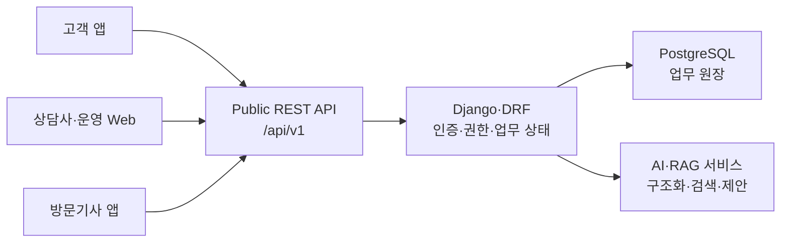

# WaterBridge Public API Specification

> 문서 기준일: 2026-08-02
>
> 사람용 문서 Revision: `2026.08.02`
>
> 기계 계약 Version: OpenAPI `0.5.0`
>
> 유지관리 역할: Backend·API 담당
>
> 상태: 부분 구현 — OpenAPI 10개, Runtime 8개, OpenAPI-only 2개

> 정본 경로: `docs/api/waterbridge_api_specification.md`

## 1. 목적과 읽는 순서

이 문서는 WaterBridge Public REST API를 사람이 검토하기 위한 팀 공용
명세다. 실제 Method·Path·Schema의 기계 기준은
[`contracts/api/openapi.yaml`](../../contracts/api/openapi.yaml)과 하위
파일이며, 실행 지원 여부는 [API Runtime 구현 상태](runtime_implementation_status.md)를
함께 확인한다.

사람용 카탈로그에는 총 42개 ID가 남아 있지만 모두 같은 성숙도가 아니다.

| 구분 | 수량 | 의미 |
|---|---:|---|
| 기계 계약 | 10 | OpenAPI에 등록된 Operation |
| └ Django Runtime | 8 | 실제 Route·View가 존재하나 팀 검토 전 |
| └ OpenAPI-only | 2 | Route가 없는 계약 |
| 설계 백로그 | 31 | OpenAPI 미등록; 구현 계약이 아님 |
| └ 구현 차단 | 4 | 저장 모델·정책 결정 전 구현 금지 |
| 폐기 설계 | 1 | generic `/events`; 현재 행동별 Endpoint 원칙에서 제외 |
| 합계 | 42 | 추적용 API ID 카탈로그 |
| `VERIFIED` | 0 | 독립 재현·소비 검토·통합 승인 전 |

## 2. 상태 정의와 기준 원본

### 2.1 상태 정의

| 상태 | 의미 |
|---|---|
| `RUNTIME_REVIEW_PENDING` | Route·View와 작성자 검증은 있으나 독립 재현·팀 검토 전 |
| `OPENAPI_ONLY` | Method·Path·Schema는 등록됐으나 실행 Route가 없음 |
| `DESIGN_BACKLOG` | 요구사항 추적용 설계이며 OpenAPI·Runtime 계약이 아님 |
| `BLOCKED` | 저장 모델이나 정책 결정 전에는 구현하면 안 되는 백로그 |
| `RETIRED` | 현재 계약 방향에서 제외된 역사 설계 |
| `VERIFIED` | 구현·자동 테스트·독립 재현·팀 검토가 모두 확인됨 |

OpenAPI의 `x-contract-status: CONFIRMED`는 Method·Path·Schema가 기계
계약에 등록됐다는 뜻이다. Runtime 구현 또는 `VERIFIED`와 같은 의미가
아니다.

### 2.2 기준 원본

| 범위 | 기준 원본 |
|---|---|
| Public Method·Path·Schema | `contracts/api/**` |
| 오류 코드·HTTP 매핑 | `contracts/error-codes/**` |
| 상태·전이·Guard·허용 행동 | `contracts/state-machine/**` |
| AI 입출력 | `contracts/ai/**` |
| 실행 Route·View·Serializer | `backend/**` |
| 요구사항·일정 | `docs/planning/md/**` |

사람용 문서, OpenAPI, 구현, JSON 예시와 계약 테스트가 다르면 해당
차이를 숨기지 않고 성숙도가 가장 낮은 항목을 현재 상태로 사용한다.

## 3. 시스템 경계



- 클라이언트는 `allowed_actions`를 소비하며 업무 상태를 자체 계산하지
  않는다.
- AI·RAG는 분석과 제안을 제공하지만 DB 상태를 직접 변경하지 않는다.
- Django·DRF가 인증, 객체 권한, Transaction과 상태 전이의 최종
  경계다.
- 현행 구현 기준은 `backend/**`다. 루트 `WaterCareBackend/**`는 구형
  Android starter이며 현재 계약의 권위 원본이 아니다.

## 4. 공통 Public 계약

### 4.1 URL·형식·식별자

| 항목 | 계약 |
|---|---|
| Public 업무 Prefix | `/api/v1` |
| 상태 점검 | `/health`; 현재 200과 빈 본문 |
| 본문 | `application/json; charset=utf-8` |
| JSON 필드명 | `lower_snake_case` |
| 날짜 | `YYYY-MM-DD` |
| 일시 | DB UTC 저장, Public API ISO 8601 `+09:00` Offset |
| 값 없음·빈 목록 | `null`, `[]` |
| Public ID | 클라이언트는 파싱하지 않는 opaque string |
| 구현된 문의·계정 관련 ID | UUID |

현재 Runtime이 있는 문의 Endpoint의 `inquiry_id`, 문의 생성의
`subscription_id`와 선택 `questionnaire_session_id`는 UUID다.
OpenAPI-only 두 Operation의 Path ID는 아직 길이 기반 문자열 정의가
남아 있어 Runtime 착수 전에 UUID 원칙과 정합화해야 한다.

### 4.2 공통 성공·오류 Envelope

성공 응답:

```json
{
  "success": true,
  "data": {},
  "error": null,
  "metadata": {
    "correlation_id": "550e8400-e29b-41d4-a716-446655440000"
  }
}
```

오류 응답:

```json
{
  "success": false,
  "data": null,
  "error": {
    "code": "STATE-CONFLICT-01",
    "message": "현재 상태에서 요청한 작업을 수행할 수 없습니다.",
    "details": {
      "current_status": "DRAFT",
      "state_version": 2,
      "allowed_actions": []
    }
  },
  "metadata": {
    "correlation_id": "550e8400-e29b-41d4-a716-446655440000"
  }
}
```

`X-Correlation-ID` Header와 `metadata.correlation_id`는 같은 요청 추적값을
사용한다. 비밀값, Token, 실제 개인정보, 내부 경로, Prompt와 검색 원문
전문은 응답·오류·로그·문서에 포함하지 않는다.

### 4.3 인증·권한

| 역할 | Public 범위 |
|---|---|
| `CUSTOMER` | 본인 구독·문진·문의·조치 결과·피드백 |
| `CONSULTANT` | 허용 Queue와 배정 문의·상담·방문 전환 |
| `TECHNICIAN` | 본인에게 배정된 방문과 방문 결과 |
| `OPERATOR` | 승인된 운영 집계·예외와 별도 권한 범위 |

| 상황 | HTTP | 원칙 |
|---|---:|---|
| 인증 누락·실패 | 401 | 로그인 또는 Token 갱신 필요 |
| 역할 부족 | 403 | 기능 자체가 허용되지 않음 |
| 리소스 미존재 | 404 | 대상 없음 |
| 타 고객·미배정 리소스 | 404 | 객체 존재 여부를 숨김 |
| 상태·Version·멱등 충돌 | 409 | 최신 공개 상태를 반환하고 입력을 보존 |

Access Token 기본 수명은 3600초, Refresh Token은 최초 발급 시점부터
최대 604800초다. Refresh Rotation은 절대 만료를 연장하지 않고 이전
Refresh Token을 폐기한다.

### 4.4 계정관리 확장 경계

`T-017A`, `T-017B`, `T-017C`는 계정관리 설계·내부 관리·수명주기·감사
범위의 **계획 항목이며 현재 완료된 Runtime이 아니다**.

- P0 계정 관리는 Django Admin Session·CSRF 기반 내부 인터페이스로
  계획하고 Public `/api/v1/admin/users/**`를 추가하지 않는다.
- 계정 비활성화·재활성화, 기존 Refresh 폐기, 관리자 권한 상승 방지와
  감사 이력은 후속 Model·Service·Admin·테스트가 필요하다.
- `ACCOUNT_INACTIVE`, `REFRESH_TOKEN_REVOKED`,
  `LAST_ADMIN_PROTECTED` 등의 계획 오류는 현재 오류 Registry와 Runtime에
  등록된 것으로 간주하지 않는다.
- P1 본인 프로필 API도 OpenAPI와 Runtime에 등록되기 전에는 소비하지
  않는다.

## 5. 기계 계약 10개

| 상태 | ID | Method | Public Path | `operationId` | Request → `data` Response |
|---|---|---|---|---|---|
| `RUNTIME_REVIEW_PENDING` | `API-SYS-001` | GET | `/health` | `getProvisionalHealth` | 없음 → 빈 본문 |
| `RUNTIME_REVIEW_PENDING` | `API-AUTH-001` | POST | `/api/v1/auth/demo-login` | `demoLogin` | `LoginRequest` → `LoginResponse` |
| `RUNTIME_REVIEW_PENDING` | `API-AUTH-002` | GET | `/api/v1/me` | `getCurrentUser` | 없음 → `AuthenticatedUser` |
| `RUNTIME_REVIEW_PENDING` | `API-AUTH-003` | POST | `/api/v1/auth/refresh` | `refreshAuthToken` | `TokenRefreshRequest` → `LoginResponse` |
| `RUNTIME_REVIEW_PENDING` | `API-AUTH-004` | POST | `/api/v1/auth/logout` | `logout` | `LogoutRequest` → `LogoutResponse` |
| `RUNTIME_REVIEW_PENDING` | `API-INQ-001` | POST | `/api/v1/inquiries` | `startInquiry` | `CreateInquiryRequest` → `CreateInquiryResult` |
| `OPENAPI_ONLY` | `API-INQ-002` | PATCH | `/api/v1/inquiries/{id}/questionnaire` | `accumulateInquiryQuestionnaire` | `InquiryQuestionnaireRequest` → `InquiryDetail` |
| `RUNTIME_REVIEW_PENDING` | `API-INQ-003` | POST | `/api/v1/inquiries/{id}/submit` | `submitSymptom` | `SymptomSubmissionRequest` → `SubmitSymptomResult` |
| `OPENAPI_ONLY` | `API-INQ-008` | POST | `/api/v1/inquiries/{id}/action-results` | `createInquiryActionResult` | `ActionResultRequest` → `ActionResult` |
| `RUNTIME_REVIEW_PENDING` | `API-INQ-013` | POST | `/api/v1/inquiries/{id}/cancel` | `cancelInquiry` | `CancelInquiryRequest` → `CancelInquiryResult` |

OpenAPI-only Operation은 호출 시 Django의 공통 API 404 경계로
처리된다. Web·Mobile은 이를 구현된 API로 연결하면 안 된다.

## 6. 구현된 문의 Mutation 계약

### 6.1 문의 생성 — `startInquiry`

`CreateInquiryRequest`:

| 필드 | 필수 | 계약 |
|---|:---:|---|
| `subscription_id` | Y | UUID, 인증 고객 본인의 ACTIVE 구독 |
| `channel_code` | Y | `WEB`, `MOBILE`, `PHONE`, `OPERATOR` |
| `raw_text` | Y | trim 후 1~5000자, 최초 원문 보존 |
| `representative_symptom_code` | N | null 또는 1~40자 코드 |
| `questionnaire_session_id` | N | null 또는 UUID |

성공 `data`는 `CreateInquiryResult`다. `InquiryDetail`로 확대해 해석하지
않는다.

| 필드 | 계약 |
|---|---|
| `inquiry_id` | 생성된 문의 Public UUID |
| `inquiry_code` | 업무 표시용 문의 번호 |
| `status_code` | `DRAFT` |
| `state_version` | `1` |
| `idempotent_replay` | 저장 결과 재사용 여부 |
| `allowed_actions` | `SUBMIT_SYMPTOM`, `CANCEL_INQUIRY`의 서버 파생 항목 |

### 6.2 증상 제출 — `submitSymptom`

- Path `id`: 문의 Public UUID
- Header: `Idempotency-Key` 필수
- Request: `state_version` 1 이상
- 소유권·현재 `DRAFT`·ACTIVE 구독·제품 연결을 다시 검증
- 성공 상태: `QUESTIONNAIRE_IN_PROGRESS`
- 성공 `data`: `SubmitSymptomResult`
- 동일 Key·동일 Payload는 저장 결과 Replay
- 같은 Key의 다른 Payload, 상태·Version 충돌은 409
- 이 Runtime Slice는 AI 호출과 Target-only Questionnaire 생성 미포함

### 6.3 문의 취소 — `cancelInquiry`

- Path `id`: 문의 Public UUID
- Header: `Idempotency-Key` 필수
- Request: `state_version`, `reason_code`, 선택 `reason_detail`
- 허용 `reason_code`: `CUSTOMER_REQUEST`, `DUPLICATE_INQUIRY`,
  `ISSUE_RESOLVED`, `OTHER`
- 성공 상태: `CANCELLED`
- 성공 `data`: `CancelInquiryResult`
- 동일 Key·동일 Payload는 저장 결과 Replay
- 같은 Key의 다른 Payload, 상태·Version 충돌은 409

## 7. 오류 계약

현재 최상위 Registry에는 10개 오류 코드가 있다.

| HTTP | 코드 | 현재 범위 |
|---:|---|---|
| 400 | `INVALID_REQUEST` | 잘못된 요청과 기타 4xx fallback |
| 401 | `AUTH_REQUIRED` | 인증 필요 |
| 403 | `FORBIDDEN` | 역할 부족 |
| 404 | `RESOURCE_NOT_FOUND` | 미존재·객체 접근 은닉 |
| 409 | `STATE-CONFLICT-01` | START·SUBMIT·CANCEL의 상태·Version 충돌 |
| 409 | `DUPLICATE-EVENT-01` | START·SUBMIT·CANCEL의 멱등 Key 충돌 |
| 422 | `VALIDATION_ERROR` | 요청·업무 사전조건 검증 실패 |
| 500 | `INTERNAL_ERROR` | 예상하지 못한 오류와 5xx fallback |
| 503 | `AI-FAILED-01` | Registry만 존재, 관련 Runtime 미구현 |
| 503 | `SEARCH-FAILED-01` | Registry만 존재, 관련 Runtime 미구현 |

`INVALID_REQUEST`와 `INTERNAL_ERROR`의 대표 `http_status` 외 예외 매핑은
`runtime_http_mapping`의 예외·상태·상태군 우선순위를 따른다. 현재
Registry와 구현된 Runtime의 공통 오류 매핑은 정합화돼 있으며, 계획
계정관리 오류와 AI·검색 실패의 실행 경로는 별도 미구현이다.

## 8. State·멱등성·동시성

State 기준 원본은
[`contracts/state-machine/**`](../../contracts/state-machine/README.md)다.
현재 계약에는 13개 상태, 30개 이벤트, 34개 전이, 39개 Guard, 5개
역할과 23개 행동 카탈로그가 있다.

- 외부 상태 변경은 행동별 Endpoint와 `operation_id`를 사용한다.
- 클라이언트는 임의의 Event code를 생성하지 않는다.
- Mutation은 기대 `state_version`과 서버 최신 Version을 비교한다.
- 불일치하면 최신 값을 덮어쓰지 않고 409를 반환한다.
- 모든 외부 쓰기는 Operation·Actor·Idempotency Key·정규화한 Payload
  Hash 범위로 중복을 판정한다.
- 같은 Key와 같은 요청은 저장 결과를 Replay하고 다른 요청은 409다.
- State 이력에는 이전·다음 상태, 수행자, 시각, 사유와
  `correlation_id`를 남긴다.

## 9. 설계 백로그 31개

아래 Endpoint는 요구사항 추적용이다. OpenAPI 등록과 Runtime 구현 전에는
요청·응답 계약으로 사용하지 않는다. `BLOCKED` 네 항목은 선행 모델이나
정책 결정 전 구현하면 안 된다.

| 상태 | ID | Method | 설계 Path | 목적·선행 조건 |
|---|---|---|---|---|
| `DESIGN_BACKLOG` | `API-SUB-001` | GET | `/api/v1/me/subscriptions` | 본인 구독 목록 |
| `DESIGN_BACKLOG` | `API-SUB-002` | POST | `/api/v1/me/subscriptions` | 구독 등록 |
| `DESIGN_BACKLOG` | `API-SUB-003` | PATCH | `/api/v1/me/subscriptions/{subscription_id}` | 구독 수정·Version 계약 필요 |
| `BLOCKED` | `API-SUB-004` | POST | `/api/v1/me/subscriptions/{subscription_id}/select` | 선택 저장 위치·단일 선택 제약 필요 |
| `BLOCKED` | `API-PRD-001` | POST | `/api/v1/me/products` | 고객 보유 제품 원장 필요 |
| `BLOCKED` | `API-PRD-002` | PATCH | `/api/v1/me/products/{product_id}` | 고객 보유 제품 Version 필요 |
| `DESIGN_BACKLOG` | `API-CARE-001` | GET | `/api/v1/me/care-histories` | 본인 케어 이력 조회 |
| `DESIGN_BACKLOG` | `API-CARE-002` | POST | `/api/v1/me/care-histories` | 등록 역할·멱등 저장 정책 필요 |
| `DESIGN_BACKLOG` | `API-CARE-003` | GET | `/api/v1/me/care-schedules` | 공식 주기 원본 필요 |
| `DESIGN_BACKLOG` | `API-QSN-001` | POST | `/api/v1/questionnaire-sessions` | 사전 문진 세션 생성 |
| `DESIGN_BACKLOG` | `API-QSN-002` | PATCH | `/api/v1/questionnaire-sessions/{session_id}` | 문진 임시 저장 |
| `DESIGN_BACKLOG` | `API-QSN-003` | POST | `/api/v1/questionnaire-sessions/{session_id}/submit` | 문진 제출 |
| `DESIGN_BACKLOG` | `API-QSN-004` | POST | `/api/v1/questionnaire-sessions/{session_id}/link-inquiry` | 문진·문의 연결 |
| `DESIGN_BACKLOG` | `API-INQ-005` | GET | `/api/v1/inquiries/{id}/questions` | 추가 질문 조회 |
| `DESIGN_BACKLOG` | `API-INQ-006` | POST | `/api/v1/inquiries/{id}/answers` | 추가 답변 제출 |
| `DESIGN_BACKLOG` | `API-INQ-007` | GET | `/api/v1/inquiries/{id}/guidance` | 검증된 안내 조회 |
| `DESIGN_BACKLOG` | `API-INQ-009` | POST | `/api/v1/inquiries/{id}/consultation-requests` | 상담 요청 |
| `DESIGN_BACKLOG` | `API-INQ-010` | GET | `/api/v1/inquiries/{id}` | 문의 상세·Timeline |
| `DESIGN_BACKLOG` | `API-INQ-011` | POST | `/api/v1/inquiries/{id}/feedback` | 해결 여부·후속 피드백 |
| `DESIGN_BACKLOG` | `API-INQ-012` | POST | `/api/v1/inquiries/{id}/reopen` | 미해결·재발 문의 재개 |
| `DESIGN_BACKLOG` | `API-CNS-001` | GET | `/api/v1/counselor/inquiries` | 상담 Queue |
| `DESIGN_BACKLOG` | `API-CNS-002` | GET | `/api/v1/counselor/inquiries/{id}` | 상담용 문의 상세 |
| `DESIGN_BACKLOG` | `API-CNS-003` | POST | 행동별 상담 Endpoint 미확정 | State `operation_id`별 Path 계약 필요 |
| `DESIGN_BACKLOG` | `API-CNS-004` | POST | `/api/v1/counselor/inquiries/{id}/visit-requests` | 인계·방문 요청 |
| `DESIGN_BACKLOG` | `API-VIS-001` | PATCH | `/api/v1/visits/{visit_id}/schedule` | 기사 배정·일정 변경 |
| `DESIGN_BACKLOG` | `API-TECH-001` | GET | `/api/v1/technician/visits` | 배정 방문 목록 |
| `DESIGN_BACKLOG` | `API-TECH-002` | GET | `/api/v1/technician/visits/{id}` | 방문 상세·인계 조회 |
| `BLOCKED` | `API-TECH-003` | PATCH | `/api/v1/technician/visits/{id}/precheck-report` | 기사 수정값 저장 모델 필요 |
| `DESIGN_BACKLOG` | `API-TECH-004` | POST | `/api/v1/technician/visits/{id}/results` | 방문 결과 등록 |
| `DESIGN_BACKLOG` | `API-OPS-001` | GET | `/api/v1/operations/dashboard` | 운영 역할·집계식·갱신 주기 필요 |
| `DESIGN_BACKLOG` | `API-OPS-002` | GET | `/api/v1/operations/exceptions` | 예외 분류·해결 상태 필요 |

백로그의 DTO 필드·필수 여부·Null·성공 상태를 이 문서에서 미리 확정하지
않는다. 구현 착수 시 요구사항, DB Model, State·AI 입력을 확인한 뒤
OpenAPI, 예시와 계약 테스트를 같은 변경에서 추가한다.

## 10. 폐기 설계 1개

| 상태 | ID | 역사 Path | 폐기 이유 |
|---|---|---|---|
| `RETIRED` | `API-INQ-004` | `POST /api/v1/inquiries/{id}/events` | 외부 행동별 Endpoint와 `operation_id`를 사용하는 현 State 계약과 불일치 |

generic `/events`의 Request 후보와 DTO는 현재 계약이 아니며 새 구현의
근거로 사용하지 않는다. 필요한 상태 변경은 `submitSymptom`,
`cancelInquiry`, `requestConsultation`, `finalizeInquiry`처럼 행동별
Operation으로 계약한다.

## 11. 변경·검증 Gate

API 변경은 최소한 다음 항목을 같은 변경 단위에서 다룬다.

1. Method·Path·`operationId`와 호출 역할
2. Request·Response Schema와 성공·오류 예시
3. 오류 코드·HTTP 상태·공통 Envelope
4. State Event·Guard 또는 상태 변경 없음 표시
5. `state_version`, 멱등성, Transaction과 Side effect
6. 객체 권한, 개인정보·비밀값·로그 노출 검토
7. OpenAPI 문법·참조·예시와 Runtime 계약 테스트
8. 미구현 경계, 호환성 영향과 Rollback 조건

다음 조건을 모두 만족하기 전에는 `VERIFIED`로 표시하지 않는다.

- OpenAPI와 사람용 명세의 Method·Path·Schema가 일치한다.
- Route·View·Serializer가 기계 계약과 일치한다.
- 정상, 400, 401, 403, 404, 409, 422와 5xx 경계를 검증한다.
- 객체 권한, 중복 요청, 동시 수정과 입력 보존을 검증한다.
- 비작성자가 새 테스트 DB에서 결과를 독립 재현한다.
- State·AI 담당과 Web·Mobile 소비자가 자기 경계를 검토한다.
- 승인된 팀 기준 Branch에서 같은 결과를 다시 확인한다.
