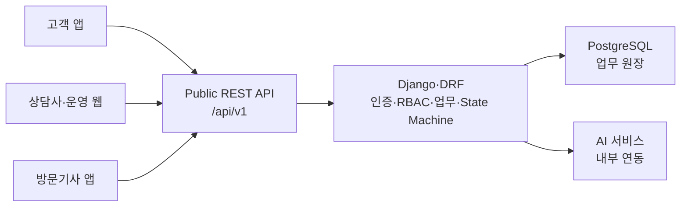

# WaterCare Public API Specification

> 문서 유형: 외부 열람 가능한 사람용 API 설계 명세
> 공개 문서 버전: `0.5.0-owner-baseline`
> 설계 기준일: 2026-07-27
> 상태: **OWNER_CONFIRMED DESIGN BASELINE — Runtime 구현·VERIFIED와 분리**
> 범위: 역할별 클라이언트가 사용하는 Public API 설계 기준선
> 작성 기준: 내부 교차검증 v0.5를 외부 공개 범위에 맞게 정리한 사본
> 작성·개정 책임: **최지용(Backend·API OWNER)**
> 외부 입력: **윤승혁(PM)—State 업무 규칙, 이동윤—AI Schema**
> 기계 판독 기준본: [`contracts/api/openapi.yaml`](../../contracts/api/openapi.yaml)

---

## 1. 문서 목적과 현재 상태

이 문서는 정수기 구독 고객 케어 및 A/S 업무 지원 시스템의 Public API
설계를 제3자가 이해할 수 있도록 정리한 공개용 사본이다. 내부 작업 이력,
개인별 진행 증거, 로컬 경로, 파일 해시와 내부 AI/RAG 경로는 포함하지
않는다.

`OWNER_CONFIRMED DESIGN BASELINE`은 최지용의 41개 API 작성·설계
기준선이 확정됐다는 뜻이다. OpenAPI 세부 정합화, Runtime 구현과
소비자 검증의 진행 상태는 아래 항목별 상태로 별도 표시한다.

현재 문서에는 최지용이 확정한 Public API 설계 기준선 41개가 있다.
이 수치는 Runtime 구현 완료 개수가 아니며, 다음 상태와 분리해 읽는다.

| 상태 | 의미 |
|---|---|
| `RUNTIME_IN_PROGRESS` | Django route와 OpenAPI 후보가 있으나 구현·테스트·리뷰 인수가 끝나지 않음 |
| `OPENAPI_CONFIRMED` | OWNER 기계 계약이 확정됐으나 실행 route가 없음 |
| `DESIGN_BASELINE_ONLY` | OWNER 사람용 설계 기준선에만 있고 OpenAPI·Runtime이 없음 |
| `BLOCKED` | 저장 모델 또는 무결성 계약이 보완되기 전 구현하면 안 됨 |
| `VERIFIED` | 구현·자동 테스트·리뷰·검증 결과가 모두 확인됨 |

현재 확인된 상태는 다음과 같다.

| 항목 | 수량 | 비고 |
|---|---:|---|
| Public API 설계 기준선 | 41 | 내부 API 5개와 분리 |
| OpenAPI 등록 operation | 8 | 상태 점검 1, 인증 4, 문의 3 |
| Runtime route | 5 | 상태 점검 1, 인증 4 |
| Runtime 미구현 설계 항목 | 36 | OpenAPI-only 3개 포함 |
| 구현 차단 항목 | 4 | 저장 모델 보완 필요 |
| `VERIFIED` | 0 | 문서 정합성은 구현 완료 증거가 아님 |

계약 채택 원칙은 다음과 같다.

1. 현재 기계 판독 기준은 `contracts/api/openapi.yaml`과 그 하위
   구성요소에 둔다. 개별 operation의 `x-contract-status`로 성숙도를
   구분한다.
2. 이 문서는 사람이 읽는 설명, 상태, 업무 규칙과 공개 예시를 제공한다.
3. Method, Path 또는 Schema 변경은 OpenAPI, Markdown, 구현, 예시와
   계약 테스트를 같은 변경 단위에서 갱신한다.
4. 어느 한 문서에만 존재하는 endpoint는 기계 계약과 Runtime에 함께
   반영된 것으로 간주하지 않는다.
5. 구현·테스트·리뷰 증거가 모두 확인되기 전에는 `VERIFIED`로 표시하지
   않는다.

---

## 2. 시스템 경계



| 구성요소 | 책임 |
|---|---|
| 역할별 클라이언트 | 화면 입력·표시, 로딩·오류 처리, 서버의 `allowed_actions`에 따른 UI 제어 |
| Django·DRF | 인증·권한, 업무 데이터, 트랜잭션, State Machine, Public DTO와 근거 카드 조립 |
| PostgreSQL | 업무 원장, 상태·감사 이력, 근거·AI 실행 참조 저장 |
| AI 서비스 | 구조화·검색·생성 결과 제안과 Schema 검증 |

클라이언트와 AI 서비스는 업무 상태를 직접 변경하지 않는다. 상태 전이와
객체 권한의 최종 책임은 Django·DRF에 있다.

---

## 3. 공통 API 계약

### 3.1 URL과 전송 형식

| 항목 | 계약 |
|---|---|
| Public 업무 Prefix | `/api/v1` |
| 상태 점검 | `/health` — 현재 provisional 계약 |
| 본문 | `application/json; charset=utf-8` |
| JSON 필드명 | `lower_snake_case` |
| 문자열 인코딩 | UTF-8 |
| Date | `YYYY-MM-DD` |
| DateTime | DB·감사 시각은 UTC 저장, Public API는 `+09:00` offset을 포함한 ISO 8601 |
| 값 없음 | `null` |
| 빈 목록 | `[]` |
| Boolean | `true`, `false` |
| Public ID | 문자열. 클라이언트는 형식과 길이에 의존하지 않는 opaque value로 처리 |
| 코드값 | `contracts/**` Enum과 Django `TextChoices`를 같은 값으로 유지 |

Backend의 도메인 ID는 ADR 0008의 `<ENTITY>-<UUID4_HEX_32>` 기준을
사용한다. Public API에서는 문자열 opaque value로 노출하며 클라이언트는
ID를 파싱하거나 접두사·길이로 의미를 판단하면 안 된다.

### 3.2 성공 응답

```json
{
  "success": true,
  "data": {},
  "error": null,
  "metadata": {
    "correlation_id": "550e8400-e29b-41d4-a716-446655440000"
  }
}
```

### 3.3 오류 응답

```json
{
  "success": false,
  "data": null,
  "error": {
    "code": "STATE-CONFLICT-01",
    "message": "현재 상태에서 요청한 작업을 수행할 수 없습니다.",
    "details": {
      "current_status": "CONSULTATION_REQUIRED",
      "state_version": 7,
      "allowed_actions": [
        "START_CONSULTATION"
      ]
    }
  },
  "metadata": {
    "correlation_id": "550e8400-e29b-41d4-a716-446655440000"
  }
}
```

| 항목 | 규칙 |
|---|---|
| 성공 | `success=true`, `data`는 endpoint별 Schema, `error=null` |
| 실패 | `success=false`, `data=null`, `error.code/message/details` |
| 사용자 메시지 | Stack trace, 비밀값과 내부 인프라 정보를 노출하지 않음 |
| 추적 | 응답 Header와 `metadata.correlation_id`에 같은 값을 반환 |
| `/health` | 현재 Runtime은 `X-Correlation-ID` Header와 빈 본문의 `200`; 최종 Health DTO는 OWNER 정합화 |

### 3.4 목록 응답

```json
{
  "success": true,
  "data": {
    "items": [],
    "page": 1,
    "size": 20,
    "total": 0
  },
  "error": null,
  "metadata": {
    "correlation_id": "550e8400-e29b-41d4-a716-446655440000"
  }
}
```

| Query | 타입 | 후보 제약 |
|---|---|---|
| `page` | integer | 기본값 1, 1 이상 |
| `size` | integer | 기본값 20, 1 이상 100 이하 |

정렬·필터 allowlist는 endpoint별로 동결해야 한다. 빈 결과는
`items=[]`로 반환한다.

### 3.5 추적 Header

| Header | 방향 | 용도 | 현재 상태 |
|---|---|---|---|
| `X-Correlation-ID` | 요청·응답 | 클라이언트, Backend와 로그를 연결하는 UUID | Public middleware·OpenAPI 구성요소 존재 |
| `Idempotency-Key` | 생성·업무 mutation 요청 | 중복 전송으로 인한 중복 처리를 방지 | 모든 외부 쓰기에 적용; scope·hash·replay·409 기준 확정, 보존 기간만 운영값 미정 |
| `Authorization` | 인증 요청 | `Bearer <access_token>` | OpenAPI 보안 Scheme와 JWT lifecycle 확정 |

유효한 `X-Correlation-ID`가 없으면 Backend가 생성한다. 민감정보,
Access Token, Refresh Token과 고객 원문 전체는 로그에 기록하지 않는다.

---

## 4. 인증·권한·보안

JWT와 역할 기반 접근 제어는 OWNER 기준선이다. Access Token은 60분,
Refresh Token은 최초 발급 시점부터 7일이며 재발급으로 절대 만료일을
연장하지 않는다. 재발급 시 기존 Refresh Token을 blacklist 처리하고,
로그아웃 시 Refresh Token을 즉시 폐기한다.

| 역할 코드 | Public API 범위 |
|---|---|
| `CUSTOMER` | 본인 구독·문진·문의·조치 결과·피드백 |
| `CONSULTANT` | 허용된 queue와 배정 문의·상담·방문 전환 |
| `TECHNICIAN` | 본인에게 배정된 방문과 방문 결과 |
| `OPERATOR` | 권한 범위 내 운영 집계·예외 조회 |

| 상황 | HTTP | 원칙 |
|---|---:|---|
| 인증 누락·실패 | 401 | 로그인 또는 Token 갱신 필요 |
| 역할 부족 | 403 | 해당 역할에 기능 자체가 허용되지 않음 |
| 리소스 미존재 | 404 | 대상 없음 |
| 타 사용자·미배정 리소스 | 404 | 객체 존재 여부를 숨김 |
| 상태·버전 충돌 | 409 | 최신 상태·버전·허용 행동을 공개 범위에서 반환 |

보안 원칙:

- 인증과 객체 소유권은 Backend가 모든 요청에서 검증한다.
- 실제 개인정보 대신 가명·합성 데이터만 사용한다.
- 비밀값은 코드, 문서, 로그, 오류 응답에 포함하지 않는다.
- CORS는 환경에 명시적으로 등록된 개발·배포 Origin만 허용한다.
- AI 결과는 검증 후 사용하며 AI가 업무 상태를 직접 변경하지 않는다.
- 공개 Evidence에는 내부 경로, 원문 전문, 검색 점수, Prompt와 Vector
  식별 정보를 포함하지 않는다.

---

## 5. Public Endpoint 인덱스

### 5.1 공통·인증

| ID | Method | Path | 기능 | 역할 | OpenAPI | Runtime | 상태 |
|---|---|---|---|---|:---:|:---:|---|
| `API-SYS-001` | GET | `/health` | 서비스 상태 점검 | Anonymous | Y | Y | `RUNTIME_IN_PROGRESS` |
| `API-AUTH-001` | POST | `/api/v1/auth/demo-login` | 합성 사용자 로그인 | Anonymous | Y | Y | `RUNTIME_IN_PROGRESS` |
| `API-AUTH-002` | GET | `/api/v1/me` | 현재 사용자 조회 | JWT 사용자 | Y | Y | `RUNTIME_IN_PROGRESS` |
| `API-AUTH-003` | POST | `/api/v1/auth/refresh` | Token 갱신 | Refresh Token 소지자 | Y | Y | `RUNTIME_IN_PROGRESS` |
| `API-AUTH-004` | POST | `/api/v1/auth/logout` | Refresh Token 폐기 | JWT 또는 Refresh Token 소지자 | Y | Y | `RUNTIME_IN_PROGRESS` |

### 5.2 제품·구독·케어

| ID | Method | Path | 기능 | 역할 | OpenAPI | Runtime | 상태 |
|---|---|---|---|---|:---:|:---:|---|
| `API-SUB-001` | GET | `/api/v1/me/subscriptions` | 본인 구독 목록 | CUSTOMER | N | N | `DESIGN_BASELINE_ONLY` |
| `API-SUB-002` | POST | `/api/v1/me/subscriptions` | 구독 등록 | CUSTOMER | N | N | `DESIGN_BASELINE_ONLY` |
| `API-SUB-003` | PATCH | `/api/v1/me/subscriptions/{subscription_id}` | 구독 수정 | CUSTOMER | N | N | `DESIGN_BASELINE_ONLY` |
| `API-SUB-004` | POST | `/api/v1/me/subscriptions/{subscription_id}/select` | 문의 대상 구독 선택 | CUSTOMER | N | N | `BLOCKED` |
| `API-PRD-001` | POST | `/api/v1/me/products` | 고객 보유 제품 등록 | CUSTOMER | N | N | `BLOCKED` |
| `API-PRD-002` | PATCH | `/api/v1/me/products/{product_id}` | 고객 보유 제품 수정 | CUSTOMER | N | N | `BLOCKED` |
| `API-CARE-001` | GET | `/api/v1/me/care-histories` | 케어 이력 조회 | CUSTOMER | N | N | `DESIGN_BASELINE_ONLY` |
| `API-CARE-002` | POST | `/api/v1/me/care-histories` | 케어 이력 등록 | 권한 허용 역할 | N | N | `DESIGN_BASELINE_ONLY` |
| `API-CARE-003` | GET | `/api/v1/me/care-schedules` | 다음 케어 일정 조회 | CUSTOMER | N | N | `DESIGN_BASELINE_ONLY` |

`API-SUB-004`는 고객별 선택 구독 저장 위치와 단일 선택 제약이,
`API-PRD-001`과 `API-PRD-002`는 고객 보유 제품 원장과 version이
확정되기 전까지 구현하지 않는다.

### 5.3 사전 문진

| ID | Method | Path | 기능 | 역할 | OpenAPI | Runtime | 상태 |
|---|---|---|---|---|:---:|:---:|---|
| `API-QSN-001` | POST | `/api/v1/questionnaire-sessions` | 문진 세션 생성 | CUSTOMER | N | N | `DESIGN_BASELINE_ONLY` |
| `API-QSN-002` | PATCH | `/api/v1/questionnaire-sessions/{session_id}` | 문진 임시 저장 | CUSTOMER | N | N | `DESIGN_BASELINE_ONLY` |
| `API-QSN-003` | POST | `/api/v1/questionnaire-sessions/{session_id}/submit` | 문진 제출 | CUSTOMER | N | N | `DESIGN_BASELINE_ONLY` |
| `API-QSN-004` | POST | `/api/v1/questionnaire-sessions/{session_id}/link-inquiry` | 제출 문진과 문의 연결 | CUSTOMER | N | N | `DESIGN_BASELINE_ONLY` |

### 5.4 고객 문의

| ID | Method | Path | 기능 | 역할 | OpenAPI | Runtime | 상태 |
|---|---|---|---|---|:---:|:---:|---|
| `API-INQ-001` | POST | `/api/v1/inquiries` | 문의 생성 | CUSTOMER | Y | N | `OPENAPI_CONFIRMED` |
| `API-INQ-002` | PATCH | `/api/v1/inquiries/{id}/questionnaire` | 문의 원문·답변 보완 | CUSTOMER | Y | N | `OPENAPI_CONFIRMED` |
| `API-INQ-003` | POST | `/api/v1/inquiries/{id}/submit` | 문의 제출·분석 시작 | CUSTOMER | N | N | `DESIGN_BASELINE_ONLY` |
| `API-INQ-004` | POST | `/api/v1/inquiries/{id}/events` | 상태 event 실행 후보 | 역할별 | N | N | `DESIGN_BASELINE_ONLY` |
| `API-INQ-005` | GET | `/api/v1/inquiries/{id}/questions` | 추가 질문 조회 | CUSTOMER | N | N | `DESIGN_BASELINE_ONLY` |
| `API-INQ-006` | POST | `/api/v1/inquiries/{id}/answers` | 추가 답변 제출 | CUSTOMER | N | N | `DESIGN_BASELINE_ONLY` |
| `API-INQ-007` | GET | `/api/v1/inquiries/{id}/guidance` | 검증된 안내 조회 | CUSTOMER | N | N | `DESIGN_BASELINE_ONLY` |
| `API-INQ-008` | POST | `/api/v1/inquiries/{id}/action-results` | 고객 조치 결과 등록 | CUSTOMER | Y | N | `OPENAPI_CONFIRMED` |
| `API-INQ-009` | POST | `/api/v1/inquiries/{id}/consultation-requests` | 상담 요청 | CUSTOMER | N | N | `DESIGN_BASELINE_ONLY` |
| `API-INQ-010` | GET | `/api/v1/inquiries/{id}` | 문의 상세 조회 | 역할별 | N | N | `DESIGN_BASELINE_ONLY` |
| `API-INQ-011` | POST | `/api/v1/inquiries/{id}/feedback` | 해결 여부·후속 피드백 | CUSTOMER | N | N | `DESIGN_BASELINE_ONLY` |
| `API-INQ-012` | POST | `/api/v1/inquiries/{id}/reopen` | 문의 재개 | CUSTOMER | N | N | `DESIGN_BASELINE_ONLY` |

`API-INQ-004`의 generic `/events`는 역사적 설계 후보다. 현재 PM
State 계약은 외부 행동별 `operation_id`를 제공하므로 최지용이 행동별
Endpoint와 OpenAPI를 정합화한다. 클라이언트는 임의의 event code를
생성하지 않는다.

### 5.5 상담사·방문 일정

| ID | Method | Path | 기능 | 역할 | OpenAPI | Runtime | 상태 |
|---|---|---|---|---|:---:|:---:|---|
| `API-CNS-001` | GET | `/api/v1/counselor/inquiries` | 상담 queue 조회 | CONSULTANT | N | N | `DESIGN_BASELINE_ONLY` |
| `API-CNS-002` | GET | `/api/v1/counselor/inquiries/{id}` | 상담용 문의 상세 | CONSULTANT | N | N | `DESIGN_BASELINE_ONLY` |
| `API-CNS-003` | POST | `/api/v1/counselor/inquiries/{id}/consultations` | 상담 업무 명령 후보 | CONSULTANT | N | N | `DESIGN_BASELINE_ONLY` |
| `API-CNS-004` | POST | `/api/v1/counselor/inquiries/{id}/visit-requests` | 인계·방문 요청 생성 | CONSULTANT | N | N | `DESIGN_BASELINE_ONLY` |
| `API-VIS-001` | PATCH | `/api/v1/visits/{visit_id}/schedule` | 기사 배정·방문 일정 변경 | CONSULTANT | N | N | `DESIGN_BASELINE_ONLY` |

### 5.6 방문기사

| ID | Method | Path | 기능 | 역할 | OpenAPI | Runtime | 상태 |
|---|---|---|---|---|:---:|:---:|---|
| `API-TECH-001` | GET | `/api/v1/technician/visits` | 본인 방문 목록 | TECHNICIAN | N | N | `DESIGN_BASELINE_ONLY` |
| `API-TECH-002` | GET | `/api/v1/technician/visits/{id}` | 방문 상세·인계 조회 | TECHNICIAN | N | N | `DESIGN_BASELINE_ONLY` |
| `API-TECH-003` | PATCH | `/api/v1/technician/visits/{id}/precheck-report` | 기사 사전 확인 저장 | TECHNICIAN | N | N | `BLOCKED` |
| `API-TECH-004` | POST | `/api/v1/technician/visits/{id}/results` | 방문 결과 등록 | TECHNICIAN | N | N | `DESIGN_BASELINE_ONLY` |

`API-TECH-003`은 기사 수정값을 보존할 저장 모델이 추가되기 전까지
구현하지 않는다.

### 5.7 운영

| ID | Method | Path | 기능 | 역할 | OpenAPI | Runtime | 상태 |
|---|---|---|---|---|:---:|:---:|---|
| `API-OPS-001` | GET | `/api/v1/operations/dashboard` | 운영 현황 집계 | OPERATOR | N | N | `DESIGN_BASELINE_ONLY` |
| `API-OPS-002` | GET | `/api/v1/operations/exceptions` | 지연·오류·근거 부족 조회 | OPERATOR | N | N | `DESIGN_BASELINE_ONLY` |

운영 역할의 객체 범위, 집계식, 갱신 주기와 합성 데이터 표시는 요구사항
입력을 받아 최지용이 API 계약으로 정합화한다. 소비자·QA 검토는 구현
후 호환성과 재현성을 확인한다.

---

## 6. Endpoint 계약 요약

아래의 `data`는 공통 Wrapper의 `data` 필드를 의미한다. OpenAPI에 없는
행의 HTTP 성공 상태와 세부 Schema는 설계 후보이며 구현 계약이 아니다.

### 6.1 공통·인증

| ID | 입력 | `data` 응답 | 핵심 규칙 |
|---|---|---|---|
| `API-SYS-001` | 없음 | 현재 본문 없음 | 현재 liveness는 빈 `200`; 최종 Health DTO는 OWNER 정합화 |
| `API-AUTH-001` | `DemoLoginRequest` | `AuthSessionDTO` | 설정이 허용된 환경의 합성 사용자만 로그인 |
| `API-AUTH-002` | 없음 | `UserDTO` | 사용자·역할·활성 상태를 서버 원장에서 다시 검증 |
| `API-AUTH-003` | `TokenRefreshRequest` | `AuthSessionDTO` | 최초 Refresh 절대 만료를 유지하며 rotation·blacklist |
| `API-AUTH-004` | `LogoutRequest` | `{ "revoked": true }` | Refresh 즉시 폐기·재사용 401 |

### 6.2 제품·구독·케어

| ID | 입력 | `data` 응답 | 핵심 규칙 |
|---|---|---|---|
| `API-SUB-001` | `page`, `size`, `status_code?` | `Page<SubscriptionDTO>` | 본인 구독만 |
| `API-SUB-002` | `SubscriptionCreateRequest` | `SubscriptionDTO` | 고객 식별자는 인증 Context에서 파생 |
| `API-SUB-003` | `SubscriptionUpdateRequest` | `SubscriptionDTO` | 변경 allowlist와 version OWNER 정합화 |
| `API-SUB-004` | 미확정 | 미확정 | 저장 위치와 단일 선택 제약 보완 전 차단 |
| `API-PRD-001` | 미확정 | 미확정 | 고객 보유 제품과 공용 제품 카탈로그 분리 필요 |
| `API-PRD-002` | 미확정 | 미확정 | 고객 보유 제품 원장과 version 보완 전 차단 |
| `API-CARE-001` | filter, `page`, `size` | `Page<CareRecordDTO>` | 본인 구독 이력만 |
| `API-CARE-002` | `CareRecordCreateRequest` | `CareRecordDTO` | 등록 역할과 멱등 저장 정책 OWNER 정합화 |
| `API-CARE-003` | `subscription_id?` | `CareScheduleDTO[]` | 공식 주기 원본 입력 후 OWNER 계약화 |

### 6.3 문진·문의

| ID | 입력 | `data` 응답 | 핵심 규칙 |
|---|---|---|---|
| `API-QSN-001` | `QuestionnaireSessionCreateRequest` | `QuestionnaireSessionDTO` | 문의 없이 세션 생성 가능 |
| `API-QSN-002` | `QuestionnaireSaveRequest` | `QuestionnaireSessionDTO` | 임시 저장과 version 검사 |
| `API-QSN-003` | `StateVersionRequest` | `QuestionnaireSessionDTO` | 필수 답변 검증 후 제출 |
| `API-QSN-004` | `QuestionnaireLinkRequest` | `QuestionnaireSessionDTO` | 같은 고객·구독의 문의에 한 번만 연결 |
| `API-INQ-001` | `InquiryCreateRequest` | `InquiryDetailDTO` | 본인 활성 구독, `raw_text` 필수, 대표 증상 코드는 선택 |
| `API-INQ-002` | `InquiryQuestionnaireRequest` | `InquiryDetailDTO` | 기존 원문을 덮어쓰지 않고 입력 누적 |
| `API-INQ-003` | `StateVersionRequest` | `InquiryDetailDTO` 또는 실행 참조 | 동기·비동기 응답 형태 OWNER 정합화 |
| `API-INQ-004` | `InquiryEventRequest` 역사 후보 | `StateTransitionResultDTO` | PM `operation_id` 입력을 행동별 URL로 OWNER 정합화 |
| `API-INQ-005` | 없음 | `QuestionDTO[]` | 공개 가능하며 미응답인 질문 |
| `API-INQ-006` | `AnswerSubmitRequest` | 질문 또는 실행 참조 | AI timeout 입력 후 OWNER 정합화 |
| `API-INQ-007` | 없음 | `GuidanceDTO` | 검증된 Guidance만 반환 |
| `API-INQ-008` | `ActionResultRequest` | `ActionResultDTO` | 수행 여부는 `result_code`가 단일 원천 |
| `API-INQ-009` | `ConsultationRequest` | `ConsultationDTO` | 활성 상담 중복 금지 |
| `API-INQ-010` | 없음 | `InquiryDetailDTO` | Guidance·상담·방문·후속 확인은 배열로 반환 |
| `API-INQ-011` | `ResolutionFeedbackRequest` | 후속 확인·문의 상세 | 문의·후속 확인 version을 별도로 검사 |
| `API-INQ-012` | `ReopenRequest` | `InquiryDetailDTO` | 미해결·재발 사유 필수 |

### 6.4 상담·방문·운영

| ID | 입력 | `data` 응답 | 핵심 규칙 |
|---|---|---|---|
| `API-CNS-001` | 검색·filter·sort·paging | `Page<ConsultantInquiryQueueItemDTO>` | 배정 scope, 고객명 마스킹, 서버 pagination |
| `API-CNS-002` | 없음 | `ConsultantInquiryDetailDTO` | AI 초안과 사람 확정본 분리, 부분 실패와 객체 권한 처리 |
| `API-CNS-003` | 행동별 Request 후보 | 상담·상태 전이 결과 | 문의와 상담 version을 별도 검사 |
| `API-CNS-004` | `VisitRequestCreateRequest` | `VisitDTO` | 인계 보고와 방문 요청을 한 transaction으로 처리 |
| `API-VIS-001` | `VisitScheduleRequest` | 방문·상태 전이 결과 | 문의와 방문 version을 별도 검사 |
| `API-TECH-001` | filter·paging | `Page<VisitDTO>` | 본인에게 배정된 방문만 |
| `API-TECH-002` | 없음 | `TechnicianVisitDetailDTO` | 인계·케어·공식 근거의 공개 allowlist 적용 |
| `API-TECH-003` | `TechnicianPrecheckRequest` | `VisitDTO` | 저장 모델 보완 전 차단 |
| `API-TECH-004` | `VisitResultCreateRequest` | 방문 결과·상태 전이 결과 | 결과·방문·문의·케어 이력을 atomic 반영 |
| `API-OPS-001` | 기간·제품·담당·상태 filter | `OperationsDashboardDTO` | 요구사항 입력 후 집계식·갱신주기 계약화 |
| `API-OPS-002` | 유형·심각도·상태 filter·paging | `Page<OperationsExceptionDTO>` | 요구사항 입력 후 예외 분류·해결 상태 계약화 |

---

## 7. Public Request Schema

### 7.1 공통 타입

| 타입 | JSON 표현 | Null 허용 | 규칙 |
|---|---|:---:|---|
| `Identifier` | string | 필드별 정의 | 클라이언트는 값의 형식·길이·접두사에 의존하지 않음 |
| `DateString` | string | 필드별 정의 | `YYYY-MM-DD` |
| `DateTimeString` | string | 필드별 정의 | offset ISO 8601 후보; 정확한 API 시간대는 OWNER 정합화 |
| `JsonObject` | object | 필드별 정의 | endpoint Schema에서 허용 속성을 제한 |
| `Page<T>` | object | N | `items`, `page`, `size`, `total` |

### 7.2 사람용 이름과 OpenAPI Component 이름

사람용 문서에서는 업무 의미가 드러나는 이름을 사용하고, OpenAPI는
현재 파일명을 Component 이름으로 사용한다. 아래 alias를 기준으로 같은
Schema를 추적한다.

| 사람용 Schema 이름 | 현재 OpenAPI Component | 관계·상태 |
|---|---|---|
| `DemoLoginRequest` | `LoginRequest` | 1:1 alias |
| `AuthSessionDTO` | `LoginResponse` | 1:1 alias |
| `UserDTO` | `AuthenticatedUser` | 1:1 alias |
| `InquiryCreateRequest` | `CreateInquiryRequest` | 1:1 alias, T-022 `CONFIRMED` |
| `InquiryQuestionnaireRequest` | `InquiryQuestionnaireRequest` | 동일 이름, T-022 `CONFIRMED` |
| `InquiryDetailDTO` | `InquiryDetail` | 이름 alias이나 사람용 projection이 더 넓음 |
| `ActionResultRequest` | `ActionResultRequest` | 동일 이름, T-022 `CONFIRMED` |
| `ActionResultDTO` | `ActionResult` | 1:1 alias, T-022 `CONFIRMED` |
| `ResolutionFeedbackRequest` | `ResolutionFeedbackRequest` | 동일 이름, 현재 빈 Schema |
| `VisitRequestCreateRequest` | `CreateVisitRequest` | 1:1 alias 후보, 현재 계약 완성도 검토 필요 |
| `VisitScheduleRequest` | `UpdateVisitScheduleRequest` | 1:1 alias 후보 |
| `VisitResultCreateRequest` | `SubmitVisitResultRequest` | 1:1 alias 후보, 현재 빈 Schema |
| `VisitDTO` | `VisitSummary`, `VisitDetail` | 목록·상세 projection으로 분리 |
| `EvidenceCardDTO` | `EvidenceCard` | 이름 alias이나 현재 빈 Schema |
| `StateTransitionResultDTO` | `StateTransitionResult` | 이름 alias이나 현재 빈 Schema |

alias는 이름을 연결할 뿐 계약 승인을 뜻하지 않는다. 필드·필수·Null
조건이 다르면 OpenAPI와 사람용 명세를 같은 변경에서 정렬해야 한다.

### 7.3 인증·구독·케어

#### `DemoLoginRequest` → OpenAPI `LoginRequest`

| 필드 | 타입 | 필수 | Null 허용 | 검증·설명 |
|---|---|:---:|:---:|---|
| `demo_user_code` | string | Y | N | 서버 allowlist에 등록된 합성 사용자 코드 |

#### `TokenRefreshRequest`

| 필드 | 타입 | 필수 | Null 허용 | 검증·설명 |
|---|---|:---:|:---:|---|
| `refresh_token` | string | Y | N | 빈 문자열 금지 |

#### `LogoutRequest`

| 필드 | 타입 | 필수 | Null 허용 | 검증·설명 |
|---|---|:---:|:---:|---|
| `refresh_token` | string | Y | N | 빈 문자열 금지 |

Token 정책은 ADR 0009와 Runtime 기준으로 확정됐다. Access는 3600초,
Refresh는 최초 발급 시점부터 최대 604800초이며 rotation마다 기존
Refresh를 blacklist 처리하되 절대 만료일을 연장하지 않는다.

#### `SubscriptionCreateRequest`

| 필드 | 타입 | 필수 | Null 허용 | 검증·설명 |
|---|---|:---:|:---:|---|
| `product_model_id` | `Identifier` | Y | N | 활성·지원 대상 제품 모델 |
| `contract_no` | string | Y | N | 가명·합성 계약 번호, UNIQUE 후보 |
| `serial_no` | string | Y | N | 가명·합성 일련번호 |
| `management_type_code` | enum | Y | N | `SELF_MANAGED`, `VISIT_CARE` 후보 |
| `started_on` | `DateString` | Y | N | 유효 날짜 |
| `installed_at` | `DateTimeString` | N | Y | API `+09:00`, DB UTC 변환 |
| `installation_address` | string | N | Y | 실제 개인정보 사용 금지 |

#### `SubscriptionUpdateRequest`

| 필드 | 타입 | 필수 | Null 허용 | 검증·설명 |
|---|---|:---:|:---:|---|
| `management_type_code` | enum | N | OWNER 정합화 | 변경 allowlist 후보 |
| `started_on` | `DateString` | N | OWNER 정합화 | 변경 allowlist 후보 |
| `installed_at` | `DateTimeString` | N | Y | 시간대 정책과 함께 결정 |
| `installation_address` | string | N | Y | 실제 개인정보 사용 금지 |
| version 필드 | integer | OWNER 정합화 | N | 필드명과 물리 원장 위치가 미확정 |

`customer_id`, `product_model_id`, `contract_no`는 이 Request의 변경
allowlist에 포함하지 않는다.

#### `CareRecordCreateRequest`

| 필드 | 타입 | 필수 | Null 허용 | 설명 |
|---|---|:---:|:---:|---|
| `subscription_id` | `Identifier` | Y | N | 대상 구독 |
| `care_type_code` | enum | Y | N | 케어 유형 |
| `status_code` | enum | Y | N | 처리 상태 |
| `scheduled_on` | `DateString` | Y | N | 예정일 |
| `completed_at` | `DateTimeString` | N | Y | 완료 시각 |
| `summary` | string | N | Y | 공개 가능한 요약 |

`next_care_on`은 공식 주기 원본·버전이 확정되기 전 클라이언트가 임의로
산정하지 않는다.

### 7.4 사전 문진

#### `QuestionnaireSessionCreateRequest`

| 필드 | 타입 | 필수 | Null 허용 | 설명 |
|---|---|:---:|:---:|---|
| `subscription_id` | `Identifier` | Y | N | 고객 본인의 구독 |
| `questionnaire_type_code` | enum | Y | N | 문진 유형 |
| `questionnaire_version` | string | Y | N | 문진 버전 |

#### `QuestionnaireSaveRequest`

| 필드 | 타입 | 필수 | Null 허용 | 설명 |
|---|---|:---:|:---:|---|
| `answers_payload` | object | Y | N | 임시 저장할 답변 |
| `state_version` | integer | Y | N | 문진 세션 기대 version |

#### `QuestionnaireLinkRequest`

| 필드 | 타입 | 필수 | Null 허용 | 설명 |
|---|---|:---:|:---:|---|
| `inquiry_id` | `Identifier` | Y | N | 연결할 문의 |
| `state_version` | integer | Y | N | 문진 세션 기대 version |

#### `StateVersionRequest`

| 필드 | 타입 | 필수 | Null 허용 | 설명 |
|---|---|:---:|:---:|---|
| `state_version` | integer | Y | N | 대상 원장의 기대 version |

### 7.5 문의·상담

#### `InquiryCreateRequest` → OpenAPI `CreateInquiryRequest`

T-022 OWNER 기계 계약은 `subscription_id`, `channel_code`, `raw_text`를
필수로 확정하고 `representative_symptom_code`와
`questionnaire_session_id`를 선택값으로 둔다. 과거 다중
`symptom_codes` 후보는 현재 계약에 포함하지 않는다.

| 확정 필드 | 타입 | 필수 | Null 허용 | 검증·현재 상태 |
|---|---|:---:|:---:|---|
| `subscription_id` | `Identifier` | Y | N | 본인의 활성 구독, 길이 1~48 |
| `channel_code` | string | Y | N | 허용된 문의 접수 채널 코드 |
| `raw_text` | string | Y | N | trim 후 nonblank, 최초 원문 보존 |
| `representative_symptom_code` | string | N | Y | 선택한 대표 증상 코드 |
| `questionnaire_session_id` | `Identifier` | N | Y | 제출된 동일 구독 사전 문진, 최대 48자 |

#### `InquiryQuestionnaireRequest`

| 필드 | 타입 | 필수 | Null 허용 | 설명 |
|---|---|:---:|:---:|---|
| `raw_text` | string | N | N | 제공 시 nonblank, 최초 원문을 덮어쓰지 않음 |
| `representative_symptom_code` | string | N | N | 제공 시 대표 증상 코드를 갱신 |
| `occurrence_condition` | string | N | Y | 발생 조건 |
| `accompanying_symptoms` | string | N | Y | 동반 증상 |
| `duration_text` | string | N | Y | 지속 시간 원문 |
| `location_text` | string | N | Y | 발생 위치 원문 |
| `answers` | object 또는 array | N | N | 현재 두 Shape 모두 허용 |
| `state_version` | integer | Y | N | 문의 기대 version |

#### `InquiryEventRequest`

generic `/events`를 채택할 때만 사용하는 역사적 후보다. 현재 방향은
PM 계약의 `operation_id`를 행동별 URL로 정합화하고, 클라이언트
Request에서 `event`를 제거해 서버가 URL에 대응하는 event를 결정하는
방식이다.

| 필드 | 타입 | 필수 | Null 허용 | 설명 |
|---|---|:---:|:---:|---|
| `event` | enum | 역사 후보 | N | generic endpoint를 채택할 때만 허용 |
| `state_version` | integer | Y | N | 문의 기대 version |
| `reason` | string | 조건부 | Y | 재개·취소·최종 완료 등 |
| `payload` | object | Y | N | event별 Schema |
| `visit_state_version` | integer | 조건부 | Y | 방문을 함께 변경할 때 |
| `consultation_state_version` | integer | 조건부 | Y | 상담을 함께 변경할 때 |

#### `AnswerSubmitRequest`

| 필드 | 타입 | 필수 | Null 허용 | 설명 |
|---|---|:---:|:---:|---|
| `answers` | array | Y | N | 추가 질문 답변 목록 |
| `answers[].question_code` | string | Y | N | 질문 코드 |
| `answers[].answer_text` | string | 조건부 | Y | 텍스트 답변 |
| `answers[].answer_payload` | object | 조건부 | Y | 구조화 답변 |
| `state_version` | integer | Y | N | 문의 기대 version |

#### `ActionResultRequest`

| 필드 | 타입 | 필수 | Null 허용 | 저장 원천·설명 |
|---|---|:---:|:---:|---|
| `guidance_item_id` | `Identifier` | Y | N | Guidance item |
| `result_code` | enum | Y | N | 수행 여부의 단일 원천, 미수행은 `NOT_PERFORMED` 후보 |
| `result_text` | string | N | Y | 조치 결과 |
| `customer_comment` | string | N | Y | 고객 의견 |
| `performed_at` | `DateTimeString` | N | Y | 수행 시각, 시간대는 OWNER 정합화 |
| `state_version` | integer | Y | N | 문의 기대 version |

별도 `performed` Boolean은 받지 않고 수행 여부는 `result_code`에서
파생한다.

#### `ConsultationRequest`

| 필드 | 타입 | 필수 | Null 허용 | 설명 |
|---|---|:---:|:---:|---|
| `state_version` | integer | Y | N | 문의 기대 version |
| `reason` | string | OWNER 정합화 | Y | 상담 요청 사유 |

#### `ResolutionFeedbackRequest`

| 필드 | 타입 | 필수 | Null 허용 | 설명 |
|---|---|:---:|:---:|---|
| `resolved` | boolean | Y | N | 해결 여부 |
| `recurrence` | boolean | Y | N | 재발 여부 |
| `feedback` | string | N | Y | 고객 응답 |
| `unresolved_reason` | string | 조건부 | Y | 미해결·재발 시 |
| `inquiry_state_version` | integer | Y | N | 문의 기대 version |
| `followup_id` | `Identifier` | 조건부 | Y | 기존 후속 확인 갱신 시 |
| `followup_state_version` | integer | 조건부 | Y | 기존 후속 확인 기대 version |

#### `ReopenRequest`

| 필드 | 타입 | 필수 | Null 허용 | 설명 |
|---|---|:---:|:---:|---|
| `reason` | string | Y | N | 미해결·재발 사유 |
| `state_version` | integer | Y | N | 문의 기대 version |

#### 상담 행동별 Request 공통 Payload 후보

상담 시작·완료·방문 전환의 행동별 Path를 PM State 계약의
`operation_id`와 정합화하기 전까지 아래 필드는 공통 Payload 후보로만
사용한다.

| 필드 | 타입 | 필수 | Null 허용 | 설명 |
|---|---|:---:|:---:|---|
| `consultation_id` | `Identifier` | 조건부 | Y | 기존 상담 변경 시 |
| `customer_summary` | string | 조건부 | N | 상담 원장의 고객 요약 |
| `consultant_notes` | string | N | Y | 고객 응답에는 기본 비노출 |
| `disposition_code` | string | 조건부 | Y | 상담 결과 |
| `visit_required` | boolean | Y | N | 방문 필요 여부 |
| `final_summary` | string | 조건부 | Y | 상담사 확정본 |
| `next_action` | string | N | Y | 다음 행동 |
| `inquiry_state_version` | integer | Y | N | 문의 기대 version |
| `consultation_state_version` | integer | 조건부 | Y | 기존 상담 기대 version |

AI 초안과 사람 확정본을 같은 필드에 덮어쓰지 않는다.

### 7.6 방문

#### `VisitRequestCreateRequest` → OpenAPI `CreateVisitRequest`

| 필드 | 타입 | 필수 | Null 허용 | 제약·설명 |
|---|---|:---:|:---:|---|
| `consultation_id` | `Identifier` | Y | N | 상담·인계 보고 참조 |
| `product_summary` | string | Y | N | 서버 파생 규칙은 OWNER 정합화 |
| `symptom_summary` | string | Y | N | 서버 파생 규칙은 OWNER 정합화 |
| `action_summary` | string | Y | N | 서버 파생 규칙은 OWNER 정합화 |
| `risk_summary` | string | Y | N | 서버 파생 규칙은 OWNER 정합화 |
| `priority_check_items` | array | Y | N | 생성 규칙은 OWNER 정합화 |
| `address_snapshot` | OWNER 정합화 | Y | N | 구독 주소 snapshot 규칙·공개 Shape 결정 필요 |
| `synthetic_technician_id` | `Identifier` | N | Y | 배정 전 null 가능 |
| `preferred_date` | `DateString` | N | Y | 고객 희망일 |
| `confirmed_date` | `DateString` | N | Y | 확정일 |
| `schedule_status` | enum | 서버 파생 후보 | N | 정확한 생성 상태는 OWNER 정합화 |
| `scheduled_start_at` | `DateTimeString` | N | Y | 후속 시간창 확장 필드 |
| `inquiry_state_version` | integer | Y | N | 문의 기대 version |
| `consultation_state_version` | integer | Y | N | 상담 기대 version |

클라이언트 입력과 서버 파생 필드, 생성 순서와 rollback을 함께 동결해야
한다.

#### `VisitScheduleRequest` → OpenAPI `UpdateVisitScheduleRequest`

| 필드 | 타입 | 필수 | Null 허용 | 설명 |
|---|---|:---:|:---:|---|
| `synthetic_technician_id` | `Identifier` | 조건부 | Y | 기사 배정 |
| `preferred_date` | `DateString` | 조건부 | Y | 희망일 |
| `confirmed_date` | `DateString` | 조건부 | Y | 확정일 |
| `scheduled_start_at` | `DateTimeString` | N | Y | 시간창 확장 |
| `scheduled_end_at` | `DateTimeString` | N | Y | 시간창 확장 |
| `change_reason` | string | Y | N | 변경 사유 |
| `visit_state_version` | integer | Y | N | 방문 기대 version |
| `inquiry_state_version` | integer | Y | N | 문의 기대 version |

목표 상태와 event는 Request에서 받지 않고 PM 계약과 정합화된 행동별
Path, 현재 상태와 Guard를 기준으로 Backend가 결정한다.

#### `TechnicianPrecheckRequest`

| 필드 | 타입 | 필수 | Null 허용 | 설명 |
|---|---|:---:|:---:|---|
| `precheck_confirmations` | object 또는 array | Y | N | 기사 사전 확인 |
| `technician_note` | string | N | Y | 기사 메모 |
| `report_version` | string | Y | N | 사전 보고서 버전 |
| `visit_state_version` | integer | Y | N | 방문 기대 version |
| `inquiry_state_version` | integer | Y | N | 문의 기대 version |

이 Payload를 보존할 저장 모델이 없어 해당 Endpoint는 `BLOCKED`다.

#### `VisitResultCreateRequest` → OpenAPI `SubmitVisitResultRequest`

| 필드 | 타입 | 필수 | Null 허용 | 설명 |
|---|---|:---:|:---:|---|
| `cause_category_code` | string | N | Y | 원인 분류 |
| `inspection_summary` | string | Y | N | 점검 요약 |
| `action_summary` | string | Y | N | 조치 요약 |
| `parts_used_text` | string | N | Y | 사용 부품 |
| `customer_guidance` | string | N | Y | 고객 안내 |
| `resolved_on_site` | boolean | Y | N | 현장 해결 여부 |
| `revisit_required` | boolean | Y | N | 재방문 필요 여부 |
| `revisit_reason` | string | 조건부 | Y | 재방문 필요 시 |
| `technician_note` | string | N | Y | 기사 메모 |
| `completed_at` | `DateTimeString` | Y | N | 완료 시각 |
| `next_care_on` | `DateString` | N | Y | 다음 케어일 |
| `visit_state_version` | integer | Y | N | 방문 기대 version |
| `inquiry_state_version` | integer | Y | N | 문의 기대 version |

---

## 8. Public Response Schema

아래 필수·Null 조건 중 `OWNER 정합화`로 표시한 항목은 논리
projection은 있지만 OpenAPI에서 아직 동결되지 않은 값이다. 최지용이
계약·Runtime과 직접 맞추는 후속 작업이며 팀 승인 대기가 아니다.

### 8.1 사용자·제품·구독

#### `ActorRefDTO`

| 필드 | 타입 | 필수 | Null 허용 | 설명 |
|---|---|:---:|:---:|---|
| `id` | `Identifier` | OWNER 정합화 | N | 공개 actor 식별자 |
| `display_name` | string | OWNER 정합화 | N | 역할별 공개 표시명 |
| `role_code` | enum | OWNER 정합화 | N | 역할 코드 |

#### `UserDTO` → OpenAPI `AuthenticatedUser`

| 필드 | 타입 | 필수 | Null 허용 | 설명 |
|---|---|:---:|:---:|---|
| `id` | `Identifier` | Y | N | 사용자 식별자 |
| `display_name` | string | Y | N | 공개 표시명 |
| `role_code` | enum | Y | N | `CUSTOMER`, `CONSULTANT`, `TECHNICIAN`, `OPERATOR` |
| `is_active` | boolean | Y | N | 활성 상태 |
| `customer_profile` | object | Y | Y | 고객일 때 공개 가능한 최소 profile |
| `allowed_actions` | string[] | Y | N | 역할·상태 기반 서버 파생 |

#### `AuthSessionDTO` → OpenAPI `LoginResponse`

| 필드 | 타입 | 필수 | Null 허용 | 상태·설명 |
|---|---|:---:|:---:|---|
| `access_token` | string | Y | N | OpenAPI 등록 |
| `refresh_token` | string | Y | N | OpenAPI 등록 |
| `token_type` | string | Y | N | OpenAPI `Bearer` |
| `access_expires_in` | integer | Y | N | 3600초 |
| `refresh_expires_in` | integer | Y | N | 최초 발급 시 604800초, rotation 응답은 남은 초 |
| `user` | `UserDTO` | Y | N | OpenAPI `AuthenticatedUser` |

필드 Shape와 Token lifecycle은 ADR 0009·OpenAPI·Runtime에서 함께
관리한다.

#### `ProductDTO`

| 필드 | 타입 | 필수 | Null 허용 | 설명 |
|---|---|:---:|:---:|---|
| `id` | `Identifier` | OWNER 정합화 | N | 제품 공개 식별자 |
| `model_code` | string | OWNER 정합화 | N | 모델 코드 |
| `model_name` | string | OWNER 정합화 | N | 모델명 |
| `category_code` | enum | OWNER 정합화 | N | 제품 분류 |
| `generation_code` | enum/string | OWNER 정합화 | OWNER 정합화 | 제품 세대 |
| `is_supported` | boolean | OWNER 정합화 | N | MVP 지원 여부 |
| `is_active` | boolean | OWNER 정합화 | N | 활성 상태 |

#### `SubscriptionDTO`

| 필드 | 타입 | 필수 | Null 허용 | 설명 |
|---|---|:---:|:---:|---|
| `id` | `Identifier` | OWNER 정합화 | N | 구독 공개 식별자 |
| `customer_id` | `Identifier` | OWNER 정합화 | N | 고객 참조, 역할별 노출 검토 |
| `product` | `ProductDTO` | OWNER 정합화 | N | 구독 제품 |
| `contract_no` | string | OWNER 정합화 | N | 가명·합성 계약 번호 |
| `serial_no` | string | OWNER 정합화 | N | 가명·합성 일련번호 |
| `management_type_code` | enum | OWNER 정합화 | N | 관리 유형 |
| `status_code` | enum | OWNER 정합화 | N | 구독 상태 |
| `started_on` | `DateString` | OWNER 정합화 | N | 구독 시작일 |
| `installed_at` | `DateTimeString` | OWNER 정합화 | Y | 설치 시각 |
| `installation_address_display` | string | OWNER 정합화 | Y | 마스킹된 주소 표현 |
| `latest_care` | `CareRecordDTO` | OWNER 정합화 | Y | 최근 케어 |
| `next_care_on` | `DateString` | OWNER 정합화 | Y | 다음 케어일 |

### 8.2 케어·문진

#### `CareRecordDTO`

| 필드 | 타입 | 필수 | Null 허용 | 설명 |
|---|---|:---:|:---:|---|
| `id` | `Identifier` | OWNER 정합화 | N | 케어 이력 식별자 |
| `subscription_id` | `Identifier` | OWNER 정합화 | N | 구독 참조 |
| `care_type_code` | enum | OWNER 정합화 | N | 케어 유형 |
| `status_code` | enum | OWNER 정합화 | N | 처리 상태 |
| `scheduled_on` | `DateString` | OWNER 정합화 | N | 예정일 |
| `completed_at` | `DateTimeString` | OWNER 정합화 | Y | 완료 시각 |
| `summary` | string | OWNER 정합화 | Y | 공개 가능한 요약 |
| `next_care_on` | `DateString` | OWNER 정합화 | Y | 다음 케어일 |
| `actor` | `ActorRefDTO` | OWNER 정합화 | Y | 처리 주체 |

#### `QuestionnaireSessionDTO`

| 필드 | 타입 | 필수 | Null 허용 | 설명 |
|---|---|:---:|:---:|---|
| `id` | `Identifier` | OWNER 정합화 | N | 문진 세션 |
| `subscription_id` | `Identifier` | OWNER 정합화 | N | 구독 참조 |
| `inquiry_id` | `Identifier` | OWNER 정합화 | Y | 연결 전 null |
| `status_code` | enum | OWNER 정합화 | N | 문진 상태 |
| `questionnaire_type_code` | enum | OWNER 정합화 | N | 문진 유형 |
| `questionnaire_version` | string | OWNER 정합화 | N | 문진 버전 |
| `answers_payload` | object | OWNER 정합화 | N | 누적 답변 |
| `state_version` | integer | OWNER 정합화 | N | 문진 원장 version |
| `started_at` | `DateTimeString` | OWNER 정합화 | Y | 시작 시각 |
| `submitted_at` | `DateTimeString` | OWNER 정합화 | Y | 제출 시각 |
| `linked_at` | `DateTimeString` | OWNER 정합화 | Y | 문의 연결 시각 |
| `allowed_actions` | string[] | OWNER 정합화 | N | 서버 파생 허용 행동 |

#### `QuestionDTO`

| 필드 | 타입 | 필수 | Null 허용 | 설명 |
|---|---|:---:|:---:|---|
| `id` | `Identifier` | OWNER 정합화 | N | 질문 식별자 |
| `sequence_no` | integer | OWNER 정합화 | N | 표시 순서 |
| `question_code` | string | OWNER 정합화 | N | 질문 코드 |
| `question_text` | string | OWNER 정합화 | N | 공개 질문 문구 |
| `answer_type_code` | enum | OWNER 정합화 | N | 답변 형식 |
| `answer_text` | string | OWNER 정합화 | Y | 텍스트 답변 |
| `answer_payload` | object | OWNER 정합화 | Y | 구조화 답변 |
| `asked_by_type_code` | enum | OWNER 정합화 | N | 질문 생성 주체 |
| `answered_at` | `DateTimeString` | OWNER 정합화 | Y | 답변 시각 |

### 8.3 문의

#### `InquirySummaryDTO`

| 필드 | 타입 | 필수 | Null 허용 | 설명 |
|---|---|:---:|:---:|---|
| `id` | `Identifier` | OWNER 정합화 | N | 문의 공개 식별자 |
| `inquiry_no` | string | OWNER 정합화 | N | 업무용 문의 번호 |
| `product` | `ProductDTO` | OWNER 정합화 | N | 제품 요약 |
| `symptoms` | array | 논리 필수 | N | 다중 증상 projection, 세부 Schema는 OWNER 정합화 |
| `status_code` | enum | OWNER 정합화 | N | 문의 상태 |
| `state_version` | integer | OWNER 정합화 | N | 문의 원장 version |
| `priority_code` | enum | OWNER 정합화 | OWNER 정합화 | 우선순위 |
| `risk_level` | enum | OWNER 정합화 | OWNER 정합화 | `general`, `caution`, `danger` |
| `current_owner` | `ActorRefDTO` | OWNER 정합화 | Y | 현재 담당 |
| `customer_action_required` | boolean | OWNER 정합화 | N | 고객 행동 필요 여부 |
| `next_action` | object | OWNER 정합화 | OWNER 정합화 | 다음 행동 |
| `opened_at` | `DateTimeString` | OWNER 정합화 | Y | 접수 시각 |
| `updated_at` | `DateTimeString` | OWNER 정합화 | Y | 최근 변경 시각 |
| `allowed_actions` | string[] | OWNER 정합화 | N | 역할·상태 기반 서버 파생 |

#### `InquiryDetailDTO` → OpenAPI `InquiryDetail`

`InquirySummaryDTO`의 모든 필드와 다음 필드를 포함한다.

| 필드 | 타입 | 필수 | Null 허용 | 규칙 |
|---|---|:---:|:---:|---|
| `raw_text` | string | OWNER 정합화 | Y | 고객 원문, 증상만으로 생성 가능할 경우 null 후보 |
| `structured_symptom` | object | OWNER 정합화 | Y | 구조화 증상 |
| `questionnaire_answers` | object 또는 array | OWNER 정합화 | OWNER 정합화 | 문진·추가 QA |
| `guidances` | `GuidanceDTO[]` | OWNER 정합화 | N | 1:N |
| `action_results` | `ActionResultDTO[]` | OWNER 정합화 | N | append-only |
| `consultations` | `ConsultationDTO[]` | OWNER 정합화 | N | 1:N |
| `visits` | `VisitDTO[]` | OWNER 정합화 | N | 1:N |
| `followups` | `FollowupConfirmationDTO[]` | OWNER 정합화 | N | 1:N |
| `timeline` | `StateHistoryDTO[]` | OWNER 정합화 | N | 상태 이력 |
| `completion_route_code` | enum | OWNER 정합화 | Y | 완료 경로 |
| `required_finalizer` | `ActorRefDTO` | OWNER 정합화 | Y | 최종 확인 담당 snapshot |

단수 `latest_*` projection이 필요하면 선택·정렬 기준을 별도로 동결한다.
현재 OpenAPI `InquiryDetail`은 위 사람용 projection보다 필드가 적다.

### 8.4 Guidance·Evidence

#### `GuidanceDTO`

| 필드 | 타입 | 필수 | Null 허용 | 의미 |
|---|---|:---:|:---:|---|
| `guidance_id` | string | 논리 필수 | N | 안내 식별자 |
| `guidance_version` | string | 논리 필수 | N | 안내 버전 |
| `review_status_code` | enum | 논리 필수 | N | 검토 상태 |
| `title` | string | 논리 필수 | N | 사용자용 제목 |
| `summary_text` | string | 논리 필수 | N | 사용자용 요약 |
| `safety_notice` | string | 논리 필수 | N | 안전 안내 |
| `risk_level` | enum | 논리 필수 | N | `general`, `caution`, `danger` |
| `usage_guidance_status` | enum | 논리 필수 | Y | `NORMAL`, `PARTIAL_STOP`, `TOTAL_STOP`, `PENDING_CONSULTATION` |
| `usage_guidance_message` | string | OWNER 정합화 | Y | 사용자용 사용 안내 |
| `restricted_functions` | string[] | 논리 필수 | N | 제한 기능 |
| `safe_actions` | array | 논리 필수 | N | 안전하게 가능한 행동 |
| `escalation_conditions` | array | 논리 필수 | N | 상담·방문 전환 조건 |
| `prohibited_actions` | array | 논리 필수 | N | 수행 금지 행동 |
| `evidence_sufficiency_code` | enum | 논리 필수 | N | 근거 충분성 |
| `requires_consultation` | boolean | 논리 필수 | N | 상담 전환 여부 |
| `items` | `GuidanceItemDTO[]` | OWNER 정합화 | N | 안내 단계 |
| `evidence` | `EvidenceCardDTO[]` | OWNER 정합화 | N | 공식 근거 |
| `next_action` | object | OWNER 정합화 | OWNER 정합화 | 다음 행동 |
| `allowed_actions` | string[] | OWNER 정합화 | N | 현재 역할·상태 허용 행동 |

정확한 하위 객체와 Null 조건은 OWNER 정합화 대상이다. Public API에서는 DB 물리
컬럼명이 아니라 공개 projection 이름인 `risk_level`을 사용한다.

#### `GuidanceItemDTO`

| 필드 | 타입 | 필수 | Null 허용 | 설명 |
|---|---|:---:|:---:|---|
| `id` | `Identifier` | OWNER 정합화 | N | 안내 단계 식별자 |
| `step_no` | integer | OWNER 정합화 | N | 단계 순서 |
| `action_type_code` | enum | OWNER 정합화 | N | 행동 유형 |
| `instruction_text` | string | OWNER 정합화 | N | 수행 안내 |
| `caution_text` | string | OWNER 정합화 | OWNER 정합화 | 주의 문구 |
| `requires_confirmation` | boolean | OWNER 정합화 | N | 결과 확인 필요 여부 |

#### `EvidenceCardDTO` → OpenAPI `EvidenceCard`

| Public 논리값 | 후보 필드 | 타입 | 필수 | Null 허용 | 공개 상태·설명 |
|---|---|---|:---:|:---:|---|
| 문서명 | `document_title` | string | OWNER 정합화 | OWNER 정합화 | 허용 |
| 문서 버전 | `revision_label` | string | OWNER 정합화 | OWNER 정합화 | 허용 |
| 페이지 | `page_no` | integer/string | OWNER 정합화 | OWNER 정합화 | 허용 |
| 근거 요약 | `evidence_summary` | string | OWNER 정합화 | OWNER 정합화 | 허용 |
| 검증 상태 | `verification_status` | enum | 논리 필수 | N | 허용 |
| 데이터 분류 | `data_classification` | enum | 논리 필수 | N | `official`, `team_designed`, `synthetic` |
| 공식 랜딩 페이지 | `official_url` | string | OWNER 정합화 | OWNER 정합화 | 허용 |

현재 OpenAPI `EvidenceCard`, `EvidenceSource`,
`EvidenceVerification`은 빈 Schema이므로 위 필드의 정확한 이름·필수·Null
조건은 OWNER 정합화 대상이다.

| 추가 후보·내부 필드 | 공개 처리 |
|---|---|
| `source_organization` | Public 필요 여부와 표시명은 OWNER 정합화 |
| `product_model_codes` | 제품 범위 공개 필요 여부는 OWNER 정합화 |
| `section` | 문서 절 표시 필요 여부는 OWNER 정합화 |
| `evidence_id` | Public 식별자 필요 여부는 OWNER 정합화 |
| `cited_text` | 원문 전문이 될 수 있어 Public 비노출 |
| `retrieval_text` | 검색 내부 텍스트이므로 Public 비노출 |
| `chunk_id` | 검색 내부 식별자이므로 Public 비노출 |
| `document_sha256` | 내부 변경 감지 값이므로 Public 비노출 |
| `risk_level_code` | DB 물리 필드 후보이며 Public은 `risk_level` 사용 |

그 밖에도 내부 파일 경로, Embedding, Vector 식별자, 검색 raw score,
내부 Prompt·Debug 값과 비공개 상담·기사 메모는 공개하지 않는다.

### 8.5 상담·방문·후속

#### `ActionResultDTO` → OpenAPI `ActionResult`

| 필드 | 타입 | 필수 | Null 허용 | 설명 |
|---|---|:---:|:---:|---|
| `id` | `Identifier` | OWNER 정합화 | N | 조치 결과 식별자 |
| `guidance_item_id` | `Identifier` | OWNER 정합화 | N | 안내 단계 참조 |
| `attempt_no` | integer | OWNER 정합화 | N | 시도 순서 |
| `result_code` | enum | OWNER 정합화 | N | 수행 결과 |
| `result_text` | string | OWNER 정합화 | Y | 결과 설명 |
| `performed_at` | `DateTimeString` | OWNER 정합화 | Y | 수행 시각 |
| `customer_comment` | string | OWNER 정합화 | Y | 고객 의견 |
| `submitted_by` | `Identifier` | OWNER 정합화 | N | 제출 actor |
| `created_at` | `DateTimeString` | OWNER 정합화 | N | 생성 시각 |

#### `ConsultationDTO`

| 필드 | 타입 | 필수 | Null 허용 | 설명 |
|---|---|:---:|:---:|---|
| `id` | `Identifier` | OWNER 정합화 | N | 상담 식별자 |
| `inquiry_id` | `Identifier` | OWNER 정합화 | N | 문의 참조 |
| 상담사 참조 | `ActorRefDTO` | OWNER 정합화 | OWNER 정합화 | 정확한 JSON 필드명은 OWNER 정합화 |
| `status_code` | enum | OWNER 정합화 | N | 상담 상태 |
| `state_version` | integer | OWNER 정합화 | N | 상담 원장 version |
| `customer_summary` | string | OWNER 정합화 | N | 고객 상황 요약 |
| `ai_summary_draft` | string/object | OWNER 정합화 | Y | AI 초안 |
| `final_summary` | string | OWNER 정합화 | Y | 상담사 확정본 |
| `disposition_code` | enum | OWNER 정합화 | Y | 상담 결과 |
| `visit_required` | boolean | OWNER 정합화 | N | 방문 필요 |
| `next_action` | string/object | OWNER 정합화 | Y | 다음 행동 |
| `started_at` | `DateTimeString` | OWNER 정합화 | Y | 시작 시각 |
| `ended_at` | `DateTimeString` | OWNER 정합화 | Y | 종료 시각 |

#### `HandoffReportDTO`

| 필드 | 타입 | 필수 | Null 허용 | 설명 |
|---|---|:---:|:---:|---|
| `id` | `Identifier` | OWNER 정합화 | N | 인계 보고 식별자 |
| `inquiry_id` | `Identifier` | OWNER 정합화 | N | 문의 참조 |
| `consultation_id` | `Identifier` | OWNER 정합화 | N | 상담 참조 |
| `report_version` | string | OWNER 정합화 | N | 보고서 버전 |
| `report_status_code` | enum | OWNER 정합화 | N | 검토 상태 |
| `product_summary` | string | OWNER 정합화 | N | 제품 요약 |
| `symptom_summary` | string | OWNER 정합화 | N | 증상 요약 |
| `action_summary` | string | OWNER 정합화 | N | 기존 조치 요약 |
| `risk_summary` | string | OWNER 정합화 | N | 위험 요약 |
| `evidence_summary` | string/object | OWNER 정합화 | OWNER 정합화 | 공개 근거 요약 |
| `priority_check_items` | array | OWNER 정합화 | N | 우선 점검 항목 |
| `consultant_final` | boolean | OWNER 정합화 | N | 상담사 확정 여부 |
| `confirmed_by` | `ActorRefDTO` | OWNER 정합화 | Y | 확정 actor |
| `confirmed_at` | `DateTimeString` | OWNER 정합화 | Y | 확정 시각 |

#### `VisitDTO` → OpenAPI `VisitSummary`·`VisitDetail`

| 필드 | 타입 | 필수 | Null 허용 | 설명 |
|---|---|:---:|:---:|---|
| `id` | `Identifier` | OWNER 정합화 | N | 방문 식별자 |
| `visit_no` | string | OWNER 정합화 | N | 업무용 방문 번호 |
| `inquiry_id` | `Identifier` | OWNER 정합화 | N | 문의 참조 |
| `synthetic_technician_id` | `Identifier` | OWNER 정합화 | Y | 담당 기사 |
| `preferred_date` | `DateString` | OWNER 정합화 | Y | 고객 희망일 |
| `confirmed_date` | `DateString` | OWNER 정합화 | Y | 확정일 |
| `schedule_status` | enum | OWNER 정합화 | N | 방문 일정 상태 |
| `state_version` | integer | OWNER 정합화 | N | 방문 원장 version |
| `scheduled_start_at` | `DateTimeString` | OWNER 정합화 | Y | 시간창 시작 |
| `scheduled_end_at` | `DateTimeString` | OWNER 정합화 | Y | 시간창 종료 |
| `address_display` | string | OWNER 정합화 | Y | 마스킹된 방문 주소 |
| `handoff_report` | `HandoffReportDTO` | OWNER 정합화 | Y | 확정 인계 보고 |
| `result` | `VisitResultDTO` | OWNER 정합화 | Y | 방문 결과 |
| `allowed_actions` | string[] | OWNER 정합화 | N | 역할·상태 기반 서버 파생 |

#### `VisitResultDTO` → OpenAPI `VisitResult`

| 필드 | 타입 | 필수 | Null 허용 | 설명 |
|---|---|:---:|:---:|---|
| `id` | `Identifier` | OWNER 정합화 | N | 결과 식별자 |
| `visit_id` | `Identifier` | OWNER 정합화 | N | 방문 참조 |
| `cause_category_code` | string | OWNER 정합화 | Y | 원인 분류 |
| `inspection_summary` | string | OWNER 정합화 | N | 점검 요약 |
| `action_summary` | string | OWNER 정합화 | N | 조치 요약 |
| `parts_used_text` | string | OWNER 정합화 | Y | 사용 부품 |
| `customer_guidance` | string | OWNER 정합화 | Y | 고객 안내 |
| `resolved_on_site` | boolean | OWNER 정합화 | N | 현장 해결 |
| `revisit_required` | boolean | OWNER 정합화 | N | 재방문 필요 |
| `revisit_reason` | string | OWNER 정합화 | Y | 재방문 사유 |
| `technician_note` | string | OWNER 정합화 | Y | 기사 메모, 역할별 비노출 |
| `completed_at` | `DateTimeString` | OWNER 정합화 | N | 완료 시각 |
| `next_care_on` | `DateString` | OWNER 정합화 | Y | 다음 케어일 |

#### `FollowupConfirmationDTO`

| 필드 | 타입 | 필수 | Null 허용 | 설명 |
|---|---|:---:|:---:|---|
| `id` | `Identifier` | OWNER 정합화 | N | 후속 확인 식별자 |
| `inquiry_id` | `Identifier` | OWNER 정합화 | N | 문의 참조 |
| `guidance_id` | `Identifier` | OWNER 정합화 | Y | 안내 참조 |
| `consultation_id` | `Identifier` | OWNER 정합화 | Y | 상담 참조 |
| `visit_id` | `Identifier` | OWNER 정합화 | Y | 방문 참조 |
| `channel_code` | enum | OWNER 정합화 | N | 확인 채널 |
| `resolution_status_code` | enum | OWNER 정합화 | N | 해결 상태 |
| `state_version` | integer | OWNER 정합화 | N | 후속 확인 원장 version |
| `customer_response` | string | OWNER 정합화 | Y | 고객 응답 |
| `unresolved_reason` | string | OWNER 정합화 | Y | 미해결 사유 |
| `next_action` | string/object | OWNER 정합화 | Y | 다음 행동 |
| `requested_at` | `DateTimeString` | OWNER 정합화 | Y | 요청 시각 |
| `responded_at` | `DateTimeString` | OWNER 정합화 | Y | 응답 시각 |
| `confirmed_at` | `DateTimeString` | OWNER 정합화 | Y | 확인 시각 |

AI 초안과 사람이 확정한 결과를 같은 필드에 덮어쓰지 않는다. 역할별
projection에서는 내부 메모와 불필요한 개인정보를 제외한다.

### 8.6 상태·실행

#### `StateTransitionResultDTO` → OpenAPI `StateTransitionResult`

| 필드 | 타입 | 필수 | Null 허용 | 설명 |
|---|---|:---:|:---:|---|
| `target_type` | enum | OWNER 정합화 | N | 상태 원장 유형 |
| `target_id` | `Identifier` | OWNER 정합화 | N | 대상 식별자 |
| `previous_state` | string | OWNER 정합화 | Y | 이전 상태 |
| `state` | string | OWNER 정합화 | N | 최신 상태 |
| `state_version` | integer | OWNER 정합화 | N | 대상 최신 version |
| `inquiry_state_version` | integer | OWNER 정합화 | Y | 문의 최신 version |
| `consultation_state_version` | integer | OWNER 정합화 | Y | 상담 최신 version |
| `visit_state_version` | integer | OWNER 정합화 | Y | 방문 최신 version |
| `followup_state_version` | integer | OWNER 정합화 | Y | 후속 확인 최신 version |
| `current_owner` | `ActorRefDTO` | OWNER 정합화 | Y | 현재 담당 |
| `next_action` | object | OWNER 정합화 | OWNER 정합화 | 다음 행동 |
| `allowed_actions` | string[] | OWNER 정합화 | N | 최신 허용 행동 |

#### `StateHistoryDTO`

| 필드 | 타입 | 필수 | Null 허용 | 설명 |
|---|---|:---:|:---:|---|
| `target_type` | enum | OWNER 정합화 | N | 상태 원장 유형 |
| `target_id` | `Identifier` | OWNER 정합화 | N | 대상 식별자 |
| `event` | enum | OWNER 정합화 | N | 실행 event |
| `previous_state` | string | OWNER 정합화 | Y | 이전 상태 |
| `next_state` | string | OWNER 정합화 | N | 다음 상태 |
| `state_version` | integer | OWNER 정합화 | N | 전이 후 version |
| `changed_by` | `ActorRefDTO` | OWNER 정합화 | OWNER 정합화 | 변경 actor |
| `changed_at` | `DateTimeString` | OWNER 정합화 | N | 변경 시각 |
| `reason` | string | OWNER 정합화 | Y | 변경 사유 |
| `correlation_id` | string(UUID) | OWNER 정합화 | N | 요청 추적 |
| `idempotency_key` | string | OWNER 정합화 | OWNER 정합화 | 내부 중복 처리 추적, Public 응답 비노출 |

#### `AiRunStatusDTO`

| 필드 | 타입 | 필수 | Null 허용 | 설명 |
|---|---|:---:|:---:|---|
| `run_id` | `Identifier` | OWNER 정합화 | N | 실행 식별자 |
| `inquiry_id` | `Identifier` | OWNER 정합화 | N | 문의 참조 |
| `task_type_code` | enum | OWNER 정합화 | N | 실행 과업 |
| `status_code` | enum | OWNER 정합화 | N | 실행 상태 |
| `schema_validation_status_code` | enum | OWNER 정합화 | OWNER 정합화 | Schema 검증 상태 |
| `started_at` | `DateTimeString` | OWNER 정합화 | Y | 시작 시각 |
| `completed_at` | `DateTimeString` | OWNER 정합화 | Y | 완료 시각 |
| `latency_ms` | integer | OWNER 정합화 | Y | 처리 지연 |
| `retry_count` | integer | OWNER 정합화 | N | 재시도 횟수 |
| `error_code` | string | OWNER 정합화 | Y | 공개 오류 코드 |
| `error_message` | string | OWNER 정합화 | Y | 사용자에게 안전한 오류 메시지 |
| `correlation_id` | string(UUID) | OWNER 정합화 | N | 요청 추적 |

---

## 9. 오류 계약

| HTTP | 공개 오류 코드 후보 | 의미 | 상태 |
|---:|---|---|---|
| 400 | `INVALID_REQUEST` | 잘못된 요청 | Runtime 관찰 |
| 401 | `AUTH_REQUIRED` | 인증 필요 | Registry·Runtime 일치 |
| 403 | `FORBIDDEN` | 역할 부족 | Registry·Runtime 일치 |
| 404 | `RESOURCE_NOT_FOUND` | 미존재 또는 객체 접근 은닉 | Runtime 관찰, Registry 동기화 필요 |
| 409 | `STATE-CONFLICT-01` | 상태·version 충돌 | Registry 존재, Runtime 미구현 |
| 409 | `DUPLICATE-EVENT-01` | 중복 event | Registry 존재, Runtime 미구현 |
| 422 | `VALIDATION_ERROR` | 필드 검증 실패 | Runtime 관찰, Registry 동기화 필요 |
| 500 | `INTERNAL_ERROR` | 예상하지 못한 오류 | Runtime 관찰, Registry 동기화 필요 |
| 503 | `AI-FAILED-01` | AI 처리 실패 | Registry 존재, Runtime 미구현 |
| 503 | `SEARCH-FAILED-01` | 검색 처리 실패 | Registry 존재, Runtime 미구현 |

오류 코드 Registry, OpenAPI와 Runtime 상수의 이름·HTTP 상태가 모두
일치하기 전에는 새 오류 코드를 구현에 복제하지 않는다.

409 응답은 가능한 경우 최신 `current_status`, `state_version`,
`allowed_actions`를 공개 범위에서 제공하여 클라이언트가 입력을 보존한
채 다시 조회할 수 있게 한다.

---

## 10. State Machine·멱등성·동시성

### 10.1 상태 원장

현재 기계 파일에 나열된 Inquiry 상태:

`DRAFT`, `QUESTIONNAIRE_IN_PROGRESS`, `AI_GUIDANCE`,
`CONSULTATION_REQUIRED`, `CONSULTATION_IN_PROGRESS`,
`VISIT_REVIEW_PENDING`, `VISIT_SCHEDULING`, `VISIT_SCHEDULED`,
`COMPLETION_PENDING`, `REOPENED`, `REVISIT_REQUIRED`, `RESOLVED`,
`CANCELLED`.

PM State 계약에는 13개 상태, 30개 이벤트, 34개 전이, 39개 Guard,
5개 역할과 상태별 `allowed_actions`가 `draft_for_review` 상태로
채워져 있다. 계약 내용 존재와 Backend Engine·Model·API Runtime
구현 완료는 별도 판정한다.

문의, 문진, 상담, 방문과 후속 확인은 별도 원장과 별도 version으로
관리한다. 하나의 transaction에서 둘 이상의 원장을 변경하면 각각의
version을 검증한다.

### 10.2 전이 규칙

- Backend는 현재 상태, 역할, 담당자와 필수 Payload를 검증한다.
- 클라이언트는 `allowed_actions`에 포함된 행동만 요청한다.
- AI는 위험도와 다음 행동을 제안할 수 있지만 DB 상태를 직접 바꾸지
  않는다.
- 모든 계약 전이는 이전·다음 상태, 변경자, 시각, 사유,
  `correlation_id`와 멱등 키를 감사 이력에 남긴다.
- 자가조치 단독 해결은 고객 이벤트로 `RESOLVED`에 직접 도달한다.
  상담·방문 완료는 `COMPLETION_PENDING`에서 고객 해결 확인 후 마지막
  처리 담당자가 `FINALIZE_INQUIRY`를 실행한다.

### 10.3 동시성

상태 mutation은 Request의 기대 `state_version`과 서버의 현재 version을
비교한다. 일치하지 않으면 최신 데이터를 덮어쓰지 않고 409를 반환한다.

```json
{
  "state_version": 7
}
```

문의와 방문을 함께 변경하는 요청은 다음처럼 원장별 version을 구분한다.

```json
{
  "inquiry_state_version": 7,
  "visit_state_version": 3
}
```

### 10.4 멱등성

PM 동시성 계약은 모든 외부 쓰기에 다음 멱등 기준을 정의한다.

- `Idempotency-Key` 적용 operation
- Key 형식과 scope
- Payload 정규화와 hash 비교 방식
- 결과 replay 여부
- 저장 위치와 보존 기간(운영값은 미정)
- 같은 Key에 다른 Payload가 들어온 경우의 오류

Header·scope·hash·replay와 다른 Payload 재사용 시 409 기준은 확정됐다.
Backend 저장 Model·보존 기간·Runtime 테스트가 끝나기 전에는 “멱등성
구현 완료”로 표시하지 않는다.

### 10.5 State·AI 계약과 Runtime 원본 경계

- State 업무 규칙의 입력 원본은
  [`contracts/state-machine/**`](../../contracts/state-machine/README.md)다.
  현재 13개 상태, 30개 이벤트, 34개 전이, 39개 Guard, 5개 역할과
  23개 행동 카탈로그가 존재하며 계약 상태는 `draft_for_review`다.
- AI 입출력 Schema의 입력 원본은
  [`contracts/ai/**`](../../contracts/ai/README.md)다.
  증상 분석 Request·Response와 사용 안내·안전 평가 Schema는 채워져
  있지만 DB/API canonical 이름과의 남은 차이는 별도 교차검증 대상으로
  추적한다.
- 현행 Django Runtime 원본은 `backend/**`다. 루트
  `WaterCareBackend/**`와 이를 호출하는 구형 BAT 파일은 과거 Android
  연동 starter 참고본이며 현행 API·Migration·State·AI 계약을
  판정하지 않는다.

---

## 11. OpenAPI 정합성 현황

현재 [`contracts/api/openapi.yaml`](../../contracts/api/openapi.yaml)은
OpenAPI 3.1.0, 문서 버전 0.5.0이며
이 문서의 Public 후보 전체를 아직 표현하지 않는다.

| 비교 항목 | 사람용 공개 명세 | 현재 OpenAPI | 판정 |
|---|---|---|---|
| Public operation | 41개 OWNER 기준선 | 8개 등록 | 33개 미등록 |
| Runtime operation | 5개 | 5개 모두 등록 | 구현 인수는 별도 필요 |
| 문의 operation | 12개 OWNER 기준선 | 3개 `CONFIRMED` | 9개 미등록 |
| 다른 업무 도메인 | 제품·구독·케어·문진·상담·방문·운영 포함 | path 파일이 비어 있음 | 기계 계약 미완성 |
| 문의 생성 조건 | `raw_text` 필수, 대표 증상 코드 선택 | `raw_text` 필수, `representative_symptom_code` 선택 | T-022 계약 일치 |
| `InquiryDetailDTO` | 상태·원문·문진·안내·상담·방문·이력 등 | 최소 7개 필드만 존재 | projection 확정 필요 |
| Evidence | 공개 최소 projection 정의 | 관련 Schema가 비어 있음 | 기계 계약 미완성 |
| State Machine | version·allowed actions·전이 결과 요구 | PM YAML 계약은 채워짐 | API projection·Runtime Adapter 미완성 |
| AI Schema | DB/API canonical 필드와 안전·근거 응답 요구 | 핵심 증상 분석 Schema는 채워짐 | 이름·필수 필드·Fallback 계약 교차검증 필요 |
| 오류 | Registry·Runtime 차이 공개 | 공통 Wrapper 중심 | 오류 코드 동기화 필요 |
| 문서 버전 | 공개 문서 `0.5.0-owner-baseline` | OpenAPI info `0.5.0` | OWNER 설계 기준선 확정, Runtime 성숙도는 operation별 상태로 판정 |

현재 OpenAPI 구성요소 중 업무 필드가 비어 있는 Schema가 다수 존재한다.
빈 Schema 파일은 디렉토리 구조가 준비됐다는 뜻일 뿐 계약이 완성됐다는
뜻이 아니다.

### 11.1 OWNER 정합화·외부 입력 목록

| 상태 | 항목 | 책임·다음 행동 | 영향 |
|---|---|---|---|
| `RESOLVED` | Public ID·내부 PK | 최지용 ADR 0008 기준 | URL·DTO·DB·Seed |
| `RESOLVED` | JWT 수명·rotation·revocation | 최지용 ADR 0009·Runtime 기준 | 인증 전체 |
| `RESOLVED` | DateTime 저장·표현 | DB UTC·API `+09:00` | 모든 일시 필드 |
| `RESOLVED` | 문의 필수 원문·선택 대표 증상 | T-022 `CreateInquiryRequest` 기준 | 문의·AI 입력 |
| `PM_INPUT_AVAILABLE` | 행동별 Endpoint·State 규칙 | 윤승혁 계약의 `operation_id`를 최지용이 API에 매핑 | State Machine |
| `AI_INPUT_PARTIAL` | 증상 분석·안전·사용 안내 Schema | 이동윤 Schema를 최지용이 DB/API canonical 필드와 교차검증 | AI Adapter |
| `OWNER_ALIGNMENT` | 멱등 저장 Model·운영 보존 기간 | 최지용 Runtime 구현, 김은진 재현 검토 | 외부 쓰기 |
| `OWNER_ALIGNMENT` | 오류 Registry·Runtime 매핑 | 최지용 계약·예외 동기화 | 모든 클라이언트 |
| `REQUIREMENT_INPUT` | 운영 역할·집계식 | 요구사항 입력 후 최지용 계약화 | 운영 API |
| `RUNTIME_PENDING` | 제품·구독 선택·기사 precheck 저장 모델 | 최지용 Model·Migration 구현 | 차단 API 4개 |
| `CONSUMER_REVIEW` | Web·Mobile DTO 호환성 | 한예나·양정현 소비 검토 | 클라이언트 |

---

## 12. 공개 문서 변경·검증 기준

API 변경 PR은 최소한 다음 내용을 포함한다.

- Method·Path·operation ID와 인증 역할
- Request·Response Schema와 성공·오류 예시
- 오류 코드와 HTTP 상태
- State Machine event와 Guard 또는 “상태 변경 없음” 표시
- `state_version`과 멱등성 적용 여부
- DB·외부 연동 side effect와 transaction 경계
- 권한·개인정보·로그 노출 검토
- OpenAPI 문법·참조·예시 검증
- 계약 테스트와 Runtime 구현 증거
- 남은 결정과 호환성 영향

완료 판정:

1. OpenAPI와 Markdown의 Method·Path·Schema 차이가 없다.
2. 구현 route와 Serializer가 현재 `contracts/api/**` 기준본과 일치한다.
3. 정상, 입력 오류, 401, 403, 404, 409, 422와 5xx 시나리오를
   검증한다.
4. 객체 권한, 중복 요청, 동시성 충돌과 입력 보존을 검증한다.
5. 비밀값, 실제 개인정보, 내부 경로와 AI 내부 정보가 응답·로그·문서에
   노출되지 않는다.
6. 계약 검토자와 소비자 역할의 리뷰가 완료된다.

이 기준을 모두 만족하기 전에는 Public API를 production-ready 또는
`VERIFIED`로 표시하지 않는다.
