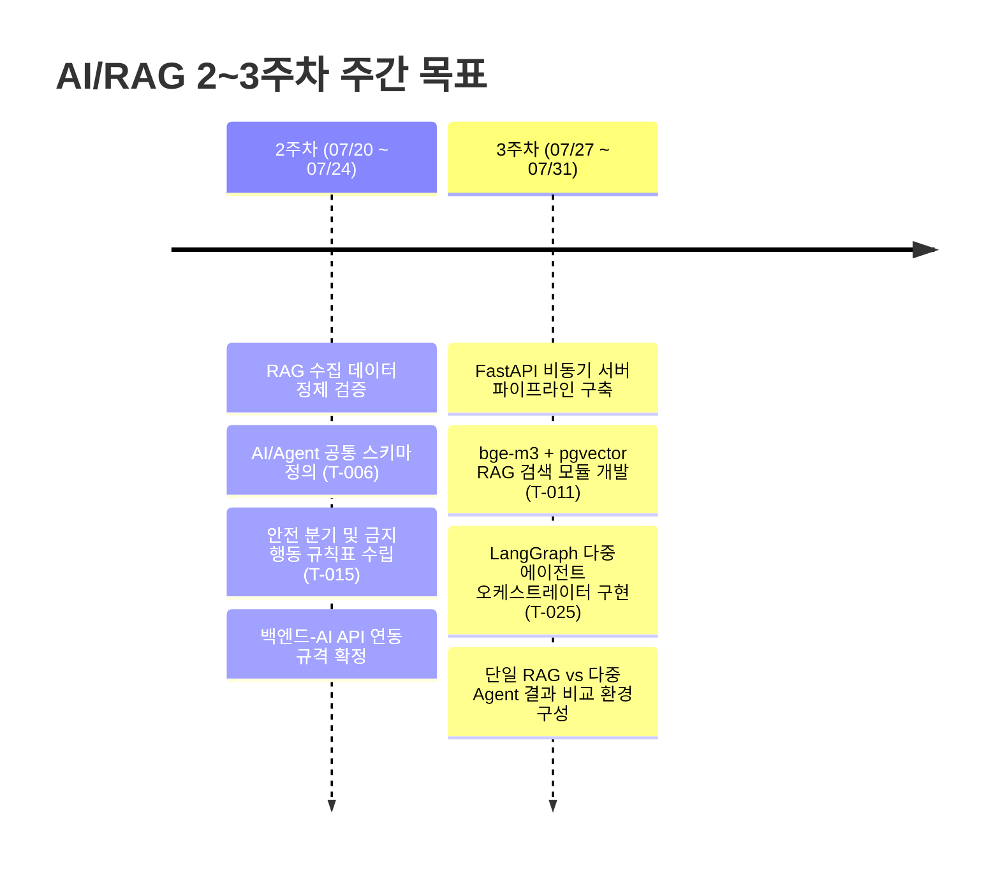

# 📄 [AI/RAG] 기술 스택 명세서 및 세부 업무 계획서

> **프로젝트명**: 정수기 구독 고객 케어 및 A/S 업무 지원 시스템 (`SKN29-FINAL-4TEAM`)  
> **담당 역할**: AI / RAG Engineer (이동윤)  
> **작성일자**: 2026-07-24  
> **문서 버전**: v1.1 (최종 검토 및 피드백 반영본)  
> **총 예상 공수**: 15개 Task / 21.0 인일 (P0: 20.5인일, P1: 0.5인일)  

---

## 1. 개요 (Overview)

본 문서는 **'정수기 구독 고객 케어 및 A/S 업무 지원 시스템'** 프로젝트의 AI/RAG 담당자로서 확정한 **최종 기술 스택 명세**와 WBS(Work Breakdown Structure)에 기반한 **2~3주차 집중 세부 업무 계획서**입니다.

### 🎯 핵심 목표
1. **환각 없는 근거 기반 안내 (Zero-Hallucination Grounding)**: SK매직 공식 매뉴얼/FAQ 100% 검증 근거 기반의 안전한 고객 안내 및 자가조치 가이드 제공.
2. **다중 에이전트(Multi-Agent) 파이프라인 구축**: 증상 구조화 $\rightarrow$ 위험도 판단 $\rightarrow$ RAG 검색 $\rightarrow$ 대응 분석 $\rightarrow$ 상담 요약 / 기사 리포트 생성 flow 구현.
3. **고성능 & 비용 최적화**: P95 10초 이내 응답 속도 확보, MVP 단계 비용 최소화(OpenAI API) 및 시연용 오픈소스 sLLM(vLLM + EXAONE/Qwen) 스위칭 유연 아키텍처 구축.

---

## 2. 확정 기술 스택 명세서 (Tech Stack Specification)

### 2.1 핵심 기술 스택

| 구분 | 확정 기술 / 프레임워크 | 선정 사유 및 세부 역할 |
| :--- | :--- | :--- |
| **AI 서빙 프레임워크** | **FastAPI** (Python 3.11+) | 백엔드(Django)와 연동되는 **독립 비동기 API 서버**. 비동기(async) 처리로 LLM 응답 대기 병목 최소화. |
| **오케스트레이션** | **LangChain** + **LangGraph** | 증상 구조화 $\rightarrow$ 위험도 판단 $\rightarrow$ RAG 검색 $\rightarrow$ 대응 분석 $\rightarrow$ 가드레일 검증 등 **상태 기반 Multi-Agent Workflow** 구현. |
| **Vector DB / 저장소** | **PostgreSQL + `pgvector`** | 별도 Vector DB 추가 구축 없이 기존 백엔드 DB(PostgreSQL) 모듈로 통합. 제품 모델/증상 메타데이터 필터링과 벡터 검색 단권화. |
| **임베딩 (Embedding)** | **`BAAI/bge-m3`** <br>*(보조: `text-embedding-3-small`)* | **한국어 특화 1위 모델**, 밀도(Dense) + 희소(BM25) 하이브리드 검색 지원. CPU 환경 인퍼런스 지원. |
| **LLM 추론 계층 (2-Step Hybrid)** | **[MVP] OpenAI `gpt-4o-mini`**<br>**[sLLM] vLLM + `EXAONE 7.8B` / `Qwen 7B`** | • **MVP**: 빠른 개발 속도, 월 1만원 이하 비용, JSON Schema 지시 이행 능력 최고.<br>• **sLLM (RunPod)**: vLLM PagedAttention 적용 고속 추론, `USE_LOCAL_SLLM` 환경변수로 1초 스위칭 인터페이스 구축. |
| **가드레일 & 검증** | **Pydantic v2** + **Custom Grounding Validator** | JSON Schema 구조화 강제(상담 요약/기사 리포트 규격화) 및 환각 방지/위험 행동(제품 분해, 전기/누수 위험) 차단. |

### 2.2 미도입 / 제외 기술 (Non-Goals)

| 제외 기술 | 제외 사유 및 대안 |
| :--- | :--- |
| **그래프 DB (Neo4j 등)** | 데이터 구축 공수 폭발 및 오버엔지니어링. RDB 메타데이터 필터링과 하이브리드 검색으로 100% 대체 가능. |
| **Ollama** | 서버/API 서빙 시 동시 처리(Continuous Batching) 성능 부족. 서빙 전용으로는 **vLLM** 사용. |
| **LlamaIndex** | 단순 RAG 검색에는 용이하나, complex agent workflow 및 가드레일 제어에는 **LangChain/LangGraph**가 우수. |

---

## 3. 2~3주차 세부 업무 계획서 (Detailed 2-3 Week Work Plan)

### 3.1 주차별 핵심 목표 요약



---

### 3.2 일자별 세부 액션 플랜 (Daily Action Plan)

#### 📌 [2주차] 2026-07-20 (월) ~ 2026-07-24 (금): 설계, 데이터 검증 및 안전 규칙 수립

* **📅 07/20 (월) ~ 07/21 (화) : 수집 데이터 정제 검증 및 대표 증상 매핑 [완료]**
  - **주요 작업**:
    - `data/processed/structured/` 디렉터리의 `manual_pages.jsonl` 및 FAQ 데이터 정합성 검증 (김은진 님 협업).
    - MVP 대상 모델 `WPUJAC104DWH` (`WPU-JAC104D` 계열)의 대표 증상 4종(출수량 저하, 물맛/냄새 이상, 제품 누수, 냉/온수 온도 이상) 공식 매뉴얼 페이지 및 청크 맵 연결.
  - **산출물**: 매뉴얼 38쪽(출수량 저하 대표 시연 건) 및 4대 증상 메타데이터 매핑표.

* **📅 07/22 (수) ~ 07/23 (목) : AI·Agent 공통 상태 및 스키마 정의 (`T-006`, 1.5인일) [진행 중]**
  - **주요 작업**:
    - Pydantic v2 기반의 공통 입출력 DTO 구조 설계 (`ai/src/schemas/inquiry_state.py`).
    - 필수 필드 6종 구현:
      1. `usage_guidance_status` (`NORMAL_USE`, `PARTIAL_RESTRICTION`, `FULL_RESTRICTION`, `PENDING_CONSULTATION`)
      2. `usage_guidance_message` (고객 친화적 안내 문구)
      3. `restricted_functions` (제한되는 기능/출수 범위 목록)
      4. `evidence` (`EvidenceCardDTO` 참조 정보)
      5. `next_action` (고객이 취해야 할 직관적 다음 행동)
      6. `requires_consultation` (상담/방문 필요 여부 Boolean)
    - 위험도 코드 통일: `general` (일반), `caution` (주의), `danger` (위험).
  - **산출물**: `contracts/schemas/inquiry.schema.json` 계약 연동 코드, Pydantic DTO 파일.

* **📅 07/24 (금, 오늘) : AI 안전 규칙표 확정 및 API 연동 규격 정리 (`T-015`, 1.5인일) [진행 중]**
  - **주요 작업**:
    - 누수, 전기, 화상, 온수 모듈 위험 키워드 분류표 작성 (`ai/src/guards/safety_rules.py`).
    - **금지 행동 가드레일 규칙 수립**:
      - 공식 근거 없는 자가조치 금지 $\rightarrow$ `PENDING_CONSULTATION` 분기.
      - 고객에 의한 제품 임의 분해, 직접 수리 안내 금지.
      - 확정 진단 금지 ("100% ~고장입니다" 표현 차단 $\rightarrow$ "~점검이 필요합니다").
    - 백엔드 담당자(최지용 님)와 FastAPI `POST /api/v1/ai/analyze` 엔드포인트 요청/응답 규격 확정.
  - **산출물**: 안전 규칙 정의서, `safety_rules.py` 1차 드래프트.

---

#### 📌 [3주차] 2026-07-27 (월) ~ 2026-07-31 (금): RAG 파이프라인 & LangGraph 오케스트레이터 구현

* **📅 07/27 (월) : FastAPI 프로젝트 환경 구축 & 안전 규칙 최종 확정 (`T-015` 완료)**
  - **주요 작업**:
    - `ai/` 디렉터리 내 FastAPI 프로젝트 기반 환경 구축 (`main.py`, `config.py`, `logging.py`).
    - OpenAI GPT-4o-mini API 클라이언트 및 비동기 호출 모듈 구현 (`ai/src/generation/client.py`).
    - `safety_rules.py` 단위 테스트 작성 및 위험 키워드 감지 검증.
  - **산출물**: FastAPI 서버 헬스체크 엔드포인트 (`GET /health`), LLM 비동기 클라이언트.

* **📅 07/28 (화) ~ 07/29 (수) : RAG 검색 파이프라인 구현 (`T-011`, 2.0인일) [미착수]**
  - **주요 작업**:
    - **`BAAI/bge-m3` 임베딩 파이프라인 구축** (`ai/src/retrieval/embedder.py`):
      - 한국어 queries 및 청크 텍스트에 대해 1024차원 Dense 임베딩 생성.
    - **PostgreSQL `pgvector` 검색 모듈 작성** (`ai/src/retrieval/retriever.py`):
      - 메타데이터 필터 쿼리 구현: `WHERE model_code = 'WPUJAC104DWH' AND generation = 'D'`
      - Cosine Similarity 기반 Top-k (k=3~5) 청크 검색.
    - **검색 결과 검증**:
      - 미검증 FAQ 단독 검색 차단 및 JAC104 D/S 세대 혼용 방지 필터링 작동 확인.
  - **산출물**: `bge-m3` 임베딩 추출기, `pgvector` 메타데이터 통합 검색 모듈, 검색 단위 테스트.

* **📅 07/30 (목) ~ 07/31 (금) : LangGraph 다중 에이전트 오케스트레이터 구축 (`T-025`, 2.0인일) [미착수]**
  - **주요 작업**:
    - **LangGraph 상태 객체(`AgentState`) 구성** (`ai/src/orchestrator/state.py`):
      ```python
      class AgentState(TypedDict):
          inquiry_id: str
          user_message: str
          model_code: str
          symptom_structured: dict
          risk_level: str  # general, caution, danger
          retrieved_chunks: list[dict]
          usage_guidance: dict
          error: str | None
      ```
    - **조건부 분기 노드(Conditional Edge) 설계** (`ai/src/orchestrator/graph.py`):
      1. `SymptomStructuringNode` (증상 구조화)
      2. `RiskAssessmentNode` (위험도 판별)
      3. `RetrievalNode` (RAG 근거 검색)
      4. `GuidanceGenerationNode` (고객 안내 생성)
      5. `SafetyGuardNode` (가드레일 검증)
    - **비교 분석 환경 구성**: 단일 RAG(Baseline) vs LangGraph 다중 에이전트 응답 성능 비교.
  - **산출물**: LangGraph `StateGraph` 오케스트레이터 모듈, 오케스트레이션 단위 실행 테스트.

---

### 3.3 산출물 및 완료 기준 (Deliverables & Acceptance Criteria)

| Task ID | 주요 산출물 파일 경로 | 완료 검증 기준 (Acceptance Criteria) |
| :--- | :--- | :--- |
| **`T-006`** | `contracts/schemas/inquiry.schema.json`<br>`ai/src/schemas/inquiry_state.py` | Pydantic 검증 시 6개 공통 필드 및 `general/caution/danger` 위험도가 오류 없이 직렬화/역직렬화됨. |
| **`T-015`** | `ai/src/guards/safety_rules.py`<br>`ai/tests/safety/test_safety_rules.py` | 누수/전기/화상 위험 키워드 입력 시 100% `danger` 감지 및 분해/직접수리 문구가 가드레일에 의해 차단됨. |
| **`T-011`** | `ai/src/retrieval/embedder.py`<br>`ai/src/retrieval/retriever.py` | `WPUJAC104DWH` 검색 시 타 세대(S세대/IAC425) 데이터가 섞이지 않고 정답 매뉴얼 청크(38쪽 등)가 Top-3 내 상위 포함됨. |
| **`T-025`** | `ai/src/orchestrator/state.py`<br>`ai/src/orchestrator/graph.py` | LangGraph 오케스트레이터가 입력 문의에 대해 `구조화 -> 위험판단 -> RAG검색 -> 생성 -> 검증` 흐름을 에러 없이 완주함. |

---

### 3.4 타 역할과의 협업 지점 (Inter-Role Checkpoints)

1. **백엔드(최지용 님) 연동**:
   - 07/24(금) ~ 07/27(월): FastAPI `POST /api/v1/ai/analyze` API 스키마 및 Exception HTTP 응답 코드(400, 422, 500) 확정.
   - 07/28(화): PostgreSQL `pgvector` 테이블 생성 및 메타데이터 칼럼 스키마 공유 받기.
2. **데이터/QA(김은진 님) 연동**:
   - 07/24(금): `T-012` RAG Top-k 평가 세트 데이터 구조 수령.
   - 07/29(수): RAG 검색 파이프라인 완성 후 Top-k 검색 정확도(Recall@k) 교차 검증.

---

## 4. 4~8주차 마일스톤 전망 (Future Milestones Overview)

| 기간 | 핵심 마일스톤 | 주요 수행 Task |
| :--- | :--- | :--- |
| **4~5주차 (8/03~8/14)** | 다중 에이전트 핵심 구현 | 증상 분류 Agent(`T-026`), 위험 판단(`T-027`), 지식/이력 RAG 조회(`T-028A`), 타임아웃/Fallback(`T-032`) |
| **6주차 (8/18~8/21)** | 역할별 출력 & 가드레일 | 대응 분석 Agent(`T-029`), 상담 요약(`T-030A`), 기사 리포트(`T-030B`), Grounding Fail Safe(`T-031`) |
| **7주차 (8/24~8/28)** | E2E 통합 & 안전성 검증 | E2E 통합(`T-046`), AI 안전성 종합 테스트(`T-049`), RunPod vLLM sLLM 벤치마크 수행 |
| **8주차 (8/31~9/03)** | 최종 배포 & 대표 시연 | 대표 시연(`SYN-JAC104-002`, 출수량 저하, 매뉴얼 38쪽) 검증, 배포(`T-053`), 최종 검수(`T-054`) |

---

## 5. 위험 관리 및 품질 보증 (Risk & QA Management)

1. **RAG 환각(Hallucination) 방지**:
   - `Grounding Validator`를 통해 반환된 LLM 답변의 모든 문장이 검색된 `EvidenceCardDTO` 내의 text 범위에 존재하는지 검증. 근거 누락 시 답변을 버리고 상담 전환 Fallback 조치.
2. **응답 속도(Latency) 최적화 (P95 10초 이내)**:
   - FastAPI 비동기 구조 + vLLM Continuous Batching 적용.
   - 파이프라인 단계별 비동기 병렬 처리 적용.
3. **인프라 비용 제어**:
   - 개발 기간 동안 OpenAI `gpt-4o-mini`로 개발하여 비용을 최소화하고, 시연 및 평가 주간에만 RunPod On-Demand GPU 인스턴스를 가동.
