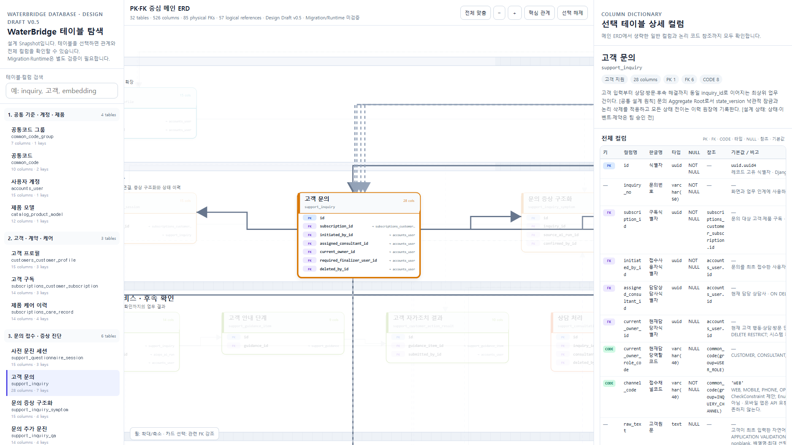

# WaterBridge 데이터베이스 문서 안내

> 상태: **T-005 OWNER 기준선 확정·Runtime 32/32 로컬 기술 검증 완료·공식 리뷰 대기**
>
> 현행 설계 기준: `T-005 Physical Contract v1.3`
>
> 현행 실행 기준: PostgreSQL `waterbridge` 데이터베이스의 `public` Schema

설계 계약과 Django Runtime은 모두 32개 대상 테이블을 포함한다.
Model·App Registry·Migration·빈 PostgreSQL·Seed·격리 Importer 검증은
완료됐지만, 비작성자 독립 재현·외부 소비 검토·PM 완료 승인은 별도
Gate로 남아 있다. 따라서 로컬 기술 완료와 공식 WBS 완료를 구분한다.

## 문서 구성

| 문서 | 용도 |
|---|---|
| [T-005 현행 기준 패키지](t-005/README.md) | ADR·Physical Contract·검증 명령·현재 구현 경계 |
| [WaterBridge 테이블 명세](waterbridge_table_dictionary.md) | 32개 테이블과 526개 필드의 역사적 v0.5 공개 스냅샷 |
| [대화형 ERD](erd/waterbridge_erd.html) | 역사적 v0.5 테이블·PK·FK 관계 탐색 |
| [ERD 정적 미리보기](erd/waterbridge_erd.png) | 역사적 v0.5 관계도 화면 |
| [데이터베이스 Schema·Migration 구현 가이드](../individual/jiyong/데이터베이스/데이터베이스_스키마_마이그레이션_구현_가이드.md) | Model·Migration·Registry·제약 구현과 현재 검증 절차 |
| [합성데이터 Seed·Importer 검증 가이드](../individual/jiyong/데이터베이스/합성데이터_시드_Importer_검증_가이드.md) | 합성 Fixture의 Dry-run·Apply·Replay와 원장 정합성 검증 절차 |

## 설계 범위

- 테이블: **32개**
- 필드: **526개**
- 물리 FK: **85개**
- 논리 코드 참조: **57개**
- 실제 고객 레코드·Token·비밀값: **포함하지 않음**

## 기준 우선순위

1. DB 설계 기준은 [ADR-0010](../adr/0010-t005-three-layer-identifier-bridge.md),
   [ADR-0011](../adr/0011-t005-status-history-idempotency-scope.md),
   [Logical Contract v0.3](t-005/t005_logical_contract_v0.3.json),
   [Decision Register v0.3](t-005/t005_decision_register_v0.3.json),
   [Physical Contract v1.3](t-005/t005_physical_contract_v1.3.json)을
   우선한다.
2. 서비스 간 필드·코드 교환은 현재 `contracts/**`의 기계 계약을
   함께 적용한다.
3. Runtime 적용 여부는 Django Model·Migration과 실제 PostgreSQL
   검증 결과로 판정한다.
4. 이 디렉터리의 공개 데이터 사전·ERD는 당시 설계를 보존한 역사
   스냅샷이며, 현행 override나 Runtime 완료 증거로 사용하지 않는다.
5. Logical·Decision v0.2와 Physical v1.0~v1.2는 이전 세대의
   역사본이다. 신규 결정과 완료 경계는 활성 v0.3·v1.3에만 누적한다.

## 열람 방법

- 빠른 관계 파악: PNG 미리보기
- 검색·전체 필드 확인: HTML을 내려받아 브라우저에서 열거나 GitHub Pages로 게시
- PR 리뷰·필드 검색: Markdown 테이블 명세
- 구현 변경: T-005 데이터베이스 스키마 변경 실행 가이드의 순서에 따라 Migration·문서·테스트를 함께 갱신

## 주의사항

- ERD 공개 스냅샷의 관계와 타입은 당시 설계값이며 운영 DB 적용 완료를
  의미하지 않는다.
- 논리 코드 참조는 물리 FK로 계산하지 않는다.
- 스냅샷의 `팀 결정 필요` 문구는 과거 이력이며 최지용 Owner 구현의
  선행 승인 조건이 아니다. 현행 값은 ADR·Physical Contract와 담당
  계약 입력을 따른다.
- 공개 예시는 가명·합성 데이터만 사용한다.
