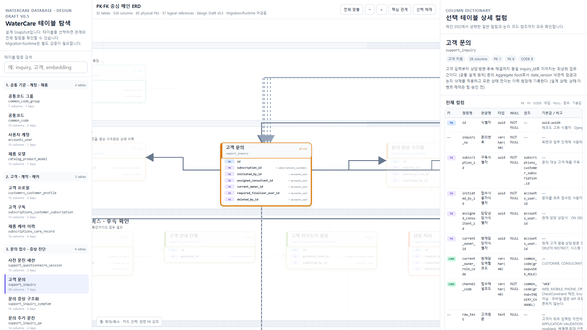

# WaterCare Database Documentation

> 상태: **OWNER_CONFIRMED DB DESIGN BASELINE — Runtime 구현과 분리**
> 설계 기준: `T-005 Physical Contract v1.2` / 기준일: 2026-07-28
> 구현 경계: 설계 기준선은 확정됐으며 Django Model·Migration은 현재
> `12/32` 테이블까지 구현됐고 20개가 남았다. 공통코드 2개 테이블은
> 2026-07-30 `LOCAL_VERIFIED` 상태이며, 담당 Branch Push와 PM 병합
> 전에는 팀 기준선이 아니다. Accounts는 `public_id(UUID)`를 추가하는
> 전환 브리지 단계로, 전체 내부 BigInt PK 전환 완료를 뜻하지 않는다.

## 문서 구성

| 문서 | 용도 |
|---|---|
| [T-005 현행 기준 패키지](t-005/README.md) | ADR·Physical Contract·검증 명령·현재 구현 경계 |
| [WaterCare 테이블 명세](watercare_table_dictionary.md) | 32개 테이블과 526개 필드의 역사적 v0.5 공개 스냅샷 |
| [대화형 ERD](erd/watercare_erd.html) | 역사적 v0.5 테이블·PK·FK 관계 탐색 |
| [ERD 정적 미리보기](erd/watercare_erd.png) | 역사적 v0.5 관계도 화면 |
| [DB 스키마 개발·인계 가이드](../individual/jiyong/technical/backend/database_schema_handover_guide.md) | Model·Migration·Seed·검증과 역할별 인계 절차 |
| [공통코드 Registry 구현 가이드](../individual/jiyong/technical/backend/t005_common_code_registry_implementation.md) | `common_code_group`·`common_code` Migration, Seed 2회와 차단 계약 |

## 설계 범위

- 테이블: **32개**
- 필드: **526개**
- 물리 FK: **85개**
- 논리 코드 참조: **57개**
- 실제 고객 레코드·Token·비밀값: **포함하지 않음**

## 기준 우선순위

1. DB 설계 기준은 [ADR-0010](../adr/0010-t005-three-layer-identifier-bridge.md),
   [ADR-0011](../adr/0011-t005-status-history-idempotency-scope.md),
   [Logical Contract v0.3](t-005/t005_logical_contract_v0.3.json),
   [Decision Register v0.3](t-005/t005_decision_register_v0.3.json),
   [Physical Contract v1.2](t-005/t005_physical_contract_v1.2.json)을
   우선한다.
2. 서비스 간 필드·코드 교환은 현재 `contracts/**`의 기계 계약을
   함께 적용한다.
3. Runtime 적용 여부는 Django Model·Migration과 실제 PostgreSQL
   검증 결과로 판정한다.
4. 이 디렉터리의 공개 데이터 사전·ERD는 당시 설계를 보존한 역사
   스냅샷이며, 현행 override나 Runtime 완료 증거로 사용하지 않는다.
5. Logical·Decision v0.2와 Physical v1.1은 이전 세대의 역사본이다.
   신규 결정은 활성 v0.3·v1.2에만 누적한다.

## 열람 방법

- 빠른 관계 파악: PNG 미리보기
- 검색·전체 필드 확인: HTML을 내려받아 브라우저에서 열거나 GitHub Pages로 게시
- PR 리뷰·필드 검색: Markdown 테이블 명세
- 구현 변경: DB 스키마 개발·인계 가이드의 순서에 따라 Migration·문서·테스트를 함께 갱신

## 주의사항

- ERD 공개 스냅샷의 관계와 타입은 당시 설계값이며 운영 DB 적용 완료를
  의미하지 않는다.
- 논리 코드 참조는 물리 FK로 계산하지 않는다.
- 스냅샷의 `팀 결정 필요` 문구는 과거 이력이며 최지용 Owner 구현의
  선행 승인 조건이 아니다. 현행 값은 ADR·Physical Contract와 담당
  계약 입력을 따른다.
- 공개 예시는 가명·합성 데이터만 사용한다.
