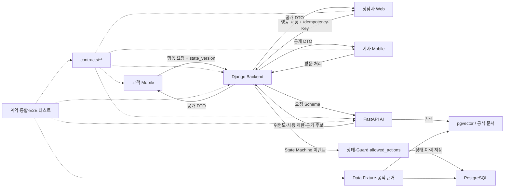
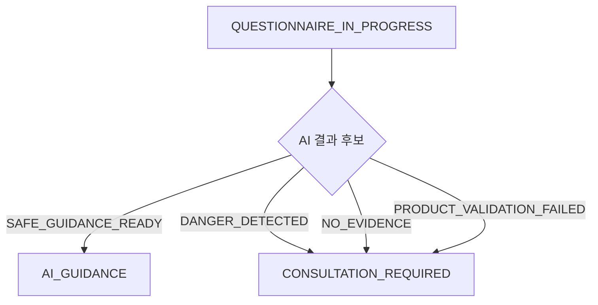

# PM을 위한 프로젝트 진행 상황 이해 가이드

> 작성 일시: 2026-07-29 18:18:17 +09:00 (Asia/Seoul)  
> 대상: 윤승혁 — PM·기술 통합  
> 목적: 다른 사람이 작성한 보고서의 결론에 의존하지 않고, 계약·코드·테스트를 직접 읽어 현재 구현 수준과 다음 작업을 판단한다.  
> 현재 기준선: State Machine `v1.0.0 / TEAM_APPROVED`, 2026-07-29 작업 트리

---

## 1. 이 가이드의 사용법

이 문서는 프로젝트 파일을 전부 외우기 위한 문서가 아니다. 다음 세 가지 질문에 스스로 답할 수 있게 하는 안내서다.

1. 고객의 요청이 어느 서비스를 거쳐 어떤 상태로 바뀌는가?
2. 각 단계가 계약만 있는지, Mock인지, 실제 Runtime인지 어떻게 구분하는가?
3. 팀원이 “완료했다”고 말했을 때 어떤 파일과 명령으로 검증하는가?

처음에는 2~5장을 읽어 전체 구조와 대표 흐름을 이해한다. 이후 팀원의 PR이나 완료 보고를 받을 때 8~11장을 점검표로 사용한다.

이 문서의 현재 현황은 2026년 7월 29일 기준이다. 코드는 계속 바뀌므로 완료율 자체를 외우지 말고 **판정 방법과 근거 파일**을 익히는 것이 중요하다.

---

## 2. 프로젝트를 한 문장으로 설명하기

이 프로젝트는 고객이 정수기 증상을 입력하면 Backend가 권한과 업무 상태를 관리하고, AI가 위험도·사용 제한·공식 근거를 제안하며, 상담사와 방문기사가 처리 결과를 이어받고, 고객 확인 후 문의를 종료하는 시스템이다.

핵심 책임은 다음처럼 나뉜다.

| 영역 | 한 문장 책임 | 하지 말아야 할 일 |
| --- | --- | --- |
| Web·Mobile | 사용자 입력을 받고 Backend가 허용한 행동을 보여준다 | 화면이 다음 상태를 임의로 계산하지 않는다 |
| Backend | 인증·권한·저장·상태 전이의 최종 권위를 가진다 | AI나 화면에 상태 결정권을 넘기지 않는다 |
| AI | 증상을 구조화하고 위험·사용 제한·공식 근거를 제안한다 | DB 상태를 직접 변경하거나 확정 진단하지 않는다 |
| Data | 공식 근거, 합성 업무 데이터와 검증 기준을 제공한다 | 다른 영역의 업무 정책을 임의로 결정하지 않는다 |
| Contracts | 영역 사이의 필드·코드·행동을 기계 판독 가능한 형태로 고정한다 | 설명 문서와 구현에 같은 계약을 따로 복제하지 않는다 |
| QA·Tests | 같은 계약이 각 영역에서 실제로 지켜지는지 검증한다 | Mock 통과를 실제 통합 완료로 판정하지 않는다 |
| PM | 범위와 계약을 확정하고 불일치의 담당자·순서·완료 기준을 정한다 | 다른 담당자의 코드를 대신 고쳐 병목을 만들지 않는다 |

---

## 3. 전체 시스템 지도



그림을 읽을 때 가장 중요한 점은 두 가지다.

- 화살표가 설계돼 있다는 것과 실제 코드로 연결됐다는 것은 다르다.
- `contracts/**`는 연결 방법을 정의할 뿐, 그 계약을 실제로 소비하는 Runtime을 자동으로 만들어 주지 않는다.

### 현재 실제 연결 수준

현재 프로젝트 전체를 실행했을 때 위 그림의 모든 화살표가 동작하는 상태는 아니다.

- Backend에는 인증·현재 사용자·문의 생성·문의 취소 등 Runtime 7개가 있다.
- Web 상담사 화면은 상당 부분 동작하지만 상담 기능은 계약 기반 Mock 중심이다.
- Mobile은 3모듈과 화면 골격은 있으나 확정 상태 계약·API DTO와 차이가 크다.
- AI는 FastAPI·안전 분류·순차 Pipeline 골격이 있지만 실제 bge-m3·pgvector 검색과 Backend 연결은 없다.
- Data에는 대표 14단계 Fixture가 있지만 현재 State 계약 Hash 불일치가 남아 있다.
- 따라서 현재는 **각 영역의 기반이 병렬로 존재하는 상태**이며, 고객→Backend→AI→상담→방문→완료의 실제 E2E는 아직 없다.

---

## 4. 무엇을 기준으로 믿어야 하는가

문서와 코드가 다를 때는 다음 우선순위로 판단한다.

```text
현재 Commit에서 통과한 실제 통합 테스트
  > 실제 Route·Service·DB 저장 코드와 현재 단위 테스트
  > 기계 판독 계약(contracts/**)
  > Mock·Fixture
  > 설계 문서·README
  > 개인 결과 보고서의 주장
```

다만 “무엇이 되어야 하는가”를 묻는다면 계약이 Runtime보다 우선한다. 예를 들어 Mobile 코드가 계약에 없는 `ERROR_CONFIRMED`를 사용한다고 해서 그것이 새로운 기준이 되는 것은 아니다. 계약에 맞게 Mobile을 고쳐야 한다.

### 자주 혼동하는 표현

| 표현 | 실제 의미 | 의미하지 않는 것 |
| --- | --- | --- |
| `TEAM_APPROVED` | State Machine 계약 기준선이 채택됨 | 모든 서비스 구현 완료 |
| `x-contract-status: CONFIRMED` | API Method·Path·Schema 기준이 확정됨 | Django Route 존재 |
| OpenAPI에 Endpoint 존재 | 호출 규격이 문서화됨 | View·Service·DB 저장 구현 |
| 예시 JSON 존재 | 소비자가 형태를 참고할 수 있음 | Runtime이 같은 JSON을 반환함 |
| Mock 테스트 통과 | 화면의 독립 개발이 가능함 | Backend 실제 연동 완료 |
| 단위 테스트 통과 | 해당 함수의 제한된 조건이 맞음 | 서비스 간 통합 완료 |
| 과거 `100%` 보고 | 특정 시점·환경의 작성자 주장 | 현재 Commit 재현 성공 |
| 파일명에 `pgvector`, `LangGraph` 포함 | 목표 역할을 나타냄 | 실제 기술이 사용됨 |

---

## 5. 대표 14단계 흐름으로 프로젝트 이해하기

대표 기준은 [representative-e2e.yaml](../../../contracts/state-machine/examples/representative-e2e.yaml)이다.

| 항목 | 기준값 |
| --- | --- |
| 제품 | `WPUJAC104DWH` |
| 증상 | 출수량 저하 |
| 시나리오 | `SYN-JAC104-002` |
| 문의 업무 코드 | `DEMO-INQ-002` |
| 공식 근거 | 사용설명서 38페이지 |
| 최종 상태 | `RESOLVED` |
| 최종 문의 Version | 14 |
| 최종 방문 상태 | `COMPLETED` |

### 5.1 단계별 의미와 현재 구현 상태

| 단계 | 수행자 | 이벤트 | 상태 변화 | 담당 영역 | 현재 수준 |
| ---: | --- | --- | --- | --- | --- |
| 1 | 고객 | `START_INQUIRY` | 없음 → `DRAFT` | Mobile·Backend | **Backend 실제 Runtime 있음** |
| 2 | 고객 | `SUBMIT_SYMPTOM` | `DRAFT` → `QUESTIONNAIRE_IN_PROGRESS` | Mobile·Backend | 계약·일부 Serializer 골격, Runtime 미구현 |
| 3 | 고객 | `SUBMIT_ANSWERS` | 상태 유지 | Mobile·Backend | 계약 중심, Runtime 미구현 |
| 4 | 시스템 | `SAFE_GUIDANCE_READY` | → `AI_GUIDANCE` | AI·Backend | AI 골격은 있으나 Backend Mapper·자동 이벤트 미연결 |
| 5 | 고객 | `REQUEST_CONSULTATION` | → `CONSULTATION_REQUIRED` | Mobile·Backend | 계약·화면 Mock 중심 |
| 6 | 상담사 | `START_CONSULTATION` | → `CONSULTATION_IN_PROGRESS` | Web·Backend | Web Mock 중심, Backend Runtime 미구현 |
| 7 | 상담사 | `VISIT_REVIEW_REQUIRED` | → `VISIT_REVIEW_PENDING` | Web·Backend | 계약·Mock 중심 |
| 8 | 상담사 | `VISIT_NEEDED` | → `VISIT_SCHEDULING` | Web·Backend | 계약·Data Fixture 중심 |
| 9 | 상담사 | `UPDATE_VISIT_SCHEDULE` | 문의 상태 유지, 방문 `SCHEDULING` | Web·Backend | 계약 중심 |
| 10 | 상담사 | `CONFIRM_VISIT` | → `VISIT_SCHEDULED`, 방문 `CONFIRMED` | Web·Backend | 계약 중심 |
| 11 | 기사 | `START_VISIT` | 문의 상태 유지, 방문 `IN_PROGRESS` | 기사 Mobile·Backend | 화면·계약 골격 중심 |
| 12 | 기사 | `VISIT_COMPLETED` | → `COMPLETION_PENDING`, 방문 `COMPLETED` | 기사 Mobile·Backend | 계약·Data Fixture 중심 |
| 13 | 고객 | `SUBMIT_RESOLUTION_FEEDBACK` | 상태 유지 | 고객 Mobile·Backend | 계약 중심 |
| 14 | 기사 | `FINALIZE_INQUIRY` | → `RESOLVED` | 기사 Mobile·Backend | 계약 중심 |

현재 대표 14단계 중 Backend Runtime으로 확인되는 것은 1단계 `START_INQUIRY`다. 문의 취소 `CANCEL_INQUIRY`도 실제 Runtime이지만 이 대표 14단계에는 포함되지 않는다.

### 5.2 AI 결과에 따른 분기

대표 흐름은 안전한 공식 안내가 생성되는 경우다. AI 결과에 따라 4단계는 다음처럼 갈린다.



이 분기에서 AI는 이벤트 후보를 반환할 뿐이다. Backend가 현재 상태·Version·Guard를 다시 확인하고 실제 이벤트를 적용해야 한다.

### 5.3 `state_version`이 중요한 이유

두 사용자가 같은 문의를 동시에 수정하면 먼저 성공한 요청이 Version을 올린다. 늦은 요청의 Version이 오래됐으면 Backend는 덮어쓰지 않고 409를 반환해야 한다.

```text
화면이 본 Version: 6
현재 DB Version: 7
화면이 Version 6으로 상태 변경 요청
→ 409 STATE_VERSION_CONFLICT
→ 최신 상태·Version·allowed_actions 반환
→ 화면은 사용자 입력을 유지하고 최신 Snapshot만 반영
```

이 원칙을 이해하면 Web·Mobile·Backend의 동시성 코드와 테스트를 읽기 쉬워진다.

---

## 6. 저장소에서 기준 문서를 찾는 순서

### 6.1 1순위: 프로젝트 범위와 책임

- [3주차 범위와 DoD](../../planning/md/week3-scope-and-dod.md)
- [팀원별 관할 영역](../../planning/md/팀원별%20관할%20영역%20v2.md)
- [프로젝트 디렉터리 구조](../../architecture/프로젝트%20디렉토리%20구조%20v2.md)

여기서 “누가 고쳐야 하는가”와 “이번 주에 어디까지 해야 하는가”를 판단한다.

### 6.2 2순위: 기계 판독 계약

- [State Machine README](../../../contracts/state-machine/README.md)
- [문의 상태](../../../contracts/state-machine/inquiry-states.yaml)
- [문의 이벤트](../../../contracts/state-machine/inquiry-events.yaml)
- [전이 규칙](../../../contracts/state-machine/transition-rules.yaml)
- [Guard](../../../contracts/state-machine/transition-guards.yaml)
- [허용 행동](../../../contracts/state-machine/allowed-actions.yaml)
- [동시성 정책](../../../contracts/state-machine/concurrency-policy.yaml)
- [OpenAPI](../../../contracts/api/openapi.yaml)
- [AI 응답 Schema](../../../contracts/ai/responses/SymptomAnalysisResponse.schema.json)
- [공통 코드](../../../contracts/codes/)

여기서 “무슨 필드와 코드가 맞는가”를 판단한다.

### 6.3 3순위: 실제 구현과 현재 지원 범위

- [Backend Runtime 현황](../../api/runtime_implementation_status.md)
- [Backend README](../../../backend/README.md)
- [AI README](../../../ai/README.md)
- [팀 인계 진입점](../../handoffs/README.md)

여기서 “현재 실제로 실행되는가”를 확인한다. 문서의 수치는 반드시 Route·Service·테스트와 다시 대조한다.

### 6.4 4순위: 검토·진행도 자료

- [계약 정합성 검토](../../testing/week3-contract-alignment-review.md)
- [PM 진행도](./윤승혁_작업_진행도_07291709.md)
- [Backend 진행도](./최지용_작업_진행도_07291635.md)
- [AI 진행도](./이동윤_작업_진행도_07291655.md)
- [Web 진행도](./한예나_작업_진행도_07291605.md)
- [Mobile 진행도](./양정현_작업_진행도_07291614.md)
- [Data·QA 진행도](./김은진_작업_진행도_07291552.md)

이 자료는 탐색을 빠르게 해 주지만 최종 증거는 아니다. 코드가 변경되면 다시 확인해야 한다.

---

## 7. 영역별 코드를 읽는 방법

### 7.1 Backend — “요청이 실제로 저장되고 상태가 바뀌는가?”

### 읽는 순서

1. [URL 진입점](../../../backend/config/urls.py)
2. [문의 URL](../../../backend/apps/inquiries/api/urls.py)
3. [문의 View](../../../backend/apps/inquiries/api/views.py)
4. [문의 Service](../../../backend/apps/inquiries/services/inquiry_service.py)
5. [문의 Model](../../../backend/apps/inquiries/models/inquiry.py)
6. [State Machine Engine](../../../backend/apps/workflow/engine/state_machine.py)
7. [Guard Evaluator](../../../backend/apps/workflow/engine/guard_evaluator.py)
8. [Allowed Action Resolver](../../../backend/apps/workflow/engine/allowed_action_resolver.py)
9. [문의 생성 테스트](../../../backend/tests/api/test_t022_create_inquiry.py)
10. [문의 취소 테스트](../../../backend/tests/api/test_t023_cancel_inquiry.py)

### 스스로 답할 질문

- URL이 등록돼 있는가?
- View가 Serializer를 호출하는가?
- Service가 Transaction 안에서 Model과 상태 이력을 저장하는가?
- 사용자 역할과 리소스 소유권을 검사하는가?
- `state_version`과 멱등성 Key를 검사하는가?
- 상태가 바뀌면 History가 같은 Transaction에 저장되는가?
- 응답의 `allowed_actions`가 계약 기준으로 계산되는가?
- 테스트가 실제 DB 저장 결과까지 검사하는가?

### 현재 알아둘 경계

- 인증 4개, `/me`, 문의 생성, 문의 취소 등 Runtime 7개가 있다.
- 문의 생성과 취소는 실제 코드와 테스트가 있다.
- 문진 누적과 자가조치 결과 2개는 OpenAPI에만 있고 Runtime이 없다.
- 상담·방문 Action과 범용 전이 Service는 아직 실제 수직 흐름에 연결되지 않았다.
- [AI 연결 Service](../../../backend/apps/inquiries/services/inquiry_ai_service.py)는 실질 구현이 없는 Stub이다.

### 7.2 AI — “실제 모델과 Vector DB를 쓰는가, 흉내만 내는가?”

### 읽는 순서

1. [FastAPI 진입점](../../../ai/app/main.py)
2. [분석 Route](../../../ai/app/interfaces/http/routes/analysis_routes.py)
3. [공개 결과 DTO](../../../ai/app/schemas/pipeline.py)
4. [안전 위험 분류기](../../../ai/app/safety/risk_classifier.py)
5. [사용 안내 분류기](../../../ai/app/safety/usage_guidance_classifier.py)
6. [단일 Pipeline](../../../ai/app/orchestration/pipelines/single_rag_pipeline.py)
7. [Chunk Loader](../../../ai/app/retrieval/indexing/chunk_loader.py)
8. [Vector Search](../../../ai/app/retrieval/search/vector_search.py)
9. [평가 Runner](../../../ai/evaluation/evaluation_runner.py)
10. [AI 계약 응답](../../../contracts/ai/responses/SymptomAnalysisResponse.schema.json)

### 스스로 답할 질문

- 실제 Model Client를 호출하는가, 규칙·고정 문장을 반환하는가?
- 실제 `sentence-transformers` 또는 bge-m3를 Import하고 실행하는가?
- pgvector Connection과 SQL Query가 있는가?
- Loader가 `data/processed/**` 파일을 읽는가, 코드 안 Sample을 반환하는가?
- 위험·근거 없음 입력이 일반 생성 단계와 다른 Graph 경로를 타는가?
- Runtime 응답이 JSON Schema를 실제 Validator로 통과하는가?
- 평가 Dataset이 실제 Data Chunk ID와 같은가?

### 현재 알아둘 경계

- 안전 키워드 분류와 사용 제한 판정의 최소 구현은 있다.
- FastAPI Health와 분석 Route, 순차 Stage Pipeline 골격은 있다.
- Runtime 응답은 계약과 필드 구조가 다르다.
- `ChunkLoader`는 코드에 있는 5개 Sample을 반환한다.
- `VectorSearchService`는 pgvector가 아닌 문자열 일치 기반 모의 검색이다.
- `SingleRAGPipeline`은 LangGraph가 아니라 Python 함수 순차 호출이다.
- `ai/pyproject.toml`에 재현 가능한 의존성 선언이 없어 현재 표준 실행 환경이 없다.

### 7.3 Web — “화면이 Mock을 보는가, 실제 API를 보는가?”

### 읽는 순서

1. [App Router](../../../web/src/app/router/AppRouter.tsx)
2. [상담 문의 상세 Page](../../../web/src/pages/consultant/InquiryDetailPage.tsx)
3. [상담 Mock API](../../../web/src/features/consultation/api/consultationMockApi.ts)
4. [상담 Type](../../../web/src/features/consultation/model/consultationTypes.ts)
5. [Workflow DTO](../../../web/src/features/workflow-action/model/workflowActionDtos.ts)
6. [Workflow Mapper](../../../web/src/features/workflow-action/model/workflowActionMapper.ts)
7. [공통 HTTP Client](../../../web/src/common/api/httpClient.ts)
8. [Evidence Mapper](../../../web/src/features/evidence-viewer/model/evidenceMapper.ts)

### 스스로 답할 질문

- Page가 `useMock...` Hook을 쓰는가 실제 API Hook을 쓰는가?
- Type의 Enum이 `contracts/codes/**`와 일치하는가?
- 버튼을 상태 문자열로 계산하는가 `allowed_actions`로 그리는가?
- 상태 변경 요청에 현재 `state_version`과 새 멱등성 Key가 들어가는가?
- 409가 오면 입력을 유지하고 최신 Snapshot을 반영하는가?
- Evidence에서 내부 경로·Chunk 원문을 버리는가?

### 현재 알아둘 경계

- 상담사 목록·상세·입력·오류 화면은 Mock 기준으로 상당 부분 구현돼 있다.
- `allowed_actions`, `state_version`, 멱등성·409 입력 유지 골격이 있다.
- 실제 상담 Backend API는 아직 연결되지 않았다.
- 일부 타입에 `PENDING_CONSULTATION`이 빠져 있고 최신 Public UUID Fixture Mapping 차이가 남아 있다.

### 7.4 Mobile — “화면 골격과 계약 기반 앱을 구분하기”

### 읽는 순서

1. [공통 Model](../../../mobile/core/src/main/kotlin/com/skn29/watercare/model/Models.kt)
2. [로컬 State Machine](../../../mobile/core/src/main/kotlin/com/skn29/watercare/domain/InquiryStateMachine.kt)
3. [고객 화면](../../../mobile/customer-app/src/main/java/com/skn29/watercare/ui/customer/CustomerScreens.kt)
4. [App State Store](../../../mobile/customer-app/src/main/java/com/skn29/watercare/data/AppStateStore.kt)
5. [고객 API 예시](../../../mobile/customer-app/src/main/java/com/skn29/watercare/data/dispatch/ServiceCallApi.kt)

### 스스로 답할 질문

- DTO에 `state_version`, `allowed_actions`와 공통 오류가 있는가?
- Kotlin Enum이 State Machine 계약의 13개 상태만 사용하는가?
- 화면이 서버 행동 목록이 아니라 로컬 State Machine으로 다음 상태를 정하지 않는가?
- Request/Response DTO가 Kotlinx Serialization로 검증되는가?
- Repository·Fake Repository가 분리돼 있는가?
- 409 최신 상태 반영과 입력 유지 테스트가 있는가?
- 고객 안내에 위험도·사용 제한·공식 Evidence 필드가 있는가?

### 현재 알아둘 경계

- `customer-app`, `technician-app`, `core` 3모듈 구조는 승인된 최신 구조다.
- 화면과 `StateFlow` 저장 기반은 있다.
- 확정 계약에 없는 `ERROR_CONFIRMED`와 자체 이벤트를 사용한다.
- `state_version`, `allowed_actions`, 409와 계약 기반 DTO·Mapper·테스트가 부족하다.
- 일부 HTTP 호출 파일은 있으나 일관된 Repository·오류·인증 계층으로 연결되지 않았다.

### 7.5 Data·QA — “파일이 있다는 것과 현재 녹색 검증을 구분하기”

### 읽는 순서

1. [대표 E2E 설정](../../../data/config/e2e/representative_case.json)
2. [서비스 계약 Mapping](../../../data/config/workflow/service_contract_mapping.json)
3. [공식 RAG Sample](../../../data/processed/structured/rag/mvp/rag_verified_sample.jsonl)
4. [대표 E2E 테스트](../../../data/tools/tests/test_representative_e2e.py)
5. [서비스 계약 테스트](../../../data/tools/tests/test_service_contract_mapping.py)
6. [Data Pipeline](../../../data/tools/pipeline.py)
7. [최신 대표 E2E Report](../../../data/processed/validation/business/latest_representative_e2e_report.json)

### 스스로 답할 질문

- 원본→정제→Chunk→근거 ID가 끊기지 않는가?
- 제품·세대·문서·페이지·Hash가 기록돼 있는가?
- 대표 14단계와 State Machine 이벤트 순서가 같은가?
- 서비스 계약 원본 Hash가 현재 계약과 같은가?
- 저장된 PASS Report가 현재 Commit에서 재생성된 결과인가?
- Fixture가 Backend Seed와 Web·Mobile·AI Mock으로 자동 변환되는가?
- 실패 시 Process Exit code가 0이 아닌가?

### 현재 알아둘 경계

- 공식·합성 데이터 기준본과 생성·검증 도구는 상당 부분 있다.
- 대표 E2E 14단계 Data 테스트는 존재한다.
- 2026-07-29 재실행에서 관련 테스트 12개 중 11개가 통과하고 State 원본 Hash 불일치로 1개가 실패했다.
- RAG 공식 평가 세트, 실제 pgvector 결과와 Top-5·오염 0건 통합 증거는 부족하다.
- `docs/submission/`이 비어 있어 공식 전처리·DB 저장소 산출물은 미완료다.

---

## 8. 기능 완료 여부를 스스로 판정하는 7단계

팀원이 특정 기능을 완료했다고 보고하면 아래 순서로 확인한다.

| 단계 | 질문 | 완료 증거 |
| ---: | --- | --- |
| 1 | 이번 주 범위에 포함되는가? | WBS·Issue·개인 지침서·공통 범위 문서 |
| 2 | 최종 계약이 있는가? | `contracts/**`의 필드·Enum·오류·예시 |
| 3 | 실제 진입점이 있는가? | Route·View·Controller·Screen Navigation |
| 4 | 업무 로직과 저장이 있는가? | Service·Repository·Model·Transaction·이력 |
| 5 | 소비자가 실제 연결했는가? | Mock이 아닌 API Client·Mapper·호출 결과 |
| 6 | 현재 Commit에서 테스트가 통과하는가? | 재실행 명령·Exit code·실패 0건 |
| 7 | 다른 팀원이 재현했는가? | Reviewer·CI·동일 Commit 실행 증거 |

판정은 다음처럼 한다.

| 확인 결과 | 판정 |
| --- | --- |
| 계약만 있음 | 설계·계약 완료 |
| 화면/코드 골격만 있음 | Stub·기반 완료 |
| Mock과 단위 테스트 있음 | Mock 검증 완료 |
| 실제 Route·DB 저장·단위 테스트 있음 | 영역 단독 구현 완료 |
| 서비스 간 실제 호출·통합 테스트 있음 | 연동 완료 |
| 동일 Commit의 대표 전체 흐름 통과 | E2E 완료 |

### 완료로 인정하면 안 되는 대표 사례

- `properties: {}`인 Schema에 파일명이 있으므로 계약 완료라고 하는 경우
- Docstring 한 줄뿐인 Service를 구현 완료라고 하는 경우
- Mock API를 실제 Backend 연동이라고 하는 경우
- 하드코딩 Sample 검색을 bge-m3·pgvector 완료라고 하는 경우
- 과거 PC의 테스트 로그를 현재 Commit의 통과 결과로 사용하는 경우
- 테스트 파일이 있지만 Assertion이 실제 계약을 검사하지 않는 경우
- OpenAPI 전용 Endpoint를 Runtime Endpoint 수에 포함하는 경우

---

## 9. 현재 프로젝트 상황판

| 영역 | 현재 단계 | 실제로 믿을 수 있는 것 | 다음 핵심 Gate |
| --- | --- | --- | --- |
| PM·계약 | 기준선 완료·통합 검토 중 | State v1.0.0, 범위·DoD, 불일치 목록 | 수정 재검토·공식 산출물·4주차 판정 |
| Backend | 부분 Runtime | 인증·`/me`·문의 생성·취소 | 문진 누적, 범용 전이, 상담·방문, AI Client |
| AI | 골격·Mock | 안전 분류, FastAPI·순차 Pipeline 코드 | Schema 정합, 환경 재현, 실제 bge-m3·pgvector, Backend 연결 |
| Web | Mock 검증 | 상담 목록·상세·입력·409 Mock UI | 타입 수정·실제 API Adapter |
| Mobile | 실행·화면 골격 | 3모듈, 화면·StateFlow 기반 | 계약 DTO·Repository·409·테스트 |
| Data·QA | 기준본·검증 부분 | 대표 14단계 Data와 도구 | Hash 수정, RAG 평가, 서비스 Fixture, CI |
| 통합 | 미착수에 가까움 | 계약과 인계 문서 | 같은 Commit의 Backend↔AI↔화면↔Data 검증 |
| 공식 산출물 | 미완료 | 작성 근거 파일 일부 | 전처리 결과서·DB 저장소 설계 문서·공동 검수 |

### 현재 가장 중요한 통합 순서

1. Data의 State 계약 Hash를 현재 v1.0.0과 맞춘다.
2. AI JSON Schema와 Runtime DTO를 일치시킨다.
3. Backend가 AI 결과를 안전한 자동 이벤트로 변환한다.
4. Backend의 공개 Workflow DTO·409 형식을 확정한다.
5. Web·Mobile이 확정 DTO와 `allowed_actions`를 소비한다.
6. 상담·방문 Runtime을 대표 14단계에 연결한다.
7. 실제 bge-m3·pgvector와 공식 38페이지 Top-5를 검증한다.
8. 같은 Commit에서 계약·통합·E2E를 실행한다.

---

## 10. 직접 실행해 볼 점검 명령

명령은 저장소 루트에서 실행한다. 환경이 없으면 무리하게 설치해 결과를 오염시키지 말고 `실행 불가` 이유를 기록한다.

### 10.1 Git 변경과 현재 기준 확인

```powershell
git status --short
git log -10 --oneline
git diff --check
```

확인할 것:

- 팀원의 변경이 관할 범위 안에 있는가?
- 생성물·가상환경·비밀값이 포함되지 않았는가?
- 보고서가 말하는 Commit과 현재 HEAD가 같은가?

### 10.2 State Machine 계약

```powershell
$python = ".\backend\.venv\Scripts\python.exe"
& $python .\scripts\contracts\validate_state_machine.py
& $python .\scripts\contracts\render_state_machine.py --compact --state-labels both --check
```

현재 환경에 PyYAML이 없으면 실행되지 않는다. 이는 계약 실패가 아니라 **재현 가능한 검증 환경 미완료**다. 의존성을 임의 설치해 끝내지 말고 프로젝트 설치 문서와 CI에 고정해야 한다.

### 10.3 Backend

```powershell
$python = ".\backend\.venv\Scripts\python.exe"
& $python .\backend\manage.py check --settings=config.settings.test
& $python -m pytest backend/tests -q -p no:cacheprovider
```

전체 수치만 보지 말고 문의 생성·취소, 권한, 멱등성, 409 Test가 실제로 포함됐는지 확인한다.

### 10.4 Data 계약과 대표 E2E

```powershell
python -B -m unittest `
  data.tools.tests.test_service_contract_mapping `
  data.tools.tests.test_representative_e2e
```

2026-07-29 점검 결과는 12개 중 11개 통과, 계약 원본 Hash 불일치 1개 실패다.

### 10.5 Web

```powershell
Set-Location .\web
npm ci
npm run lint
npm run test -- --run
npm run build
Set-Location ..
```

Build 통과와 실제 API 연동 완료는 다르다. 어떤 Test가 Mock을 사용했는지 함께 확인한다.

### 10.6 Mobile

```powershell
Set-Location .\mobile
.\gradlew.bat :core:test
.\gradlew.bat :customer-app:testDebugUnitTest
.\gradlew.bat :technician-app:testDebugUnitTest
.\gradlew.bat :customer-app:assembleDebug
.\gradlew.bat :technician-app:assembleDebug
Set-Location ..
```

Test 파일이 없으면 Build 성공만으로 계약 기반 기능 완료라고 판정하지 않는다.

### 10.7 AI

```powershell
.\ai\.venv\Scripts\python.exe -m pytest ai/tests -q
```

현재는 `ai/.venv`와 고정 의존성 설치 기준이 없다. AI 담당자가 `pyproject.toml`, Lock 또는 constraints, README를 확정한 뒤 사용해야 한다.

---

## 11. 팀원의 완료 보고를 받을 때 묻는 질문

“완료했습니다” 대신 아래 양식으로 답해 달라고 요청한다.

```text
[기능·WBS]
[현재 수준] 계약 / Stub / Mock / 영역 단독 Runtime / 실제 연동 / E2E
[변경 파일]
[실제 진입점]
[저장 또는 상태 변경 위치]
[사용한 계약 Version]
[테스트 명령과 Exit code]
[정상 사례]
[오류·권한·409 사례]
[Mock 또는 미구현 경계]
[다음 소비자와 필요한 입력]
[Commit SHA / PR]
```

### 영역별 추가 질문

#### Backend 담당자에게

- 이 Endpoint는 OpenAPI-only인가 실제 Route인가?
- 어느 Transaction에서 상태와 이력이 함께 저장되는가?
- 권한·소유권·`state_version`·멱등성은 어디서 검사하는가?
- 409 응답에 최신 Snapshot이 포함되는가?

#### AI 담당자에게

- 실제 bge-m3와 pgvector를 호출한 코드 위치는 어디인가?
- Data의 어떤 파일과 Hash를 Index했는가?
- 위험·근거 없음이 일반 경로와 어디서 분기되는가?
- Runtime 응답을 JSON Schema로 검증한 Test는 무엇인가?

#### Web·Mobile 담당자에게

- Mock과 실제 API를 전환하는 위치는 어디인가?
- 버튼이 `allowed_actions`를 기준으로 표시되는가?
- 409 때 입력을 유지하는 Test가 있는가?
- 계약에 없는 Enum을 사용하지 않는가?

#### Data·QA 담당자에게

- 저장된 PASS Report가 현재 Commit에서 재생성됐는가?
- 실패가 있으면 Process가 non-zero로 끝나는가?
- 대표 정답과 금지 문서는 누가 독립 검토했는가?
- 공통 Fixture가 각 서비스용으로 어떻게 변환되는가?

---

## 12. PR을 PM 관점에서 읽는 순서

1. PR 제목과 WBS가 같은 작업을 말하는지 확인한다.
2. 변경 파일을 관할 표와 대조한다.
3. 계약 변경이 있으면 구현보다 먼저 검토됐는지 확인한다.
4. Route→Service→Model/외부 호출→Response 순서로 코드를 따라간다.
5. 정상 Test보다 오류·권한·멱등성·409·Fallback Test를 먼저 확인한다.
6. Mock·Stub·미구현을 숨기는 문구가 없는지 확인한다.
7. 테스트 명령을 같은 Commit에서 실행한다.
8. 다음 소비자에게 필요한 Schema·예시·실행 명령이 있는지 확인한다.

### PM이 직접 코드를 고치지 말아야 하는 경우

- AI DTO가 Schema와 다를 때: 불일치 필드와 기대 결과를 이동윤에게 전달한다.
- Mobile Enum이 계약과 다를 때: 계약 코드를 제시하고 양정현에게 수정 요청한다.
- Data Hash가 다를 때: 기준 계약 Commit과 재생성 조건을 김은진에게 전달한다.
- Backend Serializer가 OpenAPI와 다를 때: 구체적인 차이와 Test 기준을 최지용에게 전달한다.

PM이 직접 고칠 수 있는 주된 영역은 범위·State Machine 계약·공동 검토 기록·Issue Template 등 자신의 주관할이다.

---

## 13. 추천 학습 순서

### 1회차 — State Machine과 대표 흐름

- 읽기: State Machine README, 상태, 이벤트, 대표 14단계
- 목표: 각 상태의 담당자와 다음 행동을 설명한다.
- 스스로 답할 질문: “AI가 위험을 감지하면 누가 실제 상태를 바꾸는가?”

### 2회차 — Backend 문의 생성 수직 흐름

- 읽기: URL→View→Serializer→Service→Model→Test
- 목표: HTTP 요청이 DB Row와 이력으로 바뀌는 경로를 설명한다.
- 스스로 답할 질문: “문의 생성과 증상 제출이 왜 다른 이벤트인가?”

### 3회차 — AI 안전·검색·계약

- 읽기: AI Route→DTO→안전 분류→Pipeline→Retriever→평가
- 목표: 실제 구현과 Mock 검색을 코드로 구분한다.
- 스스로 답할 질문: “왜 현재 RAG 100%를 실제 검색 성공으로 보면 안 되는가?”

### 4회차 — Web·Mobile 계약 소비

- 읽기: DTO→Mapper→Mock/API→ViewModel/Hook→화면
- 목표: `allowed_actions`, `state_version`, 409가 UI에서 어떻게 쓰이는지 설명한다.
- 스스로 답할 질문: “화면이 상태를 직접 전이시키면 왜 위험한가?”

### 5회차 — Data·QA와 재현성

- 읽기: 대표 Case→Mapping→Fixture→Test→Report
- 목표: 저장된 PASS Report와 현재 녹색 Test를 구분한다.
- 스스로 답할 질문: “계약 Hash가 달라졌을 때 Data를 자동으로 바꾸면 안 되는 경우는 언제인가?”

### 6회차 — 통합 판정 연습

- 대표 14단계의 각 행에 `계약/Mock/Runtime/연동/Test` 상태를 직접 표시한다.
- 팀원 PR 하나를 12장의 순서로 검토한다.
- 4주차 진입 Gate를 근거 파일과 함께 다시 판정한다.

---

## 14. PM이 매일 갱신할 한 장짜리 상황판

아래 표를 Issue·Project 또는 PM 문서에서 유지하면 전체 코드를 매번 다시 읽지 않아도 된다.

| 통합 지점 | 계약 Version | 제공자 상태 | 소비자 상태 | 최신 Test | Blocker | 담당자 | 목표일 |
| --- | --- | --- | --- | --- | --- | --- | --- |
| Mobile/Web → Backend 인증 |  |  |  |  |  |  |  |
| 문의 생성·입력 누적 |  |  |  |  |  |  |  |
| Backend → AI 분석 |  |  |  |  |  |  |  |
| AI → Backend 이벤트 후보 |  |  |  |  |  |  |  |
| Backend → Web 상담 |  |  |  |  |  |  |  |
| Backend → Mobile 상태·409 |  |  |  |  |  |  |  |
| Data → Backend Seed |  |  |  |  |  |  |  |
| Data → AI Vector Index |  |  |  |  |  |  |  |
| 전체 14단계 E2E |  |  |  |  |  |  |  |

상태는 다음 중 하나만 사용한다.

```text
계약 확정 / Stub / Mock 검증 / 영역 단독 Runtime / 연동 확인 / E2E 통과 / 차단
```

“진행 중”만 쓰면 무엇이 남았는지 알 수 없으므로 사용하지 않는 편이 좋다.

---

## 15. 핵심 용어 빠른 사전

| 용어 | 의미 |
| --- | --- |
| Contract | 영역 사이 요청·응답·상태·오류의 합의 |
| Runtime | 실제 실행되는 Route·Service·화면·Process |
| DTO | 서비스 경계에서 주고받는 데이터 구조 |
| State Machine | 현재 상태와 이벤트에 따라 다음 상태를 결정하는 규칙 |
| Guard | 전이 전에 권한·입력·담당자·Version 등을 검사하는 조건 |
| `allowed_actions` | 현재 사용자에게 Backend가 허용한 행동 목록 |
| `state_version` | 오래된 화면의 동시 수정 요청을 막기 위한 상태 버전 |
| Idempotency | 같은 요청을 반복해도 중복 처리가 생기지 않는 성질 |
| `correlation_id` | 서비스 사이에서 같은 요청을 추적하는 식별자 |
| Mock | 실제 서버·DB·모델 대신 계약 형태를 흉내 내는 구현 |
| Stub | Interface나 파일 골격만 있고 실질 처리가 없는 구현 |
| Fixture | 테스트·시연에 반복 사용하는 고정 입력 데이터 |
| Migration | DB Schema 변경 이력과 적용 코드 |
| RAG | 공식 문서를 검색해 그 근거로 답을 생성하는 방식 |
| Embedding | 문장을 숫자 Vector로 변환한 값 |
| pgvector | PostgreSQL에서 Vector를 저장·검색하는 확장 |
| Exact Search | 근사 Index 없이 전체 후보와 정확히 유사도를 비교하는 검색 |
| Top-5 | 검색 결과 상위 다섯 개 안에 정답 근거가 포함되는지 보는 기준 |
| E2E | 고객 입력부터 최종 완료까지 실제 서비스 경계를 모두 통과하는 검증 |

---

## 16. 지금 당장 기억할 다섯 문장

1. **Backend가 상태의 최종 권위다.**
2. **계약이 있다는 것은 구현이 있다는 뜻이 아니다.**
3. **Mock이 동작한다는 것은 실제 연동이 완료됐다는 뜻이 아니다.**
4. **현재 대표 14단계 전체 E2E는 아직 연결되지 않았다.**
5. **완료 판정은 현재 Commit의 실행 결과와 다음 소비자의 확인까지 있어야 한다.**

이 다섯 문장을 기준으로 팀원의 설명을 들으면 어떤 추가 질문을 해야 하는지 자연스럽게 보이기 시작한다.
