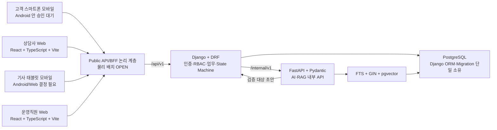

# WaterCare API 명세서

> 문서 버전: **v0.3**  
> 기준일: **2026-07-24**  
> 문서 상태: **v0.8 기술스택 반영 · 구현 전 계약 검토본**  
> 범위: **Public API 39개 + Internal API 5개 = 총 44개**  
> 적합성 판정: **조건부 적합**

---

## 1. 한눈에 보는 명세

### 1.1 판정

이 문서는 v0.2의 44개 Method+Path를 그대로 유지하면서 기술스택 선정안 v0.8과 공통 개발 규칙을 반영한 API 계약 검토본이다.

v0.8에서 다음 기준은 더 이상 단순 후보가 아니다.

- Public 인증·권한: `JWT + RBAC`
- 업무 API와 상태 관리: Django + Django REST Framework
- AI/RAG 내부 API: FastAPI + Pydantic + Uvicorn
- DB 단일 소유: PostgreSQL + Django ORM·Migration
- 검색: PostgreSQL FTS + GIN과 pgvector의 하이브리드 검색
- API 문서: 사람이 검토하는 Markdown과 기계 검증용 OpenAPI를 함께 관리
- OpenAPI 생성: drf-spectacular와 FastAPI OpenAPI
- 배포: Kubernetes + GitHub Actions + Docker image
- 전 구간 추적: 구조화 JSON 로그와 `correlation_id`

그러나 아래 항목은 여전히 팀 결정 또는 DB 보완이 필요하므로 최종 승인본으로 볼 수 없다.

- JWT 만료·갱신·rotation·revocation과 채널별 안전 저장 방식
- API DateTime 시간대·offset·DB UTC 변환 방식
- 도메인형 문자열 ID 생성 규칙과 현재 ERD UUID PK의 정합화
- Public API/BFF의 물리 배치, 인증 종단, Kubernetes Ingress 책임
- `correlation_id`, 멱등 key, 동시성 version의 정확한 전송 위치
- 고객 보유 제품, 선택 구독, 기사 precheck 저장 모델
- 운영 역할 코드와 일부 endpoint별 요청·응답 세부
- 구현 코드·Migration·OpenAPI·자동 테스트·리뷰 증거

따라서 v0.3의 판정은 **조건부 적합**이며 구현 상태는 44개 모두 `NOT_IMPLEMENTED`다.

### 1.2 API 현황

| 항목 | 수량 | 의미 |
|---|---:|---|
| 전체 API | 44 | v0.2 Method+Path 보존 |
| Public API | 39 | 고객·상담사·기사·운영 채널 |
| Internal API | 5 | Django와 FastAPI AI/RAG 사이의 내부 계약 |
| `ALIGNED` | 21 | 현재 자료와 구조적으로 일치 |
| `CONDITIONAL` | 7 | 공통 정책 결정 후 동결 가능 |
| `OPEN` | 12 | endpoint별 또는 공통 계약 선택 필요 |
| `BLOCKED` | 4 | 현재 DB 저장·무결성 계약으로 구현 불가 |
| `VERIFIED` | 0 | 구현·테스트·리뷰 증거 없음 |

> `ALIGNED`는 “문서 간 구조가 일치함”을 뜻하며 팀 승인 완료나 구현 완료를 뜻하지 않는다.

### 1.3 v0.2에서 달라진 핵심

| 구분 | v0.2 | v0.3 |
|---|---|---|
| Public 인증 | 방식 전체 `OPEN` | `JWT + RBAC` 필수, 수명주기·저장·전송 세부만 `OPEN` |
| OpenAPI | 후보 | Markdown과 함께 필수, drf-spectacular·FastAPI OpenAPI 적용 |
| 배포 | Kubernetes 채택 여부 충돌 | Kubernetes + GitHub Actions + Docker image 필수 |
| 검색 | 기술 후보 | PostgreSQL FTS + GIN과 pgvector 필수 |
| Public API/BFF | 존재 여부 `OPEN` | 논리 계층 채택, 물리 배치·인증 종단만 `OPEN` |
| ID | Public 문자열 취급 | 도메인형 문자열 ID 정책 적용, 생성 규칙·ERD UUID 정합화 필요 |
| 고객 채널 | Web/Android 중립 | 스마트폰 모바일 전용, Android Native 안은 팀 승인 대기 |
| 상담·운영 채널 | 후보 | React + TypeScript + Vite Web |
| 기사 채널 | 중립 | 태블릿 모바일 전용, Android Native와 태블릿 Web 중 결정 필요 |
| 운영 역할 | `OPERATOR` 고정 표현 | 역할 코드는 `SUPERVISOR`·`OPERATIONS` 등 팀 동결 전까지 `OPEN` |

### 1.4 구현 차단 API

| API ID | Method·Path | 차단 원인 |
|---|---|---|
| `API-SUB-004` | `POST /api/v1/me/subscriptions/{subscription_id}/select` | 고객별 선택 구독 저장 필드와 단일 선택 제약이 없음 |
| `API-PRD-001` | `POST /api/v1/me/products` | 고객 보유 제품과 공용 제품 카탈로그를 분리한 소유 모델이 없음 |
| `API-PRD-002` | `PATCH /api/v1/me/products/{product_id}` | 고객 보유 제품 원장과 version 필드가 없음 |
| `API-TECH-003` | `PATCH /api/v1/technician/visits/{id}/precheck-report` | 기사 사전 확인 수정값을 보존할 물리 필드가 없음 |

다음 항목은 특정 API 한 개가 아니라 전체 구현에 영향을 주는 스키마 차단이다.

| 차단 ID | 내용 | 처리 |
|---|---|---|
| `BLOCK-CONFLICT-ID-001` | v0.8은 도메인형 문자열 ID를 요구하지만 현재 ERD는 31개 테이블의 PK를 UUID로 정의 | Django Model·Migration·ERD·Seed·API 예시를 같은 결정으로 정합화하기 전 운영 schema 확정 금지 |

`BLOCK-CONFLICT-ID-001`은 Method+Path를 바꾸지 않으므로 44개 endpoint 상태 수량에는 중복 가산하지 않는다. 클라이언트는 그동안 모든 ID를 형식에 의존하지 않는 opaque string으로 취급한다.

### 1.5 상태 표기

| 축 | 값 | 의미 |
|---|---|---|
| 계약 상태 | `ALIGNED` | 현재 교차검증 자료가 구조적으로 일치 |
| 계약 상태 | `CONDITIONAL` | 공통 정책 결정 후 동결 가능 |
| 계약 상태 | `OPEN` | endpoint별 계약 선택 필요 |
| 계약 상태 | `BLOCKED` | schema 또는 저장 계약 보완 전 구현 금지 |
| 구현 상태 | `NOT_IMPLEMENTED` | 구현·Migration·계약 테스트 증거 없음 |
| 구현 상태 | `IN_PROGRESS` | 구현 중이며 인수 증거 미완료 |
| 구현 상태 | `VERIFIED` | 구현·자동 테스트·리뷰·결과 리포트 확인 |

### 1.6 우선 결정 순서

| 우선순위 | 결정 항목 | 영향 |
|---:|---|---|
| 1 | 도메인형 문자열 ID 생성 규칙과 ERD UUID 정합화 | URL·DTO·Model·Migration·Seed 전체 |
| 2 | JWT 만료·갱신·rotation·revocation·채널별 저장·전송 | Public 인증 전체 |
| 3 | API DateTime 시간대와 DB UTC 변환 | 모든 일시 필드 |
| 4 | Public API/BFF·Ingress·인증 종단의 물리 경계 | 클라이언트 호출·배포·보안 |
| 5 | 전역 멱등 저장·payload hash·응답 replay | 모든 생성·업무 mutation |
| 6 | `correlation_id` 생성 주체와 Header/body 공개 위치 | Public·Internal 전 구간 |
| 7 | 운영 역할 코드 | OPS API·RBAC·JWT claim |
| 8 | 고객 보유 제품·선택 구독·기사 precheck 저장 모델 | 차단된 4개 API |
| 9 | `/events` 또는 `/actions/{event_code}` | 상태 명령 canonical URL |
| 10 | Follow-up 생성·갱신과 version 전달 | `API-INQ-011` |

---

## 2. 시스템 경계와 채널

### 2.1 논리 구조



### 2.2 책임

| 구성요소 | 확정 책임 | 금지·미정 |
|---|---|---|
| 역할별 클라이언트 | 화면 입력·표시, 로딩·오류, `allowed_actions` 기반 UI 제어 | DB·FastAPI 직접 호출 금지 |
| Public API/BFF | 모든 채널의 공통 Public 계약 계층 | 별도 gateway인지 Django 진입 계층인지, 인증 종단·Ingress 배치 미정 |
| Django/DRF | JWT 검증·RBAC, CRUD, State Machine, transaction, Evidence 조립, Public DTO | 검증되지 않은 AI 결과로 상태 변경 금지 |
| PostgreSQL | 업무 원장, 상태 이력, 문서·Evidence·AI/RAG 실행 이력 | FastAPI·Node의 별도 ORM/Migration 소유 금지 |
| FastAPI/Pydantic | AI 입력·출력 검증, 증상 구조화, 검색, 질문·안내·요약·기사 브리프 초안, fallback | Public 노출, 업무 상태 직접 변경, 독자 Migration 금지 |
| Node.js/TypeScript | Web 개발·build·test runtime | Express/NestJS 업무 백엔드 도입 금지 |
| Kubernetes·GitHub Actions | 통합 배포·승인·rollback·배포 후 검증 | Ingress와 gateway의 중복 책임은 ADR 필요 |

### 2.3 채널별 계약

모든 채널은 UI 기술이 달라도 다음 계약을 공유한다.

- REST `/api/v1`
- JWT 기반 인증과 RBAC
- `allowed_actions`
- `state_version`
- 멱등 key
- 상태·오류·로딩·빈 화면 의미
- `EvidenceCardDTO`
- `correlation_id` 전 구간 전달

---

## 3. 공통 API 계약

### 3.1 URL과 문서 원본

| 구분 | Prefix | 호출자 | 계약 상태 |
|---|---|---|---|
| Public 상태 점검 | `/health` | 배포·모니터링 | 응답 schema `OPEN` |
| Public 업무 API | `/api/v1` | 역할별 클라이언트 | prefix `ALIGNED`, 물리 ingress `OPEN` |
| Internal AI/RAG | `/internal/v1` | Django → FastAPI | prefix `ALIGNED`, service 인증 `OPEN` |

사람이 검토하는 공식 계약은 이 Markdown 문서이며, 기계 검증과 타입 생성은 versioned OpenAPI로 수행한다.

- Django/DRF: drf-spectacular
- FastAPI: FastAPI OpenAPI
- 특정 OpenAPI 숫자 버전은 도구 호환성 검증 후 결정
- Method·Path·Schema 변경은 Markdown과 OpenAPI를 같은 PR에서 수정
- Markdown·OpenAPI·Django route·Serializer 간 계약 diff는 0건이어야 함

### 3.2 데이터 형식

| 항목 | v0.3 계약 | 상태 |
|---|---|---|
| JSON 필드명 | `lower_snake_case` | 적용 |
| Public 식별자 | `Identifier` 문자열 | 도메인형 문자열 정책 적용, 생성 형식 `OPEN-ID-001` |
| 클라이언트 ID 처리 | opaque string | UUID·ULID·prefix 길이에 의존 금지 |
| 현재 ERD 물리 PK | 31개 UUID, `common_code_group.group_code` 자연키 예외 | v0.8 정책과 충돌 |
| Date | `YYYY-MM-DD` | 적용 |
| DateTime | `YYYY-MM-DD HH:mm:ss` | 형식 적용, 시간대 profile `OPEN-TIME-001` |
| 값 없음 | `null` | 적용 |
| 빈 목록 | `[]` | 적용 |
| Boolean | `true` / `false` | 적용 |
| 코드값 | `UPPER_SNAKE_CASE` | 표현 적용, Enum 저장 방식 `OPEN-ENUM-001` |
| 문자열 인코딩 | UTF-8 | 적용 |

ERD의 `timestamptz`는 DB 저장 타입의 근거지만 Public 직렬화 시간대를 자동으로 확정하지 않는다.

### 3.3 성공·오류 Wrapper

`/api/v1`의 최소 Wrapper:

```json
{
  "success": true,
  "data": {},
  "error": null
}
```

```json
{
  "success": false,
  "data": null,
  "error": {
    "code": "INVALID_STATE_TRANSITION",
    "message": "현재 상태에서 요청한 작업을 수행할 수 없습니다.",
    "details": {}
  }
}
```

| 항목 | 계약 |
|---|---|
| 성공 | `success=true`, `data`는 endpoint schema, `error=null` |
| 실패 | `success=false`, `data=null`, `error.code/message/details` |
| 사용자 문구 | 내부 stack trace·비밀값·민감정보 비노출 |
| correlation ID | 추적·전달은 필수, 응답 Header/body 위치는 `OPEN-CORR-001` |
| `/health` | Wrapper와 dependency 공개 범위 `OPEN-HEALTH-001` |
| Internal | Public Wrapper 재사용 여부 `OPEN-INT-001` |

### 3.4 목록

```json
{
  "success": true,
  "data": {
    "items": [],
    "page": 1,
    "size": 20,
    "total": 0
  },
  "error": null
}
```

| Query | 타입 | 기본·제약 |
|---|---|---|
| `page` | integer | 기본 1, `page >= 1` |
| `size` | integer | 기본 20, `1 <= size <= 100` |

정렬·filter는 endpoint별로 명시하며 빈 결과는 `items=[]`로 반환한다.

### 3.5 인증·권한

JWT 인증과 RBAC는 필수다. 다만 token lifecycle과 전달 serialization은 `OPEN-JWT-001`에서 동결한다.

| 논리 역할 | 허용 범위 | 코드 상태 |
|---|---|---|
| 고객 | 본인 구독·문진·문의·조치 결과·피드백 | `CUSTOMER` |
| 상담사 | 허용 queue와 본인 배정 문의·상담·방문 전환 | `COUNSELOR` |
| 방문기사 | 본인 배정 Visit·방문 결과 | `TECHNICIAN` |
| 운영직원 | 운영 집계·예외 읽기 전용 | `OPEN-ROLE-001` |
| 시스템 | 검증된 AI snapshot과 결정론적 event | `SYSTEM` |

| 대상 | 인증 계약 |
|---|---|
| `GET /health` | Anonymous 후보 |
| `POST /api/v1/auth/demo-login` | 개발·시연 환경 합성 사용자 전용 |
| 그 외 `/api/v1/**` | JWT 필수, 역할·객체 범위 검사 |
| `/internal/v1/**` | Public JWT와 분리된 service 인증 필요, 방식 `OPEN-AUTH-002` |

타 사용자의 객체는 존재 여부를 노출하지 않도록 `RESOURCE_NOT_FOUND`로 은닉한다.

### 3.6 추적·멱등성·동시성

| 개념 | 적용 | 확정 내용 | 미정 |
|---|---|---|---|
| JWT | 인증 endpoint | JWT + RBAC | Header·cookie 등 정확한 전달 위치와 lifecycle |
| `correlation_id` | Public·Internal 전 구간 | 생성·전달·로그 연계 필수 | 생성 주체, Header/body 위치 |
| 멱등 key | 생성·업무 mutation | 중복 요청 제어 필수 | Header/body 위치, 보존 기간, payload 정규화, replay 저장소 |
| `state_version` | 상태 원장 mutation | 현재 version 일치 검사 필수 | 일부 비상태 객체 version 이름 |
| `If-Match` | 상태 mutation 후보 | 미확정 | body version과 병행 여부 |
| `Content-Type` | JSON body | `application/json` | 없음 |

독립적인 `state_version` 원장:

- `support_questionnaire_session`
- `support_inquiry`
- `support_consultation`
- `field_service_visit`
- `support_followup_confirmation`
- `support_inquiry_status_history`

Inquiry와 Consultation 또는 Inquiry와 Visit을 같은 transaction에서 변경하면 각 원장의 version을 따로 검증한다.

### 3.7 공통 오류

| HTTP | 업무 코드 | 의미 |
|---:|---|---|
| 400 | `INVALID_REQUEST` | 요청 형식 오류 |
| 401 | `AUTH_REQUIRED` | JWT 없음·만료·무효 |
| 403 | `FORBIDDEN` | 역할·배정·객체 범위 위반 |
| 404 | `RESOURCE_NOT_FOUND` | 객체 없음 또는 접근 은닉 |
| 409 | `INVALID_STATE_TRANSITION` | 허용되지 않은 상태 event |
| 409 | `STATE_VERSION_CONFLICT` | stale version |
| 409 | `IDEMPOTENCY_CONFLICT` | 같은 key에 다른 payload |
| 409 | `DUPLICATE_ACTIVE_REQUEST` | 활성 상담·방문 중복 생성 |
| 422 | `VALIDATION_ERROR` | 필수값·Enum·Schema 위반 |
| 422 | `PRODUCT_VALIDATION_FAILED` | 지원 범위·제품 검증 실패 |
| 500 | `INTERNAL_ERROR` | 내부 오류 |
| 504 | `AI_TIMEOUT` | 입력 보존 후 재시도 또는 상담 전환 |

`NO_EVIDENCE`는 예상 가능한 업무 결과다. 근거가 없으면 안내를 임의 생성하지 않고 상담 흐름으로 전환한다. 정확한 HTTP 처리 방식은 OpenAPI 동결 시 확정한다.

---

## 4. 전체 API 인덱스

### 4.1 공통·인증

| ID | Method | Path | 기능 | 역할 | 계약 | 구현 |
|---|---|---|---|---|---|---|
| `API-SYS-001` | GET | `/health` | 서비스 상태 점검 | Anonymous | `OPEN` | `NOT_IMPLEMENTED` |
| `API-AUTH-001` | POST | `/api/v1/auth/demo-login` | 합성 사용자 로그인 | Anonymous | `CONDITIONAL` | `NOT_IMPLEMENTED` |
| `API-AUTH-002` | GET | `/api/v1/me` | 현재 사용자 조회 | JWT 사용자 | `ALIGNED` | `NOT_IMPLEMENTED` |

### 4.2 제품·구독·케어

| ID | Method | Path | 기능 | 역할 | 계약 | 구현 |
|---|---|---|---|---|---|---|
| `API-SUB-001` | GET | `/api/v1/me/subscriptions` | 본인 구독 목록 | CUSTOMER | `ALIGNED` | `NOT_IMPLEMENTED` |
| `API-SUB-002` | POST | `/api/v1/me/subscriptions` | 구독 등록 | CUSTOMER | `CONDITIONAL` | `NOT_IMPLEMENTED` |
| `API-SUB-003` | PATCH | `/api/v1/me/subscriptions/{subscription_id}` | 구독 수정 | CUSTOMER | `OPEN` | `NOT_IMPLEMENTED` |
| `API-SUB-004` | POST | `/api/v1/me/subscriptions/{subscription_id}/select` | 문의 대상 구독 선택 | CUSTOMER | `BLOCKED` | `NOT_IMPLEMENTED` |
| `API-PRD-001` | POST | `/api/v1/me/products` | 고객 보유 제품 등록 | CUSTOMER | `BLOCKED` | `NOT_IMPLEMENTED` |
| `API-PRD-002` | PATCH | `/api/v1/me/products/{product_id}` | 고객 보유 제품 수정 | CUSTOMER | `BLOCKED` | `NOT_IMPLEMENTED` |
| `API-CARE-001` | GET | `/api/v1/me/care-histories` | 케어 이력 조회 | CUSTOMER | `ALIGNED` | `NOT_IMPLEMENTED` |
| `API-CARE-002` | POST | `/api/v1/me/care-histories` | 케어 이력 등록 | 권한 정책 미정 | `OPEN` | `NOT_IMPLEMENTED` |
| `API-CARE-003` | GET | `/api/v1/me/care-schedules` | 다음 케어 일정 조회 | CUSTOMER | `CONDITIONAL` | `NOT_IMPLEMENTED` |

### 4.3 사전 문진

| ID | Method | Path | 기능 | 역할 | 계약 | 구현 |
|---|---|---|---|---|---|---|
| `API-QSN-001` | POST | `/api/v1/questionnaire-sessions` | 문진 세션 생성 | CUSTOMER | `ALIGNED` | `NOT_IMPLEMENTED` |
| `API-QSN-002` | PATCH | `/api/v1/questionnaire-sessions/{session_id}` | 문진 임시 저장 | CUSTOMER | `ALIGNED` | `NOT_IMPLEMENTED` |
| `API-QSN-003` | POST | `/api/v1/questionnaire-sessions/{session_id}/submit` | 문진 제출 | CUSTOMER | `ALIGNED` | `NOT_IMPLEMENTED` |
| `API-QSN-004` | POST | `/api/v1/questionnaire-sessions/{session_id}/link-inquiry` | 제출 문진과 문의 연결 | CUSTOMER | `ALIGNED` | `NOT_IMPLEMENTED` |

### 4.4 고객 문의

| ID | Method | Path | 기능 | 역할 | 계약 | 구현 |
|---|---|---|---|---|---|---|
| `API-INQ-001` | POST | `/api/v1/inquiries` | 문의 생성 | CUSTOMER | `ALIGNED` | `NOT_IMPLEMENTED` |
| `API-INQ-002` | PATCH | `/api/v1/inquiries/{id}/questionnaire` | 문의 원문·답변 보완 | CUSTOMER | `ALIGNED` | `NOT_IMPLEMENTED` |
| `API-INQ-003` | POST | `/api/v1/inquiries/{id}/submit` | 문의 제출·분석 시작 | CUSTOMER | `OPEN` | `NOT_IMPLEMENTED` |
| `API-INQ-004` | POST | `/api/v1/inquiries/{id}/events` | 상태 event 실행 | 역할별 | `OPEN` | `NOT_IMPLEMENTED` |
| `API-INQ-005` | GET | `/api/v1/inquiries/{id}/questions` | 추가 질문 조회 | CUSTOMER | `ALIGNED` | `NOT_IMPLEMENTED` |
| `API-INQ-006` | POST | `/api/v1/inquiries/{id}/answers` | 추가 답변 제출 | CUSTOMER | `OPEN` | `NOT_IMPLEMENTED` |
| `API-INQ-007` | GET | `/api/v1/inquiries/{id}/guidance` | 검증된 안내 조회 | CUSTOMER | `CONDITIONAL` | `NOT_IMPLEMENTED` |
| `API-INQ-008` | POST | `/api/v1/inquiries/{id}/action-results` | 고객 조치 결과 등록 | CUSTOMER | `ALIGNED` | `NOT_IMPLEMENTED` |
| `API-INQ-009` | POST | `/api/v1/inquiries/{id}/consultation-requests` | 상담 요청 | CUSTOMER | `ALIGNED` | `NOT_IMPLEMENTED` |
| `API-INQ-010` | GET | `/api/v1/inquiries/{id}` | 문의 상세 조회 | 역할별 | `ALIGNED` | `NOT_IMPLEMENTED` |
| `API-INQ-011` | POST | `/api/v1/inquiries/{id}/feedback` | 해결 여부·후속 피드백 | CUSTOMER | `OPEN` | `NOT_IMPLEMENTED` |
| `API-INQ-012` | POST | `/api/v1/inquiries/{id}/reopen` | 문의 재개 | CUSTOMER | `ALIGNED` | `NOT_IMPLEMENTED` |

### 4.5 상담사·방문 일정

| ID | Method | Path | 기능 | 역할 | 계약 | 구현 |
|---|---|---|---|---|---|---|
| `API-CNS-001` | GET | `/api/v1/counselor/inquiries` | 상담 queue 조회 | COUNSELOR | `ALIGNED` | `NOT_IMPLEMENTED` |
| `API-CNS-002` | GET | `/api/v1/counselor/inquiries/{id}` | 상담용 문의 상세 | COUNSELOR | `ALIGNED` | `NOT_IMPLEMENTED` |
| `API-CNS-003` | POST | `/api/v1/counselor/inquiries/{id}/consultations` | 상담 시작·완료·방문 판단 | COUNSELOR | `OPEN` | `NOT_IMPLEMENTED` |
| `API-CNS-004` | POST | `/api/v1/counselor/inquiries/{id}/visit-requests` | 인계 리포트·방문 요청 생성 | COUNSELOR | `OPEN` | `NOT_IMPLEMENTED` |
| `API-VIS-001` | PATCH | `/api/v1/visits/{visit_id}/schedule` | 기사 배정·방문 일정 변경 | COUNSELOR | `ALIGNED` | `NOT_IMPLEMENTED` |

### 4.6 방문기사

| ID | Method | Path | 기능 | 역할 | 계약 | 구현 |
|---|---|---|---|---|---|---|
| `API-TECH-001` | GET | `/api/v1/technician/visits` | 본인 방문 목록 | TECHNICIAN | `ALIGNED` | `NOT_IMPLEMENTED` |
| `API-TECH-002` | GET | `/api/v1/technician/visits/{id}` | 방문 상세·인계 조회 | TECHNICIAN | `ALIGNED` | `NOT_IMPLEMENTED` |
| `API-TECH-003` | PATCH | `/api/v1/technician/visits/{id}/precheck-report` | 기사 사전 확인 저장 | TECHNICIAN | `BLOCKED` | `NOT_IMPLEMENTED` |
| `API-TECH-004` | POST | `/api/v1/technician/visits/{id}/results` | 방문 결과 등록 | TECHNICIAN | `ALIGNED` | `NOT_IMPLEMENTED` |

### 4.7 운영

| ID | Method | Path | 기능 | 역할 | 계약 | 구현 |
|---|---|---|---|---|---|---|
| `API-OPS-001` | GET | `/api/v1/operations/dashboard` | 운영 현황 집계 | 운영직원(코드 OPEN) | `OPEN` | `NOT_IMPLEMENTED` |
| `API-OPS-002` | GET | `/api/v1/operations/exceptions` | 지연·오류·근거 부족 조회 | 운영직원(코드 OPEN) | `OPEN` | `NOT_IMPLEMENTED` |

### 4.8 Internal AI/RAG

| ID | Method | Path | 기능 | 호출자 | 계약 | 구현 |
|---|---|---|---|---|---|---|
| `API-AI-001` | POST | `/internal/v1/inquiry-analysis` | 증상·위험·질문·근거 분석 | Django | `CONDITIONAL` | `NOT_IMPLEMENTED` |
| `API-AI-002` | POST | `/internal/v1/consultation-summary` | 상담 요약 초안 | Django | `CONDITIONAL` | `NOT_IMPLEMENTED` |
| `API-AI-003` | POST | `/internal/v1/technician-brief` | 기사 브리프 초안 | Django | `CONDITIONAL` | `NOT_IMPLEMENTED` |
| `API-AI-004` | GET | `/internal/v1/runs/{run_id}` | AI 실행 상태 조회 | Django | `ALIGNED` | `NOT_IMPLEMENTED` |
| `API-AI-005` | GET | `/internal/v1/health` | AI 서비스 상태 | Django | `OPEN` | `NOT_IMPLEMENTED` |

---

## 5. Endpoint 계약

정확한 성공 HTTP status는 `OPEN-HTTP-001` 결정 후 OpenAPI에서 동결한다. 아래 `data`는 공통 Wrapper의 `data` 필드를 뜻한다.

### 5.1 공통·인증

| ID | 입력 | `data` 응답 | 핵심 계약 |
|---|---|---|---|
| `API-SYS-001` | 없음 | `HealthDTO` | host·stack trace·비밀값 비노출. dependency 공개 범위 `OPEN` |
| `API-AUTH-001` | `DemoLoginRequest` | `AuthSessionDTO` | 합성 사용자 allowlist만 허용. 운영 활성화 금지. JWT 발급 응답·만료 계약 `OPEN-JWT-001` |
| `API-AUTH-002` | 없음 | `UserDTO` | JWT 사용자·role·활성 상태를 서버 원장에서 다시 검증 |

### 5.2 제품·구독·케어

| ID | 입력 | `data` 응답 | 핵심 계약 |
|---|---|---|---|
| `API-SUB-001` | `page`, `size`, `status_code?` | `Page<SubscriptionDTO>` | 본인 구독만 |
| `API-SUB-002` | `SubscriptionCreateRequest` | `SubscriptionDTO` | `customer_id`는 JWT 사용자에서 파생. 제품 guard. 멱등 replay는 조건부 |
| `API-SUB-003` | `SubscriptionUpdateRequest` | `SubscriptionDTO` | 변경 allowlist 필요. version 필드 `OPEN-CONC-002` |
| `API-SUB-004` | 미확정 | 미확정 | 선택 상태 저장 위치와 고객당 단일 선택 제약 전까지 `BLOCKED` |
| `API-PRD-001` | 미확정 | 미확정 | 공용 `catalog_product_model`을 고객이 직접 수정하지 않음 |
| `API-PRD-002` | 미확정 | 미확정 | 고객 보유 제품 원장·version 추가 전 `BLOCKED` |
| `API-CARE-001` | `subscription_id?`, `status_code?`, `page`, `size` | `Page<CareRecordDTO>` | 본인 구독의 이력만, 최신순 |
| `API-CARE-002` | `CareRecordCreateRequest` | `CareRecordDTO` | 등록 actor 정책과 idempotency 저장 방식 `OPEN` |
| `API-CARE-003` | `subscription_id?` | `CareScheduleDTO[]` | 공식 케어 주기 원본·계산 정책 `OPEN-CARE-001` |

### 5.3 사전 문진

| ID | 입력 | `data` 응답 | 핵심 계약 |
|---|---|---|---|
| `API-QSN-001` | `QuestionnaireSessionCreateRequest` | `QuestionnaireSessionDTO` | Inquiry 없이 생성, 생성 멱등 key 저장 |
| `API-QSN-002` | `QuestionnaireSaveRequest` | `QuestionnaireSessionDTO` | `UNANSWERED → IN_PROGRESS`, 이후 유지 |
| `API-QSN-003` | `StateVersionRequest` | `QuestionnaireSessionDTO` | 필수 답변 검증 후 `SUBMITTED` |
| `API-QSN-004` | `QuestionnaireLinkRequest` | `QuestionnaireSessionDTO` | 동일 고객·구독의 Inquiry에 한 번만 연결 |

### 5.4 고객 문의

| ID | 입력 | `data` 응답 | 핵심 계약 |
|---|---|---|---|
| `API-INQ-001` | `InquiryCreateRequest` | `InquiryDetailDTO` | `raw_text` trim 후 nonblank, 본인 활성 구독 |
| `API-INQ-002` | `InquiryQuestionnaireRequest` | `InquiryDetailDTO` | 원문을 잃지 않고 답변·구조화 정보를 누적 |
| `API-INQ-003` | `StateVersionRequest` | `InquiryDetailDTO` 또는 `AiRunReferenceDTO` | 동기·비동기 응답 형태 `OPEN` |
| `API-INQ-004` | `InquiryEventRequest` | `StateTransitionResultDTO` | canonical 상태 event만 실행. URL 표준 `OPEN-EVENT-001` |
| `API-INQ-005` | 없음 | `QuestionDTO[]` | 미응답·공개 가능한 질문만 |
| `API-INQ-006` | `AnswerSubmitRequest` | `QuestionDTO[]` 또는 `AiRunReferenceDTO` | 재분석 응답·timeout 처리 `OPEN` |
| `API-INQ-007` | 없음 | `GuidanceDTO` | 검증된 Guidance만. 선택 기준 또는 배열 계약 필요 |
| `API-INQ-008` | `ActionResultRequest` | `ActionResultDTO` | 수행 여부는 `result_code` 단일 원천 |
| `API-INQ-009` | `ConsultationRequest` | `ConsultationDTO` | 활성 상담 중복 금지 |
| `API-INQ-010` | 없음 | `InquiryDetailDTO` | Guidance·Consultation·Visit을 1:N 배열로 반환 |
| `API-INQ-011` | `ResolutionFeedbackRequest` | `FollowupConfirmationDTO`, `InquiryDetailDTO` | Follow-up 생성·갱신과 이중 version `OPEN` |
| `API-INQ-012` | `ReopenRequest` | `InquiryDetailDTO` | 미해결·재발 사유 필수 |

### 5.5 상담사·방문 일정

| ID | 입력 | `data` 응답 | 핵심 계약 |
|---|---|---|---|
| `API-CNS-001` | queue filter, `page`, `size` | `Page<InquirySummaryDTO>` | queue scope와 위험·우선순위·접수시각 정렬 |
| `API-CNS-002` | 없음 | `CounselorInquiryDetailDTO` | 배정·queue scope와 공개 allowlist |
| `API-CNS-003` | `ConsultationCommandRequest` | `ConsultationDTO`, `StateTransitionResultDTO` | Inquiry·Consultation version을 별도 검증 |
| `API-CNS-004` | `VisitRequestCreateRequest` | `VisitDTO` | HandoffReport와 Visit을 한 transaction에서 생성 |
| `API-VIS-001` | `VisitScheduleRequest` | `VisitDTO`, `StateTransitionResultDTO` | Inquiry·Visit version을 모두 검증 |

### 5.6 방문기사

| ID | 입력 | `data` 응답 | 핵심 계약 |
|---|---|---|---|
| `API-TECH-001` | 상태·기간 filter, `page`, `size` | `Page<VisitDTO>` | 본인 배정 방문만 |
| `API-TECH-002` | 없음 | `TechnicianVisitDetailDTO` | Handoff·Care·공식 Evidence 공개 allowlist |
| `API-TECH-003` | `TechnicianPrecheckRequest` | `VisitDTO` | 저장 모델 추가 전 `BLOCKED` |
| `API-TECH-004` | `VisitResultCreateRequest` | `VisitResultDTO`, `StateTransitionResultDTO` | Result·Visit·Inquiry·CareRecord·이력을 atomic 반영 |

### 5.7 운영

| ID | 입력 | `data` 응답 | 핵심 계약 |
|---|---|---|---|
| `API-OPS-001` | 기간·제품·담당·상태 filter | `OperationsDashboardDTO` | 집계식·갱신주기·합성 데이터 표기·role code `OPEN` |
| `API-OPS-002` | 예외 유형·심각도·상태 filter, paging | `Page<OperationsExceptionDTO>` | 예외 분류·source table·해결 상태·role code `OPEN` |

### 5.8 Internal AI/RAG

| ID | 입력 | 응답 payload | 핵심 계약 |
|---|---|---|---|
| `API-AI-001` | `InquiryAnalysisRequest` | `InquiryAnalysisResult` | Pydantic 전체 검증. FTS+GIN·pgvector 검색. 업무 상태 변경 금지 |
| `API-AI-002` | `ConsultationSummaryRequest` | `ConsultationSummaryDraft` | AI 초안과 상담사 확정본 분리 |
| `API-AI-003` | `TechnicianBriefRequest` | `TechnicianBriefDraft` | 확정 진단·분해·부품 교체 지시 금지 |
| `API-AI-004` | `run_id` | `AiRunStatusDTO` | `aiops_ai_run` 기반 실행 상태 |
| `API-AI-005` | 없음 | `InternalHealthDTO` | service 인증·공개 범위·Wrapper `OPEN` |

---

## 6. Request Schema

### 6.1 공통 타입

| 타입 | JSON 표현 | 계약 |
|---|---|---|
| `Identifier` | string | 도메인형 문자열 대상이며 클라이언트는 형식에 의존하지 않음 |
| `DateString` | string | `YYYY-MM-DD` |
| `DateTimeString` | string | `YYYY-MM-DD HH:mm:ss`, 시간대 profile `OPEN-TIME-001` |
| `JsonObject` | object | endpoint schema로 속성 제한 |
| `Page<T>` | object | `items`, `page`, `size`, `total` |

### 6.2 인증·구독·케어

#### `DemoLoginRequest`

| 필드 | 타입 | 필수 | 검증 |
|---|---|:---:|---|
| `demo_user_code` | string | Y | 서버 allowlist의 합성 사용자 코드 |

#### `SubscriptionCreateRequest`

| 필드 | 타입 | 필수 | 검증 |
|---|---|:---:|---|
| `product_model_id` | `Identifier` | Y | 활성·지원 대상 제품 모델 |
| `contract_no` | string | Y | 가명·합성 계약 번호, UNIQUE |
| `serial_no` | string | Y | 가명·합성 일련번호 |
| `management_type_code` | enum | Y | `SELF_MANAGED`, `VISIT_CARE` |
| `started_on` | `DateString` | Y | 유효 날짜 |
| `installed_at` | `DateTimeString`/null | N | 시간대 profile 필요 |
| `installation_address` | string/null | N | 실제 개인정보 금지 |

#### `SubscriptionUpdateRequest`

변경 후보는 `management_type_code`, `started_on`, `installed_at`, `installation_address`다. `customer_id`, `product_model_id`, `contract_no`는 별도 승인 없이 변경하지 않는다. version 필드명과 물리 위치는 `OPEN-CONC-002`다.

#### `CareRecordCreateRequest`

| 필드 | 타입 | 필수 |
|---|---|:---:|
| `subscription_id` | `Identifier` | Y |
| `care_type_code` | enum | Y |
| `status_code` | enum | Y |
| `scheduled_on` | `DateString` | Y |
| `completed_at` | `DateTimeString`/null | N |
| `summary` | string/null | N |

`next_care_on`은 공식 주기 원본·version이 확정되기 전 클라이언트가 임의 산정하지 않는다.

### 6.3 사전 문진

#### `QuestionnaireSessionCreateRequest`

| 필드 | 타입 | 필수 |
|---|---|:---:|
| `subscription_id` | `Identifier` | Y |
| `questionnaire_type_code` | enum | Y |
| `questionnaire_version` | string | Y |

#### `QuestionnaireSaveRequest`

| 필드 | 타입 | 필수 |
|---|---|:---:|
| `answers_payload` | object | Y |
| `state_version` | integer | Y |

#### `QuestionnaireLinkRequest`

| 필드 | 타입 | 필수 |
|---|---|:---:|
| `inquiry_id` | `Identifier` | Y |
| `state_version` | integer | Y |

#### `StateVersionRequest`

| 필드 | 타입 | 필수 |
|---|---|:---:|
| `state_version` | integer | Y |

### 6.4 문의·상담

#### `InquiryCreateRequest`

| 필드 | 타입 | 필수 | 검증 |
|---|---|:---:|---|
| `subscription_id` | `Identifier` | Y | 본인의 활성 구독 |
| `channel_code` | enum | Y | 허용 채널 코드 |
| `raw_text` | string | Y | trim 후 nonblank |
| `representative_symptom_code` | enum/null | N | 허용 증상 코드 |
| `questionnaire_session_id` | `Identifier`/null | N | 제출된 동일 구독 문진 |

#### `InquiryQuestionnaireRequest`

| 필드 | 타입 | 필수 |
|---|---|:---:|
| `raw_text` | string | N |
| `representative_symptom_code` | enum | N |
| `occurrence_condition` | string/null | N |
| `accompanying_symptoms` | string/null | N |
| `duration_text` | string/null | N |
| `location_text` | string/null | N |
| `answers` | object/array | N |
| `state_version` | integer | Y |

#### `InquiryEventRequest`

| 필드 | 타입 | 필수 | 설명 |
|---|---|:---:|---|
| `event` | enum | Y | 승인된 canonical event |
| `state_version` | integer | Y | Inquiry 기대 version |
| `reason` | string/null | 조건부 | 재개·취소·최종 완료 등 |
| `payload` | object | Y | event별 schema |
| `visit_state_version` | integer/null | 조건부 | Visit 동시 변경 |
| `consultation_state_version` | integer/null | 조건부 | Consultation 동시 변경 |

#### `AnswerSubmitRequest`

| 필드 | 타입 | 필수 |
|---|---|:---:|
| `answers` | array | Y |
| `answers[].question_code` | string | Y |
| `answers[].answer_text` | string/null | 조건부 |
| `answers[].answer_payload` | object/null | 조건부 |
| `state_version` | integer | Y |

#### `ActionResultRequest`

| 필드 | 타입 | 필수 | 저장 원천 |
|---|---|:---:|---|
| `guidance_item_id` | `Identifier` | Y | Guidance item |
| `result_code` | enum | Y | 미수행은 `NOT_PERFORMED` |
| `result_text` | string/null | N | 조치 결과 |
| `customer_comment` | string/null | N | 고객 의견 |
| `performed_at` | `DateTimeString`/null | N | 수행 시각 |
| `state_version` | integer | Y | Inquiry 기대 version |

별도 `performed` boolean은 받지 않는다. 수행 여부는 `result_code`에서 파생한다.

#### `ConsultationRequest`

| 필드 | 타입 | 필수 |
|---|---|:---:|
| `state_version` | integer | Y |
| `reason` | string/null | 결정 필요 |

#### `ResolutionFeedbackRequest`

| 필드 | 타입 | 필수 | 설명 |
|---|---|:---:|---|
| `resolved` | boolean | Y | 해결 여부 |
| `recurrence` | boolean | Y | 재발 여부 |
| `feedback` | string/null | N | 고객 응답 |
| `unresolved_reason` | string/null | 조건부 | 미해결·재발 시 |
| `inquiry_state_version` | integer | Y | Inquiry 기대 version |
| `followup_id` | `Identifier`/null | 조건부 | 기존 Follow-up 갱신 시 |
| `followup_state_version` | integer/null | 조건부 | 기존 Follow-up 갱신 시 |

#### `ReopenRequest`

| 필드 | 타입 | 필수 |
|---|---|:---:|
| `reason` | string | Y |
| `state_version` | integer | Y |

#### `ConsultationCommandRequest`

| 필드 | 타입 | 필수 | 설명 |
|---|---|:---:|---|
| `event` | enum | Y | `START_CONSULTATION`, `CONSULTATION_COMPLETED`, `VISIT_NEEDED` |
| `consultation_id` | `Identifier`/null | 조건부 | 기존 상담 변경 시 |
| `customer_summary` | string | 조건부 | DB NOT NULL |
| `counselor_notes` | string/null | N | 고객 응답 기본 비노출 |
| `disposition_code` | string/null | 조건부 | 상담 결과 |
| `visit_required` | boolean | Y | DB NOT NULL |
| `final_summary` | string/null | 조건부 | 상담사 확정본 |
| `next_action` | string/null | N | 상담 원장 text |
| `inquiry_state_version` | integer | Y | Inquiry 기대 version |
| `consultation_state_version` | integer/null | 조건부 | 기존 상담 기대 version |

AI 초안과 사람 확정본을 같은 필드에 덮어쓰지 않는다.

### 6.5 방문

#### `VisitRequestCreateRequest`

| 필드·원천 | ERD 제약 | 상태 |
|---|---|---|
| `consultation_id` | HandoffReport NOT NULL | 필수 |
| `product_summary` | text NOT NULL | 서버 파생 규칙 `OPEN` |
| `symptom_summary` | text NOT NULL | 서버 파생 규칙 `OPEN` |
| `action_summary` | text NOT NULL | 서버 파생 규칙 `OPEN` |
| `risk_summary` | text NOT NULL | 서버 파생 규칙 `OPEN` |
| `priority_check_items` | JSON array NOT NULL | 생성 규칙 `OPEN` |
| `address_snapshot` | Visit NOT NULL | 구독 주소 snapshot 규칙 `OPEN` |
| `technician_id` | nullable | 배정 전 null 가능 |
| `scheduled_start_at` | nullable | 일정 확정 전 null 가능 |
| `inquiry_state_version` | API 동시성 | 필수 |
| `consultation_state_version` | API 동시성 | 필수 |

클라이언트 입력과 서버 파생 필드, 생성 순서와 rollback을 `OPEN-HANDOFF-001`에서 확정한다.

#### `VisitScheduleRequest`

| 필드 | 타입 | 필수 |
|---|---|:---:|
| `event` | enum | Y |
| `technician_id` | `Identifier`/null | 조건부 |
| `scheduled_start_at` | `DateTimeString`/null | 조건부 |
| `scheduled_end_at` | `DateTimeString`/null | N |
| `change_reason` | string | Y |
| `visit_state_version` | integer | Y |
| `inquiry_state_version` | integer | Y |

#### `TechnicianPrecheckRequest`

| 필드 | 타입 | 필수 |
|---|---|:---:|
| `precheck_confirmations` | object/array | Y |
| `technician_note` | string/null | N |
| `report_version` | string | Y |
| `visit_state_version` | integer | Y |
| `inquiry_state_version` | integer | Y |

이 payload를 보존할 DB 필드가 없어 `API-TECH-003`은 `BLOCKED`다.

#### `VisitResultCreateRequest`

| 필드 | 타입 | 필수 |
|---|---|:---:|
| `cause_category_code` | string/null | N |
| `inspection_summary` | string | Y |
| `action_summary` | string | Y |
| `parts_used_text` | string/null | N |
| `customer_guidance` | string/null | N |
| `resolved_on_site` | boolean | Y |
| `revisit_required` | boolean | Y |
| `revisit_reason` | string/null | 조건부 |
| `technician_note` | string/null | N |
| `completed_at` | `DateTimeString` | Y |
| `next_care_on` | `DateString`/null | N |
| `visit_state_version` | integer | Y |
| `inquiry_state_version` | integer | Y |

### 6.6 Internal AI/RAG

#### `InquiryAnalysisRequest`

| 필드 | 타입 | 필수 |
|---|---|:---:|
| `schema_version` | string | Y |
| `correlation_id` | `Identifier` | Y |
| `inquiry_id` | `Identifier` | Y |
| `product_model_code` | string | Y |
| `raw_text` | string | Y |
| `questionnaire_answers` | object/array | Y |
| `prior_questions_and_answers` | array | Y |
| `care_context` | object | Y |
| `requested_outputs` | string[] | Y |

`ConsultationSummaryRequest`는 `schema_version`, `correlation_id`, `inquiry_id`, 제품 context, 고객 원문, 구조화 증상, 문진 답변, 조치 결과, Guidance, Evidence, 상태 이력을 포함한다.

`TechnicianBriefRequest`는 `schema_version`, `correlation_id`, `inquiry_id`, `visit_id`, 제품·케어 context, 구조화 증상, 고객 조치 결과, 상담사 확정 요약, Evidence를 포함한다.

---

## 7. Response Schema

### 7.1 사용자·제품·구독

`ActorRefDTO`: `id`, `display_name`, `role_code`.

`UserDTO`:

| 필드 | 타입 | Source |
|---|---|---|
| `id` | `Identifier` | 사용자 원장 |
| `display_name` | string | 사용자 원장 |
| `role_code` | enum | 역할 원장 |
| `is_active` | boolean | 사용자 원장 |
| `customer_profile` | object/null | 고객일 때 최소 profile |
| `allowed_actions` | string[] | 역할·상태 기반 서버 파생 |

`ProductDTO`: `id`, `model_code`, `model_name`, `category_code`, `generation_code`, `is_supported`, `is_active`.

`SubscriptionDTO`: `id`, `customer_id`, `product`, `contract_no`, `serial_no`, `management_type_code`, `status_code`, `started_on`, `installed_at`, `installation_address_display`, `latest_care`, `next_care_on`.

도메인형 ID 전환 후에도 DTO의 JSON 타입은 string을 유지한다.

### 7.2 케어·문진

`CareRecordDTO`: `id`, `subscription_id`, `care_type_code`, `status_code`, `scheduled_on`, `completed_at`, `summary`, `next_care_on`, `actor`.

`QuestionnaireSessionDTO`:

| 필드 | 타입 |
|---|---|
| `id`, `subscription_id`, `inquiry_id` | `Identifier`/null |
| `status_code` | enum |
| `questionnaire_type_code` | enum |
| `questionnaire_version` | string |
| `answers_payload` | object |
| `state_version` | integer |
| `started_at`, `submitted_at`, `linked_at` | `DateTimeString`/null |
| `allowed_actions` | string[] |

`QuestionDTO`: `id`, `sequence_no`, `question_code`, `question_text`, `answer_type_code`, `answer_text`, `answer_payload`, `asked_by_type_code`, `answered_at`.

### 7.3 문의

`InquirySummaryDTO`:

| 필드 | 타입 |
|---|---|
| `id`, `inquiry_no` | `Identifier`, string |
| `product` | `ProductDTO` |
| `representative_symptom_code` | enum/null |
| `status_code` | enum |
| `state_version` | integer |
| `priority_code`, `risk_level_code` | enum |
| `current_owner` | `ActorRefDTO`/null |
| `customer_action_required` | boolean |
| `next_action` | object |
| `opened_at`, `updated_at` | `DateTimeString`/null |
| `allowed_actions` | string[] |

`InquiryDetailDTO`는 `InquirySummaryDTO`에 다음을 추가한다.

| 필드 | 타입 | 규칙 |
|---|---|---|
| `raw_text` | string | 문의 원문 |
| `structured_symptom` | object/null | 구조화 증상 |
| `questionnaire_answers` | object/array | 문진·QA |
| `guidances` | `GuidanceDTO[]` | 1:N |
| `action_results` | `ActionResultDTO[]` | append-only |
| `consultations` | `ConsultationDTO[]` | 1:N |
| `visits` | `VisitDTO[]` | 1:N |
| `followups` | `FollowupConfirmationDTO[]` | 1:N |
| `timeline` | `StateHistoryDTO[]` | 이력 |
| `completion_route_code` | enum/null | 완료 경로 |
| `required_finalizer` | `ActorRefDTO`/null | snapshot 담당자 |

단수 `latest_*` projection을 추가하려면 선택·정렬 기준을 별도로 동결한다.

### 7.4 Guidance·Evidence

`GuidanceDTO`: `guidance_id`, `guidance_version`, `review_status_code`, `title`, `summary_text`, `safety_notice`, `evidence_sufficiency_code`, `requires_consultation`, `risk_level_code`, `usage_guidance_code`, `restricted_functions`, `items`, `evidence`, `next_action`.

`GuidanceItemDTO`: `id`, `step_no`, `action_type_code`, `instruction_text`, `caution_text`, `requires_confirmation`.

`EvidenceCardDTO`:

| 필드 | 타입 | 필수 |
|---|---|:---:|
| `evidence_id` | `Identifier` | Y |
| `document_title` | string | Y |
| `source_organization` | string | Y |
| `revision_label` | string/null | Y |
| `product_model_codes` | string[] | Y |
| `page_no` | integer | Y |
| `section` | string/null | Y |
| `evidence_summary` | string | Y |
| `cited_text` | string | Y |
| `official_url` | string | Y |
| `is_verified` | boolean | Y |
| `document_sha256` | string | Y |

Public 금지 필드:

- 내부 파일 경로와 원문 전체
- `retrieval_text`, 내부 `chunk_id`
- embedding/vector
- raw·debug score
- 내부 prompt
- 비공개 상담·기사 메모

### 7.5 상담·방문·후속

`ActionResultDTO`: `id`, `guidance_item_id`, `attempt_no`, `result_code`, `result_text`, `performed_at`, `customer_comment`, `submitted_by`, `created_at`.

`ConsultationDTO`: `id`, `inquiry_id`, `counselor`, `status_code`, `state_version`, `customer_summary`, `ai_summary_draft`, `final_summary`, `disposition_code`, `visit_required`, `next_action`, `started_at`, `ended_at`.

`HandoffReportDTO`: `id`, `inquiry_id`, `consultation_id`, `report_version`, `report_status_code`, `product_summary`, `symptom_summary`, `action_summary`, `risk_summary`, `evidence_summary`, `priority_check_items`, `counselor_final`, `confirmed_by`, `confirmed_at`.

`VisitDTO`: `id`, `visit_no`, `inquiry_id`, `technician`, `visit_status_code`, `state_version`, `scheduled_start_at`, `scheduled_end_at`, `address_display`, `handoff_report`, `result`, `allowed_actions`.

`VisitResultDTO`: `id`, `visit_id`, `cause_category_code`, `inspection_summary`, `action_summary`, `parts_used_text`, `customer_guidance`, `resolved_on_site`, `revisit_required`, `revisit_reason`, `technician_note`, `completed_at`, `next_care_on`.

`FollowupConfirmationDTO`: `id`, `inquiry_id`, `guidance_id`, `consultation_id`, `visit_id`, `channel_code`, `resolution_status_code`, `state_version`, `customer_response`, `unresolved_reason`, `next_action`, `requested_at`, `responded_at`, `confirmed_at`.

역할별 projection에서는 내부 메모와 불필요한 개인정보를 제외한다.

### 7.6 상태·실행

`StateTransitionResultDTO`:

| 필드 | 타입 |
|---|---|
| `target_type` | enum |
| `target_id` | `Identifier` |
| `previous_state` | string/null |
| `state` | string |
| `state_version` | integer |
| `inquiry_state_version` | integer/null |
| `consultation_state_version` | integer/null |
| `visit_state_version` | integer/null |
| `followup_state_version` | integer/null |
| `current_owner` | `ActorRefDTO`/null |
| `next_action` | object |
| `allowed_actions` | string[] |

`StateHistoryDTO`는 target, event, 이전·다음 상태, version, 변경자, 변경 시각, 사유, correlation ID, idempotency key를 역할별 공개 범위로 반환한다.

`AiRunStatusDTO`: `run_id`, `inquiry_id`, `task_type_code`, `status_code`, `schema_validation_status_code`, `started_at`, `completed_at`, `latency_ms`, `retry_count`, `error_code`, `error_message`, `correlation_id`.

### 7.7 Internal AI/RAG 결과

`InquiryAnalysisResult` 필수 검증 필드:

| 필드 | 타입 |
|---|---|
| `schema_version` | string |
| `correlation_id` | `Identifier` |
| `inquiry_id` | `Identifier` |
| `product_model_code` | string |
| `risk_level` | enum |
| `usage_guidance_status` | enum |
| `usage_guidance_message` | string |
| `restricted_functions` | array |
| `evidence` | array |
| `next_action` | object |
| `requires_consultation` | boolean |
| `result_status` | enum |
| `questions` | array |
| `structured_symptom` | object |
| `model_id` | string |
| `prompt_role` | enum |
| `prompt_version` | string |
| `validation_result` | object |
| `error_code` | string/null |

잘못된 출력은 제한된 재생성 후에도 실패하면 상담 흐름으로 전환한다. AI는 JSON과 사용자용 문장을 함께 반환하되 위험 규칙과 상태 전이는 Django 코드가 수행한다.

다음 DTO는 source에서 완전한 필드 계약을 확인할 수 없어 계속 `OPEN`이다.

- `HealthDTO`
- `AuthSessionDTO`
- `CareScheduleDTO`
- `AiRunReferenceDTO`
- `OperationsDashboardDTO`
- `OperationsExceptionDTO`
- `ConsultationSummaryDraft`
- `TechnicianBriefDraft`
- `CounselorInquiryDetailDTO`
- `TechnicianVisitDetailDTO`
- `InternalHealthDTO`

---

## 8. 상태 전이 계약

### 8.1 상태 원장

| 원장 | 상태 |
|---|---|
| QuestionnaireSession | `UNANSWERED`, `IN_PROGRESS`, `SUBMITTED` |
| Inquiry | `DRAFT`, `QUESTIONNAIRE_IN_PROGRESS`, `PRODUCT_VALIDATION_FAILED`, `AI_GUIDANCE_READY`, `CONSULTATION_PENDING`, `CONSULTATION_IN_PROGRESS`, `VISIT_REVIEW_PENDING`, `VISIT_PENDING`, `VISIT_IN_PROGRESS`, `COMPLETION_PENDING`, `RESOLVED`, `REOPENED` |
| Consultation | `WAITING`, `ASSIGNED`, `IN_PROGRESS`, `COMPLETED`, `CANCELLED` |
| Visit | `ASSIGNING`, `SCHEDULING`, `CONFIRMED`, `IN_PROGRESS`, `COMPLETED`, `CANCELLED` |
| Follow-up resolution | `PENDING`, `RESOLVED`, `UNRESOLVED`, `REOPENED` |

Inquiry와 Visit의 상태·version을 같은 컬럼으로 합치지 않는다.

### 8.2 Inquiry event

| Event | 시작 상태 | 결과 상태 | Actor | 핵심 guard |
|---|---|---|---|---|
| `START_INQUIRY` | 리소스 없음 | `DRAFT` | CUSTOMER | 본인 구독, `raw_text`, 멱등성 |
| `SUBMIT_SYMPTOM` | `DRAFT`, `PRODUCT_VALIDATION_FAILED` | `QUESTIONNAIRE_IN_PROGRESS` | CUSTOMER | 원문·필수 답변 |
| `PRODUCT_VALIDATION_FAILED` | 제출 처리 중 | `PRODUCT_VALIDATION_FAILED` | SYSTEM | 실패 시 AI 호출 0회 |
| `SAFE_GUIDANCE_READY` | `QUESTIONNAIRE_IN_PROGRESS` | `AI_GUIDANCE_READY` | SYSTEM | schema·근거·안전 검증 |
| `DANGER_DETECTED` | 분석·안내 중 | `CONSULTATION_PENDING` | SYSTEM | 위험 규칙, 자가조치 제한 |
| `NO_EVIDENCE` | 분석 중 | `CONSULTATION_PENDING` | SYSTEM | 검증 근거 없음 |
| `REQUEST_CONSULTATION` | 안내·초안·재개 | `CONSULTATION_PENDING` | CUSTOMER | 활성 상담 중복 금지 |
| `START_CONSULTATION` | `CONSULTATION_PENDING`, `REOPENED` | `CONSULTATION_IN_PROGRESS` | 배정 COUNSELOR | 배정자·두 version |
| `CONSULTATION_COMPLETED` | `CONSULTATION_IN_PROGRESS` | `COMPLETION_PENDING` | 배정 COUNSELOR | 결과 필수, 방문 불필요 |
| `VISIT_NEEDED` | `CONSULTATION_IN_PROGRESS` | `VISIT_REVIEW_PENDING` | 배정 COUNSELOR | 필수 HandoffReport |
| `UPDATE_VISIT_SCHEDULE` | 방문 검토·대기 | Inquiry 상태 유지 | 배정 COUNSELOR | Inquiry·Visit version |
| `CONFIRM_VISIT` | `VISIT_REVIEW_PENDING` | `VISIT_PENDING` | 배정 COUNSELOR | 기사·확정 일정 |
| `START_VISIT` | `VISIT_PENDING` | `VISIT_IN_PROGRESS` | 배정 TECHNICIAN | 실제 배정자·사전 확인 |
| `VISIT_COMPLETED` | `VISIT_IN_PROGRESS` | `COMPLETION_PENDING` | 배정 TECHNICIAN | VisitResult·CareRecord atomic |
| `SUBMIT_RESOLUTION_FEEDBACK` | 안내·완료 대기 | 경로별 결과 | CUSTOMER | 상담·방문 경로 즉시 완료 금지 |
| `RESUME_CONSULTATION` | `RESOLVED`, `COMPLETION_PENDING` | `REOPENED` | CUSTOMER | 미해결·재발 사유 |
| `FINALIZE_INQUIRY` | `COMPLETION_PENDING` | `RESOLVED` | snapshot 담당자 | 고객 피드백·필수 결과 |

### 8.3 완료 정책

- 자가조치 단독 경로만 고객의 해결 피드백으로 즉시 `RESOLVED`가 될 수 있다.
- 상담 경로는 배정 상담사, 방문 경로는 배정 기사를 최종 완료 담당자로 snapshot한다.
- 상담 뒤 방문으로 이어지면 방문 경로 snapshot을 최종 기준으로 사용한다.
- 상담·방문 경로의 고객 피드백은 담당자 최종 확인 전 `COMPLETION_PENDING`을 유지한다.
- 고객과 SYSTEM은 상담·방문 경로의 `FINALIZE_INQUIRY`를 수행하지 않는다.
- 모든 전이는 이전·다음 상태, 변경자, 시각, 사유, correlation ID, idempotency key를 이력으로 남긴다.

---

## 9. ERD·기술스택 교차검증

### 9.1 ERD snapshot

`WaterCare_ERD_상세_v3.html`과 `WaterCare_ERD_계층형_v3.html`은 표현 방식만 다르고 데이터 정의는 같다.

| 검증 항목 | 결과 |
|---|---:|
| 테이블 | 32 |
| 컬럼 | 526 |
| 물리 FK | 85 |
| 테이블·컬럼·타입·PK·NN·기본값·참조 차이 | 0 |
| 관계 집합 차이 | 0 |
| UUID PK 테이블 | 31 |
| 자연키 PK 예외 | `common_code_group.group_code` 1개 |

### 9.2 v0.2에서 유지한 ERD 정정

| ID | 유지한 계약 |
|---|---|
| `ERD-001` | Inquiry 상세의 Guidance·Consultation·Visit은 ERD 1:N에 맞춰 배열 |
| `ERD-002` | Inquiry와 Consultation, Inquiry와 Visit version을 별도 검증 |
| `ERD-003` | Follow-up 갱신에는 `followup_id`, `followup_state_version` 필요 |
| `ERD-004` | HandoffReport 필수 요약·checklist와 Visit 주소 snapshot 원천 필요 |
| `ERD-005` | 조치 수행 여부는 `result_code` 단일 원천 |
| `ERD-006` | 방문 부품 사용 정보는 `parts_used_text` string/null |
| `ERD-007` | Evidence 페이지·인용문·URL·hash를 공개 DTO에 포함 |
| `ERD-008` | DTO에서 물리 필드와 서버 파생 필드를 구분 |

### 9.3 v0.8 적용 결과

| 항목 | v0.8 기준 | v0.3 반영 |
|---|---|---|
| Django + DRF | 필수 | 인증·RBAC·업무 CRUD·상태 전이·Evidence 조립의 최종 권위 |
| FastAPI + Pydantic + Uvicorn | 필수 | Internal AI/RAG API, 업무 상태 변경 금지 |
| PostgreSQL | 필수 | Django ORM·Migration 단일 소유 |
| FTS + GIN, pgvector | 필수 | 하이브리드 검색 기준 |
| JWT + RBAC | 필수 | AUTH-002를 `ALIGNED`, AUTH-001을 `CONDITIONAL`로 재분류 |
| Markdown + OpenAPI | 필수 | drf-spectacular·FastAPI OpenAPI 병행 |
| Public API/BFF | 논리 계층 채택 | 물리 배치와 인증 종단만 `OPEN` |
| correlation ID | 전 구간 전달 | 생성·전달 필수, 정확한 위치 `OPEN` |
| 도메인형 문자열 ID | 적용 | Public `Identifier` string, 생성 규칙·ERD 정합화 필요 |
| Seed | Upsert, 수동 INSERT 금지 | 실행 수단·저장 형식만 `OPEN` |
| Kubernetes + GitHub Actions | 필수 | 배포 기준으로 반영, Ingress 책임은 ADR |

### 9.4 채널·역할 교차검증

| 사용자 | 채널 | 기술 | API 영향 |
|---|---|---|---|
| 고객 | 스마트폰 모바일 전용 | Android Native 안 팀 승인 대기 | Public 계약은 모바일 사용성을 고려하되 Android SDK에 종속하지 않음 |
| 상담사 | Web 전용 | React + TypeScript + Vite | COUNSELOR API |
| 방문기사 | 태블릿 모바일 전용 | Android Native 또는 태블릿 Web 결정 필요 | TECH API는 채널 중립 유지 |
| 운영직원 | Web 전용 | React + TypeScript + Vite | OPS API, role code는 `OPEN-ROLE-001` |

### 9.5 구현 증거

기술스택 문서의 “필수 적용” 또는 WBS 연계 “반영 완료”는 코드 구현 완료를 뜻하지 않는다. 다음 증거가 없으므로 44개 모두 `NOT_IMPLEMENTED`, `VERIFIED` 0개를 유지한다.

- 실행 가능한 Django/FastAPI route
- Django Model·Migration
- versioned OpenAPI
- 요청·응답 example
- RBAC·State Machine·멱등·동시성 자동 테스트
- AI/RAG schema·근거·fallback 통합 테스트
- CI/CD 실행 결과와 리뷰·승인 기록

---

## 10. 결정·차단 등록부

### 10.1 v0.8에서 적용된 기준

| ID | 적용 기준 |
|---|---|
| `DEC-AUTH-001` | Public 인증은 JWT, 권한은 RBAC |
| `DEC-API-001` | REST `/api/v1`, `success/data/error`, `page/size/total` |
| `DEC-DOC-001` | Markdown과 OpenAPI를 같은 PR에서 관리 |
| `DEC-STACK-001` | Django/DRF가 업무·상태·DB의 최종 권위 |
| `DEC-AI-001` | FastAPI/Pydantic은 AI/RAG 검증·초안만 담당 |
| `DEC-SEARCH-001` | PostgreSQL FTS+GIN과 pgvector 사용 |
| `DEC-DEPLOY-001` | Kubernetes + GitHub Actions + Docker image |
| `DEC-TRACE-001` | 구조화 JSON 로그와 correlation ID 전 구간 추적 |
| `DEC-DB-001` | Migration만으로 schema 변경, 논리 삭제, timestamp, Seed Upsert |

### 10.2 공통 OPEN

| ID | 결정 내용 | 영향 | 결정 전 처리 |
|---|---|---|---|
| `OPEN-JWT-001` | 만료·refresh·rotation·revocation·채널별 저장·전송 | Public 전체 | JWT 사용만 확정, 구체 serialization hard-code 금지 |
| `OPEN-AUTH-002` | Internal service 인증 | AI-001~005 | Public JWT 재사용 금지 |
| `OPEN-TIME-001` | API 시간대·offset·DB UTC 변환 | 모든 DateTime | 형식만 `YYYY-MM-DD HH:mm:ss` |
| `OPEN-ID-001` | 도메인 prefix·sequence/ULID 등 생성 규칙 | URL·DTO·Migration·Seed | opaque string으로 처리 |
| `OPEN-CORR-001` | 생성 주체·Header/body 위치 | 전체 | 추적·전달 필수 원칙 유지 |
| `OPEN-OAS-001` | OpenAPI 숫자 버전 | 계약 자동화 | 도구는 고정, 버전만 보류 |
| `OPEN-HTTP-001` | endpoint별 성공 status code | 전체 | Response schema를 우선 검토 |
| `OPEN-INGRESS-001` | BFF/gateway·Django·Ingress 물리 배치와 인증 종단 | Public 전체 | 논리 Public API/BFF 계층 유지 |
| `OPEN-ROLE-001` | 운영 역할 코드 | OPS-001~002, JWT·RBAC | 문서에서는 “운영직원” 논리 역할 사용 |
| `OPEN-EVENT-001` | `/events`와 `/actions/{event_code}` | INQ-004 | 중복 route 구현 금지 |
| `OPEN-IDEMP-001` | key 위치·보존 기간·payload 정규화·replay 저장소 | mutation 전체 | 의미 계약만 적용 |
| `OPEN-CONC-001` | `If-Match`와 body version 병행 | 상태 mutation | body `state_version`을 검토 기준으로 사용 |
| `OPEN-ENUM-001` | 앱 상수·DB Enum·코드 테이블 | 전체 Enum | API 표기는 `UPPER_SNAKE_CASE` |
| `OPEN-SEED-001` | Seed 저장 형식·실행 수단 | demo·테스트 | Upsert·반복 실행 안전성 적용 |

### 10.3 Endpoint·Schema OPEN

| ID | 결정 내용 | 영향 |
|---|---|---|
| `OPEN-FOLLOWUP-001` | Follow-up 선생성·후갱신 또는 피드백 시 생성 | INQ-011 |
| `OPEN-HANDOFF-001` | HandoffReport 필수 필드의 입력/서버 파생 경계·생성 순서 | CNS-004 |
| `OPEN-CARE-001` | 공식 케어 주기 원본·version·자동 일정 projection | CARE-003, TECH-004 |
| `OPEN-CONC-002` | Product·Subscription version 필드 | SUB-003, PRD-002 |
| `OPEN-OPS-001` | 운영 dashboard·exception schema와 집계식 | OPS-001~002 |
| `OPEN-AI-001` | AI model·prompt role·vector 검색 세부 profile | AI-001~003 |
| `OPEN-INT-001` | Internal 성공·오류 Wrapper | AI-001~005 |
| `OPEN-HEALTH-001` | Public·Internal health 공개 필드 | SYS-001, AI-005 |

### 10.4 구현 차단

| ID | 필요한 보완 | 차단 범위 |
|---|---|---|
| `BLOCK-DB-001` | 고객 보유 제품 원장과 version | PRD-001, PRD-002 |
| `BLOCK-DB-002` | 선택 구독 저장 필드와 고객당 단일 선택 제약 | SUB-004 |
| `BLOCK-DB-003` | 기사 precheck snapshot 저장 모델 | TECH-003 |
| `BLOCK-CONFLICT-ID-001` | 도메인형 문자열 ID 정책과 현재 UUID ERD 정합화 | Model·Migration·Seed·DTO·예시 전반 |

OPEN·BLOCKED 항목을 개발자가 임의로 hard-code하거나 `VERIFIED`로 변경하지 않는다.

---

## 11. API·데이터 추적

| API 영역 | 핵심 테이블 |
|---|---|
| 인증·사용자 | `accounts_user`, `customers_customer_profile` |
| 제품·구독 | `catalog_product_model`, `subscriptions_customer_subscription` |
| 케어 | `subscriptions_care_record` |
| 사전 문진 | `support_questionnaire_session` |
| 문의 | `support_inquiry`, `support_inquiry_symptom`, `support_inquiry_qa` |
| 위험·안내 | `support_symptom_assessment`, `support_guidance`, `support_guidance_item` |
| 고객 조치·후속 | `support_customer_action_result`, `support_followup_confirmation` |
| 상담·인계 | `support_consultation`, `support_handoff_report` |
| 방문 | `field_service_visit`, `field_service_visit_result` |
| 상태 이력 | `support_inquiry_status_history` |
| 지식 문서 | `knowledge_ingestion_batch`, `knowledge_source_document`, `knowledge_document_model_scope`, `knowledge_document_page`, `knowledge_document_chunk`, `knowledge_chunk_embedding` |
| AI·RAG | `aiops_ai_run`, `aiops_retrieval_run`, `aiops_retrieval_hit` |
| 공식 근거 | `knowledge_evidence_link` |
| 공통 코드 | `common_code_group`, `common_code` |
| 운영 예외 | `knowledge_data_quality_issue`와 상태·AI·검색 이력 |

---

## 12. 문서 운영과 완료 기준

### 12.1 산출물

| 산출물 | 용도 |
|---|---|
| 이 Markdown | 역할·상태·DB side effect·OPEN·BLOCKED의 사람 검토본 |
| `contracts/openapi/openapi.yaml` | Method·Path·Parameter·Request·Response·Security·Example 기계 계약 |
| Swagger UI 또는 Redoc | 탐색·시연 |
| 계약 테스트 | Markdown·OpenAPI·Django route·Serializer diff 검출 |

### 12.2 변경 규칙

1. Method·Path·Request·Response·Error·Enum 변경은 Markdown과 OpenAPI를 같은 PR에서 수정한다.
2. 상태 변경은 canonical event와 guard를 먼저 수정하고 endpoint·State Machine·테스트를 함께 갱신한다.
3. DB 변경은 Django Model·Migration·Serializer·OpenAPI·클라이언트 타입·테스트 영향을 기록한다.
4. AI schema·prompt·model 설정 변경은 version과 평가 결과를 남긴다.
5. Evidence allowlist·denylist 변경은 보안·데이터 검토를 거친다.
6. 구현·테스트·리뷰 증거가 없는 API는 `VERIFIED`로 표시하지 않는다.
7. 실제 비밀값·개인정보를 문서·Git·로그·예시에 포함하지 않는다.

### 12.3 API 완료 기준

API 하나를 `VERIFIED`로 변경하려면 다음이 모두 필요하다.

- Markdown과 versioned OpenAPI 계약 승인
- Django route·Serializer·Service·Selector 구현
- 필요한 Model·Migration·DB constraint 적용
- 역할·객체 범위·멱등·동시성·상태 전이 자동 테스트
- AI/RAG 연계 API는 schema·근거·timeout·fallback 통합 테스트
- 핵심 테스트 통과
- 코드 리뷰 완료
- commit·환경·실행 명령·pass/fail이 포함된 결과 리포트

---

## 13. 근거와 Snapshot

| Ref | 파일 | SHA-256 | 사용 범위 |
|---|---|---|---|
| `REF-API-V02` | `20260724/20260724_WaterCare_API명세서_v0.2.md` | `D725903906D615105652AB608B259191DA7628FC0216221B803643EA6F07CE9F` | 44개 Method+Path·ERD 정정·Schema 기준 |
| `REF-STACK-XLSX-V08` | `20260724/프로젝트_기술스택_선정안_v0.8.xlsx` | `89E6A608B83BEC866EE41D431867E3C0AFC3CBE1EEDECFB16683FA720EA22551` | 기술·채널·공통 규칙·WBS 교차검증 |
| `REF-STACK-MD-V08` | `20260724/프로젝트_기술스택_선정안_v0.8.md` | `54CF8EBF706F0D32B6118321EA1CCDA420E2B38D3CA4559E0C7D7B830CC7988A` | v0.8 적용 원칙과 미정 항목 |
| `REF-RULES` | `20260723/공통 개발 규칙.md` | `F2FD31155B49D6B5A97DB4C89BDD851AF1A9A4ADDFDB8262525B29C782E30935` | API·DB·보안·상태·AI·RAG·배포 공통 규칙 |
| `REF-ERD-DETAIL` | `20260723/WaterCare_ERD_상세_v3.html` | `7DDF7C8BCA2DF7EDC26A44E75FEBA55389A6F2F8F2429BADA8393516EFD6D298` | 32개 물리 테이블·컬럼·관계 |
| `REF-ERD-HIER` | `20260723/WaterCare_ERD_계층형_v3.html` | `2C7AFF8AD2BB4D13190403514E18FB6142332227CA11AB7BDD596634D235DDFD` | 계층 관계 교차검증 |

워크북 근거 위치:

| 판단 | Sheet·범위 |
|---|---|
| Django·FastAPI·PostgreSQL·OpenAPI·JWT·배포 | `기술스택!A5:M35` |
| API·DB·보안·로그·State·RAG·배포 규칙 | `공통규칙_연계표!A9:M18` |
| 채널과 운영 역할 코드 보류 | `사용자별_화면기술!A5:N18` |
| 모바일 API/BFF·JWT·공통 계약 | `모바일_교차검증!A5:N21` |
| 문서 반영과 구현 진행 구분 | `WBS_변경대조!A5:N19` |

---

## 14. v0.2 → v0.3 변경 이력

| 구분 | 변경 |
|---|---|
| 경로 | Public 39개·Internal 5개 Method+Path 전부 보존 |
| 상태 수량 | AUTH 재분류로 `ALIGNED 21`, `CONDITIONAL 7`, `OPEN 12`, `BLOCKED 4` |
| 인증 | Public 인증 선택 문제를 제거하고 JWT+RBAC를 적용; lifecycle만 `OPEN-JWT-001` |
| 문서화 | Markdown과 OpenAPI 병행을 필수화하고 생성 도구를 명시 |
| 배포 | Kubernetes + GitHub Actions + Docker image를 필수 기준으로 반영 |
| 검색 | FTS+GIN과 pgvector 하이브리드 검색을 Internal 계약에 반영 |
| 시스템 경계 | Public API/BFF 논리 계층을 적용하고 물리 배치만 OPEN으로 축소 |
| 채널 | 고객·상담사·기사·운영 채널과 확정도 분리 |
| 역할 | 운영 역할의 `OPERATOR` 단정 제거, `OPEN-ROLE-001` 신설 |
| ID | 도메인형 문자열 정책 적용과 UUID ERD 충돌을 `BLOCK-CONFLICT-ID-001`로 명시 |
| 추적 | correlation ID의 전 구간 전달은 확정, 정확한 위치만 OPEN |
| 구현 증거 | 문서 반영과 구현 완료를 구분하고 44개 모두 `NOT_IMPLEMENTED` 유지 |
| 가독성 | 결정된 기준·OPEN·BLOCKED·구현 상태를 별도 표로 분리 |

---

## 15. 인수 체크리스트

- [ ] Public 39개와 Internal 5개의 Method+Path가 OpenAPI에 정확히 존재한다.
- [ ] JWT 만료·갱신·rotation·revocation·채널별 저장·전송 정책을 팀이 승인했다.
- [ ] 운영 역할 코드를 팀이 동결하고 JWT claim·RBAC·OPS API에 동일하게 적용했다.
- [ ] 도메인형 문자열 ID 생성 규칙과 ERD·Model·Migration·Seed가 일치한다.
- [ ] API DateTime 시간대와 DB UTC 변환이 동결됐다.
- [ ] Public API/BFF·Ingress·인증 종단의 물리 배치가 ADR로 승인됐다.
- [ ] correlation ID의 생성 주체와 요청·응답 위치가 확정됐다.
- [ ] Django가 업무 상태와 PostgreSQL schema를 단독 소유한다.
- [ ] FastAPI AI/RAG 서비스는 업무 상태를 직접 변경하지 않는다.
- [ ] Inquiry 상세의 Guidance·Consultation·Visit이 1:N 관계를 보존한다.
- [ ] Consultation·Visit·Follow-up 변경 시 각 원장의 version을 검증한다.
- [ ] HandoffReport·Visit 필수 필드의 생성 원천과 transaction 순서가 정의됐다.
- [ ] EvidenceCardDTO의 페이지·인용문·공식 URL·문서 hash가 누락되지 않는다.
- [ ] Public 응답에 내부 경로·원문 전체·검색 score·prompt가 노출되지 않는다.
- [ ] 멱등 replay 저장소와 stale version 처리 테스트가 존재한다.
- [ ] 차단된 4개 API와 ID 정책 충돌을 DB 보완 전 완료 처리하지 않는다.
- [ ] Markdown·OpenAPI·route·Serializer의 계약 diff가 0건이다.
- [ ] 구현·테스트·리뷰·리포트가 없는 API를 `VERIFIED`로 표시하지 않는다.
