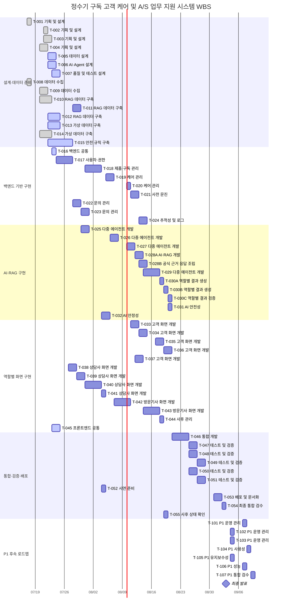

# 정수기 구독 고객 케어 및 A/S 업무 지원 시스템

## WBS (Work Breakdown Structure)

> 기획서, 화면설계서 통합본 v10, 요구사항정의서 83건 및 수집데이터보고서의 정합성을 반영한 WBS이다.
> 작성 기준일: 2026-07-23

## 목차

1. [프로젝트 일정 및 범위](#1-프로젝트-일정-및-범위)
2. [핵심 확정 사항](#2-핵심-확정-사항)
3. [주차별 목표](#3-주차별-목표)
4. [역할별 작업 배분](#4-역할별-작업-배분)
5. [진행 상태](#5-진행-상태)
6. [WBS 운영 기준](#6-wbs-운영-기준)
7. [통합 WBS 작업표](#7-통합-wbs-작업표)
8. [갠트차트](#8-갠트차트)
9. [코드 목록](#9-코드-목록)

# 1. 프로젝트 일정 및 범위

| 항목 | 내용 |
| --- | --- |
| 프로젝트 기간 | 2026-07-17 ~ 2026-09-03 |
| P0 실작업 완료일 | 2026-09-02 |
| 최종 발표 | 2026-09-03 — 별도 개발 작업 없이 발표만 진행 |
| P1 후속 로드맵 | 2026-09-04 ~ 2026-09-09 |
| 전체 작업 | 65개 |
| P0 작업 | 58개 / 85인일 |
| P1 작업 | 7개 / 3.5인일 |
| 전체 예상 공수 | 88.5인일 |
| 기본 MVP 제품 | `WPUJAC104DWH` / `WPU-JAC104D·WPU-JCC104D REV.00` |
| 후속 확장 제품 | `WPUIAC425SNW` / MVP 검색·화면에서 비노출 |
| 대표 시연 | `SYN-JAC104-002` · `DEMO-INQ-002` · 출수량 저하 · 매뉴얼 38쪽 |
| 현재 상태 | 기획·화면·데이터 정합성 반영 및 기반 구현 진행 중 |

# 2. 핵심 확정 사항

| 구분 | 확정 내용 |
| --- | --- |
| 모델 범위 | MVP는 `WPUJAC104DWH`로 고정하고 `WPUIAC425SNW`는 후속 확장으로 분리한다. `WPU-IAC506`은 `removed_legacy`로 처리하며 신규 DB·RAG·화면·시연에서 사용하지 않는다. |
| 대표 증상 | 출수량 저하, 물맛·냄새 이상, 제품 누수, 냉·온수 온도 이상 4종을 지원한다. |
| 역할 체계 | PM·기술 통합, 모바일 앱 개발, 웹 프론트엔드, 백엔드·데이터베이스, AI·RAG, 데이터·QA·DevOps의 6개 역할로 운영한다. |
| AI 실행 구조 | 단일 RAG 기준선과 선택형 책임 분리 구조를 동일 입력·출력 스키마로 비교한 뒤 최종 구조를 확정한다. |
| 사용 안내 필드 | `usage_guidance_status`, `usage_guidance_message`, `restricted_functions`, `evidence`, `next_action`, `requires_consultation`을 공통 필드로 사용한다. |
| 상태 관리 | `allowed_actions`, `state_version`, `idempotency_key`, `correlation_id`와 담당자 권한을 백엔드 State Machine에서 검증한다. |
| 완료 정책 | 자가조치 단독 해결은 즉시 `RESOLVED`, 상담·방문 경로는 `COMPLETION_PENDING` 후 담당자가 `FINALIZE_INQUIRY`한다. |
| 공식 근거 | RAG 결과, 근거 레지스트리와 문서 계보를 결합한 `EvidenceCardDTO`를 화면에 전달하며 내부 경로와 원문 전체는 노출하지 않는다. |
| 통합 개발 책임 | `T-046`은 백엔드·데이터베이스 담당자가 주도하고 모바일·웹·AI·QA·PM이 공동 협업한다. |
| 최종 패키지 순서 | `T-047`·`T-051` 테스트 완료 후 `T-053` 배포·문서화를 수행하고, `T-054` 최종 검수는 2026-09-02에 진행한다. |

# 3. 주차별 목표

| 주차 | 기간 | 주요 목표 |
| --- | --- | --- |
| 1주차 | 7/17 | 프로젝트 착수, P0·제외 범위와 MVP 모델·대표 증상 확정 |
| 2주차 | 7/20~7/24 | 서비스 흐름·역할·아키텍처·화면·데이터·안전 규칙 정합성 확정 |
| 3주차 | 7/27~7/31 | DB·State Machine·문서 전처리·평가 세트·합성 데이터 기반 구축 |
| 4주차 | 8/3~8/7 | Vector DB, 케어·문진·문의 기능 및 8/6 중간 발표 |
| 5주차 | 8/10~8/14 | 단일 RAG/선택형 책임 분리 비교, 위험 분류·Guard·Fallback·근거 DTO 구현 |
| 6주차 | 8/18~8/21 | 고객 모바일·상담사 웹·기사 리포트와 상담·방문 완료 정책 구현 |
| 7주차 | 8/24~8/28 | 고객→상담사→기사→고객 E2E 통합, 권한·상태·안전·성능 검증 |
| 8주차 | 8/31~9/3 | 9/2 제출물·배포·영상·리허설 완료, 9/3 최종 발표만 진행 |
| 후속 | 9/4~9/9 | P1 운영 대시보드·반응형·성능·유지보수 로드맵 |

# 4. 역할별 작업 배분

| 담당 역할 | 담당자 | 작업 수 | 예상 공수(인일) |
| --- | --- | ---: | ---: |
| PM·기술 통합 | 윤승혁 | 7 | 8.5 |
| 모바일 앱 개발 | 양정현 | 7 | 11 |
| 웹 프론트엔드 | 한예나 | 9 | 9.5 |
| 백엔드·데이터베이스 | 최지용 | 16 | 21 |
| AI·RAG | 이동윤 | 15 | 21 |
| 데이터·QA·DevOps | 김은진 | 11 | 17.5 |

# 5. 진행 상태

| 상태 | 작업 수 | 공수(인일) |
| --- | ---: | ---: |
| 완료 | 8 | 11.5 |
| 진행 중 | 8 | 11 |
| 미착수 | 49 | 66 |
| 보류 | 0 | 0 |
| 차단 | 0 | 0 |

# 6. WBS 운영 기준

| 구분 | 적용 기준 |
| --- | --- |
| P0 | 고객 → 상담사 → 방문기사 → 고객 후속 확인으로 이어지는 전체 흐름을 2026-09-02까지 완성한다. |
| P1 | 운영 대시보드, 반응형, 성능과 유지보수성은 2026-09-04 이후의 후속 로드맵으로 관리한다. |
| 작업 단위 | 각 작업은 0.5~2.0인일을 기본 단위로 하며 담당자·협업자·선행 작업·완료 기준을 함께 관리한다. |
| 제외 범위 | 실제 사내 시스템 API, 실제 기사 자동 배정·예약, 외부 알림 채널, 결제·해지·환불은 MVP에서 제외한다. |
| 데이터 | 실제 개인정보·상담·방문 기록 대신 가명·합성 데이터를 사용한다. |
| AI 안전 | 공식 근거 없는 자가조치, 제품 분해·직접 수리, 확정 진단을 금지하며 위험·근거 부족 시 상담 전환을 우선한다. |
| 근거 관리 | 완료·진행 작업은 근거 문서·산출물 경로를 `근거 문서·비고`에 기록한다. 실제 URL 또는 저장소 상대 경로가 확정되면 문서명과 함께 추가한다. |

# 7. 통합 WBS 작업표

> `진행률`은 상태에 따라 완료 100%, 진행 중 50%, 보류 25%, 미착수 0%로 표시한다.

## 7-1. 설계·데이터 준비

| Task ID | 우선순위 | 주요 업무 | 세부 업무 | 연계 요구사항 | 담당자·역할 | 협업·검수자 | 선행 Task | 기간 | 공수 | 상태 | 완료 기준 | 근거 문서·비고 |
| --- | --- | --- | --- | --- | --- | --- | --- | --- | --- | --- | --- | --- |
| `T-001` | P0 | 기획 및 설계 | 요구사항 정의서의 P0·P1·제외 범위를 검토하고 WBS 작성 기준과 요구사항 추적 방식을 확정한다. | 전체 요구사항, CR-001~CR-012 | 윤승혁 PM·기술 통합 | 관련 담당자 | - | 2026-07-17 | 1 | 완료 | MVP 포함·후순위·제외 항목이 구분되고 모든 작업이 요구사항 ID와 연결됨 | 기획서 · 요구사항정의서 · 화면설계서 |
| `T-002` | P0 | 기획 및 설계 | 고객 문의 접수부터 상담·방문·후속 확인·처리 완료까지 State Machine을 설계한다. START_CARE_PRECHECK, START_INQUIRY, SUBMIT_SYMPTOM, SAFE_GUIDANCE_READY, DANGER_DETECTED, NO_EVIDENCE, REQUEST_CONSULTATION, START_CONSULTATION, VISIT_NEEDED, UPDATE_VISIT_SCHEDULE, CONFIRM_VISIT, START_VISIT, VISIT_COMPLETED, SUBMIT_RESOLUTION_FEEDBACK, RESUME_CONSULTATION, FINALIZE_INQUIRY 등의 진입·가드·완료 조건을 정의한다. | FR-019~FR-021, FR-025~FR-026, FR-032~FR-034, FR-038, NFR-015, DR-012 | 윤승혁 PM·기술 통합 | 관련 담당자 | T-001 | 2026-07-21 | 1 | 완료 | 상태별 진입·완료 조건, 역할·담당자 권한, 현재 담당 주체, 다음 행동, 방문 일정과 자가 해결/상담·방문 완료 정책이 상태 전이도에 정의됨 | 기획서 · 요구사항정의서 · 화면설계서 |
| `T-003` | P0 | 기획 및 설계 | 고객·상담사·방문기사·운영 담당자의 역할별 화면, 조회 범위와 주요 사용 흐름을 정의한다. | FR-001, NFR-011, NFR-014~NFR-015 | 윤승혁 PM·기술 통합 | 관련 담당자 | T-001, T-002 | 2026-07-21 ~ 2026-07-22 | 1 | 완료 | 역할별 메뉴·화면·권한 매트릭스가 작성됨 | 기획서 · 요구사항정의서 · 화면설계서 |
| `T-004` | P0 | 기획 및 설계 | 모바일 앱·웹 프론트엔드·백엔드 API·관계형 DB·Vector DB·AI/RAG·공식 근거 레지스트리 간 전체 시스템 아키텍처와 API 경계를 설계한다. | NFR-006, NFR-009, NFR-017 | 윤승혁 PM·기술 통합 | 관련 담당자 | T-001, T-002 | 2026-07-20 ~ 2026-07-21 | 2 | 완료 | 구성도, 모듈 책임과 주요 API 목록이 확정됨 | 기획서 · 요구사항정의서 · 화면설계서 |
| `T-005` | P0 | 데이터 설계 | 사용자·구독·제품·케어·문진·문의·상담·방문·상태 이력에 현재 사용 안내 상태, 판단 근거, 적용 출수·기능 범위, 현재 담당 주체, 고객 행동 필요 여부, 방문 희망일, 방문 확정일과 일정 상태를 추가하여 ERD와 표준 코드 구조를 설계한다. | FR-026, FR-032, FR-038, NFR-015, DR-001~DR-007, DR-010~DR-012, DR-014~DR-015 | 최지용 백엔드·데이터베이스 | 윤승혁 · 김은진 | T-002, T-004 | 2026-07-22 ~ 2026-07-23 | 2 | 진행 중 | 사용 안내 상태와 방문 일정 상태를 포함한 테이블·필드·표준 코드가 정의됨 | 기획서 · 요구사항정의서 · 화면설계서 |
| `T-006` | P0 | AI·Agent 설계 | AI·RAG 단계 간 공통 상태 객체와 표준 JSON 스키마를 정의한다. 현재 사용 안내 필드는 usage_guidance_status, usage_guidance_message를 사용하고 restricted_functions, evidence, next_action, requires_consultation을 포함한다. | NFR-005~NFR-006, DR-007, DR-009 | 이동윤 AI·RAG | 최지용 · 김은진 | T-004, T-005 | 2026-07-22 ~ 2026-07-23 | 1.5 | 진행 중 | usage_guidance_status, usage_guidance_message, restricted_functions, evidence, next_action, requires_consultation과 누락·재생성 규칙이 확정되고 위험도는 general/caution/danger로 통일됨 | 기획서 · 요구사항정의서 · 화면설계서 |
| `T-007` | P0 | 품질 및 테스트 설계 | P0 기능·AI·RAG·안전성·State Machine·권한·중복 요청·EvidenceCardDTO 비노출 항목에 대한 테스트 기준과 데이터 분할, 인수 기준을 설계한다. | NFR-001~NFR-007, NFR-009~NFR-010, NFR-014~NFR-015, NFR-017 | 김은진 데이터·QA·DevOps | 윤승혁 | T-001~T-006 | 2026-07-23 ~ 2026-07-24 | 1 | 진행 중 | 4개 사용 안내 상태와 문의 진행 상태별 정답·인수 기준이 정의됨 | 기획서 · 요구사항정의서 · 화면설계서 |
| `T-008` | P0 | 데이터 수집 | 기본 MVP 제품을 WPUJAC104DWH(매뉴얼 적용 모델 WPU-JAC104D·WPU-JCC104D REV.00)로 고정하고, 후속 확장 WPUIAC425SNW는 MVP 검색·화면에서 제외한다. 대표 증상은 출수량 저하, 물맛·냄새 이상, 제품 누수, 냉·온수 온도 이상 4종으로 확정한다. | CR-002~CR-003, CR-009, CR-012 | 김은진 데이터·QA·DevOps | 이동윤 · 윤승혁 | T-001 | 2026-07-17 | 1 | 완료 | MVP·확장 모델과 4개 증상이 확정되고 WPU-IAC506 removed_legacy, JAC104 S세대 혼용 금지, 대표 E2E SYN-JAC104-002/DEMO-INQ-002/매뉴얼 38쪽이 문서화됨 | 기획서 · 요구사항정의서 · 화면설계서 |
| `T-009` | P0 | 데이터 수집 | WPU-JAC104D·WPU-JCC104D REV.00 공식 매뉴얼, 조건부 공식 FAQ와 관리 기준 자료를 수집하고 출처·버전·페이지·해시·제품 세대 메타데이터를 정리한다. | FR-015, DR-008, CR-009 | 김은진 데이터·QA·DevOps | 이동윤 · 윤승혁 | T-008 | 2026-07-20 ~ 2026-07-21 | 2 | 완료 | 원문 파일과 문서 메타데이터 목록이 준비됨 | 수집데이터보고서 · 기획서 6장 · 화면설계서 1~3장 |
| `T-010` | P0 | RAG 데이터 구축 | 공식 매뉴얼을 제품·증상·페이지 기준으로 정제·분할하고 모델·세대·적용성·사용 정책 메타데이터를 부여한다. D세대와 S세대, MVP와 후속 확장 데이터를 물리적으로 분리한다. | FR-015, DR-008 | 김은진 데이터·QA·DevOps | 이동윤 · 윤승혁 | T-009 | 2026-07-20 ~ 2026-07-22 | 1.5 | 완료 | 중복·불필요 구간이 제거된 청크 데이터가 생성됨 | 수집데이터보고서 · 기획서 6장 · 화면설계서 1~3장 |
| `T-011` | P0 | RAG 데이터 구축 | 임베딩 생성, Vector DB 인덱스 구성과 제품 모델·증상 필터 기반 검색 파이프라인을 구현한다. | FR-015, NFR-001~NFR-002, DR-008~DR-009 | 이동윤 AI·RAG | 김은진 | T-010 | 2026-07-28 ~ 2026-07-29 | 2 | 미착수 | 질의 시 관련 청크·문서명·페이지가 반환됨 | 수집데이터보고서 · 기획서 6장 · 화면설계서 1~3장 |
| `T-012` | P0 | RAG 데이터 구축 | 대표 증상별 정답 문서·페이지와 Top-k 검색 평가 세트를 구축하고, 미검증 FAQ 단독 검색과 제품·세대 불일치 검색이 차단되는지 검증한다. | FR-015, NFR-005, DR-009 | 김은진 데이터·QA·DevOps | 이동윤 · 윤승혁 | T-011 | 2026-07-22 ~ 2026-07-24 | 1 | 진행 중 | 증상별 정답 구간과 Top-k 평가용 데이터가 준비됨 | 수집데이터보고서 · 기획서 6장 · 화면설계서 1~3장 |
| `T-013` | P0 | 가상 데이터 구축 | 가상 사용자·구독 제품·관리 유형·필터 교체·살균·세척·다음 케어 일정 데이터를 생성한다. | FR-002~FR-007, FR-016, DR-002~DR-005, CR-008 | 김은진 데이터·QA·DevOps | 이동윤 · 윤승혁 | T-005, T-008 | 2026-07-22 ~ 2026-07-24 | 1.5 | 진행 중 | 역할별 계정과 대표 구독·케어 이력이 DB에 적재 가능함 | 수집데이터보고서 · 기획서 6장 · 화면설계서 1~3장 |
| `T-014` | P0 | 가상 데이터 구축 | WPUJAC104DWH 합성 문의 6건을 생성하고 각 시나리오에 공식 근거, 기대 위험도, usage_guidance_status, 상담·방문·완료 이벤트와 해결 여부를 연결한다. | FR-008~FR-034, FR-038, DR-006~DR-012, CR-008 | 김은진 데이터·QA·DevOps | 이동윤 · 윤승혁 | T-002, T-008, T-013 | 2026-07-20 ~ 2026-07-22 | 2 | 완료 | 사용 안내부터 상담·방문·후속 해결 확인까지 P0 전체 흐름을 재현할 시나리오가 준비됨 | 수집데이터보고서 · 기획서 6장 · 화면설계서 1~3장 |
| `T-015` | P0 | 안전 규칙 구축 | 누수·전기·화상·온수 모듈 경고와 근거 부재에 대해 일반 사용 가능, 일부 출수·기능 사용 중지, 제품 전체 사용 중지, 판단 보류·상담 필요로 분기하는 규칙·금지 행동·고객 문구를 정의한다. | FR-013, FR-018~FR-019, FR-038, NFR-001~NFR-004, CR-010~CR-011 | 이동윤 AI·RAG | 김은진 · 윤승혁 | T-008, T-009 | 2026-07-22 ~ 2026-07-27 | 1.5 | 진행 중 | 위험·근거 조건별 사용 안내 상태, 제한 범위와 고객의 다음 행동이 규칙표로 확정됨 | 수집데이터보고서 · 기획서 6장 · 화면설계서 1~3장 |

## 7-2. 백엔드 기반 구현

| Task ID | 우선순위 | 주요 업무 | 세부 업무 | 연계 요구사항 | 담당자·역할 | 협업·검수자 | 선행 Task | 기간 | 공수 | 상태 | 완료 기준 | 근거 문서·비고 |
| --- | --- | --- | --- | --- | --- | --- | --- | --- | --- | --- | --- | --- |
| `T-016` | P0 | 백엔드 공통 | 백엔드 프로젝트 구조, 환경변수, 공통 응답·예외 처리와 개발 환경을 구성한다. | NFR-009, NFR-017 | 최지용 백엔드·데이터베이스 | 김은진 | T-004 | 2026-07-23 | 1 | 진행 중 | 로컬 환경에서 서버 실행과 공통 오류 응답이 확인됨 | 요구사항정의서 · 화면설계서 State Machine/데이터 계약 |
| `T-017` | P0 | 사용자·권한 | 가상 로그인과 역할 기반 접근 제어를 구현하여 역할별 API와 데이터 조회 범위를 제한한다. | FR-001, NFR-011~NFR-012, DR-001~DR-002 | 최지용 백엔드·데이터베이스 | 김은진 | T-005, T-016 | 2026-07-24 ~ 2026-07-27 | 1.5 | 미착수 | 고객은 본인 데이터, 기사는 배정 건만 접근 가능함 | 요구사항정의서 · 화면설계서 State Machine/데이터 계약 |
| `T-018` | P0 | 제품·구독 관리 | 구독 제품 조회·등록·수정 API와 제품 선택 기능을 구현한다. | FR-002~FR-003, DR-003 | 최지용 백엔드·데이터베이스 | 김은진 | T-005, T-016, T-017 | 2026-07-31 ~ 2026-08-03 | 1.5 | 미착수 | 제품 모델·사용 시작일·관리 유형·최근 관리일이 저장·조회됨 | 요구사항정의서 · 화면설계서 State Machine/데이터 계약 |
| `T-019` | P0 | 케어 관리 | 필터·카트리지 교체와 살균·세척 등 케어 이력 등록·조회 기능을 구현한다. | FR-016, FR-030, DR-004 | 최지용 백엔드·데이터베이스 | 김은진 | T-018 | 2026-08-05 ~ 2026-08-06 | 1.5 | 미착수 | 케어 이력이 구독·제품 기준으로 누적·조회됨 | 요구사항정의서 · 화면설계서 State Machine/데이터 계약 |
| `T-020` | P0 | 케어 관리 | 공식 관리 주기와 최근 케어 이력을 이용한 다음 케어 예정일 산정·갱신 로직을 구현한다. | FR-004~FR-005, FR-031, CR-012 | 최지용 백엔드·데이터베이스 | 김은진 | T-009, T-019 | 2026-08-10 | 1 | 미착수 | 근거 부재 시 확인 필요 처리와 일정 변경 이력이 동작함 | 요구사항정의서 · 화면설계서 State Machine/데이터 계약 |
| `T-021` | P0 | 사전 문진 | START_CARE_PRECHECK 시 Inquiry 없이 QuestionnaireSession을 생성하고 CARE_PRECHECK 문진의 미응답·작성 중·제출 완료 상태를 관리한다. 증상 상담이 필요할 때 새 inquiry_id와 연결한다. | FR-006~FR-007, DR-005 | 최지용 백엔드·데이터베이스 | 김은진 | T-005, T-016, T-020 | 2026-08-11 ~ 2026-08-12 | 1.5 | 미착수 | 문의 없는 사전 문진 생성·임시 저장·제출과 이후 inquiry_id 연결이 정상 동작함 | 요구사항정의서 · 화면설계서 State Machine/데이터 계약 |
| `T-022` | P0 | 문의 관리 | START_INQUIRY로 Inquiry를 DRAFT 상태로 생성하고 자연어 증상·대표 증상·추가 답변·자가조치 결과를 동일 inquiry_id에 누적한다. SUBMIT_SYMPTOM 시 QUESTIONNAIRE_IN_PROGRESS로 전환한다. | FR-008~FR-011, FR-020, DR-001, DR-006 | 최지용 백엔드·데이터베이스 | 김은진 | T-005, T-016, T-017 | 2026-07-28 ~ 2026-07-29 | 1.5 | 미착수 | 신규 문의 생성과 동일 inquiry_id 누적 저장이 동작하고 미지원 제품·필수값 누락·차단 모델은 PRODUCT_VALIDATION_FAILED로 AI·RAG 실행이 차단됨 | 요구사항정의서 · 화면설계서 State Machine/데이터 계약 |
| `T-023` | P0 | 문의 관리 | 백엔드 State Machine 이벤트 API를 구현한다. allowed_actions 반환, 역할·담당자 권한, state_version 동시 수정 방지, idempotency_key 중복 요청 방지, correlation_id 추적과 COMPLETION_PENDING·REOPENED·FINALIZE_INQUIRY 전이를 포함한다. | FR-021, FR-025~FR-026, FR-032~FR-034, NFR-015, DR-012, DR-014~DR-015 | 최지용 백엔드·데이터베이스 | 김은진 | T-002, T-005, T-016, T-022 | 2026-07-30 ~ 2026-07-31 | 1.5 | 미착수 | 허용된 상태·역할·담당자·state_version에서만 전이가 수행되고 중복 요청·동시 수정이 차단되며 담당 주체·고객 행동·방문 일정·완료 주체 이력이 저장됨 | 요구사항정의서 · 화면설계서 State Machine/데이터 계약 |
| `T-024` | P0 | 추적성 및 로그 | AI 호출, 검색 근거, 생성 결과, 모델 정보, 주요 사용자 행위와 오류 로그 저장을 구현한다. | NFR-013, NFR-017, DR-009 | 최지용 백엔드·데이터베이스 | 김은진 | T-016, T-023 | 2026-08-13 ~ 2026-08-14 | 1 | 미착수 | 문의별 AI·RAG·상태 변경 이력을 재현할 수 있음 | 요구사항정의서 · 화면설계서 State Machine/데이터 계약 |

## 7-3. AI·RAG 구현

| Task ID | 우선순위 | 주요 업무 | 세부 업무 | 연계 요구사항 | 담당자·역할 | 협업·검수자 | 선행 Task | 기간 | 공수 | 상태 | 완료 기준 | 근거 문서·비고 |
| --- | --- | --- | --- | --- | --- | --- | --- | --- | --- | --- | --- | --- |
| `T-025` | P0 | 다중 에이전트 개발 | 단일 RAG 기준선과 선택형 책임 분리 구조를 동일 입력·출력 스키마로 비교한 뒤, 문의 상태와 역할에 따라 필요한 구조화·검색·안내·인계 모듈만 호출하는 오케스트레이터를 구현한다. | FR-010~FR-019, FR-022, FR-027, NFR-005~NFR-006 | 이동윤 AI·RAG | 김은진 · 최지용 | T-006, T-015, T-023 | 2026-07-30 ~ 2026-07-31 | 2 | 미착수 | 기준선과 제안안 비교 결과가 기록되고 최종 실행 구조에서 일반·위험·상담·방문 흐름이 조건별로 분기됨 | 기획서 5장 · 화면설계서 AI/RAG·EvidenceCardDTO |
| `T-026` | P0 | 다중 에이전트 개발 | 누락 정보 추가 질문, 답변 중복 방지와 표준 증상 구조화를 수행하는 증상 확인·분류 Agent를 구현한다. | FR-010~FR-012, NFR-014, DR-007, DR-015 | 이동윤 AI·RAG | 김은진 · 최지용 | T-006, T-025 | 2026-08-06 ~ 2026-08-07 | 2 | 미착수 | 필수 항목 추출과 미확인 항목 질문이 JSON으로 반환됨 | 기획서 5장 · 화면설계서 AI/RAG·EvidenceCardDTO |
| `T-027` | P0 | 다중 에이전트 개발 | 안전 규칙과 구조화 증상을 결합해 위험도·처리 우선순위와 현재 사용 안내 상태, 제한되는 출수·기능 범위를 분류하는 로직을 구현한다. | FR-013~FR-014, FR-019, FR-038, NFR-001~NFR-002, NFR-004, DR-007, DR-015 | 이동윤 AI·RAG | 김은진 · 최지용 | T-015, T-026 | 2026-08-10 ~ 2026-08-11 | 1.5 | 미착수 | 일반·주의·위험 분류와 4개 사용 안내 상태가 규칙에 따라 일관되게 반환됨 | 기획서 5장 · 화면설계서 AI/RAG·EvidenceCardDTO |
| `T-028A` | P0 | AI·RAG 개발 | 제품 모델·증상·구독·케어 이력을 조회하고 모델·세대 메타데이터 필터를 적용하여 공식 문서 근거와 고객별 관리 이력을 반환하는 지식·이력 조회 모듈을 구현한다. | FR-015~FR-016, DR-004, DR-008~DR-009 | 이동윤 AI·RAG | 김은진 · 최지용 | T-011, T-019, T-026 | 2026-08-12 ~ 2026-08-13 | 1.5 | 미착수 | WPUJAC104DWH와 WPU-JAC104D D세대에 일치하는 검증 근거·페이지·관리 이력이 하나의 구조화 출력으로 반환되고 미검증 FAQ 단독 사용이 차단됨 | 기획서 5장 · 화면설계서 AI/RAG·EvidenceCardDTO |
| `T-028B` | P0 | 공식 근거 응답 조립 | RAG 검색 결과, jac104_evidence_registry.jsonl, 문서 메타데이터와 model_document_lineage.csv를 결합하여 EvidenceCardDTO를 생성하는 백엔드 조립 로직을 구현한다. source_path·ManualPage.text·retrieval_text는 화면 응답에서 제외한다. | FR-015~FR-019, NFR-001~NFR-002, DR-008~DR-009 | 최지용 백엔드·데이터베이스 | 이동윤 · 김은진 | T-005, T-011, T-028A | 2026-08-13 ~ 2026-08-14 | 1 | 미착수 | 검증된 모델·세대·페이지·사용 정책을 만족한 근거만 고객·상담사·기사 화면에 전달되고, 고객 화면의 chunk_id와 내부 경로·원문 전체가 숨겨짐 | 기획서 5장 · 화면설계서 AI/RAG·EvidenceCardDTO |
| `T-029` | P0 | 다중 에이전트 개발 | 증상·이력·근거를 종합하여 점검 후보와 자가조치에 앞서 현재 사용 안내 상태, 제한 범위, 판단 근거와 고객의 다음 행동을 생성하는 대응 분석 Agent를 구현한다. | FR-017~FR-019, FR-038, NFR-001~NFR-003 | 이동윤 AI·RAG | 김은진 · 최지용 | T-027, T-028A, T-028B | 2026-08-14 ~ 2026-08-17 | 2 | 미착수 | 확정 진단 없이 근거가 있는 사용 안내 상태와 안전한 다음 행동이 생성됨 | 기획서 5장 · 화면설계서 AI/RAG·EvidenceCardDTO |
| `T-030A` | P0 | 역할별 결과 생성 | 제품·문진·고객 원문·추가 답변·조치 결과·공식 근거·상태 이력을 이용하여 고정 스키마의 상담용 AI 요약 초안을 생성하고 상담사 수정·확정본을 별도로 저장한다. | FR-022~FR-024, NFR-001~NFR-006, DR-010 | 이동윤 AI·RAG | 김은진 · 윤승혁 | T-023, T-029 | 2026-08-18 | 1 | 미착수 | 상담 요약 필수 필드가 충족되고 AI 초안과 상담사 수정·확정본이 구분되어 저장됨 | 기획서 5장 · 화면설계서 AI/RAG·EvidenceCardDTO |
| `T-030B` | P0 | 역할별 결과 생성 | 상담사 확정 요약, 제품·관리 이력, 위험도와 공식 근거를 이용하여 방문기사용 사전 점검 리포트 초안을 생성하고 기사 수정·확정본을 별도로 저장한다. | FR-027~FR-029, NFR-001~NFR-006, DR-011 | 이동윤 AI·RAG | 김은진 · 윤승혁 | T-019, T-030A | 2026-08-19 | 1 | 미착수 | 상담사 확정 내용과 관리 이력이 기사 리포트에 반영되고 AI 초안과 기사 확정본이 구분됨 | 기획서 5장 · 화면설계서 AI/RAG·EvidenceCardDTO |
| `T-030C` | P0 | 역할별 결과 검증 | 고객 안내·상담 요약·기사 리포트의 핵심 사실, 위험도, 현재 사용 안내, 공식 근거와 금지 행동이 서로 모순되지 않는지 검증한다. | NFR-001~NFR-006, DR-009~DR-011 | 이동윤 AI·RAG | 김은진 · 윤승혁 | T-015, T-030A, T-030B | 2026-08-20 | 0.5 | 미착수 | 역할별 결과는 표현만 다르고 제품·증상·위험도·근거·다음 행동의 핵심 사실이 일치함 | 기획서 5장 · 화면설계서 AI/RAG·EvidenceCardDTO |
| `T-031` | P0 | AI 안전성 | 공식 근거 미검색, 모델·세대 불일치 또는 검증 실패 시 임의 사용 가능 판정과 자가조치를 차단하고 usage_guidance_status를 판단 보류·상담 필요로 설정한다. | FR-038, NFR-002, NFR-009 | 이동윤 AI·RAG | 김은진 · 최지용 | T-015, T-028A | 2026-08-20 | 1 | 미착수 | 근거 부재 시 사용 가능 판정이나 임의 조치 없이 판단 보류와 상담 안내가 출력됨 | 기획서 5장 · 화면설계서 AI/RAG·EvidenceCardDTO |
| `T-032` | P0 | AI 안정성 | AI·검색 타임아웃, 재시도, 오류 기록과 사용자 재시도·상담 전환 안내를 구현한다. | NFR-007, NFR-009 | 이동윤 AI·RAG | 김은진 · 최지용 | T-016, T-025 | 2026-08-04 ~ 2026-08-05 | 1.5 | 미착수 | 실패 시 무응답 없이 오류 안내와 대체 흐름이 동작함 | 기획서 5장 · 화면설계서 AI/RAG·EvidenceCardDTO |

## 7-4. 역할별 화면 구현

| Task ID | 우선순위 | 주요 업무 | 세부 업무 | 연계 요구사항 | 담당자·역할 | 협업·검수자 | 선행 Task | 기간 | 공수 | 상태 | 완료 기준 | 근거 문서·비고 |
| --- | --- | --- | --- | --- | --- | --- | --- | --- | --- | --- | --- | --- |
| `T-033` | P0 | 고객 화면 개발 | 구독 제품 정보, 관리 유형, 최근 케어 이력과 다음 케어 일정을 조회하고, 관리 예정일 도래 시 웹 알림을 표시하는 고객 화면을 구현한다. | FR-002~FR-005, FR-016 | 양정현 모바일 앱 개발 | 최지용 · 윤승혁 | T-018, T-020, T-045 | 2026-08-11 ~ 2026-08-12 | 1.5 | 미착수 | 고객이 문의 대상 제품과 케어 상태를 한 화면에서 확인함 | 화면설계서 고객·상담사·방문기사 화면 |
| `T-034` | P0 | 고객 화면 개발 | 사전 문진 응답과 자연어 증상·대표 증상 입력 화면을 구현한다. | FR-006~FR-009 | 양정현 모바일 앱 개발 | 최지용 · 윤승혁 | T-021, T-022, T-045 | 2026-08-13 ~ 2026-08-14 | 2 | 미착수 | 문진 제출과 신규 문의 접수가 정상 저장됨 | 화면설계서 고객·상담사·방문기사 화면 |
| `T-035` | P0 | 고객 화면 개발 | AI 추가 질문, 고객 답변 입력, 구조화된 확인 정보와 위험도 안내 화면을 구현한다. | FR-010~FR-014 | 양정현 모바일 앱 개발 | 최지용 · 윤승혁 | T-026, T-034 | 2026-08-17 ~ 2026-08-18 | 2 | 미착수 | 이미 답한 항목은 반복되지 않고 다음 질문이 표시됨 | 화면설계서 고객·상담사·방문기사 화면 |
| `T-036` | P0 | 고객 화면 개발 | 고객 화면 상단에 현재 사용 안내 상태, 제한되는 출수·기능, 판단 근거와 다음 행동을 우선 표시하고, 그 아래에 점검 후보·안전한 자가조치·수행 결과 입력과 상담 요청 기능을 제공한다. | FR-017~FR-021, FR-038, NFR-001~NFR-004 | 양정현 모바일 앱 개발 | 최지용 · 윤승혁 | T-027, T-029, T-035 | 2026-08-19 ~ 2026-08-20 | 1.5 | 미착수 | 고객이 자가조치 전에 현재 사용 가능 범위와 필요한 다음 행동을 명확히 확인할 수 있음 | 화면설계서 고객·상담사·방문기사 화면 |
| `T-037` | P0 | 고객 화면 개발 | 고객 문의 상세에서 현재 상태, 담당 주체, 다음 처리 단계, 고객 행동, 방문 희망·확정일과 일정 상태를 표시한다. 자가조치 단독 해결은 즉시 RESOLVED, 상담·방문 경로는 COMPLETION_PENDING에서 고객 피드백 후 담당 상담사·기사가 FINALIZE_INQUIRY하도록 연결한다. | FR-026, FR-032~FR-034, NFR-015 | 양정현 모바일 앱 개발 | 최지용 · 윤승혁 | T-023, T-045 | 2026-08-12 ~ 2026-08-13 | 1 | 미착수 | 고객이 현재 처리 주체·일정·다음 행동을 확인하고, 자가 해결과 상담·방문 후속 해결의 서로 다른 완료 정책이 동작함 | 화면설계서 고객·상담사·방문기사 화면 |
| `T-038` | P0 | 상담사 화면 개발 | 상담 대기 문의 목록, 위험도·우선순위 정렬과 검색 화면을 구현한다. | FR-023, NFR-014 | 한예나 웹 프론트엔드 | 최지용 · 윤승혁 | T-023, T-045 | 2026-07-27 ~ 2026-07-28 | 1.5 | 미착수 | 우선 상담 건이 상단 노출되고 문의 선택이 가능함 | 화면설계서 고객·상담사·방문기사 화면 |
| `T-039` | P0 | 상담사 화면 개발 | 제품·구독·문진·증상·조치·원문 답변·공식 근거·상태 이력을 통합 조회하는 상세 화면을 구현한다. | FR-022~FR-023, NFR-001, NFR-014 | 한예나 웹 프론트엔드 | 최지용 · 윤승혁 | T-030A, T-038 | 2026-07-29 ~ 2026-07-30 | 2 | 미착수 | 고객이 제공한 정보와 상담 요약을 한 화면에서 확인함 | 화면설계서 고객·상담사·방문기사 화면 |
| `T-040` | P0 | 상담사 화면 개발 | 추가 확인사항·안내 내용·상담 결과를 등록하고, CONSULTATION_COMPLETED 시 COMPLETION_PENDING, 방문 필요 시 VISIT_REVIEW_PENDING으로 전환한다. 상담 요약 AI 초안을 수정·확정한다. | FR-024~FR-025, DR-001, DR-010 | 한예나 웹 프론트엔드 | 최지용 · 윤승혁 | T-023, T-039 | 2026-07-31 ~ 2026-08-03 | 1.5 | 미착수 | 상담 결과 저장과 방문 예정 상태 전환이 가능함 | 화면설계서 고객·상담사·방문기사 화면 |
| `T-041` | P0 | 상담사 화면 개발 | 고객 방문 희망일, 가상 담당 기사, 방문 일정 상태와 가상 방문 확정일을 등록·변경하는 기능을 구현한다. | FR-026, CR-005 | 한예나 웹 프론트엔드 | 최지용 · 윤승혁 | T-023, T-040 | 2026-08-04 | 1 | 미착수 | 방문 희망일과 확정일이 구분되고 기사 배정 중, 일정 조율 중, 방문 확정 상태가 문의에 저장됨 | 화면설계서 고객·상담사·방문기사 화면 |
| `T-042` | P0 | 방문기사 화면 개발 | 배정된 가상 방문 목록과 방문기사용 사전 점검 리포트·공식 근거 조회 화면을 구현한다. | FR-027~FR-028, NFR-014 | 양정현 모바일 앱 개발 | 최지용 · 이동윤 | T-030B, T-041, T-045 | 2026-08-07 ~ 2026-08-10 | 1.5 | 미착수 | 기사가 고객 답변·상담 내용·우선 점검 항목을 확인함 | 화면설계서 고객·상담사·방문기사 화면 |
| `T-043` | P0 | 방문기사 화면 개발 | 점검 결과·확인 원인·수행 조치·교체 항목·처리 상태를 등록하고 필수값을 검증한다. VISIT_COMPLETED 후 Inquiry를 COMPLETION_PENDING으로 전환하며 기사가 확정 리포트를 저장한다. | FR-029, DR-001, DR-011, DR-014~DR-015 | 양정현 모바일 앱 개발 | 최지용 · 이동윤 | T-023, T-042 | 2026-08-14 ~ 2026-08-17 | 1.5 | 미착수 | 필수값 누락 시 완료가 차단되고 결과가 저장됨 | 화면설계서 고객·상담사·방문기사 화면 |
| `T-044` | P0 | 사후 관리 | 방문 결과를 케어 이력에 반영하고 다음 케어 예정일을 갱신하는 연계 처리를 구현한다. | FR-030~FR-031, NFR-010, DR-004, DR-011 | 최지용 백엔드·데이터베이스 | 양정현 · 김은진 | T-019, T-043 | 2026-08-18 | 1 | 미착수 | 중복 저장 없이 케어 이력과 다음 일정이 갱신됨 | 화면설계서 고객·상담사·방문기사 화면 |
| `T-045` | P0 | 프론트엔드 공통 | 공통 레이아웃·상태 배지·근거 표시·오류 안내 컴포넌트와 역할 기반 라우팅을 구현한다. | FR-001, NFR-001, NFR-009, NFR-011, NFR-015 | 한예나 웹 프론트엔드 | 양정현 · 윤승혁 | T-003, T-004 | 2026-07-23 ~ 2026-07-24 | 1.5 | 진행 중 | 역할별 화면 이동과 공통 UI 표현이 일관되게 동작함 | 화면설계서 고객·상담사·방문기사 화면 |

## 7-5. 통합·검증·배포

| Task ID | 우선순위 | 주요 업무 | 세부 업무 | 연계 요구사항 | 담당자·역할 | 협업·검수자 | 선행 Task | 기간 | 공수 | 상태 | 완료 기준 | 근거 문서·비고 |
| --- | --- | --- | --- | --- | --- | --- | --- | --- | --- | --- | --- | --- |
| `T-046` | P0 | 통합 개발 | 고객→상담사→방문기사 전 과정의 프론트엔드·백엔드·Agent·DB API를 연결한다. | P0 기능 요구사항 전체 | 최지용 백엔드·데이터베이스 | 양정현 · 한예나 · 윤승혁 · 이동윤 · 김은진 | T-025, T-033, T-038, T-042, T-044 | 2026-08-21 ~ 2026-08-24 | 2 | 미착수 | 대표 시나리오가 화면 간 데이터 손실 없이 끝까지 실행됨 | 기획서 5-5 · 요구사항정의서 · 화면설계서 E2E |
| `T-047` | P0 | 테스트 및 검증 | 사용자·제품·문진·문의·상담·방문 API와 State Machine의 정상·예외·권한·allowed_actions·state_version·idempotency_key·correlation_id 테스트를 작성한다. | FR-001~FR-034, FR-038, DR-001~DR-012, DR-014~DR-015 | 최지용 백엔드·데이터베이스 | 김은진 | T-016~T-024, T-044 | 2026-08-25 ~ 2026-08-26 | 2 | 미착수 | 사용 안내 상태 저장·조회, 방문 희망일·확정일 구분, 후속 해결 입력과 문의 재개를 포함한 핵심 API 정상·예외·권한 테스트가 통과함 | 기획서 5-5 · 요구사항정의서 · 화면설계서 E2E |
| `T-048` | P0 | 테스트 및 검증 | API·AI·RAG·안전성·권한·성능·상태 전환·EvidenceCardDTO 비노출·문서 링크 Fallback 결과를 취합하여 서비스 테스트 계획 및 결과 보고서를 작성한다. | FR-001~FR-034, FR-038, NFR-001~NFR-007, NFR-009~NFR-015, NFR-017, DR-001~DR-012, DR-014~DR-015 | 김은진 데이터·QA·DevOps | 전 팀원 | T-047, T-049~T-051 | 2026-08-25 ~ 2026-08-26 | 2 | 미착수 | 테스트 범위·환경·결과, 사용 안내 상태·근거 일치성·상태 가시성·문의 재개 결과와 미해결 이슈가 제출 가능한 형태로 정리됨 | 기획서 5-5 · 요구사항정의서 · 화면설계서 E2E |
| `T-049` | P0 | 테스트 및 검증 | 누수·전기·화상·온수 경고·근거 부재·확정 진단, JAC104 D/S 혼용, IAC425 MVP 노출, IAC506 사용과 미검증 FAQ 단독 답변을 차단하는 안전성 테스트를 수행한다. | FR-038, NFR-001~NFR-004, CR-010~CR-011 | 이동윤 AI·RAG | 김은진 | T-015, T-027, T-031 | 2026-08-27 ~ 2026-08-28 | 1.5 | 미착수 | 위험 시나리오에서 잘못된 사용 가능 판정, 일부 사용 중지 범위 오류와 판단 보류 누락이 없음 | 기획서 5-5 · 요구사항정의서 · 화면설계서 E2E |
| `T-050` | P0 | 테스트 및 검증 | 역할별 화면의 allowed_actions와 실제 버튼 일치, 반복 질문 방지, 담당자 권한, 방문 일정, 자가 해결/COMPLETION_PENDING/문의 재개 정책과 AI 초안·담당자 확정본 표시를 검증한다. | FR-026, FR-032~FR-033, NFR-011~NFR-015, DR-014 | 김은진 데이터·QA·DevOps | 양정현 · 한예나 · 최지용 · 이동윤 | T-033~T-043 | 2026-08-25 ~ 2026-08-26 | 1.5 | 미착수 | 담당 주체·고객 행동·방문 일정·완료 대기·문의 재개 정보가 누락 없이 표시되고 상태 전환이 정상 동작함 | 기획서 5-5 · 요구사항정의서 · 화면설계서 E2E |
| `T-051` | P0 | 테스트 및 검증 | AI p95 10초, 일반 API 안정성, 동일 idempotency_key 재전송, state_version 충돌, AI·검색 타임아웃·재시도·상담 Fallback과 correlation_id 로그 연결을 검증한다. | NFR-007, NFR-009~NFR-010 | 김은진 데이터·QA·DevOps | 양정현 · 한예나 · 최지용 · 이동윤 | T-024, T-032, T-046 | 2026-08-27 ~ 2026-08-28 | 2 | 미착수 | 성능 측정 결과와 장애·중복 요청 테스트가 기록됨 | 기획서 5-5 · 요구사항정의서 · 화면설계서 E2E |
| `T-052` | P0 | 시연 준비 | 대표 시연을 WPUJAC104DWH / SYN-JAC104-002 / DEMO-INQ-002 / 출수량 저하 / 매뉴얼 REV.00 38쪽으로 고정하고 문진→구조화→위험 판정→공식 검색→자가확인→상담→방문→후속 확인 Seed·초기화 스크립트·대본을 구성한다. | P0 핵심 시연 시나리오, FR-006~FR-032, FR-038 | 윤승혁 PM·기술 통합 | 김은진 · 전 팀원 | T-014, T-046 | 2026-08-04 | 1 | 미착수 | 8/6 중간 발표와 9/3 최종 발표에서 현재 사용 안내부터 고객→상담사→방문기사→고객 후속 확인 흐름이 동일하게 재현됨 | 기획서 5-5 · 요구사항정의서 · 화면설계서 E2E |
| `T-053` | P0 | 배포 및 문서화 | Docker 실행 환경, 환경변수·비밀키 분리, DB·Vector DB 초기화, 확정 배포 환경 배포, 모바일·웹·백엔드·AI 연동, 시연 초기화 스크립트, Git 원본 PDF 제외와 Smoke Test를 완료하고 README·실행 문서·시연영상을 정리한다. | NFR-009, NFR-017 | 김은진 데이터·QA·DevOps | 윤승혁 · 전 개발 담당 | T-046, T-047, T-051 | 2026-08-31 ~ 2026-09-01 | 2 | 미착수 | 배포 주소에서 대표 시연이 재현되고 소스·환경설정 예시·초기화 절차·시연영상·Smoke Test 결과가 제출 가능함 | 기획서 5-5 · 요구사항정의서 · 화면설계서 E2E |
| `T-054` | P0 | 최종 통합 검수 | P0 요구사항 추적표와 대표 E2E를 기준으로 모바일·웹·백엔드·AI·RAG·데이터·배포를 통합 검수하고 차단 결함 수정, 제출물 검수와 최종 리허설을 9월 2일까지 완료한다. | P0 요구사항 전체 | 윤승혁 PM·기술 통합 | 전 팀원 | T-047~T-053 | 2026-09-02 | 2 | 미착수 | 9월 2일까지 차단 결함 수정, 제출물 검수와 최종 리허설이 끝나고 9월 3일 발표 환경이 준비됨 | 기획서 5-5 · 요구사항정의서 · 화면설계서 E2E |
| `T-055` | P0 | 사후 상태 확인 | 상담·방문 처리 후 고객에게 처리 결과와 갱신된 현재 사용 안내를 제공하고 해결 여부를 저장한다. 고객 해결 피드백만으로는 COMPLETION_PENDING을 유지하며 담당 상담사·기사가 FINALIZE_INQUIRY한 뒤 RESOLVED로 전환한다. | FR-032, FR-033, FR-038, NFR-015 | 최지용 백엔드·데이터베이스 | 양정현 · 윤승혁 | T-023, T-037, T-044 | 2026-08-19 | 0.5 | 미착수 | 고객 피드백, 담당자 최종 완료, 미해결 REOPENED·상담 재요청과 상태 이력이 완료 정책에 맞게 저장됨 | 기획서 5-5 · 요구사항정의서 · 화면설계서 E2E |

## 7-6. P1 후속 로드맵

| Task ID | 우선순위 | 주요 업무 | 세부 업무 | 연계 요구사항 | 담당자·역할 | 협업·검수자 | 선행 Task | 기간 | 공수 | 상태 | 완료 기준 | 근거 문서·비고 |
| --- | --- | --- | --- | --- | --- | --- | --- | --- | --- | --- | --- | --- |
| `T-101` | P1 | P1 운영 관리 | 기간·모델·관리 유형·담당자·위험도·상태별 문의 현황 조회와 필터를 구현한다. | FR-035, DR-013 | 한예나 웹 프론트엔드 | 양정현 · 최지용 | T-046 | 2026-09-07 | 0.5 | 미착수 | 운영 조건별 목록·집계 조회가 가능함 | 요구사항정의서 P1 · 화면설계서 ADMIN-01 |
| `T-102` | P1 | P1 운영 관리 | 증상 유형·처리 상태·상담 전환·방문 전환 지표 집계 API와 운영 대시보드를 구현한다. | FR-036, DR-013 | 한예나 웹 프론트엔드 | 양정현 · 최지용 | T-101 | 2026-09-04 | 0.5 | 미착수 | 저장된 문의 데이터 기반 차트와 집계 수치가 표시됨 | 요구사항정의서 P1 · 화면설계서 ADMIN-01 |
| `T-103` | P1 | P1 운영 관리 | 케어 일정 미산정·문진 미응답·처리 지연·근거 검색 실패 예외 건 조회를 구현한다. | FR-037 | 한예나 웹 프론트엔드 | 양정현 · 최지용 | T-101 | 2026-09-04 | 0.5 | 미착수 | 예외 사유와 마지막 처리 단계가 표시됨 | 요구사항정의서 P1 · 화면설계서 ADMIN-01 |
| `T-104` | P1 | P1 사용성 | 고객 모바일 앱과 상담사 웹·기사 태블릿 화면의 모바일·데스크톱 반응형 레이아웃을 후속 고도화한다. | NFR-016 | 한예나 웹 프론트엔드 | 양정현 · 최지용 | T-045, T-046 | 2026-09-08 | 0.5 | 미착수 | 주요 화면이 모바일과 데스크톱에서 깨짐 없이 사용됨 | 요구사항정의서 P1 · 화면설계서 ADMIN-01 |
| `T-105` | P1 | P1 유지보수성 | 증상 분류 규칙·위험 규칙·프롬프트를 코드와 분리하고 버전·변경 이력을 관리한다. | NFR-018 | 이동윤 AI·RAG | 김은진 | T-025, T-031 | 2026-09-04 | 0.5 | 미착수 | 설정 파일 변경만으로 규칙·프롬프트 수정이 가능함 | 요구사항정의서 P1 · 화면설계서 ADMIN-01 |
| `T-106` | P1 | P1 성능 | 일반 조회·저장 API의 95백분위 3초 목표를 기준으로 쿼리와 캐시를 최적화한다. | NFR-008 | 최지용 백엔드·데이터베이스 | 김은진 | T-051 | 2026-09-07 | 0.5 | 미착수 | 주요 일반 API 성능 측정 결과가 목표 범위에 도달함 | 요구사항정의서 P1 · 화면설계서 ADMIN-01 |
| `T-107` | P1 | P1 통합 검수 | P1 기능을 P0 흐름과 통합하고 운영·반응형·성능 회귀 테스트를 수행한다. | FR-035~FR-037, NFR-008, NFR-016, NFR-018 | 윤승혁 PM·기술 통합 | 전 팀원 | T-101~T-106 | 2026-09-09 | 0.5 | 미착수 | P0 회귀 없이 P1 주요 기능이 정상 동작함 | 요구사항정의서 P1 · 화면설계서 ADMIN-01 |

# 8. 갠트차트

# 9. 코드 목록

## 9-1. 상태

| 코드 | 의미 | 기본 진행률 |
| --- | --- | ---: |
| 미착수 | 아직 작업을 시작하지 않음 | 0% |
| 진행 중 | 작업을 수행 중임 | 50% |
| 완료 | 완료 기준을 충족함 | 100% |
| 보류 | 착수 또는 진행이 일시 중단됨 | 25% |
| 차단 | 선행 작업이나 외부 이슈로 진행할 수 없음 | 0% |

## 9-2. 우선순위

| 코드 | 의미 |
| --- | --- |
| P0 | 최종 발표 전 반드시 구현·검증해야 하는 MVP 범위 |
| P1 | P0 완료 후 수행하는 후속 고도화 범위 |
