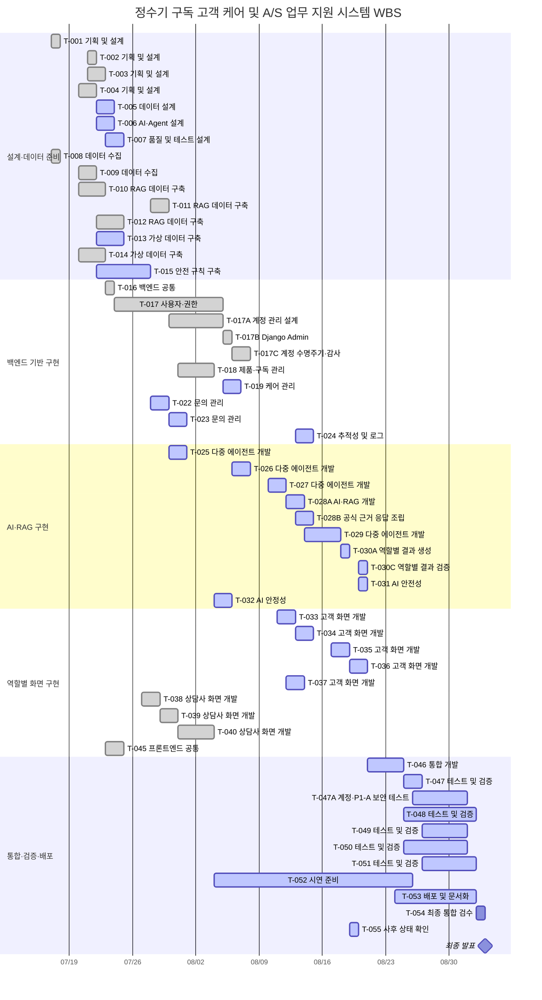

# 정수기 구독 고객 케어 및 A/S 업무 지원 시스템

## WBS (Work Breakdown Structure) v2.4

> 기획서, 화면설계서 통합본 v10, 요구사항정의서 v2.2 104건 및 수집데이터보고서의 정합성을 반영한 WBS이다.
> 최초 작성 기준일: 2026-08-07
> 최종 현행화: 2026-08-28 (원격 `main` 문서 HEAD `7a12f676437dd077c8e29e3c7163673163bd1cf3`; 코드·Runtime 검증 기준 `95f90f843124373fc97c6cd9e258b1427e0cbde8`)
> 범위 변경: 핵심 MVP를 합성 계약고객 인증 → 고객 앱 → AI Safety/RAG → 상담사 Web → 고객 상담 결과 확인으로 재고정한다. 방문기사 현장 처리와 운영자 통합 대시보드는 P1 후속 범위다.
> 판정 원칙: 과거 후보 SHA의 PASS는 이력으로만 인정한다. 최신 `main`의 동일 SHA 수직 E2E, P1-A 독립 QA, Browser E2E와 배포 후 기능 Smoke 전에는 최종 통합 완료로 승격하지 않는다.

## 목차

1. [프로젝트 일정 및 범위](#1-프로젝트-일정-및-범위)
2. [핵심 확정 사항](#2-핵심-확정-사항)
3. [주차별 목표](#3-주차별-목표)
4. [역할별 작업 배분](#4-역할별-작업-배분)
5. [진행 상태](#5-진행-상태)
6. [WBS 운영 기준](#6-wbs-운영-기준)
7. [통합 WBS 작업표](#7-통합-wbs-작업표)
8. [갠트차트](#8-갠트차트)
9. [코드 목록](#9-코드-목록)

# 1. 프로젝트 일정 및 범위

| 항목 | 내용 |
| --- | --- |
| 프로젝트 기간 | 2026-07-17 ~ 2026-09-03 |
| P0 실작업 완료일 | 2026-09-02 |
| 최종 발표 | 2026-09-03 — 별도 개발 작업 없이 발표만 진행 |
| P1 후속 로드맵 | P0 완료 후 범위·선행조건을 다시 확인해 별도 재계획 |
| 전체 작업 | 73개 |
| P0 작업 | 55개 / 80.5인일 |
| P1 작업 | 18개 / 14인일 |
| 전체 예상 공수 | 94.5인일 |
| 데이터·평가 제품 | `WPUJAC104DWH`, `WPUIAC425SNW`, `WPUIAC606SNW` 3모델 |
| Public Runtime 활성 | 현행 계약상 `WPUJAC104DWH`만 `INDEXED_MVP`. `WPUIAC425SNW`·`WPUIAC606SNW`는 `CONTRACT_BLOCKED_NOT_INDEXED`이며 Activation Gate 전까지 Public Runtime 활성으로 표시하지 않는다. |
| 제품 검색 경계 | 정확한 판매 모델 코드·승인 문서 선필터, 교차 모델 Fallback 금지, `WPU-IAC506` 신규 사용 금지 |
| 대표 시연 | `SYN-JAC104-002` · `DEMO-INQ-002` · 출수량 저하 · 매뉴얼 38쪽 |
| 원격 main 문서 HEAD | `7a12f676437dd077c8e29e3c7163673163bd1cf3` — 아래 보호형 HTTP E2E 결과 문서를 추가한 Commit |
| 코드·Runtime 검증 기준 SHA | `95f90f843124373fc97c6cd9e258b1427e0cbde8` — 위 문서 Commit의 부모이며 Handoff 검증 실행 대상 |
| 현재 상태 | 고객 앱의 AWS 연결·회원가입 UX, 3모델 Evidence, Safety·HITL, 상담 Handoff v2, 상담 결과 고객 조회와 Tag 기반 배포 코드가 반영됐다. 그러나 같은 SHA에서 가입→AI→상담→고객 결과 확인의 전체 수직 E2E와 P1-A G9·G10, Browser E2E, 배포 후 전체 기능 Smoke가 끝나지 않아 전체 Gate는 `진행 중 / HOLD`다. |

# 2. 핵심 확정 사항

| 구분 | 확정 내용 |
| --- | --- |
| 모델 범위 | 데이터·평가·통합 후보 검색 범위는 `WPUJAC104DWH`, `WPUIAC425SNW`, `WPUIAC606SNW` 3모델이다. Public Runtime 활성은 별도 Gate로 관리하며 현행 계약상 `WPUJAC104DWH`만 `INDEXED_MVP`다. 정확 판매 코드와 승인 문서를 선필터링하고 교차 모델 Fallback을 금지한다. `WPU-IAC506`은 `removed_legacy`로 처리한다. |
| 대표 증상 | 출수량 저하, 물맛·냄새 이상, 제품 누수, 냉·온수 온도 이상 4종을 지원한다. |
| 역할 체계 | PM·기술 통합, 모바일 앱 개발, 웹 프론트엔드, 백엔드·데이터베이스, AI·RAG, 데이터·QA·DevOps의 6개 역할로 운영한다. |
| 계정 관리 정책 | 합성 사용자 계정은 Django Admin 기반 내부 인터페이스에서 관리하고, 업무 역할과 관리자 권한을 분리한다. 사용자 삭제는 비활성화를 기본으로 하며 비활성화 시 기존 Refresh Token을 폐기하고 계정 변경 이력을 보존한다. 마지막 활성 Superuser와 마지막 활성 계정관리 권한 보유자의 삭제·비활성화·권한 제거를 차단한다. |
| P0 인증 Gate(Legacy P1-A) | 합성 계약고객의 계약정보 확인→계약 이메일 OTP→ID/PW·`CustomerAccountLink`→JWT→일반 로그인·복구→마이페이지→기존 문의/AI 진입을 핵심 MVP에 포함한다. 계약·Runtime·Mobile 구현은 반영됐지만 독립 QA와 동일 계정 수직 E2E 전에는 완료로 판정하지 않는다. 카카오 로그인은 P1-B `HOLD`, 실고객 Runtime은 `NO-GO`다. |
| AI 실행 구조 | 단일 RAG 기준선과 선택형 책임 분리 구조를 동일 입력·출력 스키마로 비교한 뒤 최종 구조를 확정한다. |
| Safety·HITL | 위험도를 생성보다 먼저 판정한다. 일반은 정책 충족 시 자동 안내, 주의는 `PRE_SEND` 사람 검토, 위험·근거 부족·검증 실패는 상담 우선으로 처리한다. |
| 상담 Handoff | 실제 상담 필요 시에만 Handoff v2를 생성하며 고객 입력·문진·수행 행동·위험·근거를 전달하고 시스템 오류와 안전 위험을 구분한다. |
| 사용 안내 필드 | `usage_guidance_status`, `usage_guidance_message`, `restricted_functions`, `evidence`, `next_action`, `requires_consultation`을 공통 필드로 사용한다. |
| 상태 관리 | `allowed_actions`, `state_version`, `idempotency_key`, `correlation_id`와 담당자 권한을 백엔드 State Machine에서 검증한다. |
| 완료 정책 | P0에서 자가조치 단독 해결은 즉시 `RESOLVED`, 상담 경로는 `COMPLETION_PENDING` 후 담당 상담사가 `FINALIZE_INQUIRY`한다. 방문 완료 정책은 P1에서 별도 검증한다. |
| 공식 근거 | RAG 결과, 근거 레지스트리와 문서 계보를 결합한 `EvidenceCardDTO`를 화면에 전달하며 내부 경로와 원문 전체는 노출하지 않는다. |
| 통합 개발 책임 | `T-046`은 백엔드·데이터베이스 담당자가 주도하고 모바일·웹·AI·QA·PM이 공동 협업한다. |
| 최종 패키지 순서 | 후보 배포 이력을 보존한 상태에서 `T-047`·`T-047A`·`T-051` QA를 수행하고, `T-053`에서 최신 후보를 재배포·Smoke·Rollback 검증한 뒤 `T-054` 최종 Release Gate를 2026-09-02에 진행한다. |

# 3. 주차별 목표

| 주차 | 기간 | 주요 목표 |
| --- | --- | --- |
| 1주차 | 7/17 | 프로젝트 착수, P0·제외 범위와 MVP 모델·대표 증상 확정 |
| 2주차 | 7/20~7/24 | 서비스 흐름·역할·아키텍처·화면·데이터·안전 규칙 정합성 확정 |
| 3주차 | 7/27~7/31 | DB·State Machine·문서 전처리·평가 세트·합성 데이터 기반 구축 |
| 4주차 | 8/3~8/7 | Vector DB, 케어·문진·문의 기능, T-017 인증·RBAC 검증, 계정관리 정책·Migration 승인 및 8/6 중간 발표 |
| 5주차 | 8/10~8/14 | 환경·계약·최소 수직 연결 Gate 복구 후 단일 RAG/선택형 책임 분리 비교, 위험 분류·Guard·Fallback·근거 DTO 구현 |
| 6주차 | 8/18~8/21 | 고객 모바일·상담사 웹·기사 리포트와 상담·방문 완료 정책 구현 |
| 7주차 | 8/24~8/28 | 3모델 데이터·P1-A 인증·Safety/HITL·상담 Handoff·상담 결과 조회 통합, AWS 배포와 기능별 QA |
| 8주차 | 8/31~9/3 | 핵심 MVP 동일 SHA 수직 E2E·독립 QA·배포 Smoke·제출물·영상·리허설 완료, 9/3 최종 발표 |
| 후속 | P0 완료 후 재계획 | P1 케어·방문·운영 대시보드·반응형·성능·유지보수 로드맵 |

# 4. 역할별 작업 배분

| 담당 역할 | 담당자 | 작업 수 | 예상 공수(인일) |
| --- | --- | ---: | ---: |
| PM·기술 통합 | 윤승혁 | 7 | 8.5 |
| 모바일 앱 개발 | 양정현 | 8 | 11.5 |
| 웹 프론트엔드 | 한예나 | 10 | 10 |
| 백엔드·데이터베이스 | 최지용 | 22 | 26 |
| AI·RAG | 이동윤 | 15 | 21 |
| 데이터·QA·DevOps | 김은진 | 11 | 17.5 |

# 5. 진행 상태

> 아래 집계는 기존 `T-001`~`T-111` 중 실제 등록된 73개 작업 기준이다. Legacy 명칭 P1-A의 `G0`~`G10`은 P0 인증 Gate 표로 관리하며 이 수치에 중복 합산하지 않는다.

| 상태 | 작업 수 | 공수(인일) |
| --- | ---: | ---: |
| 완료 | 20 | 28 |
| 진행 중 | 34 | 50.5 |
| 미착수 | 13 | 8.5 |
| 보류 | 6 | 7.5 |
| 차단 | 0 | 0 |

## 5-1. 4주차 3.3 P0 Exit 기준선

> 상세 선행 산출물과 완료 증거는 [4주차 P0 의존성 Map](../week4-dependency-map.md)과 [담당자·완료 증거 Matrix](../week4-owner-matrix.md)를 따른다.

| 작업 | 4주차 분류 | 2026-08-07 상태 | Exit 결정 |
|---|---|---|---|
| `T-011` | 발표 전 가능하면 포함 | 격리 pgvector 후보 증거, 팀 DB 미검증 | `DONE_WITH_LIMITATION`; 팀 DB 검색 검증을 5주차 이관 |
| `T-019` | 발표 후 8월 7일 착수 | 미착수 | 구독·제품 Runtime과 Care Migration 확인 후 착수, 미충족 시 이관 |
| `T-022` | 발표 전 필수 | 생성·증상 제출 Runtime, 나머지 미구현 | 구현된 Slice만 Runtime으로 인정하고 추가 누적 흐름 이관 |
| `T-023` | 발표 전 필수 | Action 2개 Runtime, 잔여 Action 계약·연기 | 상담·방문·완료 Action은 Crosswalk 분류 유지 |
| `T-026` | 발표 전 가능하면 포함 | AI 단독 구현, 소비자 미연동 | `DONE_WITH_LIMITATION`; Backend·Web·Mobile DTO 소비 이관 |
| `T-032` | 발표 전 가능하면 포함 | AI 내부 Timeout·1회 재시도, 전체 Fallback 미연동 | 상담 전환 Event·DB E2E를 5주차 이관 |
| `T-040` | 발표 전 필수 | Web `MOCK_UI`, 실제 저장 없음 | Live Runtime 주장 금지, 상담 Operation·Remote Adapter 이관 |
| `T-041` | 4주차 당시 후보 | Web `MOCK_UI`, 방문 Runtime 없음 | 과거 이력만 보존하고 현행 P1 HOLD로 재분류 |
| `T-045` | 발표 전 필수 | Web 상태·Action·오류 표시 구현 | Web Gate와 Mock·Runtime 표시 조건 유지 |
| `T-052` | 발표 전 필수 | 제한 시연 근거 고정, 중앙 패키지 미완료 | 중간 제한 시연과 `T-046` 이후 최종 E2E 분리 |

## 5-2. 5주차 실행 결과

> 아래 표는 4주차 Exit 뒤 재계획한 항목의 5주차 실행 결과다. 상세 이력은 [5주차 우선순위 Backlog](../week5-priority-backlog.md)를 따른다.

| 순서 | 작업 | 담당 | 5주차 목표 | 실행 결과 |
|---:|---|---|---|---|
| 1 | 기준선 Commit·Issue 대조 | 윤승혁·김은진 | 8/10 | 완료 — Planning·Exit·Blocker `f781e92` 정렬 |
| 2 | Backend·AI/Vector·Mobile 환경 Gate | 최지용·이동윤·양정현·김은진 | 8/10 | 부분 통과 — 영역별 실행 증거 확보, 최신 공용 PostgreSQL·물리기기 공동 실행 대기 |
| 3 | AI Schema–State Event Mapping | 이동윤·최지용 | 8/10 | 계약·코드·소비자 Projection 반영, 전체 역할 결과 Schema 검증은 진행 중 |
| 4 | Backend–AI 최소 수직 연결 | 최지용·이동윤 | 8/11 | 위험 규칙 경로 실제 E2E PASS 이력, 일반 RAG·LLM·팀 pgvector 최신 재검증 HOLD |
| 5 | `T-025` 기준선·책임 분리 비교 | 이동윤 | 8/10~8/11 | Single RAG·단계별 모듈 기준선과 감사 도구 구현, 실제 선택형 다중 Agent 비교는 진행 중 |
| 6 | `T-027` 위험·사용 안내 분류 | 이동윤 | 8/11~8/12 | 안전 분류 코드·단위 회귀·위험 E2E 경로 반영, 일반·근거 없음 전체 Runtime 재검증 대기 |
| 7 | `T-026` 추가 질문 소비자 연동 | 이동윤·최지용 | 8/12 | Follow-up 실단말 PASS·상담 요청 Runtime 반영, 전체 입력 평가와 역할별 소비는 진행 중 |
| 8 | `T-028A` 제품·세대 기반 검색 | 이동윤 | 8/12~8/13 | 청킹·Alias·Parent/Child 실험과 필터 코드 반영, 팀 pgvector 일반 검색 Gate HOLD |
| 9 | `T-028B` `EvidenceCardDTO` 조립 | 최지용 | 8/13~8/14 | Canonical Evidence Import·Crosswalk·검증된 Projection 구현, 공개 Evidence Runtime은 진행 중 |
| 10 | `T-031` 근거 없음 Guard·`T-032` 전체 Fallback | 이동윤·최지용 | 8/13~8/14 | No-Evidence·Timeout·재시도 코드 반영, 최신 오류 주입·상담 Fallback 공동 검증 대기 |
| 11 | `T-019`·`T-022`·`T-023` 잔여 Runtime | 최지용 | 8/10~8/14 재계획 | 케어·방문 Action 구현 이력은 보존하되 현행 P0는 추가 답변·상담·고객 후속만 판정하고 케어 일정·방문은 P1로 이관 |
| 12 | `T-040`·`T-041` 상담·방문 Runtime 연결 | 최지용·한예나 | 선행 Operation 통과 후 | 상담 시작·기록·요약 확정·완료 E2E 이력은 P0에 사용하고 방문 일정·기사 흐름은 P1 HOLD로 재분류 |

## 5-3. 2026-08-16 통합 Gate 현황

> 아래 표는 역사 기준선이다. 현재 판정은 5-4를 우선한다.

| Gate | 현재 판정 | 확인된 범위 | 남은 완료 조건 |
| --- | --- | --- | --- |
| Contract·Data CI | `PASS 이력` | 공통 계약, Data Manifest·QA, Canonical Evidence LF·Hash 계약 반영 | 최종 후보 SHA에서 CI URL과 실행 결과 재고정 |
| 고객→AI→상담사→고객 | `HISTORICAL_P0_PASS` | `1cd1905`에서 동일 Inquiry가 `DRAFT`→`COMPLETION_PENDING` v8까지 완주 | 최신 `main`·공용 PostgreSQL·물리 Android에서 동일 흐름 재실행 |
| Backend·PostgreSQL | `진행 중` | 상담 Runtime, Guidance Projection, Row Lock·계약 테스트 구현. 상담 중심 후보 환경은 `evidence.0011` 적용, P1 방문 Migration `visits.0005` 미적용 경계 | P0 최종 Schema·팀 PostgreSQL Migration·Seed·동시성·전체 회귀 필요. `visits.0005`는 P1 승인 전 적용하지 않는다. |
| AI·RAG | `HOLD` | 위험 규칙 경로, 검색 실험, Canonical Evidence Import·검증 구현 | 실제 LLM·팀 pgvector·일반/위험/근거 없음·오류 경로 공동 검증 |
| Web | `기능 PASS / P0 BROWSER HOLD` | 실제 상담 목록·상세·시작·기록·요약 확정·완료 연결, 과거 34 files / 155 tests PASS. 최신 표적 19 tests PASS | P1 방문 일정 Test Timeout은 별도 이관하고, P0 상담 흐름을 공용 Runtime Browser에서 재검증 |
| Mobile | `진행 중` | 고객 문의·Follow-up·Guidance·상담 요청과 최신 진행 문의 복구 조회 구현 | 최신 Backend 계정·Inquiry로 P0 고객 흐름 물리기기 전체 Smoke |
| 방문기사 흐름 | `P1 HOLD` | Backend 방문 Operation과 일부 Web/Mobile 골격 존재 | P0 완료 후 기사 배정·조회·시작·완료·고객 후속 확인을 별도 재계획 |
| 전체 프로젝트 | `진행 중 / HOLD` | 중간 P0 수직 흐름은 실증됐고 `a354c49`를 과거 코드 기준 후보로 보존 | P0 운영환경 Gate와 고객→상담→고객 완료를 같은 후보 SHA에서 통과한 뒤 최종 통합 기준선으로 승격 |

## 5-4. 2026-08-28 핵심 MVP·배포 Gate 현황

| Gate | 현재 판정 | 확인된 범위 | 남은 완료 조건 |
| --- | --- | --- | --- |
| 기준 SHA | `DOCUMENT/CODE SPLIT` | 원격 `main` 문서 HEAD `7a12f676437dd077c8e29e3c7163673163bd1cf3`, 코드·Runtime 검증 기준 `95f90f843124373fc97c6cd9e258b1427e0cbde8` | 후속 검증은 실행 SHA와 문서 SHA를 분리 기록하고 최종 Gate에서 다시 고정 |
| 3모델 데이터·RAG | `DATA PASS / RUNTIME RECHECK` | Full Corpus v3 132건 데이터 검증, 3모델 53개 Chunk Manifest와 운영 RDS Readonly View 조회 이력 | `three_model_index_target.json`의 `PREPARED_NOT_INDEXED`·Activation HOLD와 실제 Index Manifest·운영 이력 상태 불일치 해소, 최신 AI 검색 회귀 |
| P1-A 인증 | `IMPLEMENTED / QA HOLD` | P1-A 9개 OpenAPI Operation, Accounts Migration `0006`~`0009`, Backend Runtime, Mobile 가입·로그인·복구 UI와 AWS APK Build·실기기 실행 근거 | 승인 Inbox OTP 수신부터 동일 계정 문의·AI 진입까지 G9 독립 보안 QA와 G10 수직 E2E |
| Safety·HITL | `IMPLEMENTED / INTEGRATION HOLD` | 위험도별 Routing, `PRE_SEND`, HumanReview 원장·결정·행 잠금·멱등성, 표적 Backend·AI 회귀 이력 | Web·Mobile 소비, 영속 Checkpoint·재개, 최신 SHA 독립 오류 주입·로그 비노출 검증 |
| 상담 Handoff v2 | `PROTECTED HTTP E2E PASS / SERVICE E2E HOLD` | 코드 기준 `95f90f8`에서 실제 AI Process→Backend 보호형 HTTP→PostgreSQL Handoff 1건 저장→상담 연결→상담사 API Projection→동일 Payload 멱등 Replay까지 PASS | Web UI·실제 Provider·AWS·독립 QA·PM 승인과 운영 활성화는 미실행 또는 보류 |
| 핵심 고객→상담→고객 | `진행 중` | 고객 문의·AI 안내·상담 요청·상담 처리와 고객 상담 결과 조회 API·Mobile 소비 코드 반영 | 동일 신규 Inquiry로 가입→안내→상담→고객 결과 확인을 최신 SHA·AWS 환경에서 완주 |
| Web | `UNIT/BUILD PASS 이력 / BROWSER HOLD` | 8/24 기준 Web 252 passed, 4 excluded, Lint·TypeCheck·Build 통과 이력 | 배정 전 신규 문의가 있는 격리 DB에서 최신 Playwright Browser E2E |
| Mobile | `AWS BUILD·DEVICE PASS / FLOW HOLD` | AWS Backend 연결, AWS APK Build·실기기 실행, 가입·계정복구 UX 보완 | P1-A OTP 전체 흐름과 상담 결과 재조회까지 같은 계정으로 검증 |
| Production | `DEPLOYED / FUNCTION QA HOLD` | Backend `v0.1.3` 배포 이력, Tag 기반 Release, OIDC→ECR→SSM 자동화와 `web`·`backend`·`ai`·`trace-store` 4개 Container 정의 | 최신 4개 Container Health·Smoke, Trace 영속 조회, 전체 기능 QA와 Rollback 리허설 |
| 방문기사·운영 대시보드 | `P1 HOLD` | Backend·Mobile·Web 일부 골격과 테스트 이력 | 핵심 MVP 완료 후 별도 재계획. `visits.0005`는 승인 전 적용 금지 |
| 전체 프로젝트 | `진행 중 / HOLD` | 핵심 기능의 구현·부분 Runtime·운영 배포 근거가 누적됨 | 위 핵심 Gate를 같은 SHA에서 통과하고 KPI를 운영 실적이 아닌 파일럿 목표로 표시한 최종 제출물 검수 |

# 6. WBS 운영 기준

| 구분 | 적용 기준 |
| --- | --- |
| P0 | 합성 계약고객 인증 → 고객 앱 문의 → AI Safety/RAG → 상담사 Web 처리 → 고객 상담 결과·현재 상태 확인의 수직 흐름을 2026-09-02까지 완성한다. 방문 필요 여부는 기록할 수 있지만 실제 기사 배정·일정·현장 처리는 포함하지 않는다. |
| P1 | 케어 일정·사전 문진, 방문기사 현장 흐름, 운영 대시보드, 반응형, 성능, 유지보수성, 제한된 관리자 권한 위임·회수와 본인 프로필 기능은 P0 이후 후속 로드맵으로 관리한다. |
| 작업 단위 | 각 작업은 0.5~2.0인일을 기본 단위로 하며 담당자·협업자·선행 작업·완료 기준을 함께 관리한다. |
| 제외 범위 | 실제 사내 시스템 API, 실제 기사 자동 배정·예약, 외부 알림 채널, 결제·해지·환불은 MVP에서 제외한다. |
| 데이터 | 실제 개인정보·상담·방문 기록 대신 가명·합성 데이터를 사용하며, MVP 계정 관리는 합성 사용자와 내부 시연 관리자에 한정한다. |
| AI 안전 | 공식 근거 없는 자가조치, 제품 분해·직접 수리, 확정 진단을 금지하며 위험·근거 부족 시 상담 전환을 우선한다. |
| 계정 관리 | Web·Mobile은 사용자 DB를 직접 수정하지 않으며, 계정 생성·수정·비활성화·재활성화는 Django Service·ORM·Transaction을 통해 수행한다. 물리 삭제는 참조 없는 합성 테스트 계정의 승인된 예외로만 허용한다. |
| 근거 관리 | 완료·진행 작업은 근거 문서·산출물 경로를 `근거 문서·비고`에 기록한다. 실제 URL 또는 저장소 상대 경로가 확정되면 문서명과 함께 추가한다. |
| 기준 SHA | 코드가 모인 후보 SHA와 통합 완료 기준선을 구분한다. `HEAD`·`origin/main` 일치와 선행 증거의 조상 관계는 후보 고정 조건이며, 공용 PostgreSQL·실기기·실제 AI·최신 전체 회귀와 신규 Inquiry E2E를 통과해야 최종 통합 기준선으로 승격한다. |

# 7. 통합 WBS 작업표

> `진행률`은 상태에 따라 완료 100%, 진행 중 50%, 보류 25%, 미착수 0%로 표시한다.

## 7-1. 설계·데이터 준비

| Task ID | 우선순위 | 주요 업무 | 세부 업무 | 연계 요구사항 | 담당자·역할 | 협업·검수자 | 선행 Task | 기간 | 공수 | 상태 | 완료 기준 | 근거 문서·비고 |
| --- | --- | --- | --- | --- | --- | --- | --- | --- | --- | --- | --- | --- |
| `T-001` | P0 | 기획 및 설계 | 요구사항 정의서의 P0·P1·제외 범위를 검토하고 WBS 작성 기준과 요구사항 추적 방식을 확정한다. | 전체 요구사항, CR-001~CR-014 | 윤승혁 PM·기술 통합 | 관련 담당자 | - | 2026-07-17 | 1 | 완료 | MVP 포함·후순위·제외 항목이 구분되고 모든 작업이 요구사항 ID와 연결됨 | 기획서 · 요구사항정의서 · 화면설계서 |
| `T-002` | P0 | 기획 및 설계 | P0의 문의 접수→AI 안내/상담→고객 결과 확인 State Machine과 P1 방문 확장 계약을 설계한다. P0 완료 판정은 START_INQUIRY, SUBMIT_SYMPTOM, SAFE_GUIDANCE_READY, DANGER_DETECTED, NO_EVIDENCE, REQUEST_CONSULTATION, START_CONSULTATION, SUBMIT_RESOLUTION_FEEDBACK, RESUME_CONSULTATION, FINALIZE_INQUIRY를 기준으로 하고 방문 이벤트는 P1 계약으로 분리한다. | FR-019~FR-021, FR-025, FR-032~FR-034, FR-038, NFR-015, DR-012 | 윤승혁 PM·기술 통합 | 관련 담당자 | T-001 | 2026-07-21 | 1 | 완료 | P0 상담 상태와 P1 방문 상태의 진입·권한·완료 조건이 분리되어 정의됨 | 기획서 · 요구사항정의서 · 화면설계서 |
| `T-003` | P0 | 기획 및 설계 | P0 고객·상담사 화면과 P1 방문기사·운영 화면의 조회 범위와 주요 사용 흐름을 구분해 정의한다. | FR-001, NFR-011, NFR-014~NFR-015 | 윤승혁 PM·기술 통합 | 관련 담당자 | T-001, T-002 | 2026-07-21 ~ 2026-07-22 | 1 | 완료 | P0/P1 역할별 메뉴·화면·권한 매트릭스가 구분되어 작성됨 | 기획서 · 요구사항정의서 · 화면설계서 |
| `T-004` | P0 | 기획 및 설계 | 모바일 앱·웹 프론트엔드·백엔드 API·관계형 DB·Vector DB·AI/RAG·공식 근거 레지스트리 간 전체 시스템 아키텍처와 API 경계를 설계한다. | NFR-006, NFR-009, NFR-017 | 윤승혁 PM·기술 통합 | 관련 담당자 | T-001, T-002 | 2026-07-20 ~ 2026-07-21 | 2 | 완료 | 구성도, 모듈 책임과 주요 API 목록이 확정됨 | 기획서 · 요구사항정의서 · 화면설계서 |
| `T-005` | P0 | 데이터 설계 | 사용자·계약 연결·구독·제품·문의·상담·상태 이력과 현재 사용 안내, 판단 근거, 담당 주체, 고객 행동 필요 여부를 P0 ERD로 설계하고 케어·사전 문진·방문 Schema는 P1 확장으로 구분한다. | FR-032, FR-038, DR-001~DR-003, DR-006~DR-007, DR-010, DR-012, DR-014~DR-018 | 최지용 백엔드·데이터베이스 | 윤승혁 · 김은진 | T-002, T-004 | 2026-07-22 ~ 2026-07-23 | 2 | 진행 중 | P0 계약·문의·상담 구조와 P1 케어·방문 확장 경계가 ERD·표준 코드에 정의됨 | 기획서 · 요구사항정의서 · 화면설계서 |
| `T-006` | P0 | AI·Agent 설계 | AI·RAG 단계 간 공통 상태 객체와 표준 JSON 스키마를 정의한다. 현재 사용 안내 필드는 usage_guidance_status, usage_guidance_message를 사용하고 restricted_functions, evidence, next_action, requires_consultation을 포함한다. | NFR-005~NFR-006, DR-007, DR-009 | 이동윤 AI·RAG | 최지용 · 김은진 | T-004, T-005 | 2026-07-22 ~ 2026-07-23 | 1.5 | 진행 중 | usage_guidance_status, usage_guidance_message, restricted_functions, evidence, next_action, requires_consultation과 누락·재생성 규칙이 확정되고 위험도는 general/caution/danger로 통일됨 | 기획서 · 요구사항정의서 · 화면설계서 |
| `T-007` | P0 | 품질 및 테스트 설계 | P0 기능·AI·RAG·안전성·State Machine·권한·중복 요청·EvidenceCardDTO 비노출 항목에 대한 테스트 기준과 데이터 분할, 인수 기준을 설계한다. | NFR-001~NFR-007, NFR-009~NFR-010, NFR-014~NFR-015, NFR-017 | 김은진 데이터·QA·DevOps | 윤승혁 | T-001~T-006 | 2026-07-23 ~ 2026-07-24 | 1 | 진행 중 | 4개 사용 안내 상태와 문의 진행 상태별 정답·인수 기준이 정의됨 | 기획서 · 요구사항정의서 · 화면설계서 |
| `T-008` | P0 | 데이터 수집 | 데이터·평가 범위를 `WPUJAC104DWH`, `WPUIAC425SNW`, `WPUIAC606SNW` 3모델과 대표 증상 4종으로 확정하고, Public Runtime 활성 모델은 계약·Activation Gate로 별도 관리한다. | CR-002~CR-003, CR-009 | 김은진 데이터·QA·DevOps | 이동윤 · 윤승혁 | T-001 | 2026-07-17 | 1 | 완료 | 3모델 데이터 범위, 정확 판매 코드 선필터, 교차 모델 Fallback 금지, `WPU-IAC506` removed_legacy와 대표 E2E 기준이 문서화됨 | 수집데이터보고서 · 기획서 · 요구사항정의서 |
| `T-009` | P0 | 데이터 수집 | JAC104 REV.00 44쪽, IAC425 REV.02 52쪽, IAC606 REV.00 48쪽의 공식 매뉴얼과 조건부 공식 FAQ를 수집하고 출처·버전·페이지·해시·정확 판매 코드 메타데이터를 정리한다. | FR-015, DR-008, CR-009 | 김은진 데이터·QA·DevOps | 이동윤 · 윤승혁 | T-008 | 2026-07-20 ~ 2026-08-18 | 2 | 완료 | 공식 매뉴얼 3종 144쪽의 계보와 원문 비보관 정책이 Manifest에 고정됨 | 수집데이터보고서 · 3모델 Handoff Manifest |
| `T-010` | P0 | RAG 데이터 구축 | 3모델 공식 매뉴얼을 제품·증상·페이지 기준으로 정제·분할하고 `exact_sales_code`, Source Span, 적용성·위험·사용 정책 메타데이터를 부여한다. | FR-015, DR-008 | 김은진 데이터·QA·DevOps | 이동윤 · 윤승혁 | T-009 | 2026-07-20 ~ 2026-08-18 | 1.5 | 완료 | Parent 15·Child 53·Evidence Group 43과 제품별 15/19/19 구성이 Manifest와 일치함 | 수집데이터보고서 · `rag_three_model_handoff_manifest.json` |
| `T-011` | P0 | RAG 데이터 구축 | 3모델 임베딩·Vector DB 후보 인덱스와 정확 판매 코드 선필터 검색 파이프라인을 구성하고 Public Runtime Activation Gate를 분리한다. | FR-015, NFR-001~NFR-002, DR-008~DR-009 | 이동윤 AI·RAG | 김은진 | T-010 | 2026-07-28 ~ 2026-08-20 | 2 | 완료 | 3모델 후보 검색 Baseline이 통과하고 계약 승인 모델만 Public Runtime에서 활성화됨 | Disposable pgvector 50/50·교차 모델 Hit 0 PASS, 53건 Index Manifest와 Public Runtime 계약 강제 확인 · JAC104 `INDEXED_MVP`, IAC425/IAC606 Activation은 별도 `HOLD` Gate |
| `T-012` | P0 | RAG 데이터 구축 | 3모델 대표 증상별 정답 Evidence와 양성·음성 검색 평가 세트를 구축하고 미검증 FAQ, 미등록·교차 모델 검색 차단을 검증한다. | FR-015, NFR-005, DR-009 | 김은진 데이터·QA·DevOps | 이동윤 · 윤승혁 | T-011 | 2026-07-22 ~ 2026-08-19 | 1 | 완료 | 50개 평가 Case와 제품 격리 기준이 고정되고 후보 검색 평가가 통과함 | Positive 43/43·Negative 7/7·교차 모델 Hit 0 · Public Runtime은 JAC104만 활성, IAC425/IAC606 Activation은 별도 HOLD |
| `T-013` | P0 | 가상 데이터 구축 | 가상 사용자·연결 구독 제품과 과거 필터 교체·살균·세척 이력을 생성한다. 다음 케어 일정·사전 문진 Fixture는 P1 회귀 자료로 분리 보존한다. | FR-002~FR-003, FR-016, FR-039, DR-002~DR-004, CR-008, CR-013 | 김은진 데이터·QA·DevOps | 이동윤 · 윤승혁 | T-005, T-008 | 2026-07-22 ~ 2026-07-24 | 1.5 | 진행 중 | 역할별 합성 계정과 대표 구독·과거 케어 이력이 DB에 적재되고 P1 일정 Fixture와 구분됨 | 수집데이터보고서 · 기획서 6장 · 화면설계서 1~3장 |
| `T-014` | P0 | 가상 데이터 구축 | WPUJAC104DWH 합성 문의 24건을 생성하고 각 시나리오에 공식 근거, 기대 위험도, 사용 안내, 상담·고객 후속 이벤트를 연결한다. 기존 방문 이벤트 Fixture는 P1 회귀 자료로 보존한다. | FR-008~FR-025, FR-032~FR-034, FR-038, DR-006~DR-010, DR-012, CR-008 | 김은진 데이터·QA·DevOps | 이동윤 · 윤승혁 | T-002, T-008, T-013 | 2026-07-20 ~ 2026-07-22 | 2 | 완료 | P0 상담·고객 결과 흐름과 P1 방문 회귀 Fixture의 용도가 분리됨 | 수집데이터보고서 · 기획서 5-5 · 대표 E2E 데이터 계약 |
| `T-015` | P0 | 안전 규칙 구축 | 누수·전기·화상·온수 모듈 경고와 근거 부재에 대해 일반 사용 가능, 일부 출수·기능 사용 중지, 제품 전체 사용 중지, 판단 보류·상담 필요로 분기하는 규칙·금지 행동·고객 문구를 정의한다. | FR-013, FR-018~FR-019, FR-038, NFR-001~NFR-004, CR-010~CR-011 | 이동윤 AI·RAG | 김은진 · 윤승혁 | T-008, T-009 | 2026-07-22 ~ 2026-07-27 | 1.5 | 진행 중 | 위험·근거 조건별 사용 안내 상태, 제한 범위와 고객의 다음 행동이 규칙표로 확정됨 | 수집데이터보고서 · 기획서 6장 · 화면설계서 1~3장 |

## 7-2. 백엔드 기반 구현

| Task ID | 우선순위 | 주요 업무 | 세부 업무 | 연계 요구사항 | 담당자·역할 | 협업·검수자 | 선행 Task | 기간 | 공수 | 상태 | 완료 기준 | 근거 문서·비고 |
| --- | --- | --- | --- | --- | --- | --- | --- | --- | --- | --- | --- | --- |
| `T-016` | P0 | 백엔드 공통 | 백엔드 프로젝트 구조, 환경변수, 공통 응답·예외 처리와 개발 환경을 구성한다. | NFR-009, NFR-017 | 최지용 백엔드·데이터베이스 | 김은진 | T-004 | 2026-07-23 | 1 | 완료 | 로컬 환경에서 서버 실행과 공통 오류 응답이 확인됨 | 김은진 독립 QA 최종 승인 · Backend 전체 회귀 1,187 passed, 0 failed · Backend→AI 실제 연결과 TEAM_INTEGRATION Role 검증은 별도 Gate |
| `T-017` | P0 | 사용자·권한 | 합성 계정 로그인, 현재 사용자 조회, Access·Refresh Token 갱신·폐기, 4개 역할 기반 접근 제어와 공통 객체 권한 기반을 구현한다. P0에서는 고객 문의의 본인 소유권과 상담사 접근을 검증하고 기사 방문 객체 권한은 T-042의 P1 Gate로 분리한다. | FR-001, NFR-011~NFR-012, DR-001~DR-002 | 최지용 백엔드·데이터베이스 | 김은진 · 윤승혁 | T-005, T-016 | 2026-07-24 ~ 2026-08-04 | 1.5 | 완료 | Demo Login, `GET /api/v1/me`, Refresh, Logout, UUID JWT와 역할 기반 접근 제어가 동작하고 P0 고객·상담사 객체 권한이 검증됨 | T-017 인증·RBAC 독립 QA 이력 · 기사 배정·미배정·타 기사 객체 권한은 T-042 P1 이관 |
| `T-017A` | P0 | 사용자 계정 관리 설계 | 합성 사용자 계정의 단일 원장, 업무 역할과 관리자 권한의 분리, `is_synthetic`, `auth_version`, 비활성화·물리 삭제 제한, Token 폐기, 감사 이력과 관리자 보호 정책을 확정한다. 마지막 활성 Superuser와 마지막 활성 계정관리 권한 보유자의 삭제·비활성화·권한 제거를 차단한다. | FR-039, FR-042, NFR-019~NFR-020, DR-016, CR-013~CR-014 | 최지용 백엔드·데이터베이스 | 윤승혁 · 김은진 | T-005, T-017 | 2026-07-30 ~ 2026-08-04 | 0.5 | 완료 | `accounts.User` 단일 원장, 업무 역할과 관리자 권한의 분리, `is_synthetic` Backfill 기준, `auth_version` 기반 Token 폐기, Migration·Rollback과 마지막 관리자 보호 정책이 문서화되고 윤승혁 정책 승인과 김은진 Migration QA 승인을 모두 받음 | PM 설계 완료 결정 반영 · T-017B/C 책임 경계 확정 |
| `T-017B` | P0 | 내부 계정 관리 | Django Admin 필수 앱·Middleware·Template·Static·내부 URL과 Custom UserAdmin을 구성하고 합성 사용자 생성·조회·수정·비활성화·재활성화 기능을 구현한다. | FR-039, NFR-011, NFR-019, CR-013~CR-014 | 최지용 백엔드·데이터베이스 | 김은진 | T-017A | T-017A 승인 후 | 1 | 완료 | T-017A의 정책·Migration QA가 승인된 뒤 착수한다. 비staff 접근이 차단되고 권한 있는 내부 관리자가 합성 사용자 계정을 관리하며 일반 관리자에게 물리 삭제와 `is_superuser` 변경이 노출되지 않음 | Runtime·Migration·독립 QA 42건·Forward·Rollback·Backfill·관리자 보호 PASS |
| `T-017C` | P0 | 계정 수명주기·감사 | 계정 비활성화·재활성화 Service, `auth_version` 기반 기존 Token 폐기, 보호 API 접근 차단과 계정 변경 감사 이력을 구현한다. 마지막 활성 Superuser와 마지막 활성 계정관리 권한 보유자의 삭제·비활성화·권한 제거를 차단한다. | FR-042, NFR-013, NFR-019~NFR-020, DR-016, CR-014 | 최지용 백엔드·데이터베이스 | 김은진 · 윤승혁 | T-017A, T-017B | T-017B 완료 후 | 1.5 | 완료 | T-017A와 T-017B가 완료된 뒤 착수한다. 비활성 사용자의 로그인·Refresh·보호 API가 차단되고 재활성 후 과거 Token을 재사용할 수 없으며 수행자·사유·전후값 감사 이력이 남고 마지막 관리자 보호가 검증된다. | 김은진 독립 QA 최종 승인 · Backend 전체 회귀 1,187 passed, 0 failed · T-047A 계정 보안 인수 테스트는 별도 Gate |
| `T-018` | P0 | 제품·구독 관리 | 계약정보·OTP로 연결된 `CustomerAccountLink` 기준 본인 구독 제품 조회와 문의 대상 선택 기능을 구현한다. 계약 원장 속성의 고객 임의 등록·수정은 제공하지 않는다. | FR-002~FR-003, DR-003, DR-017 | 최지용 백엔드·데이터베이스 | 김은진 | T-005, T-016, T-017 | 2026-07-31 ~ 2026-08-22 | 1.5 | 완료 | 연결된 계약 고객만 본인 제품을 조회·선택하고 타 고객 제품 접근과 임의 계약 속성 수정이 차단됨 | Backend 제품 조회와 Account Link Runtime 이력 · Mobile 전체 가입→제품 조회 E2E는 P0 인증 Gate에서 별도 검증 |
| `T-019` | P0 | 케어 관리 | 필터·카트리지 교체와 살균·세척 등 과거 케어 이력 등록·조회 기능을 구현한다. | FR-016, DR-004 | 최지용 백엔드·데이터베이스 | 김은진 | T-018 | 2026-08-05 ~ 2026-08-06 | 1.5 | 진행 중 | 과거 케어 이력이 구독·제품 기준으로 누적·조회됨 | 본인 ACTIVE 구독 LIST·DETAIL·셀프 케어 CREATE Runtime·계약 구현, 작성자 16 tests PASS · PostgreSQL 독립 QA와 소비자 연결 승인 대기 |
| `T-020` | P1 | 케어 관리 | 공식 관리 주기와 최근 케어 이력을 이용한 다음 케어 예정일 산정·안내·갱신 로직을 P1로 재계획한다. | FR-004~FR-005, FR-031, CR-012 | 최지용 백엔드·데이터베이스 | 김은진 | T-009, T-019 | P0 완료 후 재계획 | 1 | 보류 | 근거 부재 시 확인 필요 처리와 일정 변경 이력이 P1 환경에서 검증됨 | 계산·재산정 코드와 PostgreSQL 독립 QA 이력은 보존 · 현재 핵심 MVP 여정에서 제외 |
| `T-021` | P1 | 사전 문진 | 케어 일정 기반 `START_CARE_PRECHECK`와 Inquiry 없는 QuestionnaireSession 생성·응답·문의 연결을 P1로 재계획한다. | FR-006~FR-007, DR-005 | 최지용 백엔드·데이터베이스 | 김은진 | T-005, T-016, T-020 | P0 완료 후 재계획 | 1.5 | 보류 | 사전 케어 문진과 증상 문의 문진이 분리되고 이후 inquiry_id 연결이 검증됨 | 현재 핵심 MVP는 문의 생성 후 증상 문진만 포함 · 사전 케어는 P1 HOLD |
| `T-022` | P0 | 문의 관리 | START_INQUIRY로 Inquiry를 DRAFT 상태로 생성하고 자연어 증상·대표 증상·추가 답변·자가조치 결과를 동일 inquiry_id에 누적한다. SUBMIT_SYMPTOM 시 QUESTIONNAIRE_IN_PROGRESS로 전환한다. | FR-008~FR-011, FR-020, DR-001, DR-006 | 최지용 백엔드·데이터베이스 | 김은진 | T-005, T-016, T-017 | 2026-07-28 ~ 2026-07-29 | 1.5 | 진행 중 | 신규 문의 생성과 동일 inquiry_id 누적 저장이 동작하고 미지원 제품·필수값 누락·차단 모델은 PRODUCT_VALIDATION_FAILED로 AI·RAG 실행이 차단됨 | 문의 생성·증상 제출·추가 답변·AI 결과 저장과 Mobile 실제 연결 구현 · 자가조치 결과 누적과 전체 독립 QA 잔여 |
| `T-023` | P0 | 문의 관리 | P0 Backend State Machine 이벤트 API의 `allowed_actions`, 역할·담당자 권한, `state_version`, `idempotency_key`, `correlation_id`, `COMPLETION_PENDING`·`REOPENED`·`FINALIZE_INQUIRY`를 구현한다. 방문 이벤트 Runtime은 P1 Task로 분리한다. | FR-021, FR-025, FR-032~FR-034, NFR-015, DR-012, DR-014~DR-015 | 최지용 백엔드·데이터베이스 | 김은진 | T-002, T-005, T-016, T-022 | 2026-07-30 ~ 2026-07-31 | 1.5 | 진행 중 | P0 상담·고객 후속 전이가 권한·동시성·멱등성 계약에 맞게 실행되고 방문 Runtime 없이 완주됨 | Runtime12·동적 `allowed_actions`·상담 Operation·409·Replay·Row Lock 구현 · `FINALIZE_INQUIRY`·재개 최신 E2E 잔여, 방문 Operation은 P1 이력으로 보존 |
| `T-024` | P0 | 추적성 및 로그 | AI 호출, 검색 근거, 생성 결과, 모델 정보, 주요 사용자 행위와 오류 로그 저장을 구현한다. | NFR-013, NFR-017, DR-009 | 최지용 백엔드·데이터베이스 | 김은진 | T-016, T-023 | 2026-08-13 ~ 2026-08-14 | 1 | 진행 중 | 문의별 AI·RAG·상담·상태 변경 이력을 재현할 수 있음 | Backend→AI Callback·AIRun·상태·`correlation_id` 구조화 로그와 민감정보 비노출 구현 · Retrieval/Evidence Lineage·P0 상담 전체 추적과 독립 QA 잔여, 방문 추적은 P1 이관 |

## 7-3. AI·RAG 구현

| Task ID | 우선순위 | 주요 업무 | 세부 업무 | 연계 요구사항 | 담당자·역할 | 협업·검수자 | 선행 Task | 기간 | 공수 | 상태 | 완료 기준 | 근거 문서·비고 |
| --- | --- | --- | --- | --- | --- | --- | --- | --- | --- | --- | --- | --- |
| `T-025` | P0 | 다중 에이전트 개발 | 단일 RAG 기준선과 선택형 책임 분리 구조를 동일 입력·출력 스키마로 비교한 뒤, 문의 상태와 역할에 따라 필요한 구조화·검색·안내·상담 인계 모듈만 호출하는 오케스트레이터를 구현한다. | FR-010~FR-019, FR-022, NFR-005~NFR-006 | 이동윤 AI·RAG | 김은진 · 최지용 | T-006, T-015, T-023 | 2026-07-30 ~ 2026-07-31 | 2 | 진행 중 | 기준선과 제안안 비교 결과가 기록되고 최종 실행 구조에서 일반·위험·상담 흐름이 조건별로 분기됨 | Single RAG·단계별 Router와 다중 AI 감사 도구 구현 · 실제 LLM 기반 선택형 다중 Agent 비교와 Backend 전체 저장 연결 진행 중, 방문 흐름은 T-030B P1 이관 |
| `T-026` | P0 | 다중 에이전트 개발 | 누락 정보 추가 질문, 답변 중복 방지와 표준 증상 구조화를 수행하는 증상 확인·분류 Agent를 구현한다. | FR-010~FR-012, NFR-014, DR-007, DR-015 | 이동윤 AI·RAG | 김은진 · 최지용 | T-006, T-025 | 2026-08-06 ~ 2026-08-07 | 2 | 진행 중 | 필수 항목 추출과 미확인 항목 질문이 JSON으로 반환됨 | 구조화·누락 검사·질문 생성·중복 방지 구현 · 전체 입력 평가와 Backend·Web·Mobile 소비 미완료 |
| `T-027` | P0 | 다중 에이전트 개발 | 안전 규칙과 구조화 증상을 결합해 위험도·처리 우선순위와 현재 사용 안내 상태, 제한되는 출수·기능 범위를 분류하는 로직을 구현한다. | FR-013~FR-014, FR-019, FR-038, NFR-001~NFR-002, NFR-004, DR-007, DR-015 | 이동윤 AI·RAG | 김은진 · 최지용 | T-015, T-026 | 2026-08-10 ~ 2026-08-11 | 1.5 | 진행 중 | 일반·주의·위험 분류와 4개 사용 안내 상태가 규칙에 따라 일관되게 반환됨 | Safety Rule Loader·Classifier·Validator 구현 및 위험 문의 실제 E2E 반영 · 일반·근거 없음 전체 Runtime 교차검증 대기 |
| `T-028A` | P0 | AI·RAG 개발 | 제품 모델·증상·구독·케어 이력을 조회하고 정확한 판매 모델 코드·승인 문서 필터를 적용하여 공식 문서 근거와 고객별 관리 이력을 반환하는 지식·이력 조회 모듈을 구현한다. | FR-015~FR-016, DR-004, DR-008~DR-009, CR-002 | 이동윤 AI·RAG | 김은진 · 최지용 | T-011, T-019, T-026 | 2026-08-12 ~ 2026-08-13 | 1.5 | 진행 중 | 3개 MVP 모델에 일치하는 검증 근거·페이지·관리 이력이 반환되고 교차 모델 Fallback과 미검증 FAQ 단독 사용이 차단됨 | Full Corpus v3 132건·3모델 53개 Chunk·제품 필터·Parent/Child 구현 · Target 상태 불일치 해소와 최신 AI 검색 회귀 대기 |
| `T-028B` | P0 | 공식 근거 응답 조립 | 3모델 RAG 검색 결과, Canonical Evidence Registry, 문서 메타데이터와 Lineage를 결합하여 EvidenceCardDTO를 생성하는 백엔드 조립 로직을 구현한다. source_path·ManualPage.text·retrieval_text는 화면 응답에서 제외한다. | FR-015~FR-019, NFR-001~NFR-002, DR-008~DR-009 | 최지용 백엔드·데이터베이스 | 이동윤 · 김은진 | T-005, T-011, T-028A | 2026-08-13 ~ 2026-08-14 | 1 | 진행 중 | 검증된 모델·세대·페이지·사용 정책을 만족한 근거만 고객·상담사 화면에 전달되고, 고객 화면의 chunk_id와 내부 경로·원문 전체가 숨겨짐 | 3모델 53개 Evidence Import·Readonly View·Crosswalk·안전 Projection 구현 및 운영 RDS 조회 이력 · 최신 공개 DTO·화면 공동 검증 대기 |
| `T-029` | P0 | 다중 에이전트 개발 | 증상·이력·근거를 종합하여 점검 후보와 자가조치에 앞서 현재 사용 안내 상태, 제한 범위, 판단 근거와 고객의 다음 행동을 생성하는 대응 분석 Agent를 구현한다. | FR-017~FR-019, FR-038, NFR-001~NFR-003 | 이동윤 AI·RAG | 김은진 · 최지용 | T-027, T-028A, T-028B | 2026-08-14 ~ 2026-08-17 | 2 | 진행 중 | 확정 진단 없이 근거가 있는 사용 안내 상태와 안전한 다음 행동이 생성됨 | Customer Guidance Generator·Prompt v2·LLM Client 구현, 위험 경로 실제 E2E 반영 · 일반 RAG 근거 경로와 재생성 실패 Fallback 검증 대기 |
| `T-030A` | P0 | 역할별 결과 생성 | 제품·문진·고객 원문·추가 답변·수행 행동·공식 근거·상태 이력을 이용하여 Handoff v2 상담 맥락과 상담용 AI 요약 초안을 생성하고 상담사 수정·확정본을 별도로 저장한다. | FR-022~FR-024, FR-048, NFR-001~NFR-006, DR-010, DR-018 | 이동윤 AI·RAG | 김은진 · 윤승혁 | T-023, T-029 | 2026-08-18 | 1 | 진행 중 | 상담 필요 시에만 Schema를 충족한 맥락이 전달되고 고객 답변·수행 행동·Safety 의미가 보존됨 | 보호형 AI→Backend HTTP·PostgreSQL 저장·상담 연결·상담사 API Projection·멱등 Replay PASS · 실제 Provider·Web UI·AWS·독립 QA는 HOLD |
| `T-030B` | P1 | 역할별 결과 생성 | 상담사 확정 요약, 제품·관리 이력, 위험도와 공식 근거를 이용하여 방문기사용 사전 점검 리포트 초안을 생성하고 기사 수정·확정본을 별도로 저장한다. | FR-027~FR-029, NFR-001~NFR-006, DR-011 | 이동윤 AI·RAG | 김은진 · 윤승혁 | T-019, T-030A | P0 완료 후 재계획 | 1 | 미착수 | 상담사 확정 내용과 관리 이력이 기사 리포트에 반영되고 AI 초안과 기사 확정본이 구분됨 | 핵심 MVP 이후 P1 재계획 |
| `T-030C` | P0 | 역할별 결과 검증 | 고객 안내와 상담 Handoff·상담 요약의 핵심 사실, 위험도, 현재 사용 안내, 공식 근거와 금지 행동이 서로 모순되지 않는지 검증한다. | NFR-001~NFR-006, DR-009~DR-010, DR-018 | 이동윤 AI·RAG | 김은진 · 윤승혁 | T-015, T-030A | 2026-08-20 | 0.5 | 진행 중 | 역할별 결과는 표현만 다르고 제품·증상·위험도·근거·수행 행동·다음 행동의 핵심 사실이 일치함 | 상담 맥락 Safety 의미·오류 분리 정합화와 표적 테스트 이력 · 최신 전체 회귀·독립 QA 대기 |
| `T-031` | P0 | AI 안전성 | 공식 근거 미검색, 모델·세대 불일치 또는 검증 실패 시 임의 사용 가능 판정과 자가조치를 차단하고 usage_guidance_status를 판단 보류·상담 필요로 설정한다. | FR-038, NFR-002, NFR-009 | 이동윤 AI·RAG | 김은진 · 최지용 | T-015, T-028A | 2026-08-20 | 1 | 진행 중 | 근거 부재 시 사용 가능 판정이나 임의 조치 없이 판단 보류와 상담 안내가 출력됨 | No-Evidence Policy·제품/세대·공식 근거 검증 실패의 fail-closed 코드·테스트 구현 · 팀 pgvector·Backend 상담 전환 오류 주입 검증 대기 |
| `T-032` | P0 | AI 안정성 | AI·검색 타임아웃, 재시도, 오류 기록과 사용자 재시도·상담 전환 안내를 구현한다. | NFR-007, NFR-009 | 이동윤 AI·RAG | 김은진 · 최지용 | T-016, T-025 | 2026-08-04 ~ 2026-08-05 | 1.5 | 진행 중 | 실패 시 무응답 없이 오류 안내와 대체 흐름이 동작함 | 단계별 Timeout·내부 1회 재시도·오류 구분 구현 · Backend 상담 전환과 팀 DB 장애 검증 미완료 |

## 7-4. 역할별 화면 구현

| Task ID | 우선순위 | 주요 업무 | 세부 업무 | 연계 요구사항 | 담당자·역할 | 협업·검수자 | 선행 Task | 기간 | 공수 | 상태 | 완료 기준 | 근거 문서·비고 |
| --- | --- | --- | --- | --- | --- | --- | --- | --- | --- | --- | --- | --- |
| `T-033` | P0 | 고객 화면 개발 | 계약 OTP로 연결된 구독 제품 정보와 최근 과거 케어 이력을 조회하고 문의 대상 제품을 선택하는 고객 화면을 구현한다. 다음 케어 일정·도래 알림은 P1로 분리한다. | FR-002~FR-003, FR-016, DR-004 | 양정현 모바일 앱 개발 | 최지용 · 윤승혁 | T-018, T-019, T-045 | 2026-08-11 ~ 2026-08-12 | 1.5 | 진행 중 | 고객이 연결된 문의 대상 제품과 최근 과거 케어 이력을 확인함 | 실제 구독 목록·상세와 제품 선택 Remote 연결·실기기 PASS · 과거 케어 이력 공개 DTO 연결 대기, 다음 일정·알림은 T-020 P1 이관 |
| `T-034` | P0 | 고객 화면 개발 | 신규 문의의 자연어 증상·대표 증상 입력과 AI 추가 문진 응답 화면을 구현한다. 케어 일정 기반 사전 문진 화면은 P1로 분리한다. | FR-008~FR-011 | 양정현 모바일 앱 개발 | 최지용 · 윤승혁 | T-022, T-045 | 2026-08-13 ~ 2026-08-14 | 2 | 진행 중 | 신규 문의 생성, 증상 제출과 추가 문진 응답이 정상 저장됨 | 자연어 증상 입력·문의 생성·증상 제출 실제 Backend/실기기 흐름 구현 · Inquiry 없는 사전 케어 문진은 P1 HOLD |
| `T-035` | P0 | 고객 화면 개발 | AI 추가 질문, 고객 답변 입력, 구조화된 확인 정보와 위험도 안내 화면을 구현한다. | FR-010~FR-014 | 양정현 모바일 앱 개발 | 최지용 · 윤승혁 | T-026, T-034 | 2026-08-17 ~ 2026-08-18 | 2 | 진행 중 | 이미 답한 항목은 반복되지 않고 다음 질문이 표시됨 | Snapshot·미답변 Questions·Follow-up Answers 실제 API와 실기기 PASS · AI 전체 질문 생성·중복 방지 교차검증 대기 |
| `T-036` | P0 | 고객 화면 개발 | 고객 화면 상단에 현재 사용 안내 상태, 제한되는 출수·기능, 판단 근거와 다음 행동을 우선 표시하고, 그 아래에 점검 후보·안전한 자가조치·수행 결과 입력과 상담 요청 기능을 제공한다. | FR-017~FR-021, FR-038, NFR-001~NFR-004 | 양정현 모바일 앱 개발 | 최지용 · 윤승혁 | T-027, T-029, T-035 | 2026-08-19 ~ 2026-08-20 | 1.5 | 진행 중 | 고객이 자가조치 전에 현재 사용 가능 범위와 필요한 다음 행동을 명확히 확인할 수 있음 | 실제 Guidance·제한 기능·상담 요청 Remote 연결과 위험 P0 E2E PASS 이력 · 일반/근거 없음·자가조치 결과·최신 물리기기 재검증 대기 |
| `T-037` | P0 | 고객 화면 개발 | 고객 문의 상세에서 현재 상태, 담당 주체, 다음 처리 단계와 고객 행동을 표시한다. 자가조치 단독 해결은 즉시 `RESOLVED`, 상담 경로는 `COMPLETION_PENDING`에서 고객 피드백 후 담당 상담사가 `FINALIZE_INQUIRY`하도록 연결한다. | FR-032~FR-034, NFR-015 | 양정현 모바일 앱 개발 | 최지용 · 윤승혁 | T-023, T-045 | 2026-08-12 ~ 2026-08-13 | 1 | 진행 중 | 고객이 상담 처리 주체·현재 상태·다음 행동을 확인하고 상담 결과에 피드백할 수 있음 | 고객 상태·버전·`allowed_actions` 표시와 `GET /me/inquiries/active` 최신 문의 복구 구현 · 상담 피드백·`FINALIZE_INQUIRY` 연결 대기, 방문 일정·기사 완료는 P1 이관 |
| `T-038` | P0 | 상담사 화면 개발 | 상담 대기 문의 목록, 위험도·우선순위 정렬과 검색 화면을 구현한다. | FR-023, NFR-014 | 한예나 웹 프론트엔드 | 최지용 · 윤승혁 | T-023, T-045 | 2026-07-27 ~ 2026-07-28 | 1.5 | 완료 | 우선 상담 건이 상단 노출되고 문의 선택이 가능함 | 실제 상담 Queue API·검색·정렬·상세 이동 연결, P0 E2E와 Web 34 files / 155 tests PASS 이력, 2026-08-15 접수시각 표시 회귀 보강 |
| `T-039` | P0 | 상담사 화면 개발 | 제품·구독·문진·증상·조치·원문 답변·공식 근거·상태 이력을 통합 조회하는 상세 화면을 구현한다. | FR-022~FR-023, NFR-001, NFR-014 | 한예나 웹 프론트엔드 | 최지용 · 윤승혁 | T-030A, T-038 | 2026-07-29 ~ 2026-07-30 | 2 | 완료 | 고객이 제공한 정보와 상담 요약을 한 화면에서 확인함 | 실제 상세 API·AI Guidance·제한 기능·상태 이력 Projection 연결, 내부 Chunk·Score 비노출과 근거 없음 Fallback 테스트 PASS |
| `T-040` | P0 | 상담사 화면 개발 | 추가 확인사항·안내 내용·상담 결과와 방문 필요 여부·사유를 등록하고, `CONSULTATION_COMPLETED` 시 `COMPLETION_PENDING`으로 전환한다. P0에서는 방문 상태로 전환하지 않으며 상담 요약 AI 초안을 수정·확정한다. | FR-024~FR-025, DR-001, DR-010 | 한예나 웹 프론트엔드 | 최지용 · 윤승혁 | T-023, T-039 | 2026-07-31 ~ 2026-08-03 | 1.5 | 완료 | 상담 결과·방문 필요 여부와 사유가 저장되고 상담 완료가 `COMPLETION_PENDING`으로 전환됨 | 실제 상담 시작·기록 저장·요약 확정·상담 완료→`COMPLETION_PENDING` P0 E2E PASS, 재조회 복구·409 Draft 보존 테스트 포함 · `VISIT_REVIEW_PENDING` 전환은 P1 이관 |
| `T-041` | P1 | 상담사 화면 개발 | 고객 방문 희망일, 가상 담당 기사와 방문 일정 상태를 등록·변경하는 기능을 P1로 재계획한다. | FR-026, CR-005 | 한예나 웹 프론트엔드 | 최지용 · 윤승혁 | T-023, T-040 | P0 완료 후 재계획 | 1 | 보류 | 방문 희망일·확정일·기사 배정 상태가 P1 Browser E2E에서 검증됨 | 일부 Web·Backend 구현 이력 보존 · P1 HOLD |
| `T-042` | P1 | 방문기사 화면 개발 | 배정된 가상 방문 목록과 사전 점검 리포트·공식 근거 조회 및 기사 객체 권한을 P1로 재계획한다. | FR-027~FR-028, NFR-011~NFR-012, NFR-014 | 양정현 모바일 앱 개발 | 최지용 · 이동윤 · 김은진 | T-030B, T-041, T-045 | P0 완료 후 재계획 | 1.5 | 보류 | 배정·미배정·타 기사 방문 건의 객체 권한이 실제 P1 Runtime에서 검증됨 | Backend Visit Runtime·Mobile Fixture 이력 보존 · `visits.0005` 승인 전 적용 금지 |
| `T-043` | P1 | 방문기사 화면 개발 | 현장 점검 결과·수행 조치·교체 항목·완료 처리와 기사 확정 리포트를 P1로 재계획한다. | FR-029, DR-001, DR-011, DR-014~DR-015 | 양정현 모바일 앱 개발 | 최지용 · 이동윤 | T-023, T-042 | P0 완료 후 재계획 | 1.5 | 보류 | 필수값·권한·상태 전이가 실제 P1 Remote·PostgreSQL E2E에서 검증됨 | Backend Operation·Mobile 입력 골격 이력 보존 · P1 HOLD |
| `T-044` | P1 | 사후 관리 | 방문 결과의 케어 이력 반영과 다음 케어 예정일 갱신을 P1로 재계획한다. | FR-030~FR-031, NFR-010, DR-004, DR-011 | 최지용 백엔드·데이터베이스 | 양정현 · 김은진 | T-019, T-043 | P0 완료 후 재계획 | 1 | 보류 | 방문 완료 결과가 중복 없이 케어 이력·다음 일정에 반영됨 | 기존 코드 이력 보존 · `visits.0005`와 방문 완료 연계는 P1 HOLD |
| `T-045` | P0 | 프론트엔드 공통 | 공통 레이아웃·상태 배지·근거 표시·오류 안내 컴포넌트와 역할 기반 라우팅을 구현한다. | FR-001, NFR-001, NFR-009, NFR-011, NFR-015 | 한예나 웹 프론트엔드 | 양정현 · 윤승혁 | T-003, T-004 | 2026-07-23 ~ 2026-07-24 | 1.5 | 완료 | 역할별 화면 이동과 공통 UI 표현이 일관되게 동작함 | 상담사 Router·Layout·Role Guard·상태/위험/근거/오류 공통 UI 구현, Web 전체 회귀·Lint·Typecheck·Production Build PASS 이력 |

## 7-5. 통합·검증·배포

| Task ID | 우선순위 | 주요 업무 | 세부 업무 | 연계 요구사항 | 담당자·역할 | 협업·검수자 | 선행 Task | 기간 | 공수 | 상태 | 완료 기준 | 근거 문서·비고 |
| --- | --- | --- | --- | --- | --- | --- | --- | --- | --- | --- | --- | --- |
| `T-046` | P0 | 통합 개발 | 합성 계약고객 인증→고객 앱 문의→AI Safety/RAG→상담 Handoff→상담사 Web 처리→고객 상담 결과 확인 전 과정의 API·상태·DB를 연결한다. | P0 기능 요구사항 전체 | 최지용 백엔드·데이터베이스 | 양정현 · 한예나 · 윤승혁 · 이동윤 · 김은진 | T-025, T-030A, T-033, T-038, T-055 | 2026-08-21 ~ 2026-08-28 | 2 | 진행 중 | 동일 합성 계정과 신규 Inquiry가 화면 간 데이터 손실 없이 핵심 여정을 끝까지 실행함 | 각 구간 구현·부분 E2E와 상담 결과 조회 반영 · 최신 `main`·AWS에서 가입부터 결과 조회까지 동일 계정 수직 E2E 잔여 |
| `T-047` | P0 | 테스트 및 검증 | 계약 고객·연결 제품·문의·AI 결과·상담·고객 후속 API와 P0 State Machine의 정상·예외·객체 권한·`allowed_actions`·`state_version`·`idempotency_key`·`correlation_id`를 검증한다. 방문·기사 객체 권한은 T-041~T-044의 P1 검증으로 분리한다. | FR-001~FR-003, FR-008~FR-025, FR-032~FR-034, FR-038~FR-039, FR-042~FR-048, NFR-011~NFR-015, DR-001~DR-003, DR-006~DR-010, DR-012, DR-014~DR-018 | 최지용 백엔드·데이터베이스 | 김은진 | T-016~T-019, T-022~T-024, T-040 | 2026-08-25 ~ 2026-08-26 | 2 | 진행 중 | 고객은 연결된 본인 계약·문의만 접근하고 상담사는 허용된 문의만 처리하며 상담 결과·문의 재개·최종 완료 정책이 검증됨 | Runtime12·PostgreSQL·권한·409·Replay·상태 전이 부분 검증 · 최신 후보 P0 전체 회귀와 수직 E2E 잔여, 방문 권한 Matrix는 P1 이관 |
| `T-047A` | P0 | 계정·P1-A 보안 테스트 | Django Admin 계정 수명주기와 P1-A OTP·Signup·Login·Recovery·Account Link의 권한, Replay, 동시성, 세션 폐기, 로그 비노출을 검증한다. | FR-039, FR-042~FR-045, NFR-019~NFR-022, DR-016~DR-017, CR-013~CR-014 | 최지용 백엔드·데이터베이스 | 김은진 | T-017B, T-017C, T-047 | 2026-08-26 ~ 2026-08-31 | 1 | 진행 중 | 관리자 보호와 OTP·Ticket Replay·동시 Link·타 고객 접근·민감정보 로그가 모두 기대대로 차단됨 | Accounts 작성자 회귀와 Local E2E 준비 근거 있음 · 김은진 독립 G9 QA와 AWS OTP 수직 E2E 대기 |
| `T-048` | P0 | 테스트 및 검증 | API·AI·RAG·Safety/HITL·권한·성능·상태 전환·P1-A·Evidence 비노출·분산 추적 결과를 취합하여 서비스 테스트 계획 및 결과 보고서를 작성한다. | 요구사항정의서 v2.2 P0 전체 | 김은진 데이터·QA·DevOps | 전 팀원 | T-047, T-047A, T-049~T-051 | 2026-08-25 ~ 2026-09-01 | 2 | 진행 중 | 테스트 범위·환경·결과, 미실행 항목과 미해결 이슈가 동일 SHA 기준으로 제출 가능한 형태로 정리됨 | 영역별 결과 누적 중 · 최신 동일 SHA 전체 QA Matrix와 최종 판정 미완료 |
| `T-049` | P0 | 테스트 및 검증 | 누수·전기·화상·온수 경고·근거 부재·확정 진단, 3모델 간 근거 혼용, `WPU-IAC506` 사용과 미검증 FAQ 단독 답변을 차단하는 안전성 테스트를 수행한다. | FR-038, FR-047, NFR-001~NFR-004, CR-002, CR-010~CR-011 | 이동윤 AI·RAG | 김은진 | T-015, T-027, T-031 | 2026-08-27 ~ 2026-08-31 | 1.5 | 진행 중 | 위험 시나리오에서 잘못된 사용 가능 판정, 모델 혼용, 일부 사용 중지 범위 오류와 판단 보류 누락이 없음 | Safety·제품 적용 범위·부정문·HITL 표적 회귀 이력 · 최신 3모델 실제 검색·오류 주입 독립 QA 대기 |
| `T-050` | P0 | 테스트 및 검증 | 고객 앱·상담사 Web의 `allowed_actions`, 반복 질문 방지, 객체 권한, 상담 결과 재조회, `COMPLETION_PENDING`과 AI 초안·담당자 확정본 표시를 검증한다. | FR-032~FR-034, FR-046~FR-048, NFR-011~NFR-015, DR-014 | 김은진 데이터·QA·DevOps | 양정현 · 한예나 · 최지용 · 이동윤 | T-033~T-040, T-055 | 2026-08-25 ~ 2026-08-31 | 1.5 | 진행 중 | 담당 주체·고객 행동·완료 대기·상담 결과·문의 재개 정보가 누락 없이 표시되고 상태 전환이 정상 동작함 | 각 소비자 표적 테스트와 구현 이력 · 최신 AWS 앱–Web 동일 Inquiry Browser·실기기 E2E 대기 |
| `T-051` | P0 | 테스트 및 검증 | AI p95 10초, 일반 API 안정성, 동일 idempotency_key 재전송, state_version 충돌, AI·검색 타임아웃·HITL 동시성·상담 Fallback과 correlation_id·trace_id 연결을 검증한다. | NFR-007, NFR-009~NFR-010, NFR-022~NFR-023 | 김은진 데이터·QA·DevOps | 양정현 · 한예나 · 최지용 · 이동윤 | T-024, T-032, T-046 | 2026-08-27 ~ 2026-09-01 | 2 | 진행 중 | 성능·장애·중복 요청·추적·민감정보 비노출 결과가 기록됨 | Backend HITL·Row Lock·409 표적 작성자 검증 이력 · p95, Trace 영속 조회, 독립 동시성·장애 주입 대기 |
| `T-052` | P0 | 시연 준비 | 대표 시연을 WPUJAC104DWH / SYN-JAC104-002 / 출수량 저하 / 승인 매뉴얼 근거로 고정하고 계약 이메일 인증→문의→Safety/RAG→상담 Handoff→상담 처리→고객 결과 확인 Seed·초기화 스크립트·대본을 구성한다. | P0 핵심 시연 시나리오, FR-043~FR-048 | 윤승혁 PM·기술 통합 | 김은진 · 전 팀원 | T-014, T-046 | 2026-08-04 ~ 2026-09-02 | 1 | 진행 중 | 9/3 최종 발표에서 핵심 MVP 흐름이 같은 배포 환경과 합성 계정으로 재현됨 | 8/6 중간 발표 대본 완료 이력 · 최종 범위 변경을 반영한 AWS 대본·초기화·리허설 재작성 필요 |
| `T-053` | P0 | 배포 및 문서화 | 기존 후보 배포를 출발점으로 `web`, `backend`, `ai`, `trace-store` 4개 Container와 외부 RDS의 최신 후보를 재배포하고 Health·기능 Smoke·Trace 영속 조회·Rollback을 검증한다. | NFR-009, NFR-017, NFR-019, NFR-023, CR-013, CR-015 | 김은진 데이터·QA·DevOps | 윤승혁 · 전 개발 담당 | T-046, T-047, T-047A, T-051 | 2026-08-24 ~ 2026-09-01 | 2 | 진행 중 | 후보 배포→QA→최종 Release Gate 순서로 대표 시연과 4개 Container 운영 검증이 완료됨 | Backend `v0.1.3`·AI 후보 배포와 Tag Release 자동화 이력 · 최신 전체 기능 Smoke·Trace 영속·Rollback 리허설 대기 |
| `T-054` | P0 | 최종 통합 검수 | P0 요구사항 추적표와 대표 E2E를 기준으로 모바일·웹·백엔드·AI·RAG·데이터·계정 관리·배포를 통합 검수하고 차단 결함 수정, 제출물 검수와 최종 리허설을 9월 2일까지 완료한다. | P0 요구사항 전체 | 윤승혁 PM·기술 통합 | 전 팀원 | T-047, T-047A, T-048~T-053 | 2026-09-02 | 2 | 미착수 | 9월 2일까지 차단 결함 수정, 제출물 검수와 최종 리허설이 끝나고 9월 3일 발표 환경이 준비됨 | 기획서 5-5 · 요구사항정의서 · 화면설계서 E2E |
| `T-055` | P0 | 사후 상태 확인 | 상담 처리 후 고객에게 처리 결과·확정 요약·갱신된 현재 사용 안내와 다음 행동을 제공하고 해결 여부를 저장한다. 고객 피드백만으로는 COMPLETION_PENDING을 유지하며 담당자가 FINALIZE_INQUIRY한 뒤 RESOLVED로 전환한다. | FR-032~FR-034, FR-046, FR-038, NFR-015 | 최지용 백엔드·데이터베이스 | 양정현 · 윤승혁 | T-023, T-037, T-040 | 2026-08-19 ~ 2026-08-28 | 0.5 | 진행 중 | 고객 상담 결과 재조회, 해결 피드백, 담당자 최종 완료와 미해결 REOPENED가 상태 정책에 맞게 저장됨 | 고객 상담 결과 조회 API·Mobile 소비·최신 상태 동기화 반영 · 같은 Inquiry의 해결 피드백·FINALIZE·재개 AWS E2E 잔여 |

## 7-6. P0 인증 Gate

### Legacy 명칭 P1-A 승인 Gate

P1-A는 과거 승인 문서의 식별자만 유지하며 현재 우선순위는 P0 핵심 MVP 인증 진입점이다. G2 계약은 동결됐고 Backend·DB·Mobile 구현이 반영됐으나, 아래 Gate는 작성자·영역별 근거와 최종 독립 판정을 분리한다.

| 결정 항목 | 상태 |
|---|---|
| P1-A 합성 계약고객 최소 수직 기능 | `APPROVED` |
| P1-B 카카오 로그인 | `HOLD` |
| 실고객 계약 원장·개인정보 Runtime | `NO-GO` |
| P0와의 우선순위 충돌 | `P0_E2E_PRIORITY` |

상세 범위·담당자·G0~G10 Gate는 [20260822 P1-A 회원가입·계정연결 PM 승인결정](./20260822_P1-A_회원가입_계정연결_PM승인결정.md)을 따르되 WBS 우선순위 판정은 P0를 적용한다.

| Gate | 2026-08-28 상태 | 근거와 남은 조건 |
| --- | --- | --- |
| G0 범위 승인 | `PASS` | 합성 계약고객, P1-B HOLD, 실고객 NO-GO 경계 유지 |
| G1 합성 Fixture | `CANDIDATE_PASS` | `.invalid` 계약 이메일·활성 계약·구독 Candidate 존재. 최신 운영 적재·교차검증은 G3 증거와 함께 확인 |
| G2 API 계약 동결 | `PASS / FROZEN` | P1-A 9개 Operation과 Mobile 호환성·PM 승인 기록 존재 |
| G3 Additive DB·Migration | `IMPLEMENTED / FINAL ACK PENDING` | Accounts `0006`~`0009`, Model·Seed·작성자 회귀와 운영 Migration 이력. 최종 Data Crosswalk·독립 PostgreSQL 판정 확인 필요 |
| G4 Signup·OTP·Login·Recovery | `IMPLEMENTED / E2E HOLD` | Backend Runtime과 Mobile 소비 구현, Local E2E 준비·작성자 회귀. 승인 Inbox 전체 흐름 미완주 |
| G5 Owner Resolver | `IMPLEMENTED / SECURITY RECHECK` | Account Link 기반 조회 코드·타 고객 차단 테스트 존재. 최신 전체 객체 권한 Matrix 재검증 필요 |
| G6 Email Runtime | `PARTIAL` | 승인 시험 수신자 Fail-closed Gate와 Worker·AWS 설정 존재. 실제 OTP 수신·재발송·장애 흐름의 독립 증거 필요 |
| G7 Android | `BUILD·DEVICE PASS / FLOW HOLD` | Local/AWS Compile·APK Build·실기기 실행과 가입·복구 UI 구현. 동일 계정 OTP→문의 전체 흐름 대기 |
| G8 AI·Web 회귀 | `PARTIAL` | 인증정보 AI 비유입 경계와 Web Unit/Build 이력. 최신 전체 AI·Web·Browser 회귀 필요 |
| G9 독립 QA | `NOT_COMPLETE` | OTP 오입력·만료·Replay·동시 Link·Token 폐기·로그 비노출을 김은진 기준으로 동일 SHA 재검증 |
| G10 최종 수직 E2E | `NOT_COMPLETE` | 합성 가입→구독 조회→문의→AI→상담→고객 결과 확인을 동일 계정·AWS 환경에서 완주 |

## 7-7. P1 후속 로드맵

P1은 P0 완료 후 Runtime·Migration·담당자 선행조건을 재확인해 별도 일정으로 계획한다. 아래 공수는 범위 비교용 추정치이며 확정 날짜가 아니다.

| Task ID | 우선순위 | 주요 업무 | 세부 업무 | 연계 요구사항 | 담당자·역할 | 협업·검수자 | 선행 Task | 기간 | 공수 | 상태 | 완료 기준 | 근거 문서·비고 |
| --- | --- | --- | --- | --- | --- | --- | --- | --- | --- | --- | --- | --- |
| `T-101` | P1 | P1 운영 관리 | 기간·모델·관리 유형·담당자·위험도·상태별 문의 현황 조회와 필터를 구현한다. | FR-035, DR-013 | 한예나 웹 프론트엔드 | 양정현 · 최지용 | T-046 | P0 완료 후 재계획 | 0.5 | 미착수 | 운영 조건별 목록·집계 조회가 가능함 | 요구사항정의서 P1 · 화면설계서 ADMIN-01 |
| `T-102` | P1 | P1 운영 관리 | 증상 유형·처리 상태·상담 전환·방문 전환 지표 집계 API와 운영 대시보드를 구현한다. | FR-036, DR-013 | 한예나 웹 프론트엔드 | 양정현 · 최지용 | T-101 | P0 완료 후 재계획 | 0.5 | 미착수 | 저장된 문의 데이터 기반 차트와 집계 수치가 표시됨 | 요구사항정의서 P1 · 화면설계서 ADMIN-01 |
| `T-103` | P1 | P1 운영 관리 | 케어 일정 미산정·문진 미응답·처리 지연·근거 검색 실패 예외 건 조회를 구현한다. | FR-037 | 한예나 웹 프론트엔드 | 양정현 · 최지용 | T-101 | P0 완료 후 재계획 | 0.5 | 미착수 | 예외 사유와 마지막 처리 단계가 표시됨 | 요구사항정의서 P1 · 화면설계서 ADMIN-01 |
| `T-104` | P1 | P1 사용성 | 고객 모바일 앱과 상담사 웹·기사 태블릿 화면의 모바일·데스크톱 반응형 레이아웃을 후속 고도화한다. | NFR-016 | 한예나 웹 프론트엔드 | 양정현 · 최지용 | T-045, T-046 | P0 완료 후 재계획 | 0.5 | 미착수 | 주요 화면이 모바일과 데스크톱에서 깨짐 없이 사용됨 | 요구사항정의서 P1 · 화면설계서 ADMIN-01 |
| `T-105` | P1 | P1 유지보수성 | 증상 분류 규칙·위험 규칙·프롬프트를 코드와 분리하고 버전·변경 이력을 관리한다. | NFR-018 | 이동윤 AI·RAG | 김은진 | T-025, T-031 | P0 완료 후 재계획 | 0.5 | 미착수 | 설정 파일 변경만으로 규칙·프롬프트 수정이 가능함 | 요구사항정의서 P1 · 화면설계서 ADMIN-01 |
| `T-106` | P1 | P1 성능 | 일반 조회·저장 API의 95백분위 3초 목표를 기준으로 쿼리와 캐시를 최적화한다. | NFR-008 | 최지용 백엔드·데이터베이스 | 김은진 | T-051 | P0 완료 후 재계획 | 0.5 | 미착수 | 주요 일반 API 성능 측정 결과가 목표 범위에 도달함 | 요구사항정의서 P1 · 화면설계서 ADMIN-01 |
| `T-107` | P1 | P1 계정 권한 관리 | 승인된 관리자 Group·Permission의 제한적 위임·회수 기능과 자기 권한 상승·마지막 관리자 보호 규칙을 구현한다. | FR-040 | 최지용 백엔드·데이터베이스 | 김은진 · 윤승혁 | T-017C | P0 완료 후 재계획 | 0.5 | 미착수 | 승인된 하위 Group만 위임·회수할 수 있고 자기 권한 상승, `is_superuser` 부여와 마지막 관리자 제거가 차단됨 | 요구사항정의서 P1 · 계정관리 권한 계약 |
| `T-108` | P1 | P1 본인 프로필 API | 로그인 사용자의 안전한 본인 프로필 조회·수정 API와 역할별 수정 필드 Allowlist를 구현한다. | FR-041 | 최지용 백엔드·데이터베이스 | 양정현 · 한예나 · 김은진 | T-017, T-017C | P0 완료 후 재계획 | 0.5 | 미착수 | 본인 안전 Projection만 조회되고 역할·직원번호·활성 상태·관리자 권한 등 보호 필드 수정이 명시적으로 거부됨 | 요구사항정의서 P1 · API 본인 프로필 계약 |
| `T-109` | P1 | P1 고객·기사 프로필 | 고객·방문기사 Mobile에서 본인 프로필을 조회하고 허용된 표시명·연락 필드를 수정하는 화면을 구현한다. | FR-041 | 양정현 모바일 앱 개발 | 최지용 · 김은진 | T-108 | P0 완료 후 재계획 | 0.5 | 미착수 | Mobile에서 역할별 안전 Projection과 허용 필드만 표시·수정되며 401·403·409 오류가 처리됨 | 요구사항정의서 P1 · 화면설계서 MY-01 |
| `T-110` | P1 | P1 상담사·운영 프로필 | 상담사·운영 담당자 Web에서 본인 프로필을 조회하고 허용된 표시명·연락 필드를 수정하는 화면을 구현한다. | FR-041 | 한예나 웹 프론트엔드 | 최지용 · 김은진 | T-108 | P0 완료 후 재계획 | 0.5 | 미착수 | Web에서 역할별 안전 Projection과 허용 필드만 표시·수정되며 401·403·409 오류가 처리됨 | 요구사항정의서 P1 · 화면설계서 MY-01 |
| `T-111` | P1 | P1 통합 검수 | P1 기능을 P0 흐름과 통합하고 운영·반응형·성능·관리자 권한·본인 프로필 회귀 테스트를 수행한다. | FR-035~FR-037, FR-040~FR-041, NFR-008, NFR-016, NFR-018 | 윤승혁 PM·기술 통합 | 전 팀원 | T-101~T-110 | P0 완료 후 재계획 | 0.5 | 미착수 | P0 회귀 없이 P1 운영·권한·프로필 주요 기능이 정상 동작함 | 요구사항정의서 P1 · 화면설계서 ADMIN-01·MY-01 |

# 8. 갠트차트

```mermaid
gantt
    title 정수기 구독 고객 케어 및 A/S 업무 지원 시스템 WBS
    dateFormat  YYYY-MM-DD
    axisFormat  %m/%d
    section 설계·데이터 준비
    T-001 기획 및 설계 :done, T001, 2026-07-17, 1d
    T-002 기획 및 설계 :done, T002, 2026-07-21, 1d
    T-003 기획 및 설계 :done, T003, 2026-07-21, 2d
    T-004 기획 및 설계 :done, T004, 2026-07-20, 2d
    T-005 데이터 설계 :active, T005, 2026-07-22, 2d
    T-006 AI·Agent 설계 :active, T006, 2026-07-22, 2d
    T-007 품질 및 테스트 설계 :active, T007, 2026-07-23, 2d
    T-008 데이터 수집 :done, T008, 2026-07-17, 1d
    T-009 데이터 수집 :done, T009, 2026-07-20, 2d
    T-010 RAG 데이터 구축 :done, T010, 2026-07-20, 3d
    T-011 RAG 데이터 구축 :done, T011, 2026-07-28, 2d
    T-012 RAG 데이터 구축 :done, T012, 2026-07-22, 3d
    T-013 가상 데이터 구축 :active, T013, 2026-07-22, 3d
    T-014 가상 데이터 구축 :done, T014, 2026-07-20, 3d
    T-015 안전 규칙 구축 :active, T015, 2026-07-22, 6d
    section 백엔드 기반 구현
    T-016 백엔드 공통 :done, T016, 2026-07-23, 1d
    T-017 사용자·권한 :done, T017, 2026-07-24, 12d
    T-017A 계정 관리 설계 :done, T017A, 2026-07-30, 6d
    T-017B Django Admin :done, T017B, 2026-08-05, 1d
    T-017C 계정 수명주기·감사 :done, T017C, 2026-08-06, 2d
    T-018 제품·구독 관리 :done, T018, 2026-07-31, 4d
    T-019 케어 관리 :active, T019, 2026-08-05, 2d
    T-022 문의 관리 :active, T022, 2026-07-28, 2d
    T-023 문의 관리 :active, T023, 2026-07-30, 2d
    T-024 추적성 및 로그 :active, T024, 2026-08-13, 2d
    section AI·RAG 구현
    T-025 다중 에이전트 개발 :active, T025, 2026-07-30, 2d
    T-026 다중 에이전트 개발 :active, T026, 2026-08-06, 2d
    T-027 다중 에이전트 개발 :active, T027, 2026-08-10, 2d
    T-028A AI·RAG 개발 :active, T028A, 2026-08-12, 2d
    T-028B 공식 근거 응답 조립 :active, T028B, 2026-08-13, 2d
    T-029 다중 에이전트 개발 :active, T029, 2026-08-14, 4d
    T-030A 역할별 결과 생성 :active, T030A, 2026-08-18, 1d
    T-030C 역할별 결과 검증 :active, T030C, 2026-08-20, 1d
    T-031 AI 안전성 :active, T031, 2026-08-20, 1d
    T-032 AI 안정성 :active, T032, 2026-08-04, 2d
    section 역할별 화면 구현
    T-033 고객 화면 개발 :active, T033, 2026-08-11, 2d
    T-034 고객 화면 개발 :active, T034, 2026-08-13, 2d
    T-035 고객 화면 개발 :active, T035, 2026-08-17, 2d
    T-036 고객 화면 개발 :active, T036, 2026-08-19, 2d
    T-037 고객 화면 개발 :active, T037, 2026-08-12, 2d
    T-038 상담사 화면 개발 :done, T038, 2026-07-27, 2d
    T-039 상담사 화면 개발 :done, T039, 2026-07-29, 2d
    T-040 상담사 화면 개발 :done, T040, 2026-07-31, 4d
    T-045 프론트엔드 공통 :done, T045, 2026-07-23, 2d
    section 통합·검증·배포
    T-046 통합 개발 :active, T046, 2026-08-21, 4d
    T-047 테스트 및 검증 :active, T047, 2026-08-25, 2d
    T-047A 계정·P1-A 보안 테스트 :active, T047A, 2026-08-26, 6d
    T-048 테스트 및 검증 :active, T048, 2026-08-25, 8d
    T-049 테스트 및 검증 :active, T049, 2026-08-27, 5d
    T-050 테스트 및 검증 :active, T050, 2026-08-25, 7d
    T-051 테스트 및 검증 :active, T051, 2026-08-27, 6d
    T-052 시연 준비 :active, T052, 2026-08-04, 22d
    T-053 배포 및 문서화 :active, T053, 2026-08-24, 9d
    T-054 최종 통합 검수 :T054, 2026-09-02, 1d
    T-055 사후 상태 확인 :active, T055, 2026-08-19, 1d
    최종 발표 :milestone, FINAL, 2026-09-03, 0d
```

# 9. 코드 목록

## 9-1. 상태

| 코드 | 의미 | 기본 진행률 |
| --- | --- | ---: |
| 미착수 | 아직 작업을 시작하지 않음 | 0% |
| 진행 중 | 작업을 수행 중임 | 50% |
| 완료 | 완료 기준을 충족함 | 100% |
| 보류 | 착수 또는 진행이 일시 중단됨 | 25% |
| 차단 | 선행 작업이나 외부 이슈로 진행할 수 없음 | 0% |

`진행 중`에는 실제 코드뿐 아니라 계약·Mock·Fixture 단계도 포함될 수 있다. 실제 서버 저장 여부와 남은 범위는 각 Task의 `근거 문서·비고`를 함께 확인한다.

## 9-2. 우선순위

| 코드 | 의미 |
| --- | --- |
| P0 | 최종 발표 전 반드시 구현·검증해야 하는 MVP 범위 |
| P1 | P0 완료 후 수행하는 후속 고도화 범위 |
