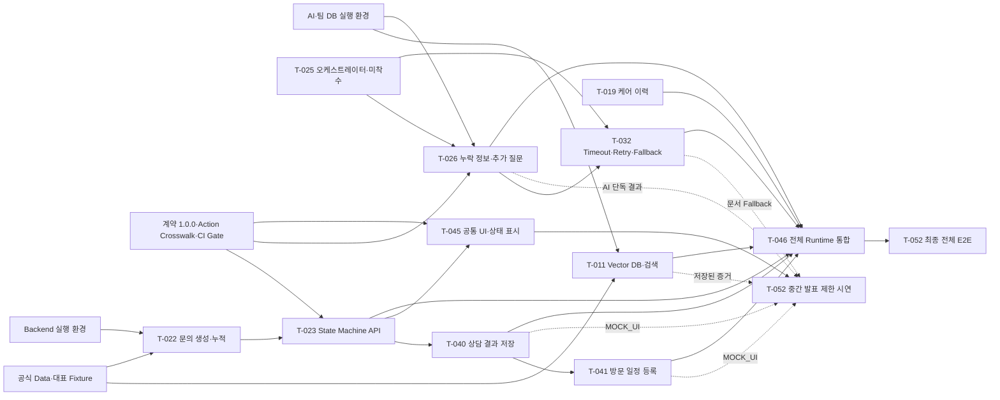

# 4주차 P0 의존성 Map

> 기준 Commit: `dad0e7a2c0e6c184ac8811bce6c6974bd7cb3fe0`  
> 기준일: **2026-08-07 KST**  
> 범위 동결일: **2026-08-05**  
> 운영 원칙: 발표 전 범위를 소급 확대하지 않고, 미완료 Runtime은 Mock·계약 전용·5주차 이관으로 분리한다.

## 1. 범위 분류

| 작업 | 4주차 분류 | 현재 상태 | 발표·이관 결정 |
|---|---|---|---|
| `T-011` Vector DB·검색 | 발표 전 가능하면 포함 | 격리 pgvector 후보 증거, 팀 DB·현재 Gate 미검증 | 중간 발표는 저장된 검색·근거 증거만 사용하고 팀 DB 재검증은 5주차 진입 조건 |
| `T-019` 케어 이력 | 발표 후 8월 7일 착수 | 미착수 | 중간 발표 필수 흐름에서 제외하고 선행 구독·제품 Runtime 확인 후 착수; 미충족 시 5주차 이관 |
| `T-022` 문의 생성·누적 | 발표 전 필수 | 생성·증상 제출 Runtime 존재, 추가 답변·자가조치·AI 효과 미구현 | 구현된 Slice만 `RECORDED_RUNTIME`, 나머지는 계약 전용 또는 이관 |
| `T-023` State Machine API | 발표 전 필수 | Engine·409·멱등성 기반과 일부 Runtime 존재, 상담·방문·완료 Event 미구현 | 구현된 Action 2개만 Runtime으로 인정하고 나머지는 Crosswalk 분류를 따름 |
| `T-026` 누락 정보·추가 질문 | 발표 전 가능하면 포함 | AI 구조화·누락 검사·질문 생성 구현, 소비자 연동 미완료 | AI 단독 결과는 저장된 증거로 사용하고 Backend·Web·Mobile 소비는 5주차 이관 |
| `T-032` Timeout·Retry·Fallback | 발표 전 가능하면 포함 | AI 단계별 Timeout·내부 1회 재시도 구현, Backend 상담 전환 E2E 없음 | AI 단독 기능으로만 표현하고 전체 장애 Fallback은 T-052 문서로 보완 |
| `T-040` 상담 결과 저장 | 발표 전 필수 | Web Mock 409·입력 유지·버튼 제어, 실제 HTTP·DB 저장 없음 | `MOCK_UI`; Backend Runtime 통과 전 Live 주장 금지 |
| `T-041` 방문 일정 등록 | 발표 전 가능하면 포함 | Web Mock Form·날짜 구분·버튼 제어, 방문 Runtime 없음 | `MOCK_UI`; 방문 분기 설명용으로만 포함 |
| `T-045` 공통 UI·상태 표시 | 발표 전 필수 | Web 공통 상태·오류·행동 표현 존재 | 현재 Web Gate를 유지하고 Mock·Runtime 표시를 숨기지 않음 |
| `T-052` 중간 발표 시연 준비 | 발표 전 필수 | 대표 식별자·근거 고정, 중앙 초기화·Fallback·리허설 3회 미완료 | 중간 발표 제한 시연과 최종 E2E를 분리하고 `W4-BLK-009` 유지 |

## 2. 산출물 기반 의존성

| 작업 | 시작에 필요한 선행 산출물 | 완료로 인정할 실행 증거 | 미충족 시 처리 |
|---|---|---|---|
| `T-011` | 처리된 공식 문서·Metadata, 임베딩 설정, 접근 가능한 pgvector | 같은 Commit의 Index 생성 로그, 제품·증상 필터 검색 결과, 정답 문서·페이지 평가 | 저장된 후보 결과만 사용하고 팀 DB 검증을 5주차로 이관 |
| `T-019` | `T-018` 구독·제품 Runtime, Care Schema·Migration, 인증 Scope | Care API 요청·응답, 구독·제품별 DB 누적 조회, 권한 Test | 발표 제외·5주차 이관 |
| `T-022` | Inquiry Schema·Migration, 구독·제품 Fixture, 문의 OpenAPI | 생성·누적 요청·응답, 동일 Inquiry DB 저장, 오류·멱등 Test | 구현된 생성·증상 제출 Slice만 사용 |
| `T-023` | State Machine 1.0.0, Action Crosswalk, `T-022` Inquiry Runtime, Backend 실행 환경 | 역할·담당자·Guard·409·멱등성·이력 Test, `correlation_id` 로그 | Action별 `CONTRACT_ONLY/DEFERRED` 유지 |
| `T-026` | AI 요청·응답 Schema, 구조화 기준, 질문 중복 방지 규칙 | 누락 필드·추가 질문 JSON, 중복 방지 Test, Backend 소비 예시 | AI 단독 증거로 제한하고 소비자 연동 이관 |
| `T-032` | AI 단계별 Timeout 설정, 오류 Schema, Backend 호출·상담 전환 경계 | Timeout·재시도 로그, 오류 응답, 상담 Fallback Event·DB E2E | AI 내부 결과만 인정하고 전체 Fallback은 문서·Mock으로 대체 |
| `T-040` | `T-023` 상담 Action Runtime, `T-039` 상세 조회, 상담 OpenAPI | 상담 저장 요청·응답, DB 저장, 상태 전이·409·멱등 Test, Web 표시 | Web Mock 유지, Runtime 완료 주장 금지 |
| `T-041` | `T-040` 방문 필요 분기, 방문 OpenAPI·Runtime, 합성 기사 Fixture | 방문 일정 요청·응답, 희망일·확정일 DB 저장, 권한·409 Test, Web 표시 | 방문 Mock만 사용하고 5주차 Runtime으로 이관 |
| `T-045` | 역할·상태·Action·오류 계약, Web Router·공통 Component | 역할별 Route, 상태 Badge, `allowed_actions`, 오류·Fallback Component Test | 기능별 Mock·미연동 표시 유지 |
| `T-052` | 고정 시연 ID·근거, 기능별 상태표, 실행·초기화 명령, 각 영역 증거 | 단계별 실행 결과, Fallback, `correlation_id`, 리허설 3회, QA 승인 | Live 실패 단계는 녹화·Mock·계약 전용으로 강등 |

담당자의 작업 완료 자체를 선행 조건으로 사용하지 않는다. 위 표의 파일·API·DB·Test·로그 산출물이 확인되어야 다음 단계로 이동한다.

## 3. 의존성 흐름

실선은 Runtime 또는 검증 산출물의 필수 의존성이고, 점선은 중간 발표에서 허용하는 저장 증거·Mock·문서 Fallback 의존성이다.

## 4. WBS 의존성 충돌과 결정

| 충돌 | 현재 사실 | 결정 |
|---|---|---|
| `T-026`, `T-032`가 `T-025` 완료를 전제로 하지만 `T-025`는 미착수 | 두 작업의 부분 Source와 Test는 이미 존재 | 기존 부분 구현은 `DONE_WITH_LIMITATION`으로 보존한다. 전체 오케스트레이터 통합은 `T-025` 완료 또는 명시적 의존성 예외 승인 후 진행한다. |
| `T-052`가 `T-046`에 의존하지만 중간 발표일은 `T-046`보다 빠름 | 중간 발표는 Live 전체 E2E가 아니라 제한 시연이었다. | `T-052 중간 발표`는 저장 증거·Mock·계약 전용 조합으로 분리하고, `T-052 최종 E2E`만 `T-046`을 필수 선행으로 유지한다. |
| `T-040`, `T-041` 화면은 있으나 `T-023` 상담·방문 Runtime이 없음 | Web Repository가 Mock 경계에서 동작 | 화면 구현 상태와 Runtime 완료 상태를 분리하고 5주차에는 Backend Operation 통과 후 Remote Adapter를 연결한다. |
| `T-011` 후보 증거는 있으나 팀 DB 현재 Gate가 없음 | 격리 pgvector 12/12 기록만 존재 | 중간 발표에서는 과거·격리 증거로 표시하고 현재 팀 DB 성공으로 승격하지 않는다. |

## 5. 5주차 이관 진입 조건

| 이관 항목 | 5주차 진입 조건 |
|---|---|
| `T-011` 팀 DB 검색 | 동일 Commit의 pgvector 연결·Index 생성·제품/증상 필터 평가 결과 |
| `T-019` 케어 이력 | 구독·제품 Runtime과 Care Migration·Seed 준비 |
| `T-023` 잔여 Action | Crosswalk에서 대상 Action을 `RUNTIME_IMPLEMENTED`로 바꿀 Source·OpenAPI·Test 증거 |
| `T-026` 소비자 연동 | Backend–AI Schema 검증과 Web·Mobile DTO 소비 Test |
| `T-032` 전체 Fallback | Backend Timeout·Retry·상담 전환 Event·DB 저장 E2E |
| `T-040`, `T-041` 실제 저장 | 상담·방문 G2 Operation Runtime, 권한·409·멱등·DB Test |
| `T-052` 최종 E2E | `T-046` 완료, 중앙 초기화 명령, 기능 상태표, Fallback, 리허설 3회 |

## 6. 범위 통제 결론

- 2026-08-05 이후 중간 발표 범위에는 신규 기능을 추가하지 않는다.
- Demo 로그인, 대표 고객·구독·문의, 증상·안전·근거 확인, 상담사 상세, 상담·방문 분기만 동결 범위로 유지한다.
- 전체 고객→상담사→기사→고객 완료 흐름은 중간 발표 필수가 아니며 `T-046` 이후 최종 E2E로 관리한다.
- 차단된 업무는 다른 담당자가 대신 구현하지 않고 Mock·계약 전용·5주차 이관 중 하나로 결정한다.
