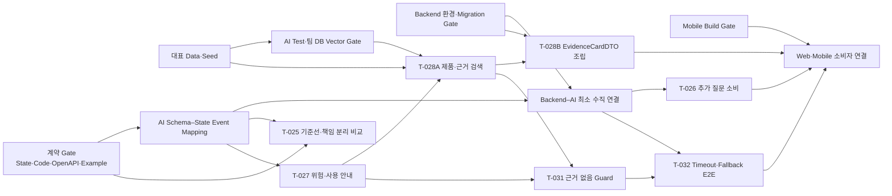

# 5주차 산출물 의존성 Map

> 기준일: **2026-08-07 KST**
> 기준 Commit: `dad0e7a2c0e6c184ac8811bce6c6974bd7cb3fe0`
> 연계: [진입 조건](week5-entry-criteria.md), [우선순위 Backlog](week5-priority-backlog.md)

## 1. 핵심 흐름

## 2. 산출물 기반 선행 관계

| 후속 작업 | 필요한 입력 산출물 | 완료 산출물 | 차단 시 처리 |
|---|---|---|---|
| AI Schema–Event Mapping | State Machine 1.0.0, AI Schema, 오류 Code | 요청·응답·Event·Fallback Mapping과 Test | 계약 Example까지만 작성 |
| Backend–AI 최소 연결 | Backend Gate, Mapping, 대표 Inquiry | HTTP·Schema·Event·DB·`correlation_id` E2E | 신규 소비자 연결 중단 |
| `T-025` | 공통 입력·출력 Schema, 동일 Fixture | 단일 RAG와 책임 분리 비교·결정 기록 | 비교 계획만 작성, Multi-Agent 완료 주장 금지 |
| `T-027` | 구조화 증상, 위험 규칙, 사용 안내 Code | 위험도·제한 범위·상담 필요 상태 Test | 규칙 단위 Test 우선 |
| `T-026` | 최소 수직 연결, 질문 Schema | 중복 없는 질문·답변 DB 저장과 DTO Test | AI 단독 결과 유지 |
| `T-028A` | 팀 DB Vector Gate, 제품·세대 Metadata, `T-027` | 공식 근거·페이지·관리 이력 구조화 출력 | 과거 12/12 증거 분석만 허용 |
| `T-028B` | `T-028A` 출력, Backend Gate, DTO 계약 | `EvidenceCardDTO`와 비노출 Test | 계약 Example로 유지 |
| `T-031` | 위험 분류와 검색 결과 | 근거 없음·불일치 시 자가조치 차단 Test | 판단 보류·상담 필요 Fixture 사용 |
| `T-032` | 최소 수직 연결, `T-031` | Timeout·Retry·안전 Template·상담 Event E2E | AI 내부 재시도까지만 인정 |
| Web·Mobile 연결 | 대상 Operation Runtime, DTO, 각 Client Gate | Remote Adapter·UiState·오류 처리 Test | Mock·Fixture 경계 유지 |

## 3. 병렬 작업 경계

- Backend 환경 복구, AI·Vector Gate, Mobile 환경 복구는 서로 병렬로 진행할 수 있다.
- `T-025` 비교 Fixture와 `T-027` 규칙 Test는 Backend–AI 수직 연결 전에도 진행할 수 있다.
- `T-028A` 실제 검색은 팀 DB Gate 이전에 완료로 처리하지 않는다.
- `T-028B`, `T-026`, `T-032`의 전체 Runtime은 Backend Gate와 최소 수직 연결 이후에 진행한다.
- KPI·모델 비교 계획·발표 문구 개선은 기능 구현과 분리하되 실제 측정값 없이 성과로 승격하지 않는다.

## 4. 5주차 종료 의존성

5주차 종료 시에는 `계약·Data → AI·Vector → Backend 최소 연결 → 위험·근거·Fallback → DTO·소비자` 경로의 각 경계에 실행 증거가 있어야 한다. 하나라도 Mock 또는 과거 증거라면 전체 경로를 E2E PASS로 표시하지 않는다.
