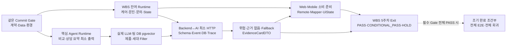

# 5주차 산출물 의존성 Map

> 기준일: **2026-08-10 KST**
> WBS 기준: `docs/planning/md/WBS.md` v2.1
> 기준 Commit: `main@dd172c796bfeede07a9f72094b5d044b67855381`
> 원칙: 담당자 이름이 아니라 **소비 가능한 산출물**이 다음 작업을 연다.

## 1. WBS 5주차 필수 흐름

## 2. 산출물 기반 선행 관계

| 후속 작업 | 필요한 입력 산출물 | 소비 가능 판정 | 목표 |
|---|---|---|---|
| WBS 대상 Web Remote | 조회·상담·방문 Runtime+Test | DTO·Pagination·권한·오류 계약 확정 | Runtime 제공 당일 |
| WBS 대상 Mobile Remote | 구독·문의·AI·Visit Runtime+Test | DTO·오류·인증·State 계약 확정 | Runtime 제공 당일 |
| Backend↔AI 실제 HTTP | AI Schema·Event Mapping, Backend Gate, 대표 Inquiry | HTTP·Schema·Event·DB·Trace PASS | 8/11 |
| 실제 근거·위험·Fallback | 팀 DB pgvector, 실제 LLM, 안전 규칙 | 정상·위험·근거 없음·장애 Test PASS | 8/11~8/14 |
| `EvidenceCardDTO` 조립 | 검증 검색 결과·근거 레지스트리·Lineage | 제품·세대·페이지 일치와 내부 정보 비노출 | 8/13~8/14 |
| Web·Mobile 소비 준비 | 공개 DTO·대상 Runtime·State 계약 | Mapper·UiState·화면 Test와 Mock 자동 대체 없음 | 8/12~8/14 |
| WBS 5주차 Exit | 필수 Gate와 영역별 증거 | 미완료 담당자·목표일·해제 조건 포함 | 8/14 |
| 대표 E2E 조기 착수 | 위 필수 산출물 전체와 고정 Fixture | 모든 선행 Gate PASS | 조건 충족 시 |

## 3. 일자별 Critical Path

| 날짜 | 필수 출력 | 지연 시 차단되는 출력 |
|---|---|---|
| 8/10 | 계획·Gate·Agent 책임·당일 WBS Runtime | Backend↔AI, 소비자 Adapter |
| 8/11 | 실제 LLM·Vector·Backend↔AI 최소 HTTP | 위험·근거·Fallback, 공개 DTO |
| 8/12 | 추가 질문·위험 분류·검색·소비 준비 | EvidenceCardDTO, 잔여 Runtime |
| 8/13 | 검색·Evidence·추적·Remote 경계 | 5주차 Exit 증거 취합 |
| 8/14 | 필수 회귀·Blocker·후속 인계 | WBS 5주차 Exit |

## 4. 병렬 작업 경계

- 계약·Data·Backend·AI·Web·Mobile Gate는 같은 Commit에서 병렬 실행한다.
- Backend Runtime 생산과 Web·Mobile Adapter 준비는 승인된 DTO를 기준으로 병렬 진행한다.
- AI Runtime과 Backend Client·Mapper는 Schema·Event Mapping이 고정되면 병렬 진행한다.
- 선행 산출물이 FAIL이면 후속은 Fixture·Adapter Test까지만 가능하며 Runtime 완료로 표시하지 않는다.
- 조기 완료 업무는 필수 Critical Path의 인력과 시간을 빼앗지 않는 경우에만 시작한다.

## 5. 6~7주차 유지 경계

| 산출물 | 현행 일정 | 5주차 처리 |
|---|---|---|
| 상담 요약 저장·확정 통합, 기사 리포트, 역할별 일관성 | `T-030A`~`T-030C`, 8/18~8/20 | 상담 요약 최소 Runtime 이후의 고도화만 조기 완료 조건부 |
| 기사 조치·사후 관리·고객 후속 확인 | `T-043`, `T-044`, `T-055`, 8/14~8/19 | 5주차 날짜에 걸친 선행 경계만 수행, 완료는 후속 일정 유지 |
| 전체 서비스 통합 | `T-046`, 8/21~8/24 | 조기 완료 조건부 |
| 전체 검증 | `T-047`~`T-051`, 8/25~8/28 | 조기 완료 조건부 |

필수 경로 중 하나라도 과거 증거·Mock·미실행이면 조기 완료 Gate를 열지 않는다.
