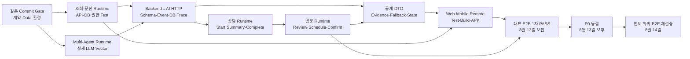

# 5주차 산출물 의존성 Map

> 기준일: **2026-08-10 KST**  
> 기준 Commit: `f3c66b3cbfd41852440bf0726722438612d6885f`  
> 원칙: 담당자 이름이 아니라 **소비 가능한 산출물**이 다음 작업을 연다.

## 1. P0 Feature Complete 흐름

## 2. 산출물 기반 선행 관계

| 후속 작업 | 필요한 입력 산출물 | 소비 가능 판정 | 목표 |
|---|---|---|---|
| 상담사 목록·상세 Web Remote | `GET /api/v1/inquiries` Runtime+Test PASS | Pagination·Filter·권한 응답 확정 | 8/10~11 |
| 고객 구독·문의 Mobile Remote | 구독·문의 Runtime+Test PASS | DTO·오류·인증 계약 확정 | 8/10~12 |
| Backend↔AI 실제 HTTP | AI Schema·Event Mapping, Backend Gate, 대표 Inquiry | 실제 HTTP·Schema·Event·DB·Trace PASS | 8/11 |
| 실제 근거·위험·Fallback | 팀 DB pgvector, 실제 LLM, 안전 규칙 | 정상·위험·근거 없음 Test PASS | 8/11~12 |
| 상담 Runtime·Web Action | 상담 Operation·DB·State Test | 409·멱등성·권한 포함 PASS | 8/12 |
| 방문 Runtime·Client Remote | 방문 Operation·기사 객체 권한 Test | Review·Create·Schedule·Confirm PASS | 8/12~13 |
| AI·Evidence Client 소비 | 공개 DTO·비노출 Test | Web·Mobile Mapper·UiState PASS | 8/12 |
| 대표 E2E | 위 산출물 전체와 고정 Fixture | Mock 자동 대체 없이 단계별 증거 확보 | 8/13 오전 |
| 최종 Feature Complete | 동결 Commit·1차 E2E 결과 | 전체 회귀·정상/Fallback E2E 재실행 | 8/14 |

## 3. 일자별 Critical Path

| 날짜 | Critical Path 출력 | 지연 시 차단되는 출력 |
|---|---|---|
| 8/10 | Gate·조회/문진 Runtime·Agent 계약·Remote 기반 | Backend↔AI, 상담 조회, Client 전환 |
| 8/11 | 실제 LLM·Vector·Backend↔AI HTTP | 상담/기사 Agent, 근거 DTO, E2E 조립 |
| 8/12 | 상담·방문 Runtime·후반 Action 승인·Client AI 소비 | Visit Remote, 대표 E2E |
| 8/13 오전 | Client Remote와 정상 대표 E2E | 동결 후보 Commit |
| 8/13 오후 | P0 동결 | 최종 회귀 기준선 |
| 8/14 | 전체 회귀·E2E 재검증 | 6주차 Release Gate |

## 4. 병렬 작업 경계

- 계약·Data·Backend·AI·Web·Mobile Gate는 8월 10일 병렬 실행한다.
- 조회 Runtime 생산과 Client Remote 기반 작업은 계약 DTO를 기준으로 병렬 진행한다.
- AI Runtime과 Backend Client·Mapper는 Schema·Event Mapping이 고정되면 병렬 진행한다.
- P1 조사와 문서화는 P0 Critical Path를 방해하지 않는 범위에서만 허용한다.
- 선행 산출물이 FAIL이면 후속은 Fixture·Adapter Test까지만 가능하며 Runtime 완료로 표시하지 않는다.

## 5. 종료 의존성

`고정 입력 → 실제 LLM·Vector → Backend HTTP·DB·State → 상담·방문 Runtime → Web·Mobile Remote → 대표 E2E → 동결 → 전체 회귀` 중 하나라도 과거 증거·Mock·미실행이면 5주차 Feature Complete를 PASS로 판정하지 않는다.
