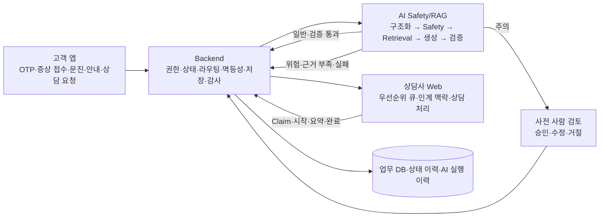

# WaterBridge MVP 기획서 · KPI · 기대효과

- 작성 기준일: 2026-08-28
- 저장소 기준: `95f90f843124373fc97c6cd9e258b1427e0cbde8`
- PPT 기획 범위: 고객 앱 + 상담사 Web + Backend + AI Safety/RAG
- 구현 가정: 위 네 영역의 핵심 사용자 여정이 MVP로 구현되었다고 가정한다.
- 제외 범위: 방문기사 앱의 현장 처리, 운영자 통합 대시보드, 상용 배포 성과는 핵심 MVP 성과에서 제외한다.

> 이 문서의 목표 수치는 운영 실적이 아니라 파일럿 가설이다. 외부 연구 수치를 WaterBridge의 달성 성과로 바꾸어 쓰지 않는다.

> WaterBridge는 2026년 7월 20일 저장소 개발을 시작한 포트폴리오 MVP다. 현업 고객센터 운영 데이터가 없으므로 **현재 구현으로 검증할 제품·안전 품질**과 **향후 현업 파일럿에서 검증할 사업 KPI**를 분리한다.

---

## 1. 기획 결론

### 1.1 프로젝트를 한 문장으로 정의

> **WaterBridge는 고객 앱과 상담사 시스템을 연결해 반복 상담의 정보 재수집 공수를 줄이고, 정수기 위험 문의의 대응 품질을 높이는 B2B2C 고객지원 운영 솔루션이다. 제품별 공식 근거가 확인된 저위험 문제만 자동 안내하고, 위험·불확실·미해결 문의는 고객 맥락을 보존해 사람에게 넘긴다.**

### 1.2 기획에서 버려야 할 표현

`AI 챗봇`, `24시간 자동 상담`, `RAG 기반 답변`만으로는 차별화가 약하다. 세 표현은 기능을 말할 뿐 고객의 문제가 어떻게 끝까지 해결되는지 설명하지 못한다.

WaterBridge의 설득 포인트는 다음 세 가지다.

1. **답변보다 안전을 먼저 판단한다.**
2. **근거가 없으면 추측하지 않고 멈춘다.**
3. **AI가 해결하지 못해도 고객이 처음부터 다시 설명하지 않게 한다.**

### 1.3 발표의 중심 주장

> 문제는 정보 부족이 아니라, 고객의 제품·증상·위험도·시도 내역·업무 상태가 앱과 고객센터 사이에서 끊기는 것이다. WaterBridge는 이 단절을 하나의 안전한 해결 여정으로 연결한다.

### 1.4 발표 커뮤니케이션 목표

발표가 끝났을 때 평가자는 WaterBridge를 범용 챗봇이 아니라 **공식 근거, 안전 차단, 상태 통제, 상담 인계를 결합한 end-to-end 서비스**로 이해해야 한다.

### 1.5 1차 구매자와 구매 이유

WaterBridge의 1차 구매자는 정수기 고객이 아니라 **렌탈·고객센터 운영 책임자와 CX·디지털 전환 책임자**다. 고객 앱은 구매 상품이 아니라 상담 전 단계의 증상·위험·시도 내역을 구조화하는 B2C 접점이다.

> **1차 구매 논리: 반복 상담을 무리하게 자동화하지 않으면서, 저위험 문의의 디지털 해결과 위험 문의의 조기 인계를 함께 운영하는 안전한 고객센터 전환**

| 이해관계자 | 핵심 가치 | 우선 검증 지표 |
|---|---|---|
| 고객 | 빠르고 안전한 다음 행동, 반복 설명 감소 | 안전한 해결, 7일 재접촉, CSAT |
| 상담사 | 상담 전 제품·증상·위험·시도 내역 확보 | Handoff 품질, 요약 준비시간, 동일군 AHT |
| 고객센터 운영 책임자 | 저위험 반복 문의 처리 Capacity와 위험 대응 품질 개선 | 상담 접촉률, 시간당 해결 건수, 위험 대응시간 |
| CX·AI 책임자 | 무근거 답변 차단과 감사 가능한 AI 운영 | Unsafe exposure, 근거 추적, Trace 연결 |

---

## 2. 왜 필요한가: 문제와 외부 근거

### 2.1 정수기는 반복적인 관리·문의 접점이 큰 생활가전이다

환경부의 2024년 상수도 서비스 이용 조사에서 전국 72,460가구 중 정수기 설치 응답은 53.6%로, 2021년보다 4.2%p 증가했다. 이 수치는 정수기 시장점유율이나 고장률은 아니지만, 정수기 관련 고객지원이 일부 사용자의 문제가 아니라 넓은 생활 기반을 가진 문제라는 근거가 된다. [환경부 조사](https://me.go.kr/home/web/board/read.do?boardMasterId=1&boardId=1712700&menuId=10525)

### 2.2 렌탈 고객경험은 계약 이후의 품질·A/S까지 이어진다

한국소비자원이 집계한 2022년~2025년 6월 가전제품 구독·렌탈 피해구제 신청은 2,624건이며, 품목이 확인된 사례에서 정수기 비중은 58.2%로 가장 높았다. 전체 품목의 피해 유형 중 품질·A/S 관련은 34.6%였다. 이는 전체 정수기 문의량이나 고장률이 아니며, 34.6%도 정수기 단독 비율이 아니다. 다만 렌탈 고객경험을 계약 체결만으로 볼 수 없고 고장 진단과 사후 대응까지 관리해야 한다는 근거가 된다. [한국소비자원](https://www.kca.go.kr/kca/sub.do?menukey=5293&mode=view&no=1004451771)

### 2.3 고객은 셀프서비스를 사용하지만 실제 해결까지 도달하기 어렵다

Gartner가 2023년 12월 고객 5,728명을 조사한 결과, 73%가 고객서비스 여정 중 셀프서비스를 이용했지만 셀프서비스만으로 완전히 해결한 비율은 14%였다. 실패 사례의 43%는 관련 콘텐츠를 찾지 못했고, 셀프서비스를 시작한 고객의 45%는 기업이 자신의 의도를 이해하지 못했다고 답했다. 해외 일반 고객서비스 조사이므로 국내 정수기 고객의 기준선으로 직접 사용하지 않고, **검색창이나 챗봇을 제공하는 것과 실제 해결은 다르다**는 문제 근거로 사용한다. [Gartner](https://www.gartner.com/en/newsroom/press-releases/2024-08-19-gartner-survey-finds-only-14-percent-of-customer-service-issues-are-fully-resolved-in-self-service)

### 2.4 생성형 AI는 생산성을 높일 수 있지만 안전한 자동화를 보장하지 않는다

한 Fortune 500 소프트웨어 기업의 상담사 5,172명을 분석한 QJE 연구에서는 생성형 AI 보조 도구 도입 후 시간당 해결 건수가 평균 15.2% 증가했다. 다만 이는 상담사를 보조한 단일 기업 연구이며 정수기 자가조치 서비스의 확정 효과가 아니다. WaterBridge에서는 **효과가 날 수 있는 방향과 측정 설계의 참고 근거**로만 사용하고, 목표치로 복사하지 않는다. [Brynjolfsson·Li·Raymond, QJE 2025](https://doi.org/10.1093/qje/qjae044)

NIST는 생성형 AI가 확신 있게 잘못된 내용을 만드는 `confabulation`을 주요 위험으로 분류하고, 출처 검증, 인간 검토, 안전한 실패, 운영 중 모니터링을 권고한다. 따라서 RAG만으로 안전하다고 주장할 수 없으며, **Safety → 승인 근거 검색 → 출력 검증 → 인간 인계**가 함께 있어야 한다. [NIST AI 600-1](https://doi.org/10.6028/NIST.AI.600-1)

### 2.5 기업의 실제 투자로 확인된 문제 범주 수요

WaterBridge와 유사한 문제 영역이 실제 기업의 예산·구축 과제라는 근거도 확인된다.

- 마음AI 분기보고서의 진행기준 수주계약 현황에는 수행 회사 `㈜웅진`, 발주처 `SK매직`, 계약액 9,600만 원, 계약기간 2025년 4월 14일~7월 31일, 진행률 100%가 기록돼 있다. 수주상황의 계약명은 `SK 매직 AICC Planning`이다. 이는 **AICC 운영 완료가 아니라 기획 용역 완료**를 뜻한다. [마음AI 2025년 3분기 공시](https://kind.krx.co.kr/external/2025/11/14/002625/20251114006025/11013.htm)
- 2026년 8월 24일 전자신문은 SK인텔릭스가 AICC 신규 투자를 가결하고 개발사 선정 초기 단계에 들어갔으며, AS·수리·배송·렌탈 요금 등 반복 문의 자동화와 상담사 답변 추천·자동 요약을 추진한다고 보도했다. 기사 발행일 기준 구축 완료는 2027년 이후로 전망됐다. [전자신문](https://www.etnews.com/20260824000234)
- WaterBridge 저장소의 최초 Commit은 2026년 7월 20일이다. 따라서 공개 보도에 맞춰 사후 구성한 주제는 아니지만, SK매직의 내부 AICC 기획은 2025년에 먼저 진행됐으므로 `업계보다 먼저 발견했다`고 주장하지 않는다.

이 근거가 입증하는 것은 **정수기·렌탈 고객지원 AI 자동화가 실제 투자 과제라는 범주 수요**다. WaterBridge 자체의 구매 의사, 제품–시장 적합성, 공수 절감 효과를 입증하는 자료는 아니다.

> WaterBridge는 공개 자료를 참고한 독립 포트폴리오 프로젝트이며 SK매직·SK인텔릭스와 협업·납품·실증 관계가 없다.

### 2.6 아직 확인되지 않은 문제의 크기

외부 자료와 기업 투자 사례는 문제의 존재와 방향을 뒷받침하지만, WaterBridge가 겨냥한 증상형 문의의 월간 규모·원가·반복 설명 비중까지 보여주지는 않는다. 현업 파일럿 전에는 다음 수치를 실적처럼 제시하지 않는다.

| 필요한 현업 기준선 | 검증 목적 |
|---|---|
| 월 정수기 증상 문의 건수와 상담 전환율 | 해결 대상 규모와 디지털 전환 여지 |
| 제품·위험도별 평균 상담시간 | 인계 요약의 처리 Capacity 효과 |
| 7일 동일 문제 재접촉률 | 실제 미해결·재발 문제의 크기 |
| 상담 시작 후 핵심 정보 재수집 비율 | 맥락 인계의 가치 |
| 방문 후보와 최종 방문 결과 | P1 방문 Workflow가 구현된 이후의 확장 가설 기준선 |

### 2.7 문제 정의

현재 고객 여정에서 발생하는 핵심 단절은 다음과 같다.

- 고객은 긴 매뉴얼에서 자신의 제품과 증상에 맞는 조치를 찾기 어렵다.
- 일반 챗봇은 제품 모델과 위험 맥락을 놓친 채 그럴듯한 답을 만들 수 있다.
- 위험 문의와 단순 문의가 같은 상담 대기열에 섞이면 긴급한 사례의 대응이 늦어진다.
- AI나 셀프서비스가 실패한 뒤 상담으로 넘어가면 고객이 같은 설명을 반복한다.
- 문의·AI 판단·근거·상담 결과가 구조화되지 않으면 실패 원인을 개선하기 어렵다.

---

## 3. 목표 고객과 해결 과업

### 3.1 핵심 사용자

| 사용자 | 현재 어려움 | WaterBridge가 해결할 과업 |
|---|---|---|
| 정수기 구독 고객 | 증상의 원인과 위험도를 모르고, 매뉴얼 탐색과 고객센터 대기를 반복한다. | 내 제품과 현재 증상에 맞는 안전한 다음 행동을 빠르게 확인한다. |
| 상담사 | 고객 설명을 다시 듣고 제품·증상·이전 조치를 재구성하는 데 시간이 든다. | 상담 시작 전에 위험도, 문진, 시도 행동, AI 판단을 확인하고 바로 해결에 집중한다. |
| 서비스 운영·QA | 상담 결과는 남아도 AI 판단과 실패 원인이 연결되지 않는다. | 문의부터 AI·상담까지 같은 식별자로 추적하고 위험·근거 부족·시간 초과를 구분한다. |

### 3.2 제품 목표

1. 저위험·근거 충분 문의는 고객이 스스로 안전하게 해결할 수 있게 한다.
2. 위험·불확실·미해결 문의는 지연 없이 상담으로 전환한다.
3. 상담 인계 시 고객이 이미 제공한 맥락을 보존한다.
4. 상담 완료 여부가 아니라 고객이 확인한 해결 결과까지 측정한다.
5. AI 답변 수가 아니라 안전·해결·재접촉을 함께 최적화한다.

MVP의 범위는 다음 세 가지 검증 질문으로 압축한다.

1. **저위험·근거 충분 문의에만 안전한 안내를 제공할 수 있는가?**
2. **위험·불확실·실패 문의를 잘못 붙잡지 않고 상담으로 전환할 수 있는가?**
3. **상담사가 전달된 맥락으로 고객 정보 재수집과 상담 준비를 줄일 수 있는가?**

OTP와 합성 계약 라우팅은 위 여정을 가능하게 하는 접근 통제·시연 보조 기능이다. 이를 독립적인 범용 인증·라우팅 제품으로 설명하지 않는다.

### 3.3 비목표

- AI가 모든 문의를 자동으로 해결하는 것
- 의학적·전기적 원인을 확정 진단하는 것
- 상담 전환율이나 방문 건수를 무조건 낮추는 것
- 승인되지 않은 인터넷 자료를 공식 해결 근거로 사용하는 것
- MVP 단계에서 방문기사 현장 업무와 운영자 전체 기능까지 완결하는 것

---

## 4. 서비스 설계

### 4.1 핵심 사용자 여정

1. 시연 환경의 고객이 계약 이메일 OTP로 본인·계약을 확인하고 본인의 구독 제품을 선택한다.
2. 고객이 증상을 입력하면 Backend가 고객 권한, 제품, 현재 문의 상태를 검증하고 문의를 생성한다.
3. AI가 증상을 구조화하고 누수·전기·온수 등 위험도를 먼저 판정한다.
4. 정보가 부족하면 해결 가능성을 높이는 후속 질문만 제시한다.
5. 저위험 문의는 정확한 제품 모델과 승인된 공식 문서로 검색 범위를 제한한다.
6. 일반 저위험 문의는 근거와 출력 검증을 통과한 경우에만 자가조치 안내를 제공한다.
7. 주의 문의는 `PRE_SEND_HUMAN_REVIEW`로 보내 고객 노출 전에 사람이 승인·수정·거절한다.
8. 위험, 근거 부족, 시간 초과, 검증 실패, 사람 검토 거절 또는 고객 미해결이면 상담으로 전환한다.
9. Backend는 HumanReview 원장과 결정 이력을 보존하고, 상담사 Web에는 제품·증상·문진·위험·시도 행동·AI 요약을 함께 전달한다.
10. 예약 계약은 지정 상담사의 대기열로 제한하고, 일반 계약은 공용 Claim 흐름을 유지한다.
11. 상담사는 문의를 가져와 상담을 시작하고 요약을 확정한 뒤 해결 또는 방문 검토로 마무리한다.

현재 Commit에는 주의 분기 정책·AI HITL 흐름·Backend HumanReview 원장과 API 근거가 있다. 다만 Web·Mobile의 사람 검토 화면을 포함한 전체 수직 E2E는 `HOLD`이므로 발표에서는 `정책·Backend 구현, 화면 통합 검증 대기`로 구분한다.

### 4.2 시스템 구조



### 4.3 컴포넌트별 책임

| 영역 | 책임 | 하지 않는 일 |
|---|---|---|
| 고객 앱 | 계약 이메일 OTP, 본인 제품 선택, 증상 접수, 문진 응답, 안내 행동, 해결 확인, 상담 요청 | 업무 상태를 독자적으로 결정하지 않는다. |
| 상담사 Web | 위험·우선순위 기반 큐, 상담 Claim·시작, 인계 맥락 확인, 요약 확정, 완료 | AI 내부 원문이나 검색 점수를 임의 해석하지 않는다. |
| Backend | OTP 인증·객체 권한, 상태 전이, 트랜잭션, 멱등성, 계약별 상담 라우팅, AI 호출, 최종 저장, 감사 이력 | AI가 지시한 다음 상태를 그대로 적용하지 않는다. |
| AI Safety/RAG | 증상 구조화, 위험 분류, 공식 근거 검색, 답변 생성·검증, 인계 요약 | 업무 DB나 문의 상태를 직접 변경하지 않는다. |

### 4.4 차별화 포인트

| 일반적인 접근 | WaterBridge |
|---|---|
| 질문을 받으면 곧바로 답변 생성 | 답변 전에 위험도를 판정하고 위험하면 자가조치를 차단 |
| 일반 지식 또는 유사 문서 검색 | 정확한 제품 모델과 승인된 공식 문서만 허용 |
| 근거가 약해도 최선의 답변 생성 | 근거 부족·검증 실패 시 답변을 강행하지 않는 Fail-closed 처리 |
| 챗봇과 상담 시스템이 분리 | 증상·문진·시도 행동·AI 판단을 상담사에게 맥락째 인계 |
| AI가 대화 흐름과 상태를 사실상 통제 | Backend 상태 머신과 `allowed_actions`가 최종 행동을 통제 |
| 성공을 응답률·이용률로 평가 | 해결 확인, 7일 재접촉, Safety, CSAT를 함께 평가 |

---

## 5. 현재 MVP 구현 근거

이 절은 과거 기획 문서가 아니라 기준 Commit의 코드·계약을 확인한 결과다.

| 확인 영역 | 현재 코드 근거 | PPT에서 가능한 표현 |
|---|---|---|
| 고객 앱 여정 | `mobile/core/.../WaterCareApi.kt`에 문의 생성, 증상 제출, 문진, 안내, 상담 요청 API 소비가 연결됨 | 고객 앱에서 증상 접수부터 상담 요청까지 하나의 여정을 제공한다. |
| 계약 이메일 OTP | `backend/apps/accounts/services/p1_auth_email_service.py`가 AWS 비운영 환경·Enable Gate·HMAC Allowlist를 모두 만족한 승인 시험 수신자만 허용 | 기존 OTP 흐름을 유지하면서 AWS 비운영 시연의 실제 메일 발송을 Fail-closed로 통제한다. |
| AI 실행 연결 | `backend/apps/inquiries/services/inquiry_transition_service.py`에서 증상 제출 트랜잭션 커밋 후 AI 분석 호출 | Backend가 상태와 저장을 확정한 뒤 AI 처리를 연결한다. |
| Safety-first 파이프라인 | `ai/app/orchestration/pipelines/single_rag_pipeline.py`, `ai/app/safety/**` | 증상 구조화 후 위험도를 우선 판정하고 위험 문의는 상담으로 전환한다. |
| 제품·문서 필터 | `ai/app/retrieval/filters/product_filter.py`, `document_policy_filter.py` | 같은 제품의 승인된 문서가 있을 때만 자가조치 근거로 사용한다. |
| 업무 상태 통제 | `contracts/state-machine/**`, `backend/apps/workflow/models/transition_history.py` | AI나 화면이 아닌 Backend가 상태 전이와 허용 행동을 통제한다. |
| 상담사 Web | `web/src/features/consultation/repositories/**` | 상담사는 대기열 조회, Claim, 상담 시작, 요약 확정, 완료를 수행한다. |
| 계약별 상담 라우팅 | `backend/apps/inquiries/p1_team_routing.py`와 Claim service가 예약 계약 6건을 지정 상담사에게 제한 | 데모 예약 계약은 지정 상담사에게 분리하고 일반 계약은 기존 공용 대기열을 유지한다. |
| 상담 인계 | `ai/app/orchestration/handoff/consultation_handoff_agent.py`, Backend handoff service/repository | 고객의 증상·문진·위험·시도 내역을 상담 요약으로 연결한다. |
| 운영 계측 | `AIRun`, `TransitionHistory`, `Consultation`, `FollowupConfirmation` 모델 | AI 지연, 상태 전이, 상담 처리시간, 해결 결과를 연결해 측정할 수 있다. |

### 5.1 현재 기준의 표현 제한

사용자 요청에 따라 PPT에서는 핵심 MVP가 구현되었다고 가정한다. 다만 다음을 이미 달성한 성과처럼 말하면 안 된다.

- KPI 수치는 아직 파일럿 목표이며 운영 실적이 아니다.
- 현재 OTP Challenge와 대상 고객은 합성 데이터 범위이므로 `운영 고객 인증 완료`라고 표현하지 않는다.
- 고객 화면에 공식 출처 카드가 직접 노출된다고 단정하지 않는다. 현재 기준 표현은 **공식 근거를 내부 검증한 안내**가 정확하다.
- 자가 해결 확인 이벤트가 운영 원장에 완전히 계측된다는 전제가 있어야 자가 해결률을 실측할 수 있다.
- 현재 계약별 전용 라우팅은 6개 합성 예약 계약을 위한 MVP 규칙이며 범용 조직·권역 라우팅 엔진으로 과장하지 않는다.
- 라우팅은 `SKN-001~006`과 예약 합성 계약의 정적 매핑이며 AI 자동 배정·역량 기반 배정·부하 분산이 아니다.
- 지정 상담사 부재 시 자동 Fallback이 확인되지 않았으므로 정체 감지와 수동 인계 절차가 필요하다.
- 표적 테스트 통과는 실제 PostgreSQL·외부 LLM·실서비스 트래픽의 end-to-end 검증을 대체하지 않는다.

### 5.2 현재 Commit의 검증 메모

기준 Commit `95f90f843124373fc97c6cd9e258b1427e0cbde8`에서 2026년 8월 28일 다음 표적 검증을 실행했다.

- AI 응답 라우팅 정책·HITL Workflow·Runtime routing: **22 passed**.
- Backend AI 상담 Handoff Runtime·HumanReview Runtime: **28 passed, 2 skipped**.
- Skip 2건은 실제 PostgreSQL 행 잠금 증거가 필요한 테스트다. 따라서 동시성 의미론까지 통과했다고 해석하지 않는다.
- 현재 Safety 정식 평가 파일은 4건이며 danger 양성은 2건뿐이다. 이는 분기 Smoke 증거이지 운영 위험 Recall 또는 오류율 1% 미만의 증거가 아니다.
- 저장소 데이터 기준은 3모델 144쪽·Child 53개·검색 평가 50건이지만, Public Runtime은 `WPUJAC104DWH`만 활성이고 `WPUIAC425SNW`·`WPUIAC606SNW`는 Activation Gate 전까지 HOLD다.
- 미검증: 전체 Backend·AI·Web 회귀, PostgreSQL 행 잠금 표적, 실제 외부 LLM, Web·Mobile 사람 검토 화면, 고객→상담 결과 전체 수직 E2E, AWS 배포, Mobile build.

따라서 PPT에는 `핵심 정책·계약·표적 Runtime 검증`이라고 표현할 수 있지만, `상용 운영 검증 완료`, `3모델 운영 지원 완료`, `KPI 달성`이라고 표현하면 안 된다.

### 5.3 구현 완료와 운영 검증의 경계

| 현재 코드·합성 데이터로 검증할 수 있는 것 | 현업 데이터가 있어야 검증할 수 있는 것 |
|---|---|
| 고객→Safety/RAG→상담의 계약·상태 흐름 | 실제 고객의 안전 확인 해결률 |
| 라벨 안전셋의 위험 분류와 Fail-closed | 실제 운영 위험 False Negative |
| 제품별 공식 근거 검색과 근거 부족 차단 | 고객이 체감한 안내 유용성·CSAT |
| Handoff Schema 생성·저장·상담 조회 | 반복 설명과 상담 AHT의 실제 감소 |
| 멱등성·권한·Trace 연결 | 상담 접촉량·원가·인력 Capacity 효과 |

이 구분은 구현 부족을 숨기기 위한 것이 아니다. 포트폴리오 MVP의 현재 성과와 현업 도입 시 검증해야 할 사업 가설을 같은 숫자로 섞지 않기 위한 경계다.

---

## 6. 프로젝트 개요 슬라이드 작성안

첨부된 `01 프로젝트 개요` 형식의 다섯 칸에는 다음 정도만 넣는다. 문장을 더 늘리면 한 슬라이드에서 핵심이 흐려진다.

### 1) 프로젝트 주제 및 선정 배경·기획 의도

**고객 앱과 상담사 시스템을 연결해 반복 상담 공수와 위험 문의 대응 품질을 함께 개선하는 B2B2C 고객지원 운영 솔루션**

- 반복 문의의 정보 재수집과 고객센터 처리 Capacity 문제
- 셀프서비스 이용과 실제 해결 사이의 격차
- 위험 문의를 놓치지 않는 Safety·공식 근거·인간 인계 필요

### 2) 프로젝트 내용

- 고객 앱에서 제품별 증상 접수와 적응형 문진
- 시연 고객의 계약 이메일 OTP 인증과 구독 제품 연결
- 위험 증상 선차단 후 공식 매뉴얼 기반 RAG 안내
- 위험·근거 부족·미해결 문의의 상담 자동 전환
- 상담사 Web에서 계약별 대기열, 인계 맥락 확인, 상담 처리, 요약 확정

### 3) 활용 장비 및 재료

- 고객 앱: Android·Kotlin
- 상담사 Web: React·TypeScript
- Backend: Django·DRF·PostgreSQL
- AI: FastAPI·LangGraph·Safety·RAG
- 검증 자산: 승인 문서, 합성 안전 시나리오, API·상태·AI 계약

### 4) 프로젝트 구조

> 고객 앱 → Backend 상태·권한 통제 → AI Safety/RAG → Backend 결과 저장 → 상담사 Web

분기 원칙: `안전한 근거 있음 → 자가조치`, `위험·근거 부족·실패 → 맥락 보존 상담`

### 5) 활용방안 및 기대효과

- 고객: 즉시 안전 안내와 반복 설명 감소
- 상담사: 사전 맥락 확보와 처리시간 단축
- 기업: 저위험 반복 문의의 안전한 디지털 전환
- 운영·QA: 문의–AI–상담 전 과정의 추적과 개선

---

## 7. KPI 체계

### 7.1 KPI 설계 원칙

`AI 응답률`, `챗봇 이용률`, `상담 전환 감소율`을 단독 핵심 KPI로 두면 시스템이 위험 문의까지 붙잡는 방향으로 왜곡될 수 있다.

반드시 다음 묶음으로 판정한다.

> **해결률 상승 + 7일 재접촉 감소 + Safety 위반 없음 + CSAT 비열등**

포트폴리오 MVP에서는 KPI를 두 계층으로 분리한다.

| 계층 | 현재 판정 가능 여부 | 목적 |
|---|---|---|
| 제품·안전 품질 Gate | 합성·라벨 데이터와 E2E로 판정 가능 | 잘못된 안내를 차단하고 근거·인계 구조가 작동하는지 검증 |
| 현업 운영·사업 KPI | 실제 고객센터 기준선과 비교군 필요 | 고객 해결, 상담 공수, 재접촉, 만족도 효과 검증 |

현재 발표에서 `달성 결과`로 제시할 수 있는 것은 첫 번째 계층의 현재 Commit 검증값뿐이다. 두 번째 계층은 **도입 효과가 아니라 파일럿 측정 계획**으로 표시한다.

### 7.2 North Star: 안전 확인 해결률

```text
안전 확인 해결률
= 안전 정책 위반 없이 고객이 해결을 확인하고
  7일 이내 동일 문제 재접촉이 없는 문의 수
  ÷ 7일 관찰 기간이 끝난 유효 문의 수
  × 100
```

- 유효 문의: 실제 고객이 제출해 AI 안내 또는 상담 여정이 시작된 문의
- 제외: 테스트, 검증된 멱등 재시도 중복, 유효 문의 성립 전 취소, 관찰 기간 미완료
- 증상 제출 이후 취소·중도이탈은 `DROP_OFF`로 분모에 남겨 성과 부풀림을 막는다.
- 동일 문제: 같은 고객의 같은 구독 제품과 동일 증상군으로 7일 안에 생성된 재문의 또는 재개
- 위험 누락이나 금지 행동 노출이 있었던 문의는 고객이 해결을 눌러도 성공에서 제외
- 후속 확인 무응답은 `UNKNOWN`으로 표시하되 유효 문의 분모에는 포함하고 해결로 추정하지 않는다.
- 절대 목표치는 2주 기준선과 제품·증상·위험 분포를 확인한 뒤 확정한다.

North Star는 AI 자가 해결과 상담 해결을 모두 포함한다. AI의 목적을 상담 회피가 아니라 안전한 최종 해결에 맞추기 위해서다.

North Star 하나로 원인을 숨기지 않도록 다음 세 층으로 함께 분해한다.

| 계층 | 필수 분해 지표 |
|---|---|
| 최종 결과 | 7일 관찰 완료 안전 확인 해결률, 무응답률 |
| 해결 경로 | AI 셀프 해결률, 상담 해결률, 미해결·이탈률 |
| 사후 결과 | 7일 동일 문제 재접촉률, CSAT, 안전 위반 |

### 7.3 PPT에 넣을 핵심 KPI 6개

| 우선순위 | KPI | 현재 표현 | 판정 조건 |
|---:|---|---|---|
| 1 | 위험 False Negative / Unsafe exposure | **제품·안전 품질 Gate** | 위험 정의·라벨·표본 수와 함께 표시하고 노출 발생 시 실패 처리 |
| 2 | 근거 검색 성공·근거 지지 답변·근거 부족 차단 | **제품·안전 품질 Gate** | 검색·생성·Fallback을 분리해 측정 |
| 3 | Handoff 핵심 필드 완전성·중대 수정률 | **제품·인계 품질 Gate** | 제품·증상·위험·문진·시도 행동 필드 기준 |
| 4 | 안전 확인 해결률 | **현업 파일럿 North Star** | 해결 경로와 무응답을 분리하고 7일 관찰 완료 건만 사용 |
| 5 | 7일 동일 문제 재접촉률 | **현업 파일럿 결과 KPI** | 고객·제품·증상군의 동일성 규칙을 사전 고정 |
| 6 | 동일 제품·위험도군의 AHT 또는 요약 준비시간 | **현업 파일럿 효율 KPI** | 상담 난도·상담사·시간대 차이를 층화하고 FCR·CSAT 비열화 금지 |

기준선이 없는 `65%`, `70%`, `35%`, `AHT 10% 감소`는 발표 전면에서 제거한다. 안전 Gate는 허용 한계와 중단 규칙으로, 운영 KPI는 기준선 수집 후 확정할 상대 목표로 제시한다.

### 7.4 상세 KPI 후보 — 발표 부록·향후 파일럿용

아래 지표는 본편의 달성 수치가 아니다. 현재 저장 구조로 산출 가능한 지표, 추가 계측이 필요한 지표, 현업 비교군이 필요한 지표를 구분해 운영 설계 부록에 둔다.

#### 고객·결과 KPI

| KPI | 산식 | 데이터 원천 | 판정 방식 |
|---|---|---|---|
| 7일 재접촉률 | 동일 제품·증상군 재문의 또는 `REOPENED` / 해결 문의 | 문의·상태 이력·후속 확인 | 현업 기준선 확보 후 상대 목표 확정 |
| 해결 소요시간 | 문의 생성부터 고객 해결 확인까지 p50·p90 | 문의·상태 이력·후속 확인 | 경로별 기준선과 비교 |
| 고객 반복 설명률 | 상담 중 이미 제출한 핵심 정보를 처음부터 재수집한 세션 / Handoff 상담 QA 표본 | 녹취·QA 표본이 있을 때만 | 확인 질문과 재설명을 구분하는 라벨 기준 선행 |
| CSAT | 해결 여정 후 5점 만족도 | 별도 후속 설문 필요 | Safety·재접촉 개선과 함께 비열등 검증 |
| 해결 확인 응답률 | 48시간 안에 후속 확인에 응답한 고객 / 확인 요청 | 후속 확인 | North Star 해석을 위해 응답·무응답 분리 |

#### AI·RAG KPI

| KPI | 정의 | 데이터 원천 | 판정 방식 |
|---|---|---|---|
| Retrieval Recall@5 | 정답 근거가 Top-5에 포함된 평가 질의 / 전체 승인 Gold 질의 | 2인 승인 Gold set, Retrieval hit | 제품·증상군별 `n`과 신뢰구간을 공개하고 사전 고정 Gate와 비교 |
| Claim groundedness | 승인된 근거로 지지되는 사실 주장 / 검증 가능한 전체 사실 주장 | Evidence·전문가 표본 검수 | 검색 성공과 생성 근거 충실성을 분리하고, 중대 무근거 주장은 1건도 숨기지 않음 |
| 출처 추적 가능률 | 문서명·버전·근거 구간·해시를 재현할 수 있는 안내 / 근거 사용 안내 | Evidence lineage | 필수 lineage 누락 건수와 원인을 함께 보고 |
| 전문가 무수정 승인율 | 핵심 사실 수정 없이 승인한 안내 / 검수 안내 | Human review | 현재 기준선 수집 후 증상군별 개선 추세로 판정 |
| 근거 부족 Fallback 정확도 | 근거 부족일 때 답변을 만들지 않고 상담 전환한 건 / 근거 부족 건 | AI run·Handoff | 무근거 답변 노출은 Release blocker, 과도한 Fallback은 별도 분석 |
| Handoff 중대 수정률 | 상담사가 제품·증상·위험 등 핵심 사실을 수정한 건 / Handoff 사용 건 | 구조화 전후 필드·QA 라벨 | 단순 문장 편집과 의미 변경을 구분한 사람 QA 기준 선행 |

RAG를 하나의 정확도로 합치지 않는다. 검색 실패, 근거 미지지, 생성 오류를 분리해야 개선 지점을 찾을 수 있다. 이 분리 방식은 RAGAS의 retrieval·faithfulness·answer relevance 평가 구조와도 일치한다. [RAGAS, EACL 2024](https://aclanthology.org/2024.eacl-demo.16/)

#### Safety KPI

| KPI | 정의 | 현재 판정 | 향후 운영 규칙 |
|---|---|---|---|
| 위험 증상 Recall | 실제 위험 건 중 danger 또는 강제상담 판정 | 현재 Safety 파일 4건 중 danger 2건으로 Smoke만 가능 | 위험 유형·제품·표현 변형별 충분한 독립 양성셋 필요 |
| 위험 False Negative Rate | 위험을 일반 안내로 잘못 분류 / 실제 위험 건 | 현재 표본으로 비율 주장 금지 | 평균 정확도에 숨기지 않고 단 1건도 원인 분석 |
| Unsafe guidance exposure | 금지 행동·무근거 위험 안내가 고객에게 노출된 건 | 합성 E2E에서 발생 시 실패 | 운영 발생 시 즉시 노출 차단·Incident 처리 |
| 강제 Handoff 성공률 | 필수 상담 판정 후 대기열 등록 성공 / 필수 상담 판정 | 표적 Runtime 테스트로 경로 검증 | 실제 PostgreSQL·장애 조건·재시도 포함 |
| 과잉 경보율 | 실제 일반 사례를 danger로 판정 / 실제 일반 사례 | 현재 일반·주의 표본이 부족해 비율 주장 금지 | Recall을 훼손하며 낮추지 않음 |
| PII·원문 로그 노출 | Trace·로그에 금지 정보가 포함된 건 | 발견 0건이 품질 Gate | 발견 즉시 Incident로 처리 |

현재 4건 Safety 파일이 전부 기대대로 동작하더라도 회귀 Smoke에 불과하다. 향후 `위험 오류율 1% 미만`을 통계적으로 주장하려면, 실패 0건일 때 95% 상한이 대략 `3/n`이라는 Rule of Three에 따라 **danger 양성 독립 사례 최소 300건**이 필요하다. 300건은 현재 달성치나 MVP 필수 개발량이 아니라, 그 수준의 주장을 하려 할 때 적용할 후보 통계 Gate다. [Hanley & Lippman-Hand](https://jhanley.biostat.mcgill.ca/Reprints/If_Nothing_Goes_1983.pdf)

#### 상담·운영 KPI

| KPI | 산식 | 목표 설정 방식 | 함께 볼 지표 |
|---|---|---|---|
| 실제 AHT | 전화·채팅 접속부터 후처리 종료까지의 활성 처리시간 | CRM·CTI 기준선 확보 후 동일 제품·위험도군 상대 개선 | FCR·CSAT·안전 |
| 상담 구간 경과시간 Proxy | `completed_at - started_at` | 현재 저장값으로 추세만 확인하고 AHT로 단정 금지 | 중간 대기·동시 업무 여부 |
| 시간당 안전 해결 건수 | 고객 확인 해결 건 / 실제 상담 투입시간 | 기준선·대조군 대비 효과와 95% CI | 재접촉률 |
| 위험 문의 Claim 시간 | 위험 Handoff부터 상담사 Claim까지 p50·p90 | 운영시간·인력 배치별 SLA를 현업과 사전 합의 | 미Claim·비근무시간 |
| 요약 준비시간 | 상담 상세 진입부터 실제 응대 시작까지 | 화면 계측 후 기준선 대비 효과 | Handoff 중대 수정률 |
| AI→대기열 등록 지연 | 필수 상담 판정부터 `WAITING` 생성까지 p95 | 부하·장애 테스트로 내부 SLO 확정 | 실제 상담사 응답과 분리 |

#### 시스템 KPI

| KPI | 정의 | 판정 방식 |
|---|---|---|
| 사용자 여정 가용성 | 정상 증상 제출이 안내 또는 안전 Fallback까지 도달한 비율 | `/health`가 아니라 전체 여정 SLI의 기준선·오류 예산으로 설정 |
| End-to-end 응답 지연 | 증상 제출부터 화면 안내·Fallback 렌더링까지 p50·p95 | `AIRun.latency_ms`와 분리해 화면 계측 후 SLO 확정 |
| AI Timeout 비율 | 종료된 AI 분석 중 Timeout 비율 | 부하·Provider별 기준선과 안전 Fallback 성공을 함께 보고 |
| Schema 검증 성공률 | AI 계약 Schema를 통과한 응답 / AI 응답 | 실패율·Fallback 성공·중복 Side effect를 함께 보고 |
| Trace 연결률 | 고객 앱·Backend·AI·상담에서 동일 correlation/trace가 연결된 건 | 미연결 건수와 누락 구간을 함께 보고 |
| 중복 Side effect | 같은 멱등 요청으로 중복 상담·이력이 생성된 건 | 허용 한계 0건 |

가용성 목표는 업계 숫자를 복사하지 않고, 실제 사용자 여정의 기준선·복구 구조·비용을 확인해 정한다. [Google SRE SLO guidance](https://sre.google/sre-book/service-level-objectives/)

#### 인증·계약 라우팅 보조 KPI

최신 변경의 OTP Gate와 예약 계약 라우팅은 핵심 North Star가 아니라 **접근 통제와 운영 정확성 Guardrail**로 둔다.

| KPI | 정의 | 현재 용도 | Guardrail |
|---|---|---|---|
| 유효 OTP 전송 성공률 | `SENT / (SENT + FAILED)` | 시연 환경 발송 경로 진단 | 비허용 수신자 전송 0건 |
| OTP 전송 처리 지연 | `sent_at - outbox.created_at` p95 | TTL 적합성 확인 | 받은편지함 도착시간으로 해석 금지 |
| OTP 인증 완료율 | `verified_at 존재 / 전송 후 TTL이 끝난 Challenge` | 시연 이탈 진단 | `SUPPRESSED`는 미확인 대상 보호로 분모 제외 |
| 예약 계약 라우팅 정확도 | 올바른 지정 상담사가 Claim한 예약 계약 / 예약 계약 Claim | 6개 합성 계약 회귀 | 타 번호 상담사 Claim 0건 |
| 예약 계약 Claim 대기 | 상담 필요 전환부터 지정 상담사 Claim까지 p90 | 시연 정체 확인 | 범용 조직 SLA로 해석 금지 |
| 라우팅 정체 대응률 | SLA 초과 예약 문의 중 경보·수동 인계된 건 / SLA 초과 예약 문의 | 추가 계측 후보 | 자동 Fallback 구현으로 표현 금지 |

`sent_at`은 SMTP 서버가 메일을 수락한 시점이지 받은편지함 도착 증거가 아니다. 메일 도착률을 발표하려면 외부 수신 확인 계측이 별도로 필요하다. 또한 현재 Gate 거부와 SMTP 실패가 같은 `DELIVERY_FAILED`로 합쳐질 수 있으므로, 이메일·OTP·HMAC을 남기지 않는 비민감 reason code가 필요하다.

---

## 8. 측정 설계

### 8.1 현재 포트폴리오에서 검증할 것

1. 기준 Commit과 데이터 버전을 고정하고 서로 다른 Commit의 통과 수치를 합치지 않는다.
2. 일반·주의·위험, 근거 있음·없음, Timeout·Schema 실패를 합성 시나리오로 분리한다.
3. Safety/RAG 단위 품질과 Backend 상태·권한·멱등성·Handoff Runtime을 각각 검증한다.
4. 고객 앱→Backend→AI→상담사 Web의 계약 경계와 실패 시 안전한 Fallback을 확인한다.
5. 실제 PostgreSQL·외부 Provider·Web/Mobile 화면·AWS처럼 실행하지 않은 구간은 `HOLD`로 남긴다.

현재 단계의 산출물은 **운영 효과 수치가 아니라 재현 가능한 품질 증거와 미검증 범위**다.

### 8.2 향후 현업 파일럿에서 검증할 것

1. **기준선**: 기간을 먼저 2주로 고정하지 않고 필요한 표본 수·요일·급여일·계절성을 포함할 때까지 상담 접촉률, 실제 AHT, FCR, 7일 재접촉, CSAT를 수집한다.
2. **비교 설계**: 가능하면 동기간 유사 제품·위험도군 대조군 또는 상담팀별 단계 도입을 사용한다.
3. **성숙 기간**: 해결 KPI는 7일 관찰이 끝난 문의만 판정하며, 증상 제출 뒤 이탈·무응답은 분모에서 지우지 않는다.
4. **층화**: 위험도, 증상군, 제품 모델, 채널, 상담사 숙련도, 근무시간을 분리한다.
5. **통계 표시**: 비율과 함께 표본 수 `n`, 95% 신뢰구간, 제외·UNKNOWN 건수를 공개한다.
6. **중단 규칙**: Unsafe exposure 또는 중대 위험 누락은 즉시 중단·원인 분석하고, 재접촉·CSAT가 악화되면 AHT가 좋아져도 성공으로 판정하지 않는다.

`300 danger 양성 사례`는 오류율 1% 미만을 주장하기 위한 후보 통계 Gate이지 모든 포트폴리오 발표의 선행 조건이 아니다. 파일럿 기간도 문의량과 필요한 검정력으로 결정한다.

### 8.3 계측 현황과 추가 이벤트

| 데이터·이벤트 | 현재 상태 | 사용할 수 있는 지표 | 해석 제한 또는 추가 조치 |
|---|---|---|---|
| `AIRun.status_code`, `latency_ms`, retry | 저장 구조 있음 | AI 성공·근거 없음·Timeout, AI 내부 지연 | 고객 화면까지의 end-to-end 지연이 아님 |
| `TransitionHistory.event_code`, `changed_at`, `correlation_id` | 저장 구조 있음 | 단계별 전환, 상태 구간시간, Trace 연결 | 화면 노출·실제 고객 행동은 별도 이벤트 필요 |
| `Consultation.started_at`, `completed_at` | 저장 구조 있음 | 상담 구간 경과시간 Proxy | CTI 활성 통화·후처리를 포함한 실제 AHT가 아님 |
| AI 초안·확정 요약 | 저장 구조 있음 | 구조화 필드 변경량 | 의미 있는 중대 수정률은 사람 QA 라벨 필요 |
| `FollowupConfirmation` | 저장 구조 있음 | 해결·미해결·무응답 | 7일 동일 문제 재접촉은 고객·제품·증상군 매칭 규칙 필요 |
| Retrieval run·hit·Evidence lineage | 평가·저장 구조 있음 | Hit@K, 근거 선택, 출처 추적 | 승인 Gold와 Public Runtime 활성 모델을 분리 |
| `P1AuthEmailOutbox`, OTP Challenge | 저장 구조 있음 | SMTP 수락·처리 지연·인증 결과 | 받은편지함 도착률이 아니며 핵심 사업 KPI가 아님 |
| `handoff_viewed`, `csat_submitted` | **현재 미확인** | Handoff 열람, CSAT | 추가 분석 이벤트·설문 필요 |
| CTI/CRM active handle·after-call work | **현재 없음** | 실제 AHT·상담 공수 | 현업 연동 없이는 Capacity 효과 실증 불가 |

우선 추가할 비식별 이벤트는 `ai_guidance_rendered`, `guidance_action_submitted`, `handoff_viewed`, `consultation_active_started`, `after_call_work_completed`, `csat_submitted`다. 공통 속성은 `correlation_id`, opaque `inquiry_id`, 위험도, 제품 모델, 증상군, 채널, 시각으로 제한한다. 고객 원문, 전화번호, 이메일, Token, 내부 Evidence 원문은 분석 이벤트와 Trace에 넣지 않는다.

현재 화면의 `waiting_seconds`는 문의 생성시각부터 계산돼 문진·AI 처리시간이 섞일 수 있다. `상담 필요 전환 → Claim → 실제 응대 시작`을 각각 별도 시각으로 계측하기 전에는 상담 대기시간으로 사용하지 않는다.

---

## 9. 기대효과

### 9.1 효과와 검증 지표

기대효과는 기능 목록이 아니라 `기능 변화 → 선행지표 → 경영 효과 → 성립 조건`의 인과 사슬로 제시한다.

| 기능 변화 | 선행지표 | 기대하는 운영·사업 효과 | 성립 조건 |
|---|---|---|---|
| 저위험·근거 충분 문의만 자동 안내 | 안전한 셀프 해결률, 상담 접촉률, 7일 재접촉 | 반복 문의에 쓰는 상담 Capacity 회수 | 위험 누락·CSAT 비열화 없음 |
| 위험·불확실·실패 문의 조기 인계 | 위험 Claim 시간, Handoff 성공, Unsafe exposure | 위험 문의 대응 품질과 책임성 향상 | 운영시간·SLA·수동 Fallback 정의 |
| 제품·증상·문진·시도 내역을 구조화해 전달 | 요약 준비시간, 반복 설명률, Handoff 중대 수정률 | 정보 재수집 공수와 상담 준비시간 감소 | 상담사가 실제로 Handoff를 열고 활용 |
| Backend 상태·권한·멱등성 통제 | 중복 Side effect, 권한 위반, 상태 충돌 | 고객지원 처리의 일관성과 감사 가능성 | 실제 PostgreSQL 동시성·장애 회귀 |
| AI·상담 결과를 같은 식별자로 추적 | Trace 연결률, UNKNOWN·실패 사유 분포 | 병목·오안내·반복 문의 원인 개선 | PII 없는 분석 이벤트와 운영 QA |

고객의 빠른 해결과 반복 설명 감소는 구매자가 원하는 결과를 만드는 매개 효과다. B2B 구매 논리의 중심은 **저위험 반복 문의 Capacity와 위험 대응 품질을 동시에 개선할 수 있는가**다.

방문 전환 적정률과 불필요 방문 감소는 방문기사 Workflow·방문 결과 라벨이 완성된 뒤 검증할 **P1 확장 효과**이며, 현행 MVP의 직접 효과나 ROI에 넣지 않는다.

### 9.2 정량 효과 산식

실제 문의량과 상담 원가가 없으므로 임의의 비용 절감액을 실적으로 제시하지 않는다. 상담 건수 감소와 AHT 감소를 따로 더하면 같은 시간을 중복 계산할 수 있으므로 전체 상담 Workload를 도입 전후로 한 번씩 계산한다.

```text
기준 상담 Workload(분)
= 기준 월 상담 건수 × 기준 실제 AHT

도입 후 상담 Workload(분)
= 도입 후 월 상담 건수 × 도입 후 실제 AHT

월 Capacity 효과(시간)
= (기준 상담 Workload - 도입 후 상담 Workload) ÷ 60

현금화된 인건비 효과
= 월 Capacity 효과 × 실현 전환율 × 완전원가 기준 시간당 비용

월 순편익
= 실제 회피한 초과근무·BPO·추가채용 비용
  - AI 추론비
  - 인프라·관측비
  - 지식관리·추가 QA·운영비

ROI
= (기간 총편익 - 기간 총비용) ÷ 기간 총비용 × 100
```

`실현 전환율`은 회수 시간을 실제 초과근무·BPO·추가채용 회피로 바꾼 비율이다. 상담 인력이 그대로 유지되면 0에 가까울 수 있으므로 절감 시간은 현금 절감이 아니라 더 많은 문의를 처리할 수 있는 **Capacity 효과**로 표시한다. 7일 재접촉 감소가 이미 월 상담 건수에 반영되면 별도 편익으로 다시 더하지 않는다. 안전사고 예방 가치는 사고·보상 데이터가 없으면 돈으로 환산하지 않고 위험 누락률과 Unsafe exposure로 보고한다.

### 9.3 부록용 Capacity 민감도 예시

다음은 WaterBridge의 예측치나 목표가 아니라 산식 이해를 위한 임의 입력 예시다. 본편보다 부록에 두고 현업 기준선이 생기면 교체한다.

- 기준 월 상담 10,000건, 실제 AHT 12분
- 예시 도입 후 상담 9,000건, 실제 AHT 10.8분

계산 결과:

```text
기준 Workload: 10,000 × 12분 = 120,000분
도입 후 Workload: 9,000 × 10.8분 = 97,200분
Capacity 차이: (120,000 - 97,200) ÷ 60 = 월 380시간
```

월 380시간은 **입력값이 그렇게 주어졌을 때의 산술 결과**일 뿐 WaterBridge의 기대 실적이 아니다. 현금 가치로 바꾸려면 실제 AHT, 통제된 비교 결과, 완전원가, 실현 전환율이 모두 필요하다.

---

## 10. 권장 PPT 구성

| 장 | 슬라이드 제목 | 한 슬라이드의 주장 | 권장 표현 |
|---:|---|---|---|
| 1 | WaterBridge는 B2B2C 고객지원 운영 솔루션이다 | 고객 앱과 상담사 시스템을 연결해 반복 공수와 위험 대응을 함께 개선한다. | 2026년 7월 개발 시작, 포트폴리오 MVP 명시 |
| 2 | 정수기 고객지원 AI는 실제 기업 투자 과제다 | SK매직 AICC 기획과 SK인텔릭스 투자 보도는 문제 범주의 현장 수요를 보여준다. | 협업·납품 관계 없음, 효과 검증 자료 아님 각주 |
| 3 | 병목은 답변 부족이 아니라 반복 공수와 위험 대응의 단절이다 | 제품·증상·시도 내역 재수집과 위험 문의 지연이 운영 비용·품질을 만든다. | 현업 기준선 미확보 항목도 함께 표시 |
| 4 | WaterBridge는 일반·주의·위험을 세 경로로 나눈다 | 일반은 자동 안내, 주의는 사전 사람 검토, 위험·불확실은 상담으로 전환한다. | Safety 의사결정 흐름 |
| 5 | 네 컴포넌트가 하나의 상태 여정을 만든다 | 고객 앱·Backend·AI·상담사 Web의 책임을 분리하고 Backend가 최종 상태를 통제한다. | 간결한 구조도와 Handoff 흐름 |
| 6 | 차별점은 RAG가 아니라 안전 차단과 맥락 인계다 | 공식 근거가 없으면 멈추고, 실패해도 고객 설명을 상담사에게 보존한다. | 범용 챗봇과 비교표 |
| 7 | 구현과 검증 완료의 경계를 공개한다 | 정책·계약·표적 Runtime은 검증했지만 실제 PostgreSQL·화면 전체 E2E·외부 Provider는 남아 있다. | 22 passed, 28 passed·2 skipped와 HOLD 표 |
| 8 | 현재 품질 Gate와 미래 사업 KPI는 다르다 | Safety/RAG/Handoff는 지금 검증하고, 해결률·재접촉·AHT는 현업 기준선으로 검증한다. | 핵심 KPI 6개, 목표 숫자 남발 금지 |
| 9 | 기대효과는 상담 Capacity와 위험 대응 품질로 검증한다 | 도입 전후 전체 Workload 차이와 Guardrail을 함께 본다. | Capacity 산식, 380시간 예시는 부록 |
| 10 | 답하지 않아야 할 때 멈추고, 상담할 때 맥락을 잇는다 | 성공 조건은 자동화율이 아니라 안전한 최종 해결과 운영 공수 개선이다. | 다음 Gate와 미검증 가설로 종료 |

### 슬라이드 작성 규칙

- 슬라이드 제목은 주제가 아니라 결론형 문장으로 쓴다.
- 외부 수치는 하단 출처와 함께 표본·기간을 표기한다.
- 한 슬라이드에 주장은 하나만 둔다.
- KPI는 `현재 품질 증거`와 `향후 현업 사업 KPI`를 색상 또는 라벨로 분리한다.
- 고객 앱 화면, Safety 분기, 상담 인계 화면을 각각 한 번만 사용한다.
- 기술 스택은 프로젝트 개요와 구조 슬라이드에서만 짧게 제시한다.
- 마지막 장은 `감사합니다`가 아니라 파일럿에서 검증할 의사결정으로 닫는다.

---

## 11. 근거 사용표

| 근거 | 이 문서가 사용하는 주장 | 이 근거로 주장하면 안 되는 것 |
|---|---|---|
| [환경부 상수도 서비스 조사](https://me.go.kr/home/web/board/read.do?boardMasterId=1&boardId=1712700&menuId=10525) | 정수기가 넓은 가구 기반을 가진 생활가전이라는 배경 | 시장점유율, 고장률, WaterBridge 수요 규모 |
| [한국소비자원 가전 구독·렌탈 피해구제](https://www.kca.go.kr/kca/sub.do?menukey=5293&mode=view&no=1004451771) | 정수기 비중이 높고 품질·A/S도 주요 피해 유형이라는 문제 근거 | 정수기 고객의 34.6%가 A/S 피해를 겪었다는 주장 |
| [한국소비자원 정수기 렌탈 피해구제](https://www.kca.go.kr/home/sub.do?menukey=4005&mode=view&no=1003878293&page=1) | 정수기 렌탈 고객지원 문제의 보조 근거 | 피해가 매년 증가했다거나 모두 A/S 문제라는 주장 |
| [마음AI 2025년 3분기 한국거래소 공시](https://kind.krx.co.kr/external/2025/11/14/002625/20251114006025/11013.htm) | SK매직 AICC Planning 용역이 실제 예산 과제였다는 근거 | AICC 구축·운영 완료 또는 WaterBridge 도입 효과 |
| [전자신문, 2026-08-24](https://www.etnews.com/20260824000234) | SK인텔릭스가 AS·렌탈 반복 문의 자동화와 상담사 보조를 위한 AICC 투자를 추진한다는 근거 | WaterBridge와의 협업·납품 관계, WaterBridge 수요·PMF·효과 |
| [Gartner self-service 조사](https://www.gartner.com/en/newsroom/press-releases/2024-08-19-gartner-survey-finds-only-14-percent-of-customer-service-issues-are-fully-resolved-in-self-service) | 셀프서비스 이용과 실제 해결의 차이 | 국내 정수기 고객의 기준선 14% |
| [Generative AI at Work, QJE](https://doi.org/10.1093/qje/qjae044) | 상담사 보조 AI가 생산성을 개선할 가능성 | WaterBridge가 15.2% 향상됐다는 실적 |
| [RAG, NeurIPS 2020](https://papers.nips.cc/paper_files/paper/2020/file/6b493230205f780e1bc26945df7481e5-Paper.pdf) | 외부 근거를 결합하는 생성 구조의 기술적 타당성 | RAG가 환각을 제거하거나 정수기 상담 정확도를 보장한다는 주장 |
| [NIST AI 600-1](https://doi.org/10.6028/NIST.AI.600-1) | 출처 검증, 인간 개입, 운영 모니터링의 필요성 | NIST 안전 인증을 받았다는 주장 |
| [RAGAS, EACL 2024](https://aclanthology.org/2024.eacl-demo.16/) | 검색·근거 충실성·답변 품질을 분리 평가 | 자동 평가만으로 운영 안전이 검증됐다는 주장 |
| [Rule of Three](https://jhanley.biostat.mcgill.ca/Reprints/If_Nothing_Goes_1983.pdf) | 안전 테스트의 표본 수와 오류율 상한 해석 | 운영에서 오류가 절대 발생하지 않는다는 주장 |
| [Google SRE SLO](https://sre.google/sre-book/service-level-objectives/) | 사용자 여정 중심 SLI와 오류 예산 원칙 | 99.5%가 모든 서비스의 산업 표준이라는 주장 |

---

## 12. 발표에서 피해야 할 과장

| 피해야 할 표현 | 권장 표현 |
|---|---|
| RAG가 환각을 제거한다. | 승인된 공식 근거로 오답 위험을 낮추고 검증 가능성을 높인다. |
| AI가 문의를 완전 자동 해결한다. | 저위험·근거 충분 문의를 우선 해결하고 나머지는 조기에 상담으로 전환한다. |
| AI 도입으로 생산성이 15% 향상된다. | 타 산업 연구에서는 생산성 개선 가능성이 관찰됐으며, WaterBridge는 파일럿으로 검증한다. |
| 고객 불만의 34.6%가 정수기 A/S다. | 전체 가전 렌탈 피해 유형 중 품질·A/S가 34.6%였고, 품목 중 정수기 비중이 가장 높았다. |
| SK인텔릭스의 투자로 WaterBridge 수요가 증명됐다. | 유사 문제 범주에 기업 예산이 배정됐다는 점만 확인됐다. WaterBridge의 도입 의사와 효과는 별도 검증 대상이다. |
| 2026년 7월에 먼저 개발했으므로 선도했다. | 공개 보도 전 개발 시작은 확인되지만, SK매직 내부 AICC 기획은 2025년에 먼저 진행됐다. |
| 위험 테스트 100%이므로 안전하다. | 현재 정식 Safety 파일은 4건·danger 2건의 Smoke다. 오류율 1% 미만을 주장할 때만 300 danger 양성·실패 0건 같은 통계 Gate를 적용한다. |
| 상담 전환율이 낮을수록 성공이다. | 안전 확인 해결률이 높고 재접촉·CSAT·위험 지표가 비열화되지 않아야 성공이다. |
| MVP가 방문 건수를 줄인다. | 방문 최적화는 방문 Workflow와 결과 라벨이 갖춰진 P1에서 검증한다. |
| 고객에게 모든 출처를 보여준다. | 제품별 공식 근거를 내부 검증한 뒤 안전한 안내를 제공한다. |

---

## 13. 최종 발표 문구

### 오프닝

> 정수기 고객센터의 문제는 상담을 무조건 줄이는 것이 아닙니다. 반복 문의에 쓰는 시간을 줄이면서도, 위험 문의는 더 빨리 사람에게 연결해야 합니다. WaterBridge는 그 두 운영 목표를 하나의 흐름으로 묶습니다.

### 클로징

> WaterBridge는 상담을 없애는 AI가 아닙니다. 저위험 반복 문의는 공식 근거로 처리하고, 주의 문의는 사람이 검토하며, 위험·불확실 문의는 맥락째 상담사에게 넘기는 운영 솔루션입니다. 현재는 이 구조의 품질을 검증했고, 실제 공수 절감과 해결 효과는 현업 기준선과 비교군으로 증명하겠습니다.
